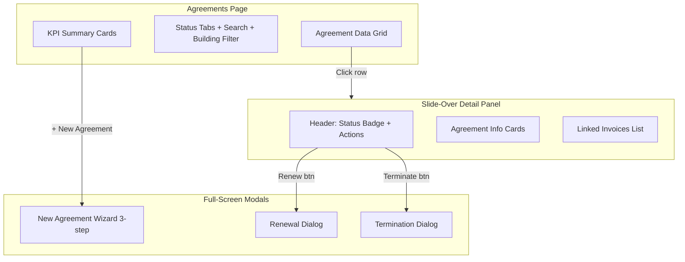

# Rental Agreement Page Redesign

## Current State (Problems)

- Agreement creation/editing is crammed into a modal (`RentalAgreementForm.tsx` inside `Modal` size="xl")
- Renewal logic is embedded inside the form component with awkward `renewMode` toggle
- Termination is a separate modal (`RentalAgreementTerminationModal.tsx`)
- Invoice generation logic (security deposit, first-month rent, recurring template) is duplicated across create/renew/manual-generate handlers -- all client-side
- Tree sidebar groups by tenant/owner/property but finding specific agreements is clunky
- No at-a-glance status dashboard; no "expiring soon" visibility
- Broker fee has no auto-calculation (default = half-month-rent minus service charges)

## New Design

### Architecture




### Page Layout (Top to Bottom)

**1. KPI Summary Cards** (4 cards in a row)

- Active Agreements (count + total monthly rent)
- Expiring Soon (within 30 days, count)
- Total Security Deposits Held
- "+ New Agreement" action card

**2. Filter Toolbar**

- Status filter tabs: All | Active | Expiring Soon | Renewed | Terminated
- Global search (tenant name, owner name, property name, building name, agreement number)
- Building dropdown filter
- Date range filter (existing pattern)

**3. Agreement Table** (the main data grid, scrollable)

- Columns: Agreement #, Tenant, Property (Building), Owner, Monthly Rent, Security Deposit, Start, End, Status
- Row click opens a **slide-over detail panel** (right side, ~40% width) instead of a modal
- Sortable columns (reuse existing sort pattern)
- Status badges with color coding: Active=green, Expiring=amber, Renewed=blue, Terminated=rose

**4. Detail Panel (Slide-Over)**
When a row is clicked, a panel slides in from the right showing:

- Header with agreement #, status badge, and action buttons (Edit, Renew, Terminate)
- Property & building info card
- Tenant & owner info card
- Financial summary card (rent, security, broker fee)
- Lease dates card (start, end, remaining days)
- Linked invoices mini-table (last 5 invoices with link to see all)
- Close button to dismiss

**5. New Agreement (Full-Screen Modal, 3-Step Wizard)**

- **Step 1 - Property**: Select Building -> Property auto-filters -> Owner auto-fills from property
- **Step 2 - Lease Terms**: Tenant selection, Start Date, End Date (auto +1 year), Monthly Rent, Rent Due Day, Security Deposit, Description
- **Step 3 - Broker & Review**: Broker selection, Broker Fee (auto = `monthlyRent/2 - property.monthlyServiceCharge`), Summary card, "Create & Generate Invoices" / "Create Only" buttons

**6. Renewal Dialog (Modal)**

- Shows previous agreement summary (read-only)
- Editable fields: New Start Date (auto day-after-old-end), New End Date (auto +1yr), Revised Monthly Rent (prefilled), Revised Security Deposit (prefilled), Revised Broker Fee
- Auto-calculates incremental security deposit (new - old)
- "Renew & Generate Invoices" / "Renew Only" buttons
- Checks for open invoices before allowing renewal

**7. Termination Dialog (Modal)** 

- Shows agreement summary
- Termination Date picker
- Status: Terminated / Expired
- Security Deposit Handling: Refund from Company / Owner Direct / No Refund (keep existing 3 options)
- Refund amount + account selection (if company refund)
- Notes field
- Checks for open invoices before allowing

---

## Files to Modify

### Frontend (complete rewrite of 3 files + new components)

1. `**[components/rentalAgreements/RentalAgreementsPage.tsx](components/rentalAgreements/RentalAgreementsPage.tsx)**` -- Complete rewrite
  - Remove tree sidebar, replace with KPI cards + status tabs + search + building filter + data grid
  - Add slide-over detail panel (right side)
  - Replace modal form with wizard and detail panel
2. `**[components/rentalAgreements/RentalAgreementForm.tsx](components/rentalAgreements/RentalAgreementForm.tsx)**` -- Complete rewrite as a 3-step wizard
  - Step 1: Property selection (building -> property -> owner auto-fill)
  - Step 2: Lease terms (tenant, dates, rent, security, due day)
  - Step 3: Broker & review with auto-calculated fee
  - Also double as an inline edit form (non-wizard mode) when editing
3. `**[components/rentalAgreements/RentalAgreementTerminationModal.tsx](components/rentalAgreements/RentalAgreementTerminationModal.tsx)**` -- Rewrite with improved UX
  - Cleaner layout, same core logic (3 refund options)
  - Add deactivation of recurring templates server-side
4. **New: `components/rentalAgreements/RentalAgreementDetailPanel.tsx**`
  - Slide-over panel showing agreement details, linked invoices, and action buttons
5. **New: `components/rentalAgreements/RentalAgreementRenewalModal.tsx**`
  - Dedicated renewal modal (currently embedded in the form component)
  - Shows old vs new terms, incremental security deposit calculation

### Backend

1. `**[server/api/routes/rentalAgreements.ts](server/api/routes/rentalAgreements.ts)**` -- Add 2 new endpoints
  - `POST /api/rental-agreements/:id/renew` -- Server-side renewal logic:
    - Validates no open invoices
    - Marks old agreement as "Renewed"
    - Deactivates old recurring templates
    - Creates new agreement with new terms
    - Optionally generates invoices (security deposit increment, first rent, new recurring template)
  - `POST /api/rental-agreements/:id/terminate` -- Server-side termination logic:
    - Validates no open invoices
    - Updates agreement status + end date
    - Deactivates recurring templates
    - Optionally creates security deposit refund transaction
  - `GET /api/rental-agreements/:id/invoices` -- Get all invoices linked to an agreement
2. `**[server/migrations/postgresql-schema.sql](server/migrations/postgresql-schema.sql)**` -- Add `previous_agreement_id` column
  - `ALTER TABLE rental_agreements ADD COLUMN previous_agreement_id TEXT REFERENCES rental_agreements(id)`
  - This creates a renewal chain for tracking agreement history

### Types

1. `**[types.ts](types.ts)**` -- Update `RentalAgreement` interface
  - Add `previousAgreementId?: string` for renewal chain tracking

### API Service

1. `**services/api/repositories/rentalAgreementsApi.ts**` -- Add API calls for new endpoints
  - `renewAgreement(id, data)`
  - `terminateAgreement(id, data)`
  - `getAgreementInvoices(id)`

---

## Key Logic Changes

### Broker Fee Auto-Calculation

When monthly rent changes and a broker is selected:

```typescript
const serviceCharge = selectedProperty?.monthlyServiceCharge || 0;
const defaultBrokerFee = Math.max(0, (monthlyRent / 2) - serviceCharge);
```

### Renewal Flow (server-side)

1. Validate: no open invoices against old agreement
2. Mark old agreement status = "Renewed"
3. Deactivate old agreement's recurring templates
4. Create new agreement with `previousAgreementId` = old ID
5. If requested, generate: incremental security deposit invoice + first month rent invoice + new recurring template
6. Return new agreement

### Termination Flow (server-side)

1. Validate: no open invoices against agreement
2. Update agreement: status = "Terminated", endDate = termination date
3. Deactivate recurring templates for this agreement
4. If refund selected, create "Security Deposit Refund" expense transaction
5. Return updated agreement

### Expiring Soon Calculation

```typescript
const today = new Date();
const thirtyDaysLater = new Date(today);
thirtyDaysLater.setDate(today.getDate() + 30);
const expiringSoon = agreements.filter(a => 
  a.status === 'Active' && 
  new Date(a.endDate) <= thirtyDaysLater && 
  new Date(a.endDate) >= today
);
```

---

## Migration

New migration file: `server/migrations/20260211_add_previous_agreement_id.sql`

```sql
ALTER TABLE rental_agreements 
ADD COLUMN IF NOT EXISTS previous_agreement_id TEXT;
```

