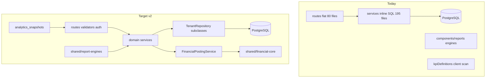
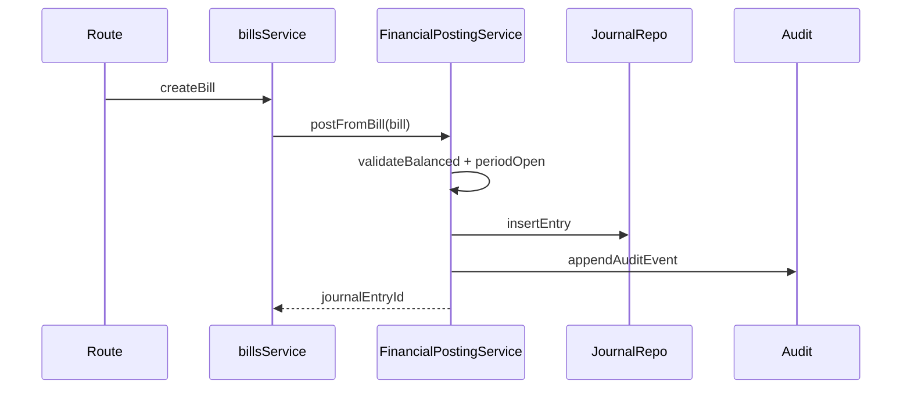

# PBooks Pro Architecture v2.0 Migration Plan

**Target:** PostgreSQL API path (staging/production)  
**Strategy:** Incremental strangler — introduce foundation layers first, then migrate high-risk financial domains before peripheral modules.

---

## Current State vs Target




| v2 principle                     | Today                                                                                                                                                                                   | Gap                                                                                                               |
| -------------------------------- | --------------------------------------------------------------------------------------------------------------------------------------------------------------------------------------- | ----------------------------------------------------------------------------------------------------------------- |
| Routes → Services → Repositories | Routes → Services → SQL                                                                                                                                                                 | Repositories only in `[backend/src/modules/reporting/repositories/](backend/src/modules/reporting/repositories/)` |
| Single financial source of truth | Split across `[services/financialEngine/](services/financialEngine/)`, `[components/reports/*Engine.ts](components/reports/)`, esbuild bundles to `[backend/dist/*.mjs](backend/dist/)` | No `shared/financial-core/`                                                                                       |
| FinancialPostingService gate     | `[journalService.ts](backend/src/services/journalService.ts)` + 4 domain `*JournalPostingService.ts`                                                                                    | No unified posting API                                                                                            |
| Audit on every mutation          | `[audit_events](database/migrations/067_enterprise_audit_trail.sql)` + 3 parallel logs                                                                                                  | ~8 services/routes call `appendAuditEvent`                                                                        |
| Accounting period lock           | `[066_accounting_periods.sql](database/migrations/066_accounting_periods.sql)` — `open`/`closed` only                                                                                   | Missing `LOCKED`; not enforced on all write paths                                                                 |
| Dashboard snapshots              | `[kpiDefinitions.ts](components/dashboard/kpiDefinitions.ts)` scans `AppState`                                                                                                          | No `analytics_snapshots`                                                                                          |
| Documents on R2                  | `[documents](database/migrations/064_quotations_documents.sql)` stores `file_data` inline                                                                                               | No object storage                                                                                                 |
| Offline sync metadata            | `version` + `/api/state/changes`                                                                                                                                                        | No `sync_queue` / `change_log`                                                                                    |
| API versioning                   | All routes on `/api` in `[backend/src/index.ts](backend/src/index.ts)`                                                                                                                  | No `/api/v1`                                                                                                      |
| Backup                           | Strong — migrations `068`–`072`, schedulers                                                                                                                                             | Already meets launch bar                                                                                          |


**Reference implementation to copy:** `[backend/src/modules/reporting/](backend/src/modules/reporting/)` (routes → services → repositories).

---

## Phase 0 — Foundation (Weeks 1–2)

Establish patterns without breaking existing routes. All new code lives alongside legacy services; legacy delegates to new layers over time.

### 0.1 Core infrastructure

Create `[backend/src/core/TenantRepository.ts](backend/src/core/TenantRepository.ts)`:

- Constructor accepts `tenantId` (required) and optional `PoolClient` for transactions.
- Protected helpers: `query()`, `queryOne()`, `insert()`, `update()`, `softDelete()` — every SQL builder auto-injects `WHERE tenant_id = $tenantId`.
- Standard column helpers: `version` (map v2 `version_number` in types/docs), `deleted_at`, `updated_at`, `updated_by`.
- ESLint rule or CI grep: block `client.query` / `pool.query` in `services/` except allowlist during migration.

Create `[backend/src/core/AuditMutation.ts](backend/src/core/AuditMutation.ts)`:

- Wrapper: `withAudit(tenantId, userId, entityType, action, fn)` → runs mutation, calls `[appendAuditEvent](backend/src/services/enterpriseAuditService.ts)` with `old_value`/`new_value`.
- Used by all new/rewritten service methods.

Create module scaffold under `[backend/src/modules/](backend/src/modules/)`:

```
accounting/     ← first domain
documents/
dashboard/
reporting/      ← extend existing
```

Each module: `routes/`, `services/`, `repositories/`, `validators/`, `types/`.

### 0.2 API versioning (non-breaking)

In `[backend/src/index.ts](backend/src/index.ts)`:

- Mount all tenant routers at `**/api/v1**` (new canonical prefix).
- Keep `**/api**` as a deprecated alias (same router instances) for one release cycle.
- Update `[services/api/client.ts](services/api/client.ts)` base URL to `/api/v1`.
- Exempt from versioning: `/health`, `/api/webhooks/paddle`, `/api/admin`.

### 0.3 Shared package layout

Create top-level packages (importable by backend via relative path; frontend imports calculation-only modules):


| New path                                           | Consolidates                                                                                                 |
| -------------------------------------------------- | ------------------------------------------------------------------------------------------------------------ |
| `[shared/financial-core/](shared/financial-core/)` | `[services/financialEngine/](services/financialEngine/)`, `[backend/src/financial/](backend/src/financial/)` |
| `[shared/report-engines/](shared/report-engines/)` | `[components/reports/*Engine.ts](components/reports/)`                                                       |


Migration steps:

1. Move engines with **no React imports** first (P&L, BS, CF, trial balance, ledger cores).
2. Replace `[scripts/ensure-shared-financial-cores.mjs](scripts/ensure-shared-financial-cores.mjs)` with direct imports from `shared/`.
3. Keep thin re-export shims in old paths (`components/reports/profitLossEngine.ts` → `export * from '../../../shared/report-engines/profitLossEngine'`) until UI imports are updated.
4. Frontend rule: report **components** preview only; no new calculation logic in `components/`.

---

## Phase 1 — Commercial Launch Scope (Weeks 3–8)

Ordered by risk and dependency. Each item uses strangler: new path goes through module layer; legacy service becomes a thin delegate.

### 1. FinancialPostingService (highest priority)

**New:** `[backend/src/modules/accounting/services/FinancialPostingService.ts](backend/src/modules/accounting/services/FinancialPostingService.ts)`

Responsibilities:

- Single entry for all GL writes: expense voucher, vendor payment, customer receipt, plot booking, installment collection, journal voucher, reversals.
- Enforce `validateBalanced()` (already in `[backend/src/financial/validation.ts](backend/src/financial/validation.ts)`).
- Call `assertAccountingPeriodOpen()` before any post.
- Delegate persistence to `[JournalRepository](backend/src/modules/accounting/repositories/JournalRepository.ts)` (wraps current `[journalService.ts](backend/src/services/journalService.ts)` INSERT logic).
- Emit `financial.posted` realtime event (extend `[backend/src/core/realtime.ts](backend/src/core/realtime.ts)`).

**Strangler wiring (in order):**

1. `[journalRoutes.ts](backend/src/routes/journalRoutes.ts)` → `FinancialPostingService.postManualJournal()`
2. `[transactionJournalPostingService.ts](backend/src/services/transactionJournalPostingService.ts)` → `postFromTransaction()`
3. `[billJournalPostingService.ts](backend/src/services/billJournalPostingService.ts)` / `[invoiceJournalPostingService.ts](backend/src/services/invoiceJournalPostingService.ts)`
4. `[fiscalPeriodCloseService.ts](backend/src/services/fiscalPeriodCloseService.ts)` → `postPeriodClose()`
5. Block direct `insertJournalEntry` exports outside accounting module (deprecate public export).




### 2. Accounting period locking (extend existing)

**Migration:** `090_accounting_periods_locked_status.sql`

- Add `locked` to `accounting_periods.status` CHECK (alongside `open`, `closed`).
- Update `[accountingPeriodService.ts](backend/src/services/accountingPeriodService.ts)`:
  - `OPEN` → full write
  - `CLOSED` → reject mutations (existing behavior)
  - `LOCKED` → reject unless `req.role === 'super_admin'` (or dedicated permission `accounting.periods.override_locked`)
- Ensure `FinancialPostingService` and all strangler delegates call `assertAccountingPeriodOpen` — audit `[transactionsService.ts](backend/src/services/transactionsService.ts)`, payroll ledger paths for bypasses.

### 3. Audit events (unify writers)

**Keep** existing `[audit_events](database/migrations/067_enterprise_audit_trail.sql)` schema (richer than v2 spec — no column rename needed).

Actions:

- Route all mutations through `withAudit()` (Phase 0.1).
- Priority writers to migrate: bills, invoices, transactions, contacts, project agreements, installment plans, vendor payments.
- Deprecation plan (post-launch): stop new writes to `accounting_audit_log` and `transaction_log`; keep read-only unified trail via `[listUnifiedAuditTrail](backend/src/services/enterpriseAuditService.ts)`.
- Add middleware hook in routes layer to capture `ip_address` / `user_agent` consistently.

### 4. Soft delete framework

**Migration:** `091_soft_delete_standard_columns.sql`

- Add `deleted_by TEXT` to business tables that already have `deleted_at` (~25 tables).
- Add DB view or repository helper `activeOnly()` → `deleted_at IS NULL`.
- **Financial tables** (`journal_entries`, `journal_lines`, posted transactions): never physical delete; soft-delete master records only.
- Update `TenantRepository.softDelete()` to set `deleted_at`, `deleted_by`, bump `version`.

Do **not** rename `version` → `version_number` in PostgreSQL (high churn); document `version` as the v2 `version_number` field in types.

### 5. Document storage (R2)

**Migration:** `092_document_metadata_r2.sql`

- New table `document_metadata` (v2 fields: `storage_key`, `entity_type`, `entity_id`, `file_name`, `uploaded_by`, `uploaded_at`).
- Migrate existing `documents.file_data` → R2 upload script; keep `documents` as compatibility view or deprecate after migration.
- New module `[backend/src/modules/documents/](backend/src/modules/documents/)`:
  - `DocumentStorageService` — R2 upload/download using existing S3-compatible provider pattern from `[backend/src/services/backup/storage/s3CompatibleProvider.ts](backend/src/services/backup/storage/s3CompatibleProvider.ts)`.
  - `DocumentRepository` extends `TenantRepository`.
- Env: `R2_ACCOUNT_ID`, `R2_ACCESS_KEY`, `R2_SECRET_KEY`, `R2_BUCKET` in `.env.staging.example` / `.env.production.example`.

### 6. Backup strategy (validate, minor gaps)

Already implemented. Launch checklist only:

- Confirm daily job active via `[backupSchedulerService.ts](backend/src/services/backupSchedulerService.ts)`.
- Confirm 30-day retention policy in scheduler config.
- Confirm weekly restore test recorded in `dr_restore_tests` (`[071_disaster_recovery.sql](database/migrations/071_disaster_recovery.sql)`).
- Document RPO/RTO in ops runbook (no code change required unless retention not configured).

### 7. Offline sync metadata

**Migration:** `093_offline_sync_metadata.sql`

```sql
-- sync_queue: outbound mutations awaiting push
-- change_log: inbound change feed per tenant (complements GET /api/state/changes)
```

- Add `updated_by` to core transactional tables missing it (contacts, transactions, invoices, bills).
- `change_log` columns: `id`, `tenant_id`, `entity_type`, `entity_id`, `action`, `payload_json`, `version`, `changed_at`, `changed_by`.
- Extend `[appStateBulkService.ts](backend/src/services/appStateBulkService.ts)` to write `change_log` on mutations.
- Phase 1 conflict policy: **last-write-wins** comparing `version` + `updated_at`.
- Client stubs in `[services/sync/localOnlyStubs.ts](services/sync/localOnlyStubs.ts)` remain for this repo; API path gets real implementation.

### 8. Dashboard snapshot layer

**Migration:** `094_analytics_snapshots.sql`

```sql
analytics_snapshots (
  id, tenant_id, snapshot_date, kpi_key,
  value_numeric, value_json, computed_at, period_start, period_end
)
```

**New module:** `[backend/src/modules/dashboard/](backend/src/modules/dashboard/)`

- `DashboardSnapshotService` — compute KPIs using `shared/report-engines` + journal data (not raw client `AppState`).
- Port KPI definitions from `[kpiDefinitions.ts](components/dashboard/kpiDefinitions.ts)` into backend `kpiRegistry.ts` (formulas only, no React).
- Nightly + on-demand job via existing `setInterval` scheduler (BullMQ deferred post-launch).
- New route: `GET /api/v1/dashboard/snapshots?date=`.
- Update `[DashboardPage.tsx](components/dashboard/DashboardPage.tsx)` to fetch snapshots when `!isLocalOnlyMode()`; keep client fallback during transition.

---

## Phase 2 — Strangler Domain Migration (Weeks 9–16)

Migrate remaining domains to `backend/src/modules/` using the reporting module as template. Priority order:


| Priority | Domain module      | Key legacy files to strangle                                                       |
| -------- | ------------------ | ---------------------------------------------------------------------------------- |
| P0       | `accounting/`      | journal, periods, transactions GL mirror                                           |
| P1       | `vendors/`         | `[billsService.ts](backend/src/services/billsService.ts)`, contractor              |
| P1       | `customers/`       | `[invoicesService.ts](backend/src/services/invoicesService.ts)`, installment plans |
| P2       | `project-selling/` | project agreements, sales returns                                                  |
| P2       | `leases/`          | rental agreements, rental reports                                                  |
| P2       | `properties/`      | buildings, properties, units                                                       |
| P3       | `crm/`             | contacts                                                                           |
| P3       | `notifications/`   | email automation (DB queue → future BullMQ)                                        |
| P4       | `admin/`           | consolidate `[adminPortal/](backend/src/adminPortal/)` gradually                   |


Per domain checklist:

1. Create `*Repository extends TenantRepository`.
2. Move business logic from `services/*Service.ts` → `modules/*/services/`.
3. Route file becomes thin: Zod validator → service → `sendSuccess`.
4. Remove inline SQL from route (14 files currently leak queries).
5. Add tests at repository + service level.

---

## Phase 3 — Post-Launch (deferred per v2 spec)


| Item                                   | Notes                                                              |
| -------------------------------------- | ------------------------------------------------------------------ |
| PostgreSQL RLS                         | `SET app.tenant_id` per connection + policies on business tables   |
| BullMQ + Redis                         | Replace `setInterval` schedulers; migrate `email_automation_queue` |
| Full CQRS / event sourcing             | Not needed for launch                                              |
| Field-level sync conflicts             | After LWW proven in production                                     |
| `financial.posted` + entity.* realtime | Extend `[realtime.ts](backend/src/core/realtime.ts)` event catalog |
| Retire `/api` alias                    | After client installers on v1                                      |
| Retire esbuild report bundles          | After `shared/report-engines` imported directly by backend         |


---

## Realtime extensions (launch-adjacent)

Extend `[RealtimeEntityType](backend/src/core/realtime.ts)` and emit from `FinancialPostingService`:

- `financial.posted` — payload: `{ journalEntryId, sourceModule, sourceId }`
- Ensure all module routes use `emitEntityEvent(tenantId, action, type, ...)` (already pattern in `[projectsRoutes.ts](backend/src/routes/projectsRoutes.ts)`)

---

## Frontend alignment (API client path)


| Layer                                                      | Action                                                                          |
| ---------------------------------------------------------- | ------------------------------------------------------------------------------- |
| `[services/api/client.ts](services/api/client.ts)`         | Base path → `/api/v1`                                                           |
| `[services/api/repositories/](services/api/repositories/)` | Already exists — align naming with backend repositories (API client, not DB)    |
| Report UI                                                  | Import engines from `shared/report-engines`; remove calculation from components |
| Dashboard                                                  | Fetch `dashboard/snapshots` API; delete `getData(state)` scans incrementally    |


---

## Verification gates

Before marking each phase complete:

- **Posting:** Integration test — unbalanced journal rejected; closed/locked period rejected; bill/invoice/transaction all produce entries via `FinancialPostingService`.
- **Audit:** Mutation test — create/update/delete bill writes exactly one `audit_events` row.
- **Snapshots:** Dashboard API returns same KPI values as legacy client computation for fixture tenant.
- **Documents:** Upload → R2 key stored; download returns correct bytes; tenant isolation enforced.
- **Sync:** `change_log` row created on transaction update; LWW conflict returns 409 with server version.
- **Regression:** Existing test suite + `[npm run test:staging](package.json)` smoke on `pBookspro_Staging`.

---

## Risk mitigations

- **Big-bang rewrite avoided** — legacy `services/*.ts` remain as delegates until each domain is migrated.
- **Report engine move** — re-export shims prevent broken imports; esbuild scripts kept until backend imports `shared/` directly.
- **Electron/local-only** — out of scope for this plan; API changes guarded by `isLocalOnlyMode()` where needed.
- **Payroll ledger** — separate from `journal_entries` today; document as Phase 2+ unification or explicit exception in `FinancialPostingService` interface.

---

## Suggested first PR sequence

1. `TenantRepository` + `AuditMutation` + ESLint/CI SQL guard
2. `/api/v1` mount + client base URL
3. `shared/financial-core` extraction (no behavior change)
4. `FinancialPostingService` + journal strangler
5. Accounting period `LOCKED` + enforcement audit
6. `analytics_snapshots` + dashboard API
7. R2 `document_metadata` module
8. `change_log` / `sync_queue` + `updated_by` columns

