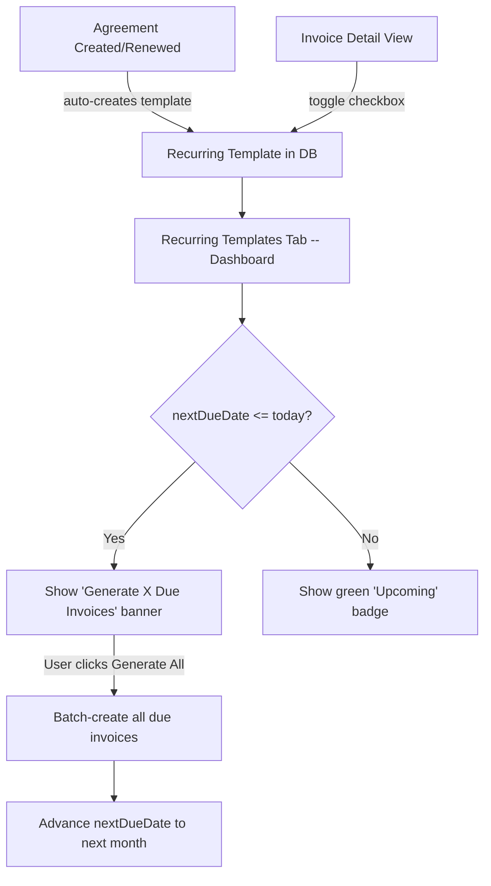

# Auto Invoice Scheduling -- Full Redesign

## How It Should Work (End-to-End)




The agreement already auto-creates a recurring template (this works). The problem is what happens AFTER: users need a simple dashboard to see what's scheduled and one-click to generate due invoices.

## Part 1: Fix Persistence Bugs

### 1A. Add snake_case normalization for recurring templates on API load

**File:** [services/api/appStateApi.ts](services/api/appStateApi.ts) -- around line 767

Replace the raw pass-through:

```typescript
recurringInvoiceTemplates: recurringInvoiceTemplates || [],
```

With a normalized mapping (following the exact pattern used for invoices at line 454, bills at line 417, etc.):

```typescript
recurringInvoiceTemplates: (recurringInvoiceTemplates || []).map((t: any) => ({
  id: t.id,
  contactId: t.contact_id ?? t.contactId ?? '',
  propertyId: t.property_id ?? t.propertyId ?? '',
  buildingId: t.building_id ?? t.buildingId ?? '',
  amount: typeof t.amount === 'number' ? t.amount : parseFloat(String(t.amount ?? '0')),
  descriptionTemplate: t.description_template ?? t.descriptionTemplate ?? '',
  dayOfMonth: typeof t.day_of_month === 'number' ? t.day_of_month : parseInt(String(t.day_of_month ?? t.dayOfMonth ?? '1')),
  nextDueDate: t.next_due_date ?? t.nextDueDate ?? '',
  active: t.active === true || t.active === 1 || t.active === 'true',
  agreementId: t.agreement_id ?? t.agreementId ?? undefined,
  invoiceType: t.invoice_type ?? t.invoiceType ?? 'Rental',
  frequency: t.frequency ?? 'Monthly',
  autoGenerate: t.auto_generate === true || t.auto_generate === 1 || t.autoGenerate === true,
  maxOccurrences: t.max_occurrences ?? t.maxOccurrences ?? undefined,
  generatedCount: typeof t.generated_count === 'number' ? t.generated_count : (typeof t.generatedCount === 'number' ? t.generatedCount : parseInt(String(t.generated_count ?? t.generatedCount ?? '0'))),
  lastGeneratedDate: t.last_generated_date ?? t.lastGeneratedDate ?? undefined,
})),
```

### 1B. Add WebSocket event listeners for recurring templates

**File:** [context/AppContext.tsx](context/AppContext.tsx)

Two changes needed:

**(i)** Add a `normalizeRecurringTemplateFromEvent` helper (near line ~2955, after `normalizeRentalAgreementFromEvent`), mapping the same fields as above.

**(ii)** Add 3 socket listeners (near line ~3178, after rental agreement listeners), following the exact `ws.on(...)` / `unsubSpecific.push(...)` pattern:

- `recurring_invoice_template:created` -> dispatch ADD_RECURRING_TEMPLATE
- `recurring_invoice_template:updated` -> dispatch UPDATE_RECURRING_TEMPLATE
- `recurring_invoice_template:deleted` -> dispatch DELETE_RECURRING_TEMPLATE

**(iii)** Add to the events array (near line ~2993) for the generic fallback refresh:

```
'recurring_invoice_template:created', 'recurring_invoice_template:updated', 'recurring_invoice_template:deleted',
```

## Part 2: Redesign Recurring Templates Tab

**File:** [components/rentalManagement/RecurringInvoicesList.tsx](components/rentalManagement/RecurringInvoicesList.tsx) -- full rewrite of the component.

### Design Principles

- **Opinionated**: Monthly on the 1st is the default. No Manual/Auto confusion -- if it exists, it's auto.
- **Status-first**: The most important info is "active or paused" and "overdue or upcoming."
- **One-click generation**: A prominent banner when invoices are due.
- **Inline actions**: Toggle active/paused directly from the table row.

### New Layout

**Top: Action Banner** (only visible when overdue templates exist)

- Amber/yellow banner: "X invoices are due for generation"
- Button: "Generate All Due Invoices" -- batch-creates all overdue invoices using existing `handleGenerateInvoice` logic in a loop
- This replaces the confusing catch-up logic that only runs inside the save handler

**Header Row**

- Search input (keep)
- Building filter dropdown (keep)
- Remove the tree sidebar -- it adds complexity for minimal value in this context. The building filter dropdown already covers the filtering need.

**Table Columns** (cleaner than current 5-col layout)


| Property / Tenant                                | Amount            | Schedule         | Next Invoice             | Status               | Actions   |
| ------------------------------------------------ | ----------------- | ---------------- | ------------------------ | -------------------- | --------- |
| Property name (bold) + Tenant name (small below) | Currency + amount | "Monthly on 1st" | Date badge (color-coded) | Active/Paused toggle | Edit icon |


- **Next Invoice** color logic:
  - Green badge: date is in the future
  - Amber badge: date is today or within past 7 days ("Due")
  - Red badge: date is more than 7 days past ("Overdue")
- **Status toggle**: Inline switch, clicking dispatches UPDATE_RECURRING_TEMPLATE with `active` flipped. No modal needed.
- **Actions**: Pencil icon opens edit modal. Optionally a "Generate" button per row.

**Footer**

- Count: X schedules (Y active)
- Total monthly: Currency X,XXX

### Simplified Edit Modal

Replace the current dense 3-section modal with:

**Header** (read-only, gray card):

- Property name, Tenant name
- Agreement number (if linked)

**Invoice Settings**:

- Amount input
- Invoice Type dropdown (Rental / Service Charge / Installment)
- Description Template input (with `{Month}` helper text)

**Schedule Settings** (clean card):

- "Create invoice on day" -- number input (1-28), default 1
- "Next scheduled date" -- date display (auto-computed, editable as override)
- Active toggle with label "Auto-generate invoices"
- If `generatedCount > 0`: show "X invoices generated so far"

**Actions bar**:

- Left: Delete (red outline)
- Right: "Generate Now" (green outline) + "Save" (primary)

Remove entirely:

- Manual/Auto toggle (always auto if schedule exists)
- Frequency selector (always Monthly -- weekly/daily are not real use cases for rent)
- "Total Number of Transactions" / max occurrences (unnecessary complexity)
- The complex tree sidebar

### Bulk Generate Logic

Extract the existing catch-up logic from `handleSaveEdit` into a standalone `generateDueInvoices(templates: RecurringInvoiceTemplate[])` function that:

1. Filters templates where `active === true` and `nextDueDate <= today`
2. For each, creates the invoice (reusing existing `handleGenerateInvoice` logic)
3. Advances `nextDueDate` by one month
4. Shows a summary toast: "Generated X invoices"

This function is called by:

- The "Generate All Due Invoices" banner button (for all due templates)
- The per-row "Generate" action (for a single template)
- Optionally on component mount (auto-catch-up when user navigates to the tab)

## Part 3: Ensure Agreement Defaults Are Correct

**File:** [components/rentalAgreements/RentalAgreementForm.tsx](components/rentalAgreements/RentalAgreementForm.tsx) -- lines 612-625, 468-484, 281-294

The agreement form already creates recurring templates but doesn't set `autoGenerate: true` or `frequency: 'Monthly'`. Add these defaults when creating templates from agreements:

```typescript
const recurringTemplate: RecurringInvoiceTemplate = {
    // ... existing fields ...
    autoGenerate: true,
    frequency: 'Monthly',
};
```

This ensures new templates are immediately active for auto-generation without requiring the user to edit them.

Similarly in [components/invoices/InvoiceDetailView.tsx](components/invoices/InvoiceDetailView.tsx) line 196-210, add `autoGenerate: true` and `frequency: 'Monthly'` to the template created by the checkbox toggle.

## Files to Modify

- [services/api/appStateApi.ts](services/api/appStateApi.ts) -- snake_case normalization (line 767)
- [context/AppContext.tsx](context/AppContext.tsx) -- WebSocket listeners + normalize helper
- [components/rentalManagement/RecurringInvoicesList.tsx](components/rentalManagement/RecurringInvoicesList.tsx) -- full UI redesign
- [components/rentalAgreements/RentalAgreementForm.tsx](components/rentalAgreements/RentalAgreementForm.tsx) -- add `autoGenerate: true, frequency: 'Monthly'` defaults (3 places)
- [components/invoices/InvoiceDetailView.tsx](components/invoices/InvoiceDetailView.tsx) -- add `autoGenerate: true, frequency: 'Monthly'` to toggle

