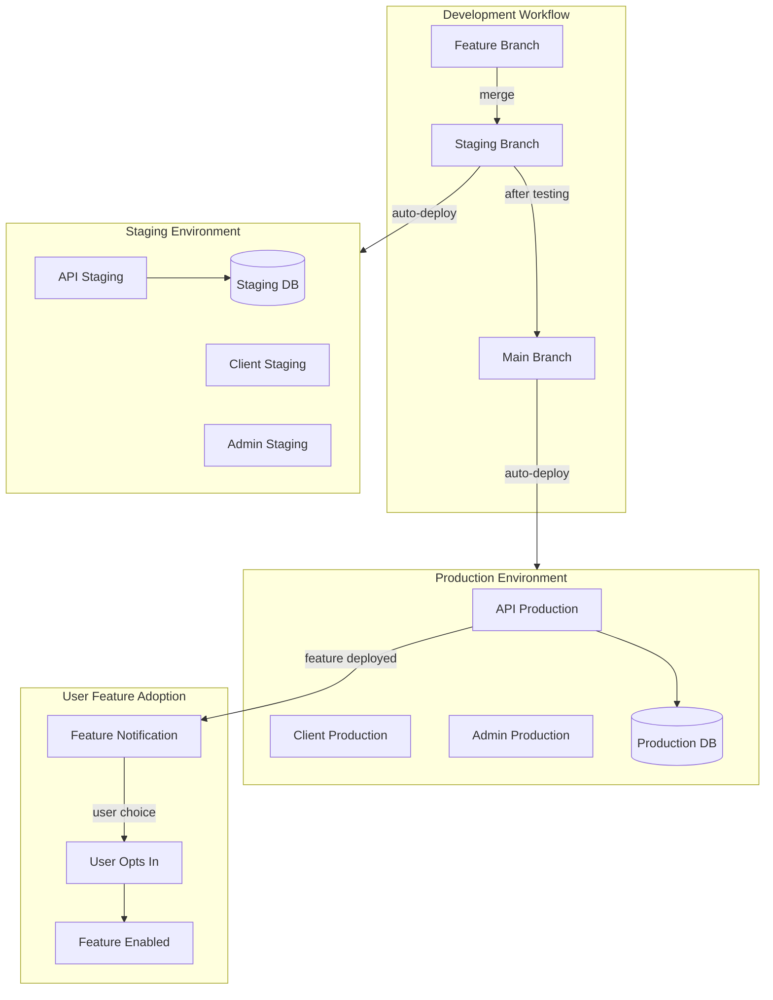

# Dual Environment Setup with Feature Flag System

## Overview

Implement a complete dual-environment deployment strategy on Render (staging + production) with separate databases, plus a feature flag system that notifies users about new features and lets them opt-in before features go live for everyone.

## Architecture Diagram




## Phase 1: Git Branch Strategy

### 1.1 Create Staging Branch

Currently only `main` branch exists. Create a `staging` branch for testing.**Actions:**

- Create and push `staging` branch from current `main`
- Set up branch protection rules (optional but recommended)

**Commands to run:**

```bash
git checkout -b staging
git push -u origin staging
git checkout main
```

**Branching model:**

- `feature/*` branches: Development work
- `staging` branch: Testing environment (auto-deploys to staging on Render)
- `main` branch: Production environment (auto-deploys to production on Render)

## Phase 2: Render Configuration Files

### 2.1 Create Staging Configuration

Create new file [`render-staging.yaml`](render-staging.yaml) for staging environment:

```yaml
services:
  # Backend API Server - STAGING
    - type: web
    name: pbookspro-api-staging
    env: node
    plan: starter
    branch: staging
    buildCommand: cd server && npm install --include=dev && npm run build
    startCommand: cd server && npm start
    envVars:
            - key: DATABASE_URL
        fromDatabase:
          name: pbookspro-db-staging
          property: connectionString
            - key: JWT_SECRET
        generateValue: true
            - key: LICENSE_SECRET_SALT
        value: PBOOKSPRO_SECURE_SALT_2024_STAGING
            - key: NODE_ENV
        value: staging
            - key: PORT
        value: 3000
            - key: CORS_ORIGIN
        value: https://pbookspro-client-staging.onrender.com,https://pbookspro-admin-staging.onrender.com,http://localhost:5173,http://localhost:5174
            - key: API_URL
        value: https://pbookspro-api-staging.onrender.com
            - key: SERVER_URL
        value: https://pbookspro-api-staging.onrender.com
            - key: CLIENT_URL
        value: https://pbookspro-client-staging.onrender.com
            - key: FEATURE_FLAGS_ENABLED
        value: true

  # Client Application - STAGING
    - type: web
    name: pbookspro-client-staging
    runtime: static
    branch: staging
    buildCommand: npm install && npm run build
    staticPublishPath: ./dist
    envVars:
            - key: VITE_API_URL
        value: https://pbookspro-api-staging.onrender.com/api
            - key: VITE_ENV
        value: staging

  # Admin Application - STAGING
    - type: web
    name: pbookspro-admin-staging
    runtime: static
    branch: staging
    buildCommand: cd admin && npm install && npm run build
    staticPublishPath: ./admin/dist
    envVars:
            - key: VITE_ADMIN_API_URL
        value: https://pbookspro-api-staging.onrender.com/api/admin
            - key: VITE_ENV
        value: staging

databases:
    - name: pbookspro-db-staging
    plan: starter
```


### 2.2 Update Production Configuration

Update existing [`render.yaml`](render.yaml) to specify `main` branch:Add `branch: main` to each service and add `FEATURE_FLAGS_ENABLED: true` environment variable.

## Phase 3: Database Schema for Feature Flags

### 3.1 Create Migration File

Create new file `server/migrations/add_feature_flags.sql`:

```sql
-- Feature flags table: stores available features
CREATE TABLE IF NOT EXISTS feature_flags (
  id TEXT PRIMARY KEY,
  name TEXT NOT NULL,
  description TEXT,
  version TEXT NOT NULL,
  release_date TEXT NOT NULL,
  is_available INTEGER DEFAULT 1,
  is_stable INTEGER DEFAULT 0,
  requires_opt_in INTEGER DEFAULT 1,
  created_at TEXT DEFAULT (datetime('now'))
);

-- User feature preferences: tracks which users enabled which features
CREATE TABLE IF NOT EXISTS user_features (
  user_id TEXT NOT NULL,
  feature_id TEXT NOT NULL,
  is_enabled INTEGER DEFAULT 0,
  enabled_at TEXT,
  disabled_at TEXT,
  PRIMARY KEY (user_id, feature_id),
  FOREIGN KEY (user_id) REFERENCES users(id) ON DELETE CASCADE,
  FOREIGN KEY (feature_id) REFERENCES feature_flags(id) ON DELETE CASCADE
);

-- Feature rollout tracking: deployment history
CREATE TABLE IF NOT EXISTS feature_rollout (
  id INTEGER PRIMARY KEY AUTOINCREMENT,
  feature_id TEXT NOT NULL,
  stage TEXT NOT NULL CHECK(stage IN ('staging', 'beta', 'production')),
  deployed_at TEXT NOT NULL DEFAULT (datetime('now')),
  deployed_by TEXT,
  rollback_at TEXT,
  notes TEXT,
  FOREIGN KEY (feature_id) REFERENCES feature_flags(id) ON DELETE CASCADE
);

-- Create indexes for performance
CREATE INDEX IF NOT EXISTS idx_user_features_user ON user_features(user_id);
CREATE INDEX IF NOT EXISTS idx_user_features_feature ON user_features(feature_id);
CREATE INDEX IF NOT EXISTS idx_feature_rollout_feature ON feature_rollout(feature_id);
CREATE INDEX IF NOT EXISTS idx_feature_rollout_stage ON feature_rollout(stage);
```


### 3.2 Run Migration

Add migration logic to `server/database.js` or create a migration runner script.

## Phase 4: Backend API Implementation

### 4.1 Create Feature Flags Route Handler

Create new file `server/routes/featureFlags.js`:

```javascript
import express from 'express';
import { db } from '../database.js';
import { authenticateToken } from '../middleware/auth.js';

const router = express.Router();

// Get all available features (public)
router.get('/available', (req, res) => {
  try {
    const features = db.prepare(`
      SELECT id, name, description, version, release_date, is_stable, requires_opt_in
      FROM feature_flags
      WHERE is_available = 1
      ORDER BY release_date DESC
    `).all();
    
    res.json(features);
  } catch (error) {
    res.status(500).json({ error: 'Failed to fetch features' });
  }
});

// Get user's enabled features (protected)
router.get('/user/:userId', authenticateToken, (req, res) => {
  try {
    const { userId } = req.params;
    
    // Verify user can only access their own features
    if (req.user.id !== userId && req.user.role !== 'admin') {
      return res.status(403).json({ error: 'Unauthorized' });
    }
    
    const userFeatures = db.prepare(`
      SELECT f.*, uf.enabled_at, uf.is_enabled
      FROM feature_flags f
      JOIN user_features uf ON f.id = uf.feature_id
      WHERE uf.user_id = ?
    `).all(userId);
    
    res.json(userFeatures);
  } catch (error) {
    res.status(500).json({ error: 'Failed to fetch user features' });
  }
});

// User opts-in to a feature (protected)
router.post('/opt-in', authenticateToken, (req, res) => {
  try {
    const { userId, featureId } = req.body;
    
    // Verify user can only modify their own features
    if (req.user.id !== userId) {
      return res.status(403).json({ error: 'Unauthorized' });
    }
    
    // Check if feature exists and requires opt-in
    const feature = db.prepare('SELECT * FROM feature_flags WHERE id = ?').get(featureId);
    if (!feature) {
      return res.status(404).json({ error: 'Feature not found' });
    }
    
    db.prepare(`
      INSERT INTO user_features (user_id, feature_id, is_enabled, enabled_at)
      VALUES (?, ?, 1, datetime('now'))
      ON CONFLICT(user_id, feature_id) 
      DO UPDATE SET is_enabled = 1, enabled_at = datetime('now'), disabled_at = NULL
    `).run(userId, featureId);
    
    res.json({ 
      success: true, 
      message: `${feature.name} enabled successfully` 
    });
  } catch (error) {
    res.status(500).json({ error: 'Failed to enable feature' });
  }
});

// User opts-out of a feature (protected)
router.post('/opt-out', authenticateToken, (req, res) => {
  try {
    const { userId, featureId } = req.body;
    
    // Verify user can only modify their own features
    if (req.user.id !== userId) {
      return res.status(403).json({ error: 'Unauthorized' });
    }
    
    db.prepare(`
      UPDATE user_features 
      SET is_enabled = 0, disabled_at = datetime('now')
      WHERE user_id = ? AND feature_id = ?
    `).run(userId, featureId);
    
    res.json({ success: true, message: 'Feature disabled successfully' });
  } catch (error) {
    res.status(500).json({ error: 'Failed to disable feature' });
  }
});

// Admin: Create new feature flag (admin only)
router.post('/create', authenticateToken, (req, res) => {
  try {
    if (req.user.role !== 'admin') {
      return res.status(403).json({ error: 'Admin access required' });
    }
    
    const { id, name, description, version, releaseDate, requiresOptIn } = req.body;
    
    db.prepare(`
      INSERT INTO feature_flags (id, name, description, version, release_date, requires_opt_in)
      VALUES (?, ?, ?, ?, ?, ?)
    `).run(id, name, description, version, releaseDate, requiresOptIn ? 1 : 0);
    
    res.json({ success: true, message: 'Feature flag created' });
  } catch (error) {
    res.status(500).json({ error: 'Failed to create feature flag' });
  }
});

export default router;
```


### 4.2 Register Routes in Main Server File

Update `server/index.js` or `server/app.js` to register the feature flags routes:

```javascript
import featureFlagsRouter from './routes/featureFlags.js';

// Add after other route registrations
app.use('/api/features', featureFlagsRouter);
```


## Phase 5: Frontend Implementation

### 5.1 Create Feature Flags Hook

Create new file `src/hooks/useFeatureFlags.ts`:

```typescript
import { useState, useEffect, useCallback } from 'react';

interface Feature {
  id: string;
  name: string;
  description: string;
  version: string;
  release_date: string;
  is_stable: boolean;
  requires_opt_in: boolean;
}

interface UserFeature extends Feature {
  is_enabled: boolean;
  enabled_at?: string;
}

export const useFeatureFlags = (userId: string | null) => {
  const [availableFeatures, setAvailableFeatures] = useState<Feature[]>([]);
  const [userFeatures, setUserFeatures] = useState<UserFeature[]>([]);
  const [loading, setLoading] = useState(true);
  const [error, setError] = useState<string | null>(null);

  const fetchFeatures = useCallback(async () => {
    if (!userId) {
      setLoading(false);
      return;
    }

    try {
      setLoading(true);
      setError(null);

      const [available, userEnabled] = await Promise.all([
        fetch('/api/features/available').then(r => r.json()),
        fetch(`/api/features/user/${userId}`, {
          headers: {
            'Authorization': `Bearer ${localStorage.getItem('token')}`
          }
        }).then(r => r.json())
      ]);
      
      setAvailableFeatures(available);
      setUserFeatures(userEnabled);
    } catch (err) {
      setError('Failed to fetch features');
      console.error('Feature fetch error:', err);
    } finally {
      setLoading(false);
    }
  }, [userId]);

  useEffect(() => {
    fetchFeatures();
  }, [fetchFeatures]);

  const isFeatureEnabled = useCallback((featureId: string): boolean => {
    const userFeature = userFeatures.find(f => f.id === featureId);
    return userFeature?.is_enabled || false;
  }, [userFeatures]);

  const enableFeature = async (featureId: string): Promise<boolean> => {
    try {
      const response = await fetch('/api/features/opt-in', {
        method: 'POST',
        headers: { 
          'Content-Type': 'application/json',
          'Authorization': `Bearer ${localStorage.getItem('token')}`
        },
        body: JSON.stringify({ userId, featureId })
      });

      if (!response.ok) throw new Error('Failed to enable feature');
      
      await fetchFeatures(); // Refresh features
      return true;
    } catch (error) {
      console.error('Failed to enable feature:', error);
      return false;
    }
  };

  const disableFeature = async (featureId: string): Promise<boolean> => {
    try {
      const response = await fetch('/api/features/opt-out', {
        method: 'POST',
        headers: { 
          'Content-Type': 'application/json',
          'Authorization': `Bearer ${localStorage.getItem('token')}`
        },
        body: JSON.stringify({ userId, featureId })
      });

      if (!response.ok) throw new Error('Failed to disable feature');
      
      await fetchFeatures(); // Refresh features
      return true;
    } catch (error) {
      console.error('Failed to disable feature:', error);
      return false;
    }
  };

  const getNewFeatures = useCallback((): Feature[] => {
    return availableFeatures.filter(feature => {
      const isAlreadyEnabled = userFeatures.some(
        uf => uf.id === feature.id && uf.is_enabled
      );
      return feature.requires_opt_in && !isAlreadyEnabled;
    });
  }, [availableFeatures, userFeatures]);

  return {
    availableFeatures,
    userFeatures,
    loading,
    error,
    isFeatureEnabled,
    enableFeature,
    disableFeature,
    getNewFeatures,
    refreshFeatures: fetchFeatures
  };
};
```


### 5.2 Create Feature Notification Component

Create new file `src/components/features/FeatureUpdateNotification.tsx`:

```typescript
import React, { useState, useEffect } from 'react';
import { useFeatureFlags } from '../../hooks/useFeatureFlags';

interface Props {
  userId: string;
}

export const FeatureUpdateNotification: React.FC<Props> = ({ userId }) => {
  const { getNewFeatures, enableFeature, loading } = useFeatureFlags(userId);
  const [dismissed, setDismissed] = useState<Set<string>>(new Set());
  const [currentFeatureIndex, setCurrentFeatureIndex] = useState(0);

  // Load dismissed features from localStorage
  useEffect(() => {
    const stored = localStorage.getItem('dismissedFeatures');
    if (stored) {
      setDismissed(new Set(JSON.parse(stored)));
    }
  }, []);

  const newFeatures = getNewFeatures().filter(f => !dismissed.has(f.id));
  const currentFeature = newFeatures[currentFeatureIndex];

  if (loading || !currentFeature) return null;

  const handleDismiss = (featureId: string) => {
    const newDismissed = new Set([...dismissed, featureId]);
    setDismissed(newDismissed);
    localStorage.setItem('dismissedFeatures', JSON.stringify([...newDismissed]));
    
    // Move to next feature or close
    if (currentFeatureIndex < newFeatures.length - 1) {
      setCurrentFeatureIndex(currentFeatureIndex + 1);
    }
  };

  const handleEnable = async (featureId: string) => {
    const success = await enableFeature(featureId);
    if (success) {
      handleDismiss(featureId);
      // Show success message
      alert(`${currentFeature.name} has been enabled!`);
    }
  };

  return (
    <div className="fixed bottom-4 right-4 max-w-md bg-white dark:bg-gray-800 shadow-2xl rounded-lg border border-gray-200 dark:border-gray-700 z-50 animate-slide-up">
      <div className="p-4">
        <div className="flex items-start gap-3">
          <div className="flex-shrink-0 mt-1">
            <div className="w-10 h-10 bg-blue-100 dark:bg-blue-900 rounded-full flex items-center justify-center">
              <svg className="w-6 h-6 text-blue-600 dark:text-blue-400" fill="none" viewBox="0 0 24 24" stroke="currentColor">
                <path strokeLinecap="round" strokeLinejoin="round" strokeWidth={2} d="M13 10V3L4 14h7v7l9-11h-7z" />
              </svg>
            </div>
          </div>
          
          <div className="flex-1 min-w-0">
            <div className="flex items-center justify-between mb-2">
              <h3 className="text-sm font-semibold text-gray-900 dark:text-white">
                New Feature Available
              </h3>
              <button
                onClick={() => handleDismiss(currentFeature.id)}
                className="text-gray-400 hover:text-gray-600 dark:hover:text-gray-300"
              >
                <svg className="w-5 h-5" viewBox="0 0 20 20" fill="currentColor">
                  <path fillRule="evenodd" d="M4.293 4.293a1 1 0 011.414 0L10 8.586l4.293-4.293a1 1 0 111.414 1.414L11.414 10l4.293 4.293a1 1 0 01-1.414 1.414L10 11.414l-4.293 4.293a1 1 0 01-1.414-1.414L8.586 10 4.293 5.707a1 1 0 010-1.414z" clipRule="evenodd" />
                </svg>
              </button>
            </div>
            
            <p className="text-base font-medium text-gray-900 dark:text-white mb-1">
              {currentFeature.name}
            </p>
            <p className="text-sm text-gray-600 dark:text-gray-400 mb-3">
              {currentFeature.description}
            </p>
            
            <div className="flex items-center gap-2 text-xs text-gray-500 dark:text-gray-400 mb-4">
              <span className="px-2 py-1 bg-gray-100 dark:bg-gray-700 rounded">
                v{currentFeature.version}
              </span>
              {newFeatures.length > 1 && (
                <span>
                  {currentFeatureIndex + 1} of {newFeatures.length} new features
                </span>
              )}
            </div>
            
            <div className="flex gap-2">
              <button
                onClick={() => handleEnable(currentFeature.id)}
                className="flex-1 px-4 py-2 bg-blue-600 hover:bg-blue-700 text-white text-sm font-medium rounded transition-colors"
              >
                Enable Now
              </button>
              <button
                onClick={() => handleDismiss(currentFeature.id)}
                className="px-4 py-2 bg-gray-100 hover:bg-gray-200 dark:bg-gray-700 dark:hover:bg-gray-600 text-gray-700 dark:text-gray-300 text-sm font-medium rounded transition-colors"
              >
                Maybe Later
              </button>
            </div>
          </div>
        </div>
      </div>
    </div>
  );
};
```


### 5.3 Create Features Management Page (Settings)

Create new file `src/components/features/FeaturesManagementPage.tsx`:

```typescript
import React from 'react';
import { useFeatureFlags } from '../../hooks/useFeatureFlags';

interface Props {
  userId: string;
}

export const FeaturesManagementPage: React.FC<Props> = ({ userId }) => {
  const { 
    availableFeatures, 
    isFeatureEnabled, 
    enableFeature, 
    disableFeature, 
    loading 
  } = useFeatureFlags(userId);

  if (loading) {
    return <div className="p-8 text-center">Loading features...</div>;
  }

  return (
    <div className="p-6 max-w-4xl mx-auto">
      <h1 className="text-2xl font-bold mb-6">Feature Management</h1>
      
      <div className="space-y-4">
        {availableFeatures.map(feature => {
          const enabled = isFeatureEnabled(feature.id);
          
          return (
            <div 
              key={feature.id}
              className="border border-gray-200 dark:border-gray-700 rounded-lg p-4 bg-white dark:bg-gray-800"
            >
              <div className="flex items-start justify-between">
                <div className="flex-1">
                  <div className="flex items-center gap-2 mb-2">
                    <h3 className="text-lg font-semibold">{feature.name}</h3>
                    <span className="px-2 py-1 text-xs bg-gray-100 dark:bg-gray-700 rounded">
                      v{feature.version}
                    </span>
                    {feature.is_stable && (
                      <span className="px-2 py-1 text-xs bg-green-100 text-green-800 dark:bg-green-900 dark:text-green-200 rounded">
                        Stable
                      </span>
                    )}
                  </div>
                  <p className="text-sm text-gray-600 dark:text-gray-400 mb-3">
                    {feature.description}
                  </p>
                  <p className="text-xs text-gray-500">
                    Released: {new Date(feature.release_date).toLocaleDateString()}
                  </p>
                </div>
                
                <button
                  onClick={() => enabled ? disableFeature(feature.id) : enableFeature(feature.id)}
                  className={`px-4 py-2 rounded font-medium transition-colors ${
                    enabled 
                      ? 'bg-green-600 hover:bg-green-700 text-white' 
                      : 'bg-gray-200 hover:bg-gray-300 dark:bg-gray-700 dark:hover:bg-gray-600 text-gray-700 dark:text-gray-300'
                  }`}
                >
                  {enabled ? 'Enabled' : 'Enable'}
                </button>
              </div>
            </div>
          );
        })}
      </div>
    </div>
  );
};
```


### 5.4 Integrate Feature Notification into Main App

Update `src/App.tsx` to include the feature notification component:

```typescript
import { FeatureUpdateNotification } from './components/features/FeatureUpdateNotification';

// Inside your App component, after user is authenticated:
{user && <FeatureUpdateNotification userId={user.id} />}
```


### 5.5 Add Features Link to Settings

Add a navigation link to the features management page in your settings or user menu.

## Phase 6: Render Dashboard Setup

### 6.1 Deploy Staging Environment

In Render Dashboard:

1. Click "New" > "Blueprint"
2. Connect your repository
3. Select `render-staging.yaml`
4. Name the blueprint: "PBooks Pro Staging"
5. Configure to deploy from `staging` branch
6. Click "Apply"

This creates:

- `pbookspro-api-staging`
- `pbookspro-client-staging`
- `pbookspro-admin-staging`
- `pbookspro-db-staging` database

### 6.2 Update Production Environment

1. Go to existing production services
2. Add branch filter: `main` only
3. Add environment variable: `FEATURE_FLAGS_ENABLED=true`
4. Redeploy services

### 6.3 Configure Auto-Deploy

For each service:

- Staging services: Auto-deploy enabled on `staging` branch
- Production services: Auto-deploy enabled on `main` branch

## Phase 7: Deployment Workflow Documentation

### 7.1 Create Deployment Guide

Create new file `DEPLOYMENT.md`:

```markdown
# Deployment Workflow

## Environment URLs

### Staging
- API: https://pbookspro-api-staging.onrender.com
- Client: https://pbookspro-client-staging.onrender.com
- Admin: https://pbookspro-admin-staging.onrender.com

### Production
- API: https://pbookspro-api.onrender.com
- Client: https://pbookspro-client.onrender.com
- Admin: https://pbookspro-admin.onrender.com

## Development Workflow

1. Create feature branch from `main`
2. Develop and test locally
3. Merge to `staging` for testing
4. After approval, merge to `main` for production

## Feature Flag Workflow

1. Deploy new feature to staging
2. Test thoroughly
3. Merge to production
4. Add feature flag to database
5. Users receive notification to opt-in
6. Monitor adoption and feedback
7. After stabilization, mark feature as stable

## Adding New Feature Flags

Run SQL on production database:

INSERT INTO feature_flags (id, name, description, version, release_date, requires_opt_in)
VALUES ('feature-id', 'Feature Name', 'Description', 'v1.2.0', '2026-01-15', 1);

INSERT INTO feature_rollout (feature_id, stage, deployed_by, notes)
VALUES ('feature-id', 'production', 'admin', 'Initial rollout');
```


### 7.2 Add Feature Flag Helper Script

Create new file `scripts/add-feature-flag.js`:

```javascript
// Helper script to add feature flags
import Database from 'better-sqlite3';

const db = new Database(process.env.DATABASE_URL || './data/pbooks.db');

function addFeatureFlag(feature) {
  const { id, name, description, version, releaseDate, requiresOptIn = true } = feature;
  
  db.prepare(`
    INSERT INTO feature_flags (id, name, description, version, release_date, requires_opt_in)
    VALUES (?, ?, ?, ?, ?, ?)
  `).run(id, name, description, version, releaseDate, requiresOptIn ? 1 : 0);
  
  console.log(`Feature flag '${name}' added successfully!`);
}

// Example usage:
// node scripts/add-feature-flag.js
const exampleFeature = {
  id: 'mobile-sidebar-2026',
  name: 'Mobile Sidebar Navigation',
  description: 'Full mobile navigation drawer with access to all pages',
  version: 'v1.2.0',
  releaseDate: '2026-01-15',
  requiresOptIn: true
};

addFeatureFlag(exampleFeature);
```


## Phase 8: Testing & Validation

### 8.1 Test Staging Deployment

- Push to `staging` branch
- Verify auto-deploy triggers
- Test all services are running
- Verify database connection
- Test feature flag APIs

### 8.2 Test Production Deployment

- Merge `staging` to `main`
- Verify auto-deploy triggers
- Test all production services
- Verify no downtime

### 8.3 Test Feature Flag Flow

1. Add test feature flag to database
2. Verify notification appears for users
3. Test opt-in functionality
4. Test opt-out functionality
5. Verify feature toggles work correctly

## Key Files Summary

**New files to create:**

- `render-staging.yaml` - Staging environment configuration
- `server/migrations/add_feature_flags.sql` - Database schema
- `server/routes/featureFlags.js` - API endpoints
- `src/hooks/useFeatureFlags.ts` - React hook
- `src/components/features/FeatureUpdateNotification.tsx` - Notification UI
- `src/components/features/FeaturesManagementPage.tsx` - Management UI
- `scripts/add-feature-flag.js` - Helper script
- `DEPLOYMENT.md` - Documentation

**Files to modify:**

- `render.yaml` - Add branch specification and feature flag env var
- `server/index.js` - Register feature flags routes
- `src/App.tsx` - Integrate notification component

## Timeline Estimate

- Phase 1-2 (Git & Render Config): 1 hour