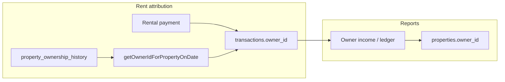

# Multi-owner property sharing and ownership transfer

## Current architecture (what you already have)

- **Property**: single owner on `[properties.owner_id](f:/AntiGravity projects/PBooksPro -Local DB only/services/database/schema.ts)` (SQLite + aligned TypeScript types).
- **Rental agreements**: optional `[rental_agreements.owner_id](f:/AntiGravity projects/PBooksPro -Local DB only/services/database/schema.ts)` (used to preserve “who was owner” on historical/renewed agreements).
- **Accounting attribution**: `[transactions.owner_id](f:/AntiGravity projects/PBooksPro -Local DB only/services/database/schema.ts)`. New rental payments set this via `[getOwnerIdForPropertyOnDate](f:/AntiGravity projects/PBooksPro -Local DB only/services/ownershipHistoryUtils.ts)` in `[RentalPaymentModal.tsx](f:/AntiGravity projects/PBooksPro -Local DB only/components/invoices/RentalPaymentModal.tsx)`, `[BulkPaymentModal.tsx](f:/AntiGravity projects/PBooksPro -Local DB only/components/invoices/BulkPaymentModal.tsx)`, `[MonthlyServiceChargesPage.tsx](f:/AntiGravity projects/PBooksPro -Local DB only/components/rentalManagement/MonthlyServiceChargesPage.tsx)`, `[ManualServiceChargeModal.tsx](f:/AntiGravity projects/PBooksPro -Local DB only/components/rentalManagement/ManualServiceChargeModal.tsx)`.
- **Ownership periods**: table `property_ownership_history` (start/end per owner) exists in `[services/database/schema.ts](f:/AntiGravity projects/PBooksPro -Local DB only/services/database/schema.ts)`; loaded/saved via `[appStateRepository.ts](f:/AntiGravity projects/PBooksPro -Local DB only/services/database/repositories/appStateRepository.ts)`.
- **Transfer UI**: `[PropertyTransferModal.tsx](f:/AntiGravity projects/PBooksPro -Local DB only/components/settings/PropertyTransferModal.tsx)` updates the property, optionally renews agreements, and stamps `ownerId` on old agreements—aligned with “keep old owner on historical records.”
- **Reports**: `[OwnerIncomeSummaryReport.tsx](f:/AntiGravity projects/PBooksPro -Local DB only/components/reports/OwnerIncomeSummaryReport.tsx)` attributes rental income using `tx.ownerId` when present, otherwise **current** `properties.ownerId` (see lines ~188–193). `[OwnerLedger.tsx](f:/AntiGravity projects/PBooksPro -Local DB only/components/payouts/OwnerLedger.tsx)` uses similar rules (lines ~56–62).

**Gaps to close (important for your second question):**

1. `**TRANSFER_PROPERTY_OWNERSHIP` is not handled in the reducer** (`[AppContext.tsx](f:/AntiGravity projects/PBooksPro -Local DB only/context/AppContext.tsx)` ends with `default: return state`). The modal dispatches it before `UPDATE_PROPERTY`, so **ownership history rows may not be updated in UI state** unless another path writes them. Implement the reducer case (close active history row, insert new row, update `properties.ownerId`) or fold that logic into a single atomic action.
2. **Historical rows without `transactions.owner_id`**: reports that fall back to **current** property owner can mis-attribute income after a transfer. Prefer: if `tx.owner_id` is null, resolve owner with `getOwnerIdForPropertyOnDate(propertyId, tx.date, history, property.ownerId)` (same idea as payment creation, but for display/backfill).
3. **PostgreSQL / LAN API**: `[database/migrations/004_buildings_properties.sql](f:/AntiGravity projects/PBooksPro -Local DB only/database/migrations/004_buildings_properties.sql)` defines `properties` only; `**property_ownership_history` is not in PostgreSQL migrations**. If you sync rental data to the API, add matching tables + `[backend/src/services/propertiesService.ts](f:/AntiGravity projects/PBooksPro -Local DB only/backend/src/services/propertiesService.ts)` / state sync or accept SQLite-only history.

---

## Part A — Property sharing among two or more owners

### Data model (backend / SQLite / types)

Introduce a **normalized share table** (avoid encoding multiple owners in a single `owner_id`):

| Approach                                                                                                                                                                | Pros                                                  | Cons                                    |
| ----------------------------------------------------------------------------------------------------------------------------------------------------------------------- | ----------------------------------------------------- | --------------------------------------- |
| `**property_owner_shares`**: `(property_id, contact_id, share_percent, effective_from?, effective_to?)` with constraint that active shares sum to **100%** per property | Clear, report-friendly, supports future dated changes | Requires migration + UI validation      |
| JSON on `properties`                                                                                                                                                    | Fewer tables                                          | Weak validation, harder to query/report |

**Recommendation:** `property_owner_shares` with `share_percent` (2 decimal places) and optional effective dates if you need mid-year changes without editing old transactions.

- Keep `**properties.owner_id`** as **primary contact** (UI default, correspondence) **or** derive “primary” as the first co-owner—product decision. Easiest migration: existing rows get one share row at **100%** for current `owner_id`.

### How income hits each owner (accounting)

**Recommended pattern (fits existing reports):** on each **rent collection** (and similar property-scoped income), **split into N `transactions` rows** (same `property_id`, `invoice_id` if applicable, `date`, category `Rental Income`), each with:

- `amount = round(total * share_i)` with last line adjusted for rounding
- `owner_id = co_owner_i`

`[OwnerIncomeSummaryReport](f:/AntiGravity projects/PBooksPro -Local DB only/components/reports/OwnerIncomeSummaryReport.tsx)` and `[OwnerLedger](f:/AntiGravity projects/PBooksPro -Local DB only/components/payouts/OwnerLedger.tsx)` already key off `tx.ownerId`; this avoids a second allocation subsystem.

**Alternative:** one transaction + child `transaction_owner_allocations` table—only needed if you must keep a single bank line; more work in reports.

**Broker fees / owner bills / payouts:** apply the same share to:

- Broker fee accrual derived from agreements (either split fee line in logic, or attribute fee per owner by share when calculating “payable”).
- Property cost-center **bills** and **owner payouts**—either split expense transactions by share or assign to “primary” only (document the rule in UI).

### UI changes

1. **Property editor** (`[PropertyForm.tsx](f:/AntiGravity projects/PBooksPro -Local DB only/components/settings/PropertyForm.tsx)`): new section **“Co-owners & shares”**: list owners (contact picker), percentage, validation (sum = 100%). Show read-only warning when changing shares mid-period.
2. **Property detail / rental settings**: display all owners and shares; link to ledger filtered by property.
3. **Owner Income Summary / Owner Payouts / Owner Ledger**: optional **column or sub-rows per property** showing each co-owner’s slice when shares exist (or rely on separate owner rows after split transactions—often enough).
4. **Help text**: explain that changing shares affects **new** payments only unless you backfill.

### Code touchpoints (implementation)

- Schema: `[services/database/schema.ts](f:/AntiGravity projects/PBooksPro -Local DB only/services/database/schema.ts)`, `[electron/sqliteBridge.cjs](f:/AntiGravity projects/PBooksPro -Local DB only/electron/sqliteBridge.cjs)` (if dynamic migrations), version bump in `SCHEMA_VERSION` / `initSchema`.
- Types: `[types.ts](f:/AntiGravity projects/PBooksPro -Local DB only/types.ts)` — new interface + `AppState` + actions `ADD/UPDATE/DELETE_PROPERTY_OWNER_SHARE`.
- Repository + API: `[appStateRepository.ts](f:/AntiGravity projects/PBooksPro -Local DB only/services/database/repositories/appStateRepository.ts)`, `[services/api/appStateApi.ts](f:/AntiGravity projects/PBooksPro -Local DB only/services/api/appStateApi.ts)` if synced.
- Payment flows: `[RentalPaymentModal.tsx](f:/AntiGravity projects/PBooksPro -Local DB only/components/invoices/RentalPaymentModal.tsx)`, `[BulkPaymentModal.tsx](f:/AntiGravity projects/PBooksPro -Local DB only/components/invoices/BulkPaymentModal.tsx)` — after computing total rent, **fan out** N transactions with `owner_id` and amounts by share.
- Optional **data repair** script: for past periods, allocate 100% to legacy single owner (no change) unless user requests recalculation.

---

## Part B — Transfer property to another owner (sale) while keeping old owner’s rental history

**Intended behavior (matches your ask):**

- **Past** rental income and agreements stay attributed to the **old owner** (via `transactions.owner_id` and/or `property_ownership_history` + agreement `owner_id`).
- **After transfer date**, new income attributes to the **new owner** (already supported if `owner_id` is set on new txs and/or history is correct).

**Concrete steps:**

1. **Implement `TRANSFER_PROPERTY_OWNERSHIP` in the reducer** (or replace with one composite action) to:
  - Set `ownership_end_date` on the active `property_ownership_history` row for the old owner.
  - Insert a new history row for the new owner from `transferDate` with `ownership_end_date` null.
  - Update `properties.owner_id` to the new owner (today partly done by `UPDATE_PROPERTY` only).
2. **Ensure all new rental/posting paths set `transactions.owner_id`** (already true for main payment paths using `getOwnerIdForPropertyOnDate`). Audit any path that creates `Rental Income` without `owner_id` (imports, manual journal, older code).
3. **Report attribution fix** for legacy rows: in `[OwnerIncomeSummaryReport](f:/AntiGravity projects/PBooksPro -Local DB only/components/reports/OwnerIncomeSummaryReport.tsx)` / `[OwnerLedger](f:/AntiGravity projects/PBooksPro -Local DB only/components/payouts/OwnerLedger.tsx)`, replace fallback “current property owner” with **date-based resolution** via `getOwnerIdForPropertyOnDate` when `tx.owner_id` is missing—so transfers do not rewrite history in the UI.
4. **Optional backfill job**: one-time update `transactions.owner_id` from history for old rows (improves performance and consistency).
5. **PostgreSQL parity** (if you use LAN sync for production): add `property_ownership_history` + sync in `[stateChangesService](f:/AntiGravity projects/PBooksPro -Local DB only/backend/src/services/stateChangesService.ts)` / properties sync.

`[PropertyTransferModal](f:/AntiGravity projects/PBooksPro -Local DB only/components/settings/PropertyTransferModal.tsx)` already renews agreements and stamps historical `ownerId` on agreements; keep that behavior and align reducer/history so `getOwnerIdForPropertyOnDate` stays consistent.

---

## Suggested rollout order

1. Fix **transfer reducer + report fallback** (small, high value for “old owner keeps history”).
2. Add `**property_owner_shares`** + property UI + split rent transactions.
3. Extend **broker fee / bills / payouts** to respect shares (or document “primary owner only” as v1).
4. **PostgreSQL migrations + API** if cloud/LAN must mirror local behavior.

