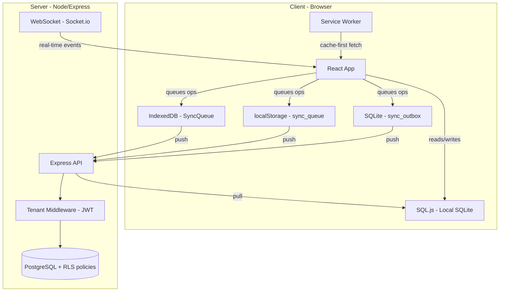

# Multi-Tenant SaaS Architecture Audit -- PBooksPro

---

## Architecture Overview




---

## CRITICAL Findings

### C1. SyncManager Queue is NOT Tenant-Scoped (Cross-Tenant Data Leak)

**File:** [services/sync/syncManager.ts](services/sync/syncManager.ts) lines 481-513

The `SyncManager` stores its in-memory queue to a **single** `localStorage` key (`sync_queue`) with **no tenant or user scoping**. When User A on Tenant X logs out and User B on Tenant Y logs in, the queue is reloaded wholesale -- operations from Tenant X will be pushed under Tenant Y's session.

```
localStorage.setItem('sync_queue', JSON.stringify(this.queue));  // line 483
const saved = localStorage.getItem('sync_queue');                // line 494
this.queue = JSON.parse(saved);                                   // line 496
```

**Why dangerous:** Financial transactions, invoices, or contact records from one tenant can be blindly synced to another tenant's cloud dataset. In a regulatory context this is a data breach.

**Fix:**

- Key the localStorage entry by tenant: `sync_queue_${tenantId}`
- On logout, flush or quarantine the current tenant's queue
- On login, load only the new tenant's queue
- Add tenant validation in `syncQueueBatch()` before sending

---

### C2. Logout Does NOT Clear Sync Queues

**File:** [context/AuthContext.tsx](context/AuthContext.tsx) lines 70-122

The `logout()` function clears auth tokens and stops the bidirectional sync service, but **never clears**:

- The SyncManager localStorage queue
- The IndexedDB `SyncQueue` (`FinanceTrackerSyncQueue`)
- The SQLite `sync_outbox` table

Combined with C1, this means stale operations survive across user/tenant sessions.

**Fix:** Add to `logout()`:

```typescript
// Clear all sync queues for current tenant
syncQueue.clearAll(currentTenantId);
syncManager.clearAll();
// Clear sync_outbox via databaseService
databaseService.execute('DELETE FROM sync_outbox WHERE tenant_id = ?', [currentTenantId]);
```

---

### C3. No Soft Deletes -- Deletions Cannot Propagate via Sync

**Files:** [services/database/schema.ts](services/database/schema.ts) (entire file)

No table in the local schema contains a `deleted_at` or `is_deleted` column. All deletes are hard deletes. This means:

- When a record is deleted offline, the sync engine has **no tombstone** to push to the cloud
- When a record is deleted on the cloud by User B, the pull cannot mark it as deleted locally for User A -- it simply won't appear in the delta, and stale data remains
- There is no audit trail for deletions of financial records

**Why dangerous:** Regulatory compliance (SOX, tax law) typically requires deletion audit trails. Hard deletes also break incremental sync -- you cannot sync "absence."

**Fix:**

- Add `deleted_at TEXT` to every entity table
- Convert all DELETE operations to `UPDATE SET deleted_at = NOW()`
- Filter out soft-deleted rows in all SELECT queries (`WHERE deleted_at IS NULL`)
- Sync engine must push soft-delete operations and pull tombstones

---

### C4. No Universal Optimistic Locking -- Silent Cross-User Overwrites

**Files:**

- [services/database/schema.ts](services/database/schema.ts) -- `version` field exists ONLY on `bills` (line 256) and `installment_plans` (line 336)
- [services/sync/syncManager.ts](services/sync/syncManager.ts) line 373 -- push sends payload with no version check
- [services/sync/bidirectionalSyncService.ts](services/sync/bidirectionalSyncService.ts) line 149 -- push sends payload with no version check

Every other entity (transactions, invoices, contacts, accounts, categories, projects, etc.) has **no version column**. The sync engine sends updates without any optimistic locking. The server has no version check on UPDATE.

**Scenario:**

1. User A edits Invoice #100 offline (amount: $500 -> $600)
2. User B edits Invoice #100 online (amount: $500 -> $450)
3. User A comes online and pushes -- silently overwrites User B's $450 with $600
4. No conflict detected, no audit trail

**Fix:**

- Add `version INTEGER NOT NULL DEFAULT 1` to all entity tables (local + cloud)
- Every UPDATE must increment version and include `WHERE version = $expectedVersion`
- Server rejects stale versions with HTTP 409
- Sync engine stores version in queue items and handles 409 as a conflict

---

### C5. `tenant_id` is Nullable on Most Local Schema Tables

**File:** [services/database/schema.ts](services/database/schema.ts) -- lines 42, 58, 73, 88, 104, 116, 130, 149, 181, 218, 254, 275, 293, etc.

The vast majority of tables define `tenant_id TEXT` (nullable). Only the newer tables (tasks, payroll, P2P) use `tenant_id TEXT NOT NULL`. This means:

- Records can be inserted without a tenant_id
- Queries filtering by `tenant_id` will miss rows where it is NULL
- A bug in any repository that forgets to set tenant_id creates orphan records visible to no tenant -- or worse, visible to all

**Fix:**

- ALTER all tables: `tenant_id TEXT NOT NULL`
- Add a migration to backfill any NULL tenant_id values
- Add a CHECK constraint or trigger to prevent NULL inserts

---

### C6. Supplier `/promote` Endpoint Trusts Client-Provided `tenantId`

**File:** [server/api/routes/suppliers.ts](server/api/routes/suppliers.ts) lines 13-88

```typescript
const { tenantId, taxId, paymentTerms, ... } = req.body;
// Uses tenantId from req.body -- NOT from JWT
```

Any authenticated user can promote **any** tenant to a supplier by sending a crafted `tenantId` in the request body.

**Fix:** Replace `req.body.tenantId` with `req.tenantId!` (from JWT middleware).

---

### C7. Service Worker Caches POST/PUT Responses

**File:** [sw.js](sw.js) lines 46-81

The fetch handler does not check `event.request.method`. All requests (GET, POST, PUT, DELETE) pass through `caches.match()` and may be cached or served from cache.

**Why dangerous:** A cached POST response (e.g., creating a transaction) could be served instead of making the actual API call, causing silent data loss or stale responses on retry.

**Fix:** Add at the top of the fetch handler:

```javascript
if (event.request.method !== 'GET') {
  return; // Never cache mutation requests
}
```

---

## HIGH Findings

### H1. Unique Constraints Without Tenant Scope -- Cross-Tenant Collisions

**File:** [services/database/schema.ts](services/database/schema.ts)


| Constraint                                  | Line | Risk                                                |
| ------------------------------------------- | ---- | --------------------------------------------------- |
| `invoices.invoice_number UNIQUE`            | ~200 | Tenant B cannot use same invoice number as Tenant A |
| `contracts.contract_number UNIQUE`          | ~476 | Same                                                |
| `rental_agreements.agreement_number UNIQUE` | ~380 | Same                                                |
| `purchase_orders.po_number UNIQUE`          | ~767 | Same                                                |


**Fix:** Change to `UNIQUE(tenant_id, invoice_number)`, etc. The `sales_returns` table already does this correctly: `UNIQUE(tenant_id, return_number)`.

---

### H2. Real-Time Sync Applies WebSocket Data Without Client-Side Tenant Validation

**File:** [services/sync/realtimeSyncHandler.ts](services/sync/realtimeSyncHandler.ts) ~line 960

When a WebSocket event arrives, the handler calls `appStateRepo.upsertEntity(entityKey, data)` without verifying that `data.tenant_id` matches the currently active tenant. If the server has a bug or the WebSocket room leaks, cross-tenant data is written to the local DB.

**Fix:** Before applying any remote data, assert:

```typescript
if (data.tenant_id !== currentTenantId) {
  console.error('SECURITY: Received data for wrong tenant, discarding');
  return;
}
```

---

### H3. Pull (Cloud to Local) Applies Data Without Client-Side Tenant Validation

**File:** [services/sync/bidirectionalSyncService.ts](services/sync/bidirectionalSyncService.ts) ~line 227

`runDownstream()` receives server data and calls `appStateRepo.upsertEntity()` without checking the tenant_id of each record. Defense-in-depth requires the client to validate, not only the server.

**Fix:** Same pattern as H2 -- validate `tenant_id` on every record before local write.

---

### H4. No Idempotency Keys -- Duplicate Operations on Retry

**Files:**

- [services/sync/syncManager.ts](services/sync/syncManager.ts) -- retry logic at lines 259-268 sends the same payload again
- [services/syncQueue.ts](services/syncQueue.ts) -- queue item ID is `sync_${Date.now()}_${random}` but not sent to server

If a push succeeds on the server but the response is lost (network flap), the retry creates a duplicate record. There is no server-side deduplication.

**Fix:**

- Include the sync queue item `id` as an `idempotency_key` in the request headers
- Server stores processed idempotency keys (with TTL) and returns the cached response for duplicates

---

### H5. LockManager Exists but is NOT Integrated into Sync

**Files:**

- [services/sync/lockManager.ts](services/sync/lockManager.ts) -- full lock acquisition/release logic
- [services/sync/syncManager.ts](services/sync/syncManager.ts) -- no lock checks before sync
- [services/sync/bidirectionalSyncService.ts](services/sync/bidirectionalSyncService.ts) -- no lock checks before sync

The lock manager is built but never consulted during push or pull operations. Two users can concurrently edit and sync the same record with no coordination.

**Fix:** Before pushing an update, check if the record is locked by another user. If locked, queue the conflict for resolution rather than blindly pushing.

---

### H6. Conflict Resolution: No Logging, No Storage, No Visibility

**File:** [services/sync/conflictResolution.ts](services/sync/conflictResolution.ts)

The `LastWriteWinsResolver` silently picks a winner. There is:

- No conflict log table
- No UI for admins to review conflicts
- No audit trail
- No ability to undo a wrong resolution

For financial data, this is unacceptable.

**Fix:**

- Create a `sync_conflicts` table (local + cloud) storing both versions, resolution, timestamp, user
- Surface unresolved/auto-resolved conflicts in an admin dashboard
- For financial entities (transactions, invoices, bills), consider requiring manual resolution

---

### H7. `databaseService.query()` / `execute()` Have No Tenant Filtering

**File:** [services/database/databaseService.ts](services/database/databaseService.ts) lines 386-435

These are raw SQL execution methods with no automatic tenant scoping. Any repository that forgets to add `WHERE tenant_id = ?` exposes cross-tenant data.

**Fix:**

- Add a `queryForTenant(sql, params, tenantId)` wrapper that automatically appends tenant filtering
- Deprecate raw `query()` for tenant-scoped data
- Or use a query builder that enforces tenant context

---

### H8. Suppliers GET Returns All Tenants' Supplier Data

**File:** [server/api/routes/suppliers.ts](server/api/routes/suppliers.ts) lines 94-109

```sql
SELECT ... FROM tenants WHERE is_supplier = TRUE ORDER BY name
```

No `tenant_id` filter. Returns all suppliers across all tenants. If this is intentional (marketplace), it should be documented and restricted to non-sensitive fields only.

---

## MEDIUM Findings

### M1. IndexedDB Sync Queue is Shared Across Tenants

**File:** [services/syncQueue.ts](services/syncQueue.ts) line 10

Database name `FinanceTrackerSyncQueue` is a single shared store. Tenant isolation relies on the `tenantId` index in queries. A single bug in index usage exposes all tenants' queued operations.

**Fix:** Consider per-tenant databases: `SyncQueue_${tenantId}`, or at minimum add a validation layer that rejects any queue read/write without an explicit tenantId parameter.

---

### M2. Last-Write-Wins Without Field-Level Detection

**File:** [services/sync/conflictResolution.ts](services/sync/conflictResolution.ts) lines 46-60

The LWW resolver compares `updated_at` timestamps at the record level. If User A changes the "amount" field and User B changes the "description" field on the same record, one user's change is entirely lost.

**Fix:** Implement field-level conflict detection:

- Store a hash of each field at sync time
- On conflict, merge non-overlapping field changes automatically
- Flag overlapping field changes for manual resolution

---

### M3. No Device Identity Tracking for Sync

Device ID exists only in [hooks/useDatabaseLicense.ts](hooks/useDatabaseLicense.ts) for license validation. It is not stored in:

- Sync queue items
- Push requests
- Server sessions
- Conflict resolution context

Without device tracking, the server cannot distinguish "same user, two devices" from "same user, one device" -- important for conflict resolution and audit.

**Fix:** Generate a persistent device UUID, include it in all sync operations and session records.

---

### M4. No Automatic Token Refresh

**File:** [services/api/client.ts](services/api/client.ts) lines 495-537

`refreshToken()` exists but is never called proactively. Tokens expire silently, causing the user to be logged out. The WebSocket client has refresh logic ([services/websocketClient.ts](services/websocketClient.ts) lines 427-472) but the HTTP client does not.

**Fix:** Implement a token refresh interceptor that refreshes the token when it is within N minutes of expiry, before making API calls.

---

### M5. `clearTransactionData()` and `clearAllData()` Ignore Tenant Scope

**File:** [services/database/databaseService.ts](services/database/databaseService.ts) lines 694-784

Both methods delete from all tables unconditionally. On a shared device, clearing data for one tenant wipes all tenants' local data.

**Fix:** Accept a `tenantId` parameter and add `WHERE tenant_id = ?` to every DELETE statement.

---

### M6. RLS Enabled But Not Used

**File:** [server/middleware/tenantMiddleware.ts](server/middleware/tenantMiddleware.ts) lines 402-406

PostgreSQL RLS policies are created in the migration but never activated because the session variable `app.current_tenant_id` is never set (due to connection pooling concerns). All tenant filtering relies on explicit WHERE clauses in every query.

**Risk:** A single forgotten WHERE clause = cross-tenant data leak. RLS would be a safety net.

**Fix:** Use `SET LOCAL app.current_tenant_id = $tenantId` within each transaction (LOCAL scope ensures it doesn't leak across pooled connections).

---

### M7. `rental_agreements` Uses `org_id` Instead of `tenant_id`

**File:** [services/database/schema.ts](services/database/schema.ts) ~line 392

This table uses `org_id` while every other table uses `tenant_id`. This inconsistency means any generic tenant-filtering logic (query builders, audits, RLS) will miss this table.

**Fix:** Rename `org_id` to `tenant_id` for consistency, or add a `tenant_id` alias column.

---

## LOW Findings

### L1. Missing Composite Indexes

Only `transactions` has a composite `(tenant_id, user_id)` index. All other tables have single-column `tenant_id` indexes. For large datasets, queries like `WHERE tenant_id = ? AND id = ?` require a table scan after the tenant filter.

**Fix:** Add `CREATE INDEX idx_{table}_tenant_id ON {table}(tenant_id, id)` for all entity tables.

---

### L2. No Offline Token Expiry Strategy

When a device is offline for hours/days, the JWT expires. Upon reconnection, the sync engine will attempt to push with an expired token. There is no graceful re-authentication flow -- the user is silently logged out and pending sync may be lost.

**Fix:** On reconnection, check token expiry first. If expired, prompt for re-authentication before syncing. Preserve the sync queue across re-auth.

---

### L3. Sync Queue Item Ordering

**File:** [services/syncQueue.ts](services/syncQueue.ts)

Queue items are ordered by `timestamp` (Date.now()). There is no per-entity ordering guarantee. If the same entity is updated multiple times offline, the operations may arrive at the server out of order.

**Fix:** Add a per-entity sequence number or ensure the server applies operations in timestamp order per entity.

---

### L4. No Batch Pagination for Full Sync

**File:** [server/api/routes/stateChanges.ts](server/api/routes/stateChanges.ts)

The pull endpoint returns all changes since `?since=timestamp` with no pagination. For a tenant with thousands of records after a long offline period, this could be a massive payload.

**Fix:** Add `LIMIT/OFFSET` or cursor-based pagination. Return a `has_more` flag so the client can page through results.

---

## Summary Matrix


| #   | Finding                                  | Severity | Category              |
| --- | ---------------------------------------- | -------- | --------------------- |
| C1  | SyncManager queue not tenant-scoped      | Critical | Tenant Isolation      |
| C2  | Logout does not clear sync queues        | Critical | Session Safety        |
| C3  | No soft deletes                          | Critical | Data Integrity / Sync |
| C4  | No universal optimistic locking          | Critical | Concurrency           |
| C5  | tenant_id nullable on most tables        | Critical | Tenant Isolation      |
| C6  | Supplier /promote trusts client tenantId | Critical | Server Security       |
| C7  | Service worker caches POST/PUT           | Critical | Cache Safety          |
| H1  | Unique constraints without tenant scope  | High     | Tenant Isolation      |
| H2  | Real-time sync no client tenant check    | High     | Tenant Isolation      |
| H3  | Pull sync no client tenant validation    | High     | Tenant Isolation      |
| H4  | No idempotency keys                      | High     | Sync Reliability      |
| H5  | LockManager not integrated into sync     | High     | Concurrency           |
| H6  | No conflict logging/storage              | High     | Audit / Compliance    |
| H7  | Raw query/execute has no tenant filter   | High     | Tenant Isolation      |
| H8  | Suppliers GET leaks cross-tenant data    | High     | Server Security       |
| M1  | Shared IndexedDB for all tenants         | Medium   | Tenant Isolation      |
| M2  | LWW without field-level detection        | Medium   | Concurrency           |
| M3  | No device identity in sync               | Medium   | Audit / Traceability  |
| M4  | No automatic token refresh               | Medium   | Auth / UX             |
| M5  | clearData ignores tenant scope           | Medium   | Tenant Isolation      |
| M6  | RLS enabled but not used                 | Medium   | Defense in Depth      |
| M7  | rental_agreements uses org_id            | Medium   | Schema Consistency    |
| L1  | Missing composite indexes                | Low      | Performance           |
| L2  | No offline token expiry strategy         | Low      | Auth / UX             |
| L3  | No per-entity sync ordering              | Low      | Sync Reliability      |
| L4  | No batch pagination for pull             | Low      | Performance           |


---

## Recommended Remediation Order

**Phase 1 -- Immediate (data safety + security):**

1. Fix C6 (supplier endpoint) -- 15 min
2. Fix C7 (service worker POST/PUT) -- 5 min
3. Fix C2 (clear queues on logout) -- 1 hour
4. Fix C1 (tenant-scope SyncManager queue) -- 2 hours
5. Fix H2/H3 (client-side tenant validation on pull/realtime) -- 1 hour
6. Fix H8 (supplier GET cross-tenant) -- 15 min

**Phase 2 -- Schema hardening:**
7. Fix C5 (make tenant_id NOT NULL) -- migration + backfill
8. Fix H1 (tenant-scoped unique constraints) -- migration
9. Fix M7 (rename org_id to tenant_id) -- migration
10. Fix C3 (add deleted_at soft deletes) -- schema + query changes

**Phase 3 -- Sync engine overhaul:**
11. Fix C4 (universal optimistic locking with version columns)
12. Fix H4 (idempotency keys)
13. Fix H5 (integrate LockManager into sync)
14. Fix H6 (conflict logging and admin visibility)
15. Fix M2 (field-level conflict detection)

**Phase 4 -- Defense in depth + performance:**
16. Fix M6 (activate RLS with SET LOCAL)
17. Fix H7 (tenant-aware query wrapper)
18. Fix M5 (tenant-scoped clear methods)
19. Fix L1 (composite indexes)
20. Fix L4 (paginated pull sync)