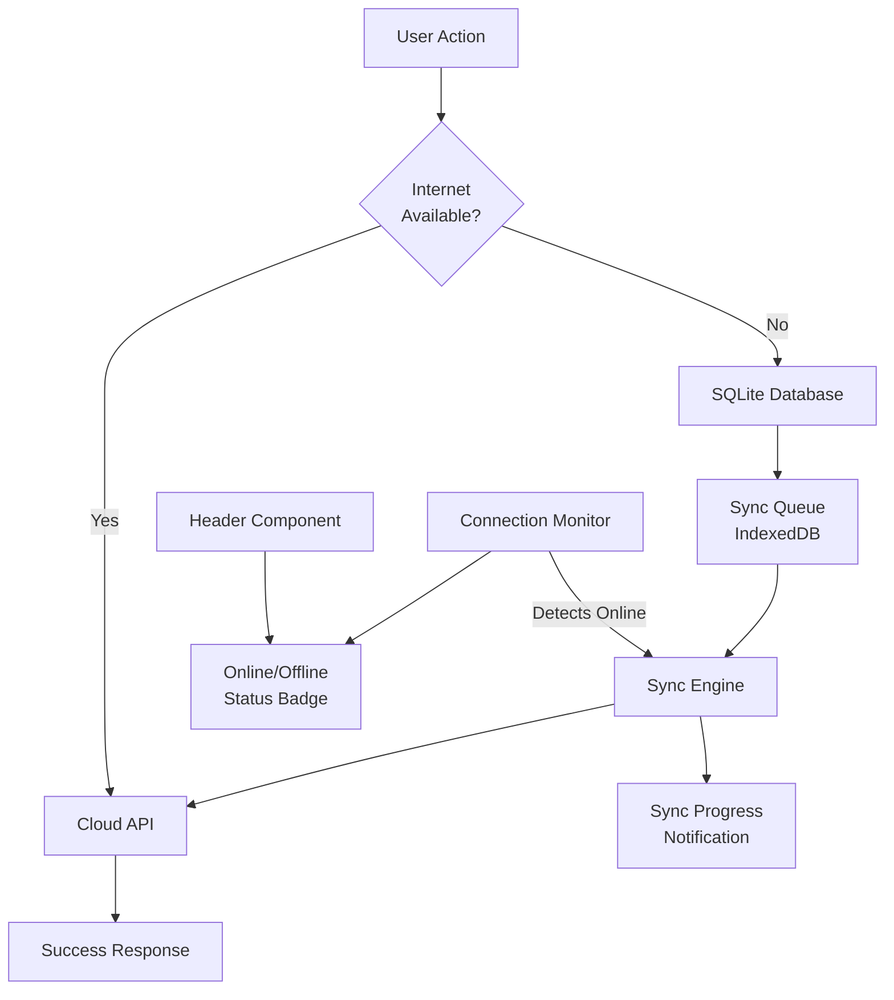
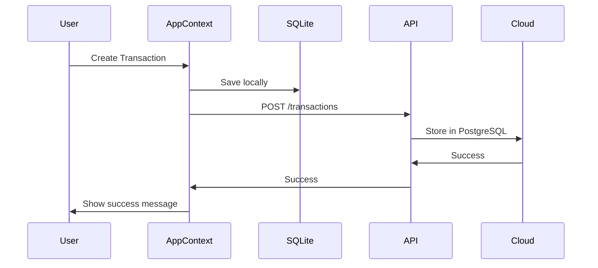
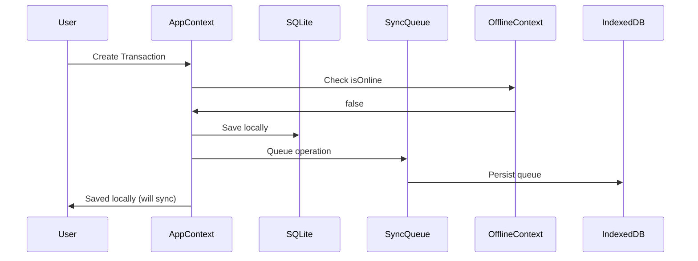
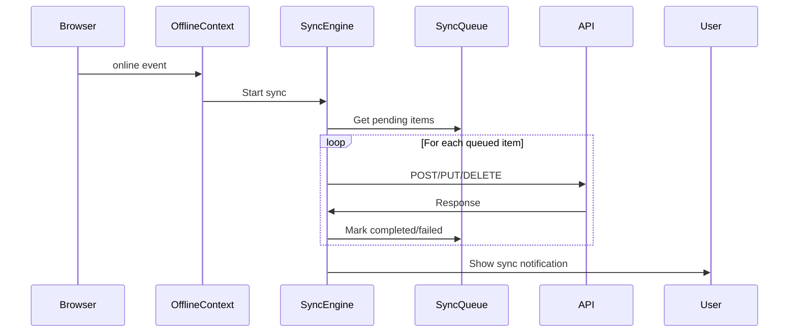

# Offline Sync System Implementation Plan

## Overview

Implement a robust offline-first capability that:

- Detects internet connectivity status
- Queues critical data changes locally when offline
- Automatically syncs to cloud when connection restores
- Displays online/offline status in application header
- Prevents data loss during logout/login cycles when offline
- Disables settings changes during offline mode

## Architecture



## Key Components to Create/Modify

### 1. Connection Monitor Service

**New file**: `services/connectionMonitor.ts`

- Monitor `navigator.onLine` status
- Listen to `online`/`offline` events
- Emit custom events for status changes
- Periodic API health checks (optional)

### 2. Sync Queue Service  

**New file**: `services/syncQueue.ts`

- Store pending operations in IndexedDB
- Queue structure: `{ id, type, action, data, timestamp, retryCount }`
- CRUD operations for queue management
- Persist queue across sessions

### 3. Sync Engine Service

**New file**: `services/syncEngine.ts`

- Process queued operations when online
- Retry failed operations with exponential backoff
- Handle sync progress and errors
- Emit sync status events

### 4. Offline Context

**New file**: `context/OfflineContext.tsx`

- Track online/offline state
- Expose sync queue status
- Provide methods to check connectivity
- Trigger manual sync

### 5. Update AppContext

**File**: [`context/AppContext.tsx`](context/AppContext.tsx)

- Integrate offline detection
- Route operations to sync queue when offline
- Disable settings actions when offline
- Handle local-first data persistence

### 6. Update Header Component

**File**: [`components/layout/Header.tsx`](components/layout/Header.tsx)

- Add online/offline status badge
- Show sync progress indicator
- Display queued operations count

### 7. Update API Client

**File**: [`services/api/client.ts`](services/api/client.ts)

- Detect network errors
- Throw specific offline errors
- Don't auto-logout on network failures

### 8. Sync Progress Notification

**New file**: `components/ui/SyncNotification.tsx`

- Show sync progress (X of Y operations)
- Display sync success/failure
- Auto-dismiss on completion

## Implementation Details

### Phase 1: Connection Monitoring & Status Display

**Create Connection Monitor Service**

```typescript
// services/connectionMonitor.ts
- Monitor navigator.onLine
- Listen to window online/offline events
- Emit custom 'connection:change' events
- Store connection status in localStorage
```

**Update Header with Status Badge**

```typescript
// components/layout/Header.tsx
- Add status indicator (green dot = online, red dot = offline)
- Display "Online" or "Offline" label
- Show sync queue count when offline
```

**Create Offline Context**

```typescript
// context/OfflineContext.tsx
- Provide isOnline state
- Provide pendingOperations count
- Provide sync status (idle/syncing/error)
```

### Phase 2: Sync Queue Implementation

**Create Sync Queue Service**

```typescript
// services/syncQueue.ts
- Use IndexedDB for queue storage
- Operations to add/remove/update queue items
- Queue item structure:
  {
    id: string,
    type: 'transaction' | 'contact' | 'invoice' | 'bill' | etc.,
    action: 'create' | 'update' | 'delete',
    data: any,
    timestamp: number,
    retryCount: number,
    status: 'pending' | 'syncing' | 'failed' | 'completed'
  }
```

**Create Sync Engine Service**

```typescript
// services/syncEngine.ts
- Process queue items sequentially
- Call appropriate API endpoints
- Handle success/failure
- Retry failed operations (max 3 attempts)
- Emit progress events
```

### Phase 3: AppContext Integration

**Update AppContext Reducer**

- Intercept data-changing actions
- Check online status before API calls
- If offline:
    - Save to local SQLite
    - Add operation to sync queue
    - Show offline notification
- If online:
    - Save to local SQLite
    - Call API immediately
    - Handle API errors

**Actions to Queue When Offline**

- Transactions: ADD/UPDATE/DELETE
- Contacts: ADD/UPDATE/DELETE
- Invoices: ADD/UPDATE/DELETE
- Bills: ADD/UPDATE/DELETE
- Projects: ADD/UPDATE/DELETE
- Buildings: ADD/UPDATE/DELETE
- Properties: ADD/UPDATE/DELETE
- Units: ADD/UPDATE/DELETE
- Budgets: ADD/UPDATE/DELETE
- Rental Agreements: ADD/UPDATE/DELETE
- Project Agreements: ADD/UPDATE/DELETE
- Contracts: ADD/UPDATE/DELETE
- Sales Returns: ADD/UPDATE/DELETE
- Quotations: ADD/UPDATE/DELETE
- Tasks: ADD/UPDATE/DELETE
- Payroll operations: ADD/UPDATE/DELETE

**Actions to DISABLE When Offline**

- Settings updates (all UPDATE_*_SETTINGS actions)
- License operations
- Data import/export
- Report generation (cloud-based)

### Phase 4: Auto-Sync on Connection Restore

**Connection Restore Handler**

```typescript
// In OfflineContext
- Listen for 'online' event
- Check if sync queue has pending items
- If yes:
 - Start sync engine
 - Show sync notification
 - Process queue items
 - Update status
```

**Sync Notification Component**

```typescript
// components/ui/SyncNotification.tsx
- Show during sync: "Syncing X of Y operations..."
- Show on success: "Successfully synced X operations"
- Show on error: "Failed to sync X operations. Retry?"
- Auto-dismiss after 5 seconds (success)
- Manual dismiss (error, with retry button)
```

### Phase 5: Persistent Offline Data

**Session Persistence**

- Sync queue stored in IndexedDB (persists across sessions)
- Local SQLite database already persists in localStorage/OPFS
- On logout:
    - Keep sync queue in IndexedDB
    - Clear auth token
    - Clear user session data
- On login:
    - Load sync queue from IndexedDB
    - Filter queue by logged-in user's tenant_id
    - Start auto-sync if online

**User Switching**

- Each queue item includes tenant_id
- Filter queue by current user's tenant on login
- Only sync operations for current tenant

## Data Flow Diagrams

### Normal Online Operation



### Offline Operation



### Sync on Reconnection



## Error Handling

### Network Errors

- Detect `Failed to fetch`, `NetworkError`, `ERR_CONNECTION_REFUSED`
- Don't logout user on network errors
- Queue operation for later sync
- Show user-friendly message: "No internet. Changes saved locally."

### API Errors (401, 403, 500)

- 401 Unauthorized: Handle separately (token expired - logout)
- Other errors: Queue for retry with exponential backoff
- Max 3 retries per operation
- After max retries, mark as failed and notify user

### Sync Conflicts

- Not handling conflicts in this phase (single user scenario)
- Local changes always overwrite cloud data
- Future enhancement: Add conflict detection/resolution

## Settings Lockdown During Offline

**Disable Settings Actions**

- Detect offline mode in SettingsPage
- Show banner: "Settings cannot be changed while offline"
- Disable all settings form inputs
- Hide save buttons
- Show read-only view

**Affected Settings**

- Dashboard config
- Agreement settings
- Invoice settings
- Print settings
- WhatsApp templates
- PM cost percentage
- Document storage path

## Testing Checklist

1. **Connection Detection**

      - ✓ Status updates when toggling Chrome DevTools offline mode
      - ✓ Header shows correct online/offline status
      - ✓ Status persists across page refreshes

2. **Offline Operations**

      - ✓ Create transaction while offline
      - ✓ Update contact while offline
      - ✓ Delete invoice while offline
      - ✓ Operations queued in IndexedDB
      - ✓ Local SQLite reflects changes immediately

3. **Logout/Login While Offline**

      - ✓ Logout preserves sync queue
      - ✓ Login loads sync queue
      - ✓ Correct tenant filtering

4. **Auto-Sync on Reconnection**

      - ✓ Sync starts automatically when online
      - ✓ Progress notification displays
      - ✓ All queued operations sync successfully
      - ✓ Queue cleared after successful sync

5. **Settings Lockdown**

      - ✓ Settings page disabled when offline
      - ✓ Banner message displayed
      - ✓ Forms are read-only

6. **Error Scenarios**

      - ✓ Failed sync operations retry
      - ✓ Max retries reached - show error
      - ✓ Network error doesn't logout user

## Files Summary

**New Files** (7):

- `services/connectionMonitor.ts` - Connection status monitoring
- `services/syncQueue.ts` - Queue management with IndexedDB
- `services/syncEngine.ts` - Sync processing logic
- `context/OfflineContext.tsx` - React context for offline state
- `components/ui/SyncNotification.tsx` - Sync progress UI
- `hooks/useOnlineStatus.ts` - Hook for online/offline state
- `types/sync.ts` - TypeScript types for sync operations

**Modified Files** (3):

- `context/AppContext.tsx` - Integrate offline detection, queue operations
- `components/layout/Header.tsx` - Add online/offline status indicator
- `services/api/client.ts` - Improve network error detection
- `App.tsx` - Add OfflineContext provider

## Success Criteria

1. ✓ Online/offline status displayed in header
2. ✓ Critical data operations queued when offline
3. ✓ Settings disabled during offline mode
4. ✓ Sync queue persists across logout/login
5. ✓ Auto-sync on connection restore with progress notification
6. ✓ No data loss during offline usage
7. ✓ Network errors don't logout user
8. ✓ User can continue working offline indefinitely
9. ✓ Sync notification shows progress and completion