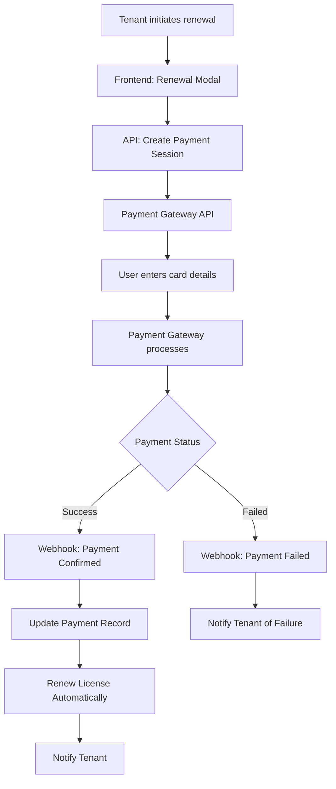

# Payment Gateway Inte

gration for License Renewal

## Overview

This plan implements a complete payment gateway integration system that enables tenants to renew their licenses through secure online payments. The system will support both one-time payments and recurring subscriptions, with automatic license renewal upon successful payment confirmation.

## Architecture




## Database Schema Changes

### New Tables

1. **`payments` table** - Store payment transactions

- `id`, `tenant_id`, `payment_intent_id`, `amount`, `currency`, `status`
- `payment_method`, `gateway`, `gateway_transaction_id`
- `license_type`, `license_duration_months`
- `created_at`, `updated_at`, `paid_at`

2. **`payment_webhooks` table** - Log webhook events for audit

- `id`, `gateway`, `event_type`, `payload`, `processed`, `created_at`

3. **`subscriptions` table** - Track recurring subscriptions (optional)

- `id`, `tenant_id`, `payment_id`, `status`, `next_billing_date`
- `billing_cycle`, `canceled_at`

### Migration File

- Create `server/migrations/add-payment-tables.sql`

## Backend Implementation

### 1. Payment Service (`server/services/paymentService.ts`)

**Responsibilities:**

- Initialize payment sessions with gateway
- Handle payment confirmations
- Process webhook events
- Integrate with LicenseService for renewal

**Methods:**

- `createPaymentSession(tenantId, licenseType, amount)`
- `confirmPayment(paymentIntentId)`
- `handleWebhook(payload, signature)`
- `processSuccessfulPayment(paymentId)`
- `processFailedPayment(paymentId)`

### 2. Payment Gateway Adapters

**Abstract Base Class** (`server/services/paymentGateways/baseGateway.ts`)

- Define interface for all gateways
- Standardize payment flow

**PayFast Adapter** (`server/services/paymentGateways/payfastGateway.ts`)

- Implement PayFast API integration
- Handle PayFast-specific webhooks

**Paymob Adapter** (`server/services/paymentGateways/paymobGateway.ts`)

- Implement Paymob API integration
- Handle Paymob-specific webhooks

**Gateway Factory** (`server/services/paymentGateways/gatewayFactory.ts`)

- Return appropriate gateway instance based on config

### 3. API Routes

**New Route File** (`server/api/routes/payments.ts`)Endpoints:

- `POST /api/payments/create-session` - Create payment intent
- Body: `{ licenseType: 'monthly' | 'yearly', currency?: 'PKR' | 'USD' }`
- Returns: Payment session data (client_secret, checkout_url, etc.)
- `POST /api/payments/confirm` - Confirm payment (for redirect-based flows)
- Body: `{ paymentIntentId, paymentId }`
- `POST /api/payments/webhook/:gateway` - Webhook endpoint
- Handles gateway callbacks for payment status updates
- `GET /api/payments/history` - Get payment history for tenant
- Returns: List of all payments with status
- `GET /api/payments/:paymentId/status` - Check payment status

### 4. Update License Service

**Modify** `server/services/licenseService.ts`:

- Add method `renewLicenseWithPayment(tenantId, licenseType, paymentId)`
- Link payment record to license renewal
- Update `renewLicense()` to support optional payment tracking

### 5. Update Tenant Routes

**Modify** `server/api/routes/tenants.ts`:

- Update `/renew-license` endpoint to optionally create payment session instead of direct renewal
- Add validation for payment requirement when license is expired

## Frontend Implementation

### 1. Payment Modal Component

**New Component** (`components/license/PaymentModal.tsx`)Features:

- Display license renewal options (monthly/yearly)
- Show pricing based on license type
- Payment gateway integration UI
- Card input form (via gateway SDK/iframe)
- Payment status feedback
- Success/failure handling

### 2. License Renewal Page/Modal

**Update** `components/license/LicenseLockScreen.tsx` or create new:

- Show renewal options when license is expired/expiring
- Integrate PaymentModal
- Display payment history

### 3. Payment History Component

**New Component** (`components/license/PaymentHistory.tsx`)

- List all past payments
- Show payment status, amount, date
- Download receipts

### 4. API Service

**New Service** (`services/api/payments.ts`)

- `createPaymentSession()`
- `confirmPayment()`
- `getPaymentHistory()`
- `getPaymentStatus()`

## Configuration

### Environment Variables

Add to `.env`:

```env
# Payment Gateway Configuration
PAYMENT_GATEWAY=payfast  # or paymob
PAYFAST_MERCHANT_ID=your_merchant_id
PAYFAST_MERCHANT_KEY=your_merchant_key
PAYFAST_PASSPHRASE=your_passphrase
PAYFAST_SANDBOX=false
PAYMOB_API_KEY=your_api_key
PAYMOB_INTEGRATION_ID=your_integration_id

# Webhook Security
WEBHOOK_SECRET=your_webhook_secret
```


## Pricing Configuration

**New File** (`server/config/pricing.ts`)

- Define license pricing in PKR and USD
- Support different tiers (starter, professional, enterprise)
- Handle currency conversion

## Error Handling & Security

1. **Webhook Verification**

- Verify webhook signatures from gateway
- Prevent replay attacks (idempotency keys)
- Log all webhook events

2. **Payment Security**

- Never store card details
- Use gateway tokenization
- Implement payment retry logic
- Handle edge cases (partial payments, refunds)

3. **Idempotency**

- Prevent duplicate license renewals
- Track payment intents uniquely

## Testing Strategy

1. **Sandbox/Test Mode**

- Use gateway test credentials
- Simulate payment scenarios (success, failure, pending)

2. **Webhook Testing**

- Use ngrok or similar for local webhook testing
- Test all payment status scenarios

3. **Integration Tests**

- Test payment → license renewal flow
- Test error scenarios

## Deployment Checklist

1. Set up merchant account with chosen gateway
2. Configure webhook URLs in gateway dashboard
3. Set environment variables in production
4. Test with real payment (refundable)
5. Monitor webhook logs initially

## Implementation Order

1. Database schema migration
2. Payment service and gateway adapter (start with PayFast)
3. Backend API routes
4. Webhook handling