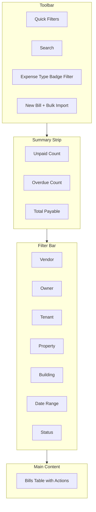

# Rental Bills Page Redesign - Maintenance Expense Recording

## Objective

Record maintenance expenses on rental properties with three expense bearer types. Redesign the page for easier bill creation, payment, and discovery—with multi-dimensional filters and WhatsApp sharing.

---

## Three Expense Bearer Types


| Type         | Who Pays            | Where Deducted               | Current Mapping                                                                                   |
| ------------ | ------------------- | ---------------------------- | ------------------------------------------------------------------------------------------------- |
| **Owner**    | Property owner      | Owner income (rent ledger)   | `propertyId` + `buildingId`; no `projectAgreementId`                                              |
| **Building** | Building management | Monthly service charge funds | `buildingId` only; no `propertyId`                                                                |
| **Tenant**   | Tenant              | Security deposit             | `projectAgreementId` (rental agreement) + `propertyId`; `contactId` = tenant; category "(Tenant)" |


*Existing reports (OwnerLedger, BMAnalysisReport, OwnerSecurityDepositReport) already interpret these patterns. The redesign aligns the UI and data model with these semantics.*

---

## Data Model Changes

### 1. Add `expenseBearerType` to Bill (Optional but Recommended)

Add an explicit enum to [types.ts](types.ts) and migration:

```typescript
export type ExpenseBearerType = 'owner' | 'building' | 'tenant';
// In Bill interface:
expenseBearerType?: ExpenseBearerType;  // 'owner' | 'building' | 'tenant'
```

**Migration:** Add nullable column `expense_bearer_type TEXT` to `bills` table. Backfill from existing logic (propertyId+no agreement→owner; buildingId only→building; projectAgreementId→tenant).

### 2. Keep Existing Bill Fields

- `vendorId`, `amount`, `paidAmount`, `status`, `issueDate`, `dueDate`, `description`, `billNumber`
- `buildingId`, `propertyId`, `projectAgreementId` (rental agreement for tenant bills)
- `categoryId` / `expenseCategoryItems`
- `documentId`, `documentPath`
- `contractId` (optional, for vendor contracts)

---

## UI/UX Redesign

### Page Layout: Top-to-Bottom Sections




### 1. Toolbar (Compact)

- **Quick filters:** Chips for "Owner" | "Building" | "Tenant" | "All" to filter by expense bearer type
- **Search:** Bill number, description, vendor name
- **Date presets:** All Time | This Month | Last Month | Custom range
- **Actions:** "New Bill" (primary), "Bulk Import"

### 2. Summary Strip (KPIs)

Three small cards:

- Unpaid bills count
- Overdue bills count  
- Total payable (sum of unpaid balances)

### 3. Filter Bar (Multi-Dimensional)

Single row of dropdowns / combos:

- **Vendor** – from `state.vendors`
- **Owner** – from `state.contacts` (type Owner) + property owners
- **Tenant** – from `state.contacts` (type Tenant)
- **Property** – from `state.properties`
- **Building** – from `state.buildings`
- **Date range** – start/end
- **Status** – Unpaid | Partially Paid | Paid | Overdue | All

*Persist filter state in localStorage if desired.*

### 4. Bills Table (Primary View)

Replace the current Building>Vendor tree sidebar with a **flat, filterable table**:


| Column         | Sortable | Notes                                                 |
| -------------- | -------- | ----------------------------------------------------- |
| Checkbox       | -        | For bulk pay                                          |
| Date           | Yes      | Issue date                                            |
| Bill #         | Yes      | Bill number                                           |
| Vendor         | Yes      | Vendor name                                           |
| Expense Bearer | Yes      | Badge: Owner                                          |
| Property/Unit  | Yes      | Property name (or "Building-wide" for building bills) |
| Building       | Yes      | Building name                                         |
| Amount         | Yes      | Total amount                                          |
| Paid           | -        | Paid amount                                           |
| Balance        | Yes      | Amount due                                            |
| Status         | Yes      | Badge                                                 |
| Actions        | -        | Edit, Pay, WhatsApp menu                              |


**Row actions:**

- **Edit** – Opens bill form
- **Pay** – Opens payment modal (TransactionForm) for bills with balance > 0
- **WhatsApp** – Dropdown: "Send to Vendor" | "Send to Owner" | "Send to Tenant" (only if bill has that party and phone exists)

**Row expand:** Expandable row to show payment history (same as current design).

**Footer:** Total bills count, total amount, total payable.

### 5. Remove Tree Sidebar

Remove the resizable Building>Vendor tree sidebar. Filtering is done via the filter bar instead. This simplifies the layout and matches the requirement to "view/filter by Vendor, tenant, owner, property and building" in one place.

---

## Bill Create/Edit Form Redesign

### Simplified Flow for Rental Bills

[InvoiceBillForm.tsx](components/invoices/InvoiceBillForm.tsx) when `rentalContext={true}` will use a **rental-specific section**:

**Step 1 – Expense Bearer (Primary choice):**

- Three large cards: "Owner", "Building", "Tenant"
- Clear labels: "Deduct from owner income" | "Deduct from building funds" | "Deduct from tenant security deposit"

**Step 2 – Context selection based on bearer:**

- **Owner:** Building → Property (required). Property implies owner.
- **Building:** Building only (no property).
- **Tenant:** Building → Tenant (from active agreements) → Agreement → Property auto-filled.

**Step 3 – Bill details (common):**

- Vendor (required)
- Bill #, Issue date, Due date
- Expense categories (line items)
- Description, Document attach
- Optional: Contract link

**Step 4 – Add "Tenant" back to allocation type**

Current form has only "Service" (building) and "Owner". Add **"Tenant"** as a third type in the Building flow, showing Tenant + Agreement selector and setting `projectAgreementId` + appropriate category.

---

## Payment Flow

- **Single Pay:** Click "Pay" on a row → TransactionForm with `billId`, amount = remaining balance, account, date. Pre-fill category based on `expenseBearerType`:
  - Owner: Property repair / owner expense category
  - Building: Building maintenance category (not owner expense)
  - Tenant: Category with "(Tenant)" suffix (reduces security deposit liability)
- **Bulk Pay:** Select multiple bills with checkbox → "Pay Selected" → BillBulkPaymentModal (reuse existing). Each bill gets its own payment transaction with correct `contactId` and `categoryId` per bearer type.

---

## WhatsApp Send to Tenant / Vendor / Owner

### Current State

[RentalBillsPage.tsx](components/rentalManagement/RentalBillsPage.tsx) (lines 454–471) only sends to **vendor** via `handleSendWhatsApp`, using `bill.contactId` (legacy) or vendor. The `billPayment` template is used.

### New Design

**Per-row WhatsApp icon** opens a dropdown (or small menu):

1. **Send to Vendor** – Use vendor's `contactNo`; template: billPayment (or a new `billToVendor` template)
2. **Send to Owner** – Use property owner's `contactNo`; template: billToOwner (new: bill details + amount)
3. **Send to Tenant** – Use tenant's `contactNo` (only for tenant bearer bills); template: billToTenant (new: bill details + amount to be deducted from security deposit)

**Implementation:**

- Add optional templates in `WhatsAppTemplates`: `billToVendor`, `billToOwner`, `billToTenant` (or extend `billPayment` with variables for recipient type)
- In [whatsappService.ts](services/whatsappService.ts): Add `generateBillToRecipient(template, contact, billNumber, amount, recipientType)` or similar
- Resolve contact for each: Vendor from `bill.vendorId`; Owner from `property.ownerId`; Tenant from `rentalAgreement.contactId`
- Show each option only if the bill has that party and the contact has `contactNo`
- Reuse `openChat` from WhatsAppContext (or WhatsAppMessageModal) with pre-filled message

---

## File Changes Summary


| File                                                                                                           | Changes                                                                                                                                                                                                      |
| -------------------------------------------------------------------------------------------------------------- | ------------------------------------------------------------------------------------------------------------------------------------------------------------------------------------------------------------ |
| [types.ts](types.ts)                                                                                           | Add `ExpenseBearerType`, extend `Bill` with `expenseBearerType`                                                                                                                                              |
| [server/migrations/](server/migrations/)                                                                       | New migration: add `expense_bearer_type` column to bills; backfill                                                                                                                                           |
| [components/rentalManagement/RentalBillsPage.tsx](components/rentalManagement/RentalBillsPage.tsx)             | Full rewrite: remove tree sidebar; add filter bar (Vendor, Owner, Tenant, Property, Building, Date, Status); summary strip; flat table with expense bearer badge; row actions (Edit, Pay, WhatsApp dropdown) |
| [components/invoices/InvoiceBillForm.tsx](components/invoices/InvoiceBillFormForm.tsx)                         | For `rentalContext`: Add "Tenant" as third allocation type in Building flow; simplify expense bearer selection (Owner/Building/Tenant cards); set `expenseBearerType` when saving                            |
| [services/whatsappService.ts](services/whatsappService.ts)                                                     | Add `generateBillToOwner`, `generateBillToTenant` (or generic with recipient type)                                                                                                                           |
| [types.ts](types.ts) / [context/AppContext.tsx](context/AppContext.tsx)                                        | Add optional `billToOwner`, `billToTenant` to WhatsAppTemplates (default fallback to billPayment)                                                                                                            |
| [server/api/routes/bills.ts](server/api/routes/bills.ts)                                                       | Support `expenseBearerType` in create/update payloads; include in API responses                                                                                                                              |
| [context/AppContext.tsx](context/AppContext.tsx)                                                               | Handle `expenseBearerType` in ADD_BILL / UPDATE_BILL reducers                                                                                                                                                |
| [services/exportService.ts](services/exportService.ts), [services/importService.ts](services/importService.ts) | Include `expenseBearerType` in export/import schemas                                                                                                                                                         |


---

## Expense Bearer Derivation (for existing bills without expenseBearerType)

```typescript
function getExpenseBearerType(bill: Bill, state): ExpenseBearerType {
  if (bill.expenseBearerType) return bill.expenseBearerType;
  if (bill.projectAgreementId && state.rentalAgreements.some(ra => ra.id === bill.projectAgreementId))
    return 'tenant';
  if (bill.propertyId) return 'owner';
  if (bill.buildingId) return 'building';
  return 'building'; // fallback
}
```

---

## Mobile Considerations

- Filter bar: Collapsible "Filters" drawer on small screens
- Table: Horizontal scroll or card view on mobile
- WhatsApp dropdown: Full-width menu on touch devices

---

## Out of Scope (Per Request)

- Do **not** follow existing tree/sidebar logic
- No project/staff allocation in rental bills (rental context only)
- WhatsApp: manual send only (no automation)

