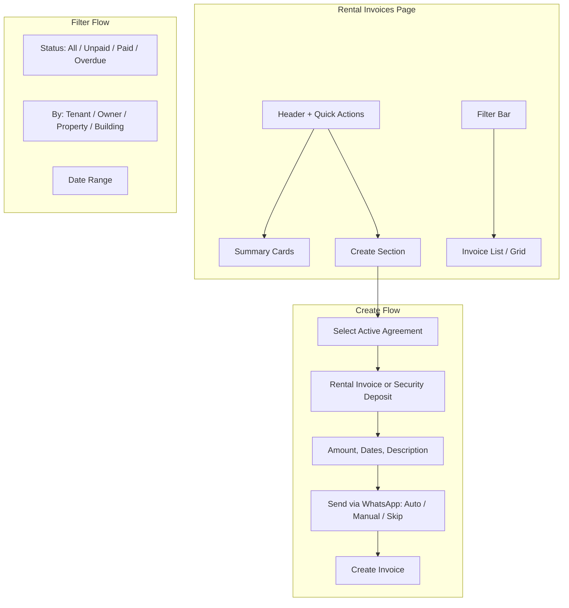

# Rental Invoices Page Redesign

## Current State Summary

- **Location**: Rental Management > Invoices tab > "Rental Invoices" sub-tab
- **Flow**: Uses shared [InvoicesPage](components/invoices/InvoicesPage.tsx) with tree sidebar; "New Rent Invoice" requires selecting a property/tenant/owner from tree first (high friction)
- **Invoice creation**: [CreateRentInvoiceForm](components/rentalManagement/CreateRentInvoiceForm.tsx) creates only rent invoices; security deposit is created at agreement time in [RentalAgreementForm](components/rentalAgreements/RentalAgreementForm.tsx) as RENTAL type with `securityDepositCharge` field
- **Types**: InvoiceType has RENTAL, SERVICE_CHARGE, INSTALLMENT; security deposit uses RENTAL + `securityDepositCharge`, not a separate type
- **WhatsApp**: Manual only (opens side panel with pre-filled message). Server has `POST /api/whatsapp/send` for programmatic send; [whatsappChatService](services/whatsappChatService.ts) has `sendMessage()` that calls it

## Design Principles

1. **Agreement-centric**: Active agreements drive invoice creation; no tree selection required upfront
2. **Two clear invoice types**: (1) Rental Invoice, (2) Security Deposit Invoice - surfaced explicitly in UI
3. **Progressive disclosure**: Quick actions visible; filters/criteria easy to apply and clear
4. **Single source of truth**: One unified page with sections instead of 3 fragmented tabs

---

## Proposed Architecture

---

## Part 1: Data Model and Types

### 1A. Add SECURITY_DEPOSIT to InvoiceType (optional but recommended)

**File**: [types.ts](types.ts)

Add `SECURITY_DEPOSIT = 'Security Deposit'` to `InvoiceType` enum. This clarifies UI and reports. Alternative: keep using RENTAL + `securityDepositCharge > 0` to denote security-only invoices (current behavior). **Recommendation**: Add the enum for clearer UX labels; backend can continue using RENTAL + `securityDepositCharge` for existing invoices.

### 1B. Backend Support

**File**: [server/api/routes/invoices.ts](server/api/routes/invoices.ts)

- Add `invoice_type` support for `Security Deposit` if new enum is added (DB likely stores string; verify schema allows new value)
- No schema change needed if using RENTAL + `securityDepositCharge`; only frontend labels change

---

## Part 2: New Page Structure (RentalInvoicesPage Redesign)

### 2A. Consolidate Tabs into Single Unified Page

**File**: [components/rentalManagement/RentalInvoicesPage.tsx](components/rentalManagement/RentalInvoicesPage.tsx)

Replace the 3-tab layout with a single scrollable page:

| Section            | Content                                                                                                                                                                       |
| ------------------ | ----------------------------------------------------------------------------------------------------------------------------------------------------------------------------- |
| **Header**         | Title "Rental Invoices", subtitle "Create and manage invoices from active agreements"                                                                                         |
| **Summary Cards**  | 4 compact cards: Unpaid, Paid, Overdue, Total Pending (calculated from filtered invoices)                                                                                     |
| **Action Bar**     | "New Rental Invoice", "New Security Deposit Invoice", "Bulk Import", optional "Schedule" shortcut to Recurring                                                                |
| **Filter Bar**     | Status chips (All / Unpaid / Paid / Partially Paid / Overdue), View by (Tenant / Owner / Property / Building), Building dropdown, Date range, Search                          |
| **Create Section** | Collapsible panel with agreement selector + create form (or modal)                                                                                                            |
| **Invoice List**   | Data grid / table with columns: #, Type (Rental / Security), Tenant, Property, Owner, Building, Amount, Status, Due Date, Actions (View, Edit, Record Payment, Send WhatsApp) |

### 2B. Remove Dependency on InvoicesPage

Create a **new dedicated component** `RentalInvoicesContent.tsx` that:

- Does not use the tree sidebar (tree adds complexity and friction)
- Uses a flat/card-based list or data table with column sorting
- Supports grouping/filtering by tenant, owner, property, building via dropdowns
- Reuses `RentalFinancialGrid`, `InvoiceDetailView`, `RentalPaymentModal` for view/edit/payment
- Integrates WhatsApp send (manual and auto)

**Alternative**: Refactor InvoicesPage to support a "flat mode" (no tree) when used from Rental Invoices, and pass `flatMode={true}`. This reduces duplication but increases InvoicesPage complexity. **Recommendation**: New component for cleaner separation and easier redesign.

---

## Part 3: Create Flow Redesign

### 3A. Agreement-First Create Modal

**New/Modified**: Create modal or inline panel that:

1. **Step 1 - Select Agreement**: Dropdown or searchable list of **active** agreements. Display: Property name, Tenant name, Building, Monthly Rent, Security Deposit. No tree selection required.
2. **Step 2 - Invoice Type**: Radio/tabs: "Rental Invoice" | "Security Deposit Invoice"
3. **Step 3 - Details**:
  - Rental: Prefill monthly rent, rental month (default current), due day (from agreement), description template
  - Security: Prefill security deposit amount, due date (e.g., agreement start + 7 days), description
4. **Step 4 - WhatsApp**:
  - Checkbox: "Send invoice to tenant via WhatsApp"
  - Sub-option: "Send automatically" (API call) | "Open WhatsApp to review first" (current `openChat` behavior)

### 3B. Auto-Send WhatsApp

- Add setting in Rental Invoice Settings or per-tenant: "Auto-send invoice via WhatsApp when created" (default: false for safety)
- On invoice create, if auto-send enabled and contact has `contactNo`:
  - Call `apiClient.post('/whatsapp/send', { contactId, phoneNumber, message })` with generated message from `WhatsAppService.generateInvoiceReminder`
  - Show toast: "Invoice created and sent via WhatsApp"
- If manual: Keep current `openChat(contact, contactNo, message)` flow after create

**File**: Extend [services/whatsappChatService.ts](services/whatsappChatService.ts) or create helper in a service that takes Invoice + Contact and returns the message text; then either `openChat` or `sendMessage` based on user choice.

### 3C. Security Deposit Invoice Creation

- When type is "Security Deposit": Create invoice with `amount = agreement.securityDeposit`, `securityDepositCharge = agreement.securityDeposit`, `invoiceType = RENTAL` (or new SECURITY_DEPOSIT), categoryId = "Security Deposit"
- Check if security deposit invoice already exists for this agreement (avoid duplicates)

---

## Part 4: Filtering and Viewing

### 4A. Filter Bar

- **Status**: Chips for All, Unpaid, Paid, Partially Paid, Overdue (same as current status filter)
- **View By**: Dropdown to group/list by Tenant, Owner, Property, or Building. When Building selected, show Building filter. When Owner, show owner multi-select or search.
- **Building**: Dropdown (All Buildings, Building A, Building B, ...)
- **Date Range**: Optional issue date or due date range picker
- **Search**: By invoice #, tenant name, property name, description

### 4B. Invoice List / Grid

- Columns: Invoice #, Type (Rental / Security Deposit), Tenant, Property, Owner, Building, Amount, Paid, Balance, Status, Due Date, Actions
- Sortable columns
- Row actions: View, Edit, Record Payment, Send WhatsApp
- Bulk select for "Record Bulk Payment" (reuse existing BulkPaymentModal)

---

## Part 5: Recurring / Schedule Integration

- Keep "Recurring Templates" and "Monthly Service Charges" as sub-tabs or a second-level nav within Invoices, or move to a "Schedule" section
- Add quick link: "Manage Schedules" → opens Recurring Templates tab or a dedicated route
- On the main Rental Invoices page, show a small "Due for Generation" banner when recurring templates have overdue invoices (similar to RecurringInvoicesList), with "Generate" button that triggers bulk generation

---

## Part 6: Files to Create/Modify

| File                                                                                                           | Action                                                                                         |
| -------------------------------------------------------------------------------------------------------------- | ---------------------------------------------------------------------------------------------- |
| [types.ts](types.ts)                                                                                           | Add `SECURITY_DEPOSIT` to InvoiceType (optional)                                               |
| [components/rentalManagement/RentalInvoicesPage.tsx](components/rentalManagement/RentalInvoicesPage.tsx)       | Redesign: single page layout, summary cards, filter bar                                        |
| **NEW** `components/rentalManagement/RentalInvoicesContent.tsx`                                                | Main content: filter bar + invoice list/grid, reuse RentalFinancialGrid or new table           |
| **NEW** `components/rentalManagement/CreateRentalInvoiceModal.tsx`                                             | Agreement-first create flow for Rental + Security Deposit                                      |
| [components/rentalManagement/CreateRentInvoiceForm.tsx](components/rentalManagement/CreateRentInvoiceForm.tsx) | Refactor or merge into CreateRentalInvoiceModal                                                |
| [services/whatsappChatService.ts](services/whatsappChatService.ts)                                             | Ensure sendMessage is callable from create flow; add optional auto-send helper                 |
| [context/AppContext.tsx](context/AppContext.tsx)                                                               | Add `autoSendInvoiceWhatsApp` to rentalInvoiceSettings if desired                              |
| [components/invoices/InvoiceDetailView.tsx](components/invoices/InvoiceDetailView.tsx)                         | Ensure Type label shows "Security Deposit" when securityDepositCharge > 0 and amount equals it |
| [server/api/routes/invoices.ts](server/api/routes/invoices.ts)                                                 | Support new invoice_type if added; no change if reusing RENTAL                                 |

---

## Part 7: UI/UX Details

### Summary Cards

- Unpaid: Count + total amount
- Paid: Count + total amount
- Overdue: Count + total amount (red accent)
- Total Pending: Sum of (amount - paidAmount) for unpaid/partially paid

### Create Button Options

- Primary: "New Invoice" → opens modal with agreement selector
- Secondary: "Rental" and "Security Deposit" as separate quick actions that pre-select type in modal

### Empty States

- No agreements: "No active agreements. Create an agreement first."
- No invoices: "No invoices yet. Create your first invoice from an active agreement."

---

## Implementation Order

1. Add `SECURITY_DEPOSIT` to InvoiceType (optional) and update InvoiceDetailView to show correct label
2. Create `CreateRentalInvoiceModal` with agreement-first flow, rental + security deposit types, WhatsApp option
3. Create `RentalInvoicesContent` with filter bar and invoice list
4. Redesign `RentalInvoicesPage` to use new layout and content
5. Wire WhatsApp auto-send (setting + API call on create)
6. Add "Due for Generation" banner and link to Recurring Templates
7. Remove or simplify dependency on InvoicesPage for rental context

---

## Migration and Compatibility

- Existing invoices remain valid (RENTAL with securityDepositCharge)
- Recurring Templates and Monthly Service Charges stay functional; either keep as sub-tabs or integrate "Schedule" section
- Bulk Import and existing payment flows (RentalPaymentModal, BulkPaymentModal) remain unchanged

