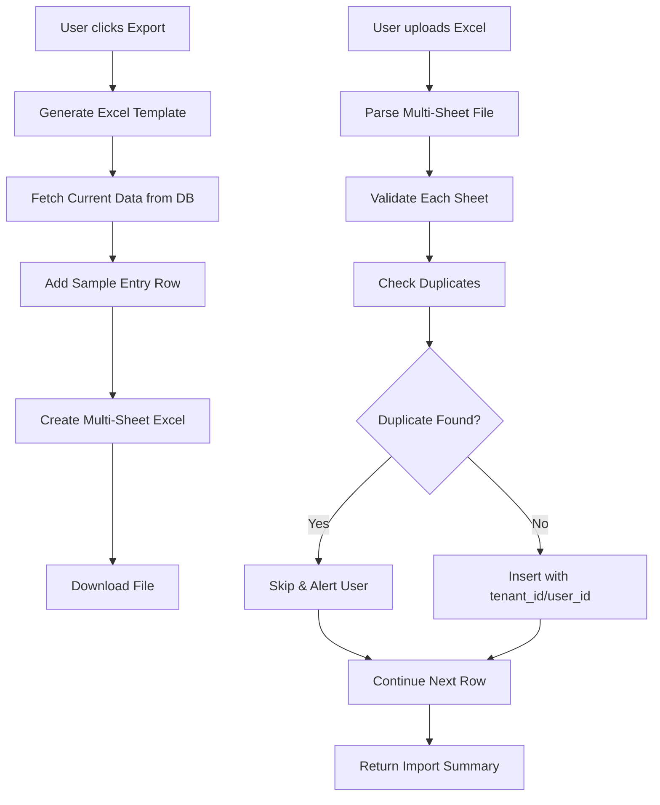

# Revamp Import/Export System

## Overview

Revamp the import/export process to be user-friendly with Excel templates (multi-sheet format). The system will support 7 entity types: Contacts, Projects, Properties, Buildings, Units, Categories, and Accounts. Export will include current data with sample entries, and import will automatically handle tenant_id/user_id assignment and duplicate detection.

## Architecture

### Data Flow



### Key Components

1. **Backend API Routes** (`server/api/routes/import-export.ts`)

   - `GET /api/import-export/template` - Generate and download template
   - `POST /api/import-export/import` - Process import file
   - `GET /api/import-export/export` - Export current data

2. **Template Generation Service** (`server/services/importExportService.ts`)

   - Generate Excel with multiple sheets
   - Include current data + sample entry
   - Match database schema exactly

3. **Import Processing Service**

   - Parse Excel file
   - Validate data
   - Check duplicates (by name for most entities)
   - Auto-inject tenant_id and user_id
   - Return detailed import results

4. **Frontend Component** (`components/settings/ImportExportPage.tsx`)

   - Simple UI with export/import buttons
   - File upload with drag & drop
   - Progress indicator
   - Import results display with duplicate alerts

## Implementation Details

### Database Schema Mapping

**Contacts:**

- Required: `name`, `type`
- Optional: `description`, `contact_no`, `company_name`, `address`
- Duplicate check: `name` (case-insensitive)

**Projects:**

- Required: `name`
- Optional: `description`, `color`, `status`, `pm_config`, `installment_config`
- Duplicate check: `name` (case-insensitive)

**Properties:**

- Required: `name`, `owner_id` (contact name), `building_id` (building name)
- Optional: `description`, `monthly_service_charge`
- Duplicate check: `name` (case-insensitive)
- Note: Resolve owner_id and building_id from names

**Buildings:**

- Required: `name`
- Optional: `description`, `color`
- Duplicate check: `name` (case-insensitive)

**Units:**

- Required: `name`, `project_id` (project name)
- Optional: `contact_id` (contact name), `sale_price`, `description`
- Duplicate check: `name` (case-insensitive)
- Note: Resolve project_id and contact_id from names

**Categories:**

- Required: `name`, `type`
- Optional: `description`, `is_permanent`, `is_rental`, `parent_category_id` (category name)
- Duplicate check: `name` + `type` combination

**Accounts:**

- Required: `name`, `type`
- Optional: `balance`, `is_permanent`, `description`, `parent_account_id` (account name)
- Duplicate check: `name` + `type` combination

### Template Structure

Excel file with 7 sheets:

1. **Contacts** - Columns: name, type, description, contact_no, company_name, address
2. **Projects** - Columns: name, description, color, status
3. **Properties** - Columns: name, owner_name, building_name, description, monthly_service_charge
4. **Buildings** - Columns: name, description, color
5. **Units** - Columns: name, project_name, contact_name, sale_price, description
6. **Categories** - Columns: name, type, description, is_permanent, is_rental, parent_category_name
7. **Accounts** - Columns: name, type, balance, is_permanent, description, parent_account_name

Each sheet will have:

- Header row with column names
- Current data rows (if exporting)
- One sample entry row (highlighted/colored)

### Import Process

1. **File Validation**

   - Check file format (Excel)
   - Verify required sheets exist
   - Validate column headers

2. **Data Processing** (per sheet)

   - Parse rows
   - Validate required fields
   - Check for duplicates in database
   - Resolve foreign key references (names to IDs)
   - Insert new records with tenant_id and user_id
   - Track skipped duplicates

3. **Response Format**
   ```typescript
   {
     success: boolean,
     summary: {
       contacts: { imported: number, skipped: number, errors: number },
       projects: { imported: number, skipped: number, errors: number },
       // ... for each entity type
     },
     duplicates: [
       { sheet: 'Contacts', row: 2, name: 'John Doe', reason: 'Already exists' },
       // ...
     ],
     errors: [
       { sheet: 'Properties', row: 3, field: 'owner_name', message: 'Owner not found' },
       // ...
     ]
   }
   ```


### Duplicate Detection Logic

- **Contacts**: `LOWER(TRIM(name))` match within tenant
- **Projects**: `LOWER(TRIM(name))` match within tenant
- **Buildings**: `LOWER(TRIM(name))` match within ten