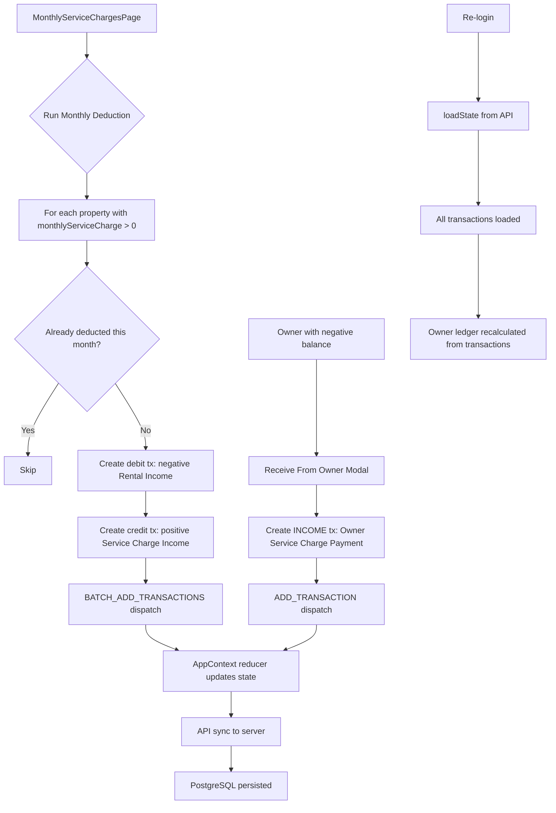

# Monthly Service Charges Page Redesign

## Current State

The existing page (`[MonthlyServiceChargesPage.tsx](components/rentalManagement/MonthlyServiceChargesPage.tsx)`) has several limitations:

- Shows only a flat transaction list (Month, Unit, Owner, Category, Amount)
- No visibility into property occupancy status (rented vs vacant)
- No owner balance summary or negative balance handling
- No way to receive payments from owners who owe money
- Deduction logic is identical for rented/vacant but there's no UI distinction

## New Design

### Page Layout (3 sections, top-to-bottom)

**Section 1: Summary Cards (top bar)**

- 4 KPI cards: Total Properties | Rented | Vacant | Total Monthly Charges
- 1 alert card: "Owners with Negative Balance" count + total owed (clickable, scrolls to section 3)

**Section 2: Properties Grid (main area)**
Replaces the current transaction-list view with a **property-centric** table:


| Building | Unit | Owner | Status | Monthly Charge | This Month | Owner Balance | Action  |
| -------- | ---- | ----- | ------ | -------------- | ---------- | ------------- | ------- |
| Tower A  | 101  | Ahmed | Rented | 500            | Deducted   | 2,300         | --      |
| Tower A  | 102  | Sara  | Vacant | 500            | Deducted   | -1,200        | Receive |
| Tower B  | 201  | Rafi  | Rented | 800            | Pending    | 4,500         | --      |


- **Status column**: badge showing "Rented" (green) or "Vacant" (amber) -- derived from whether the property has an active rental agreement
- **This Month column**: "Deducted" (green check) or "Pending" (yellow dot) -- whether current month's charge has been applied
- **Owner Balance column**: positive = company holds money, negative = owner owes money (shown in red)
- **Action column**: "Receive" button appears only for owners with negative balance
- Toolbar: Building filter, Search, Date (month selector), "Run Monthly Deduction" button, "Manual Deduction" button, "View History" toggle

**Section 3: Owner Negative Balances Panel (collapsible bottom section)**
Shows only owners whose balance is negative (they owe money due to vacant property charges):


| Owner | Properties (Vacant) | Total Owed | Action          |
| ----- | ------------------- | ---------- | --------------- |
| Sara  | 101, 205            | -1,700     | Receive Payment |


Clicking "Receive Payment" opens a **Receive From Owner Modal**.

### New Modal: Receive From Owner

A modal to record payment received from an owner to cover service charges on vacant properties:

- Owner name (read-only, pre-filled)
- Amount (pre-filled with negative balance, editable)
- Payment date
- Account (default: Cash)
- Reference/description
- Creates an INCOME transaction with a new category "Owner Service Charge Payment" and `contactId` = owner, `type` = INCOME

### Logic Changes

**Deduction Logic (handleBulkRun):**

- Current: Iterates `properties.filter(p => monthlyServiceCharge > 0)` -- no change needed here since it already processes ALL properties regardless of agreement status
- Enhancement: After deduction, display a summary toast showing: X rented properties deducted, Y vacant properties deducted, Z already applied

**Property Status Detection:**
New helper function to determine if a property is rented or vacant:

```typescript
const getPropertyStatus = (propertyId: string): 'Rented' | 'Vacant' => {
  return state.rentalAgreements.some(
    a => a.propertyId === propertyId && a.status === 'Active'
  ) ? 'Rented' : 'Vacant';
};
```

**Owner Balance Calculation:**
Reuse the same logic from `[OwnerPayoutsPage.tsx](components/payouts/OwnerPayoutsPage.tsx)` (lines 40-137) but scoped per-owner:

- Credits: Rental Income transactions (positive = rent, negative = service charge deductions)
- Debits: Owner payouts + property expenses
- New: Add "Owner Service Charge Payment" as a credit (money received from owner)

**New Category:**
Add `"Owner Service Charge Payment"` as a system category (type: INCOME, isRental: true) in tenant initialization, similar to existing categories like "Rental Income".

### Files to Modify

1. `**[components/rentalManagement/MonthlyServiceChargesPage.tsx](components/rentalManagement/MonthlyServiceChargesPage.tsx)**` -- Complete rewrite with new UI (summary cards, property grid, negative balance panel)
2. `**[components/rentalManagement/ManualServiceChargeModal.tsx](components/rentalManagement/ManualServiceChargeModal.tsx)**` -- Minor update: show property status (rented/vacant) in the property dropdown
3. **New file: `components/rentalManagement/ReceiveFromOwnerModal.tsx**` -- Modal for receiving payment from owner with negative balance
4. `**[components/payouts/OwnerLedger.tsx](components/payouts/OwnerLedger.tsx)**` -- Add "Owner Service Charge Payment" category to credits in rent ledger calculation
5. `**[components/payouts/OwnerPayoutsPage.tsx](components/payouts/OwnerPayoutsPage.tsx)**` -- Add "Owner Service Charge Payment" to collected amount calculation; add "Receive" button for negative balances
6. `**[server/services/tenantInitializationService.ts](server/services/tenantInitializationService.ts)**` (or equivalent) -- Add new system category "Owner Service Charge Payment"
7. `**[context/AppContext.tsx](context/AppContext.tsx)**` -- No structural changes needed; existing `BATCH_ADD_TRANSACTIONS` handles persistence and sync

### Data Flow




### Persistence and Re-login

- All deductions are stored as transactions via `BATCH_ADD_TRANSACTIONS` dispatch
- The `AppContext` middleware syncs every transaction to the server API (`POST /api/transactions`)
- On re-login, `appStateApi.loadState()` fetches all transactions from the server
- Owner ledger is dynamically recalculated from loaded transactions -- no separate ledger table needed

