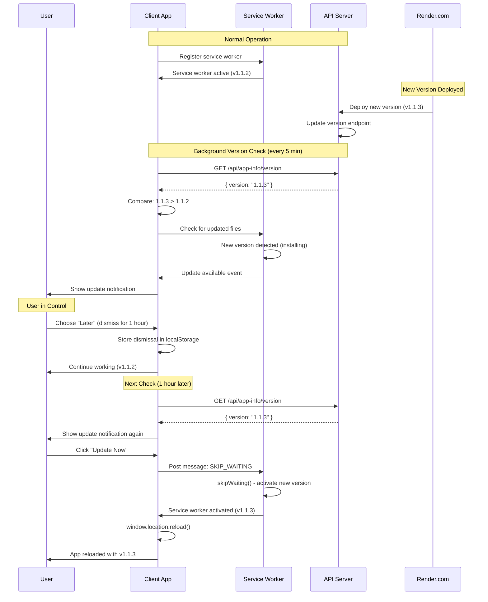

# Staging and Production Environment Implementation

## Overview

This plan implements separate staging and production environments on Render.com. The staging branch will auto-deploy to staging services, while the main branch continues to deploy to production. A separate staging database will be created, and all API URLs will be environment-configurable.

## Architecture

```
Production (main branch)          Staging (staging branch)
├── pbookspro-api                 ├── pbookspro-api-staging
├── pbookspro-client              ├── pbookspro-client-staging
├── pbookspro-admin               ├── pbookspro-admin-staging
└── pbookspro-db                  └── pbookspro-db-staging
```

## Implementation Steps

### 1. Create Staging Database Service

**File:** `render.yaml`

Add a new database service for staging:

```yaml
databases:
 - name: pbookspro-db-staging
    databaseName: pbookspro_staging
    user: pbookspro_staging
    plan: starter
```

### 2. Add Staging Services to render.yaml

**File:** `render.yaml`

Add staging service definitions that:

- Deploy from `staging` branch
- Use `-staging` suffix in service names
- Reference the staging database
- Use staging-specific URLs
```yaml
services:
  # ... existing production services ...

  # Staging API Server
 - type: web
    name: pbookspro-api-staging
    env: node
    plan: starter
    branch: staging
    buildCommand: cd server && npm install --include=dev && npm run build
    startCommand: cd server && npm start
    envVars:
   - key: DATABASE_URL
        fromDatabase:
          name: pbookspro-db-staging
          property: connectionString
   - key: JWT_SECRET
        generateValue: true
   - key: LICENSE_SECRET_SALT
        value: PBOOKSPRO_SECURE_SALT_2024_STAGING
   - key: NODE_ENV
        value: staging
   - key: PORT
        value: 3000
   - key: CORS_ORIGIN
        value: https://pbookspro-client-staging.onrender.com,https://pbookspro-admin-staging.onrender.com,http://localhost:5173,http://localhost:5174
   - key: API_URL
        value: https://pbookspro-api-staging.onrender.com
   - key: SERVER_URL
        value: https://pbookspro-api-staging.onrender.com
   - key: CLIENT_URL
        value: https://pbookspro-client-staging.onrender.com

  # Staging Client Application
 - type: web
    name: pbookspro-client-staging
    runtime: static
    branch: staging
    buildCommand: npm install && npm run build
    staticPublishPath: ./dist
    envVars:
   - key: VITE_API_URL
        value: https://pbookspro-api-staging.onrender.com/api

  # Staging Admin Application
 - type: web
    name: pbookspro-admin-staging
    runtime: static
    branch: staging
    buildCommand: cd admin && npm install && npm run build
    staticPublishPath: ./admin/dist
    envVars:
   - key: VITE_ADMIN_API_URL
        value: https://pbookspro-api-staging.onrender.com/api/admin
```


### 3. Update Production Services to Deploy from Main Branch

**File:** `render.yaml`

Ensure production services explicitly specify the `main` branch:

```yaml
 - type: web
    name: pbookspro-api
    branch: main  # Add this
    # ... rest of config
```

### 4. Replace Hardcoded API URLs with Environment Variables

**File:** `services/api/client.ts`

Replace hardcoded URL with environment variable:

```typescript
// Use environment variable with fallback to production for backwards compatibility
const API_BASE_URL = import.meta.env.VITE_API_URL || 'https://pbookspro-api.onrender.com/api';
```

**File:** `admin/src/services/adminApi.ts`

Replace hardcoded URL with environment variable:

```typescript
// Use environment variable with fallback to production for backwards compatibility
const ADMIN_API_URL = import.meta.env.VITE_ADMIN_API_URL || 'https://pbookspro-api.onrender.com/api/admin';
```

### 5. Update Vite Configuration for Environment Variables

**File:** `vite.config.ts`

Ensure Vite properly exposes environment variables (should already work, but verify):

The current config should already handle `import.meta.env.VITE_*` variables automatically.

**File:** `admin/vite.config.ts`

Verify environment variable handling. The current config already includes explicit definition, but update to use the actual env var:

```typescript
const adminApiUrl = process.env.VITE_ADMIN_API_URL || 'http://localhost:3000/api/admin';
```

### 6. Create Environment Configuration Documentation

**File:** `doc/ENVIRONMENT_SETUP.md` (new)

Document:

- Environment structure
- How staging vs production works
- Environment variable setup
- Database isolation
- Deployment workflow

### 7. Update .gitignore if Needed

Verify `.gitignore` excludes environment files:

- `.env`
- `.env.local`
- `.env.*.local`

### 8. Add Version Checking API Endpoint

**File:** `server/api/routes/app-info.ts` (new)

Create an API endpoint to return the current application version:

```typescript
import express from 'express';
import { readFileSync } from 'fs';
import { resolve } from 'path';

const router = express.Router();

router.get('/version', async (req, res) => {
  try {
    // Read version from package.json
    const packageJsonPath = resolve(process.cwd(), '../package.json');
    const packageJson = JSON.parse(readFileSync(packageJsonPath, 'utf-8'));
    
    res.json({
      version: packageJson.version,
      buildDate: process.env.BUILD_DATE || new Date().toISOString(),
      environment: process.env.NODE_ENV || 'production'
    });
  } catch (error) {
    console.error('Error getting version:', error);
    res.status(500).json({ error: 'Failed to get version information' });
  }
});

export default router;
```

**File:** `server/api/index.ts`

Add the app-info router:

```typescript
import appInfoRouter from './routes/app-info.js';
// ... existing imports ...

app.use('/api/app-info', appInfoRouter);
```

### 9. Inject Version at Build Time

**File:** `vite.config.ts`

Inject application version from package.json into the build:

```typescript
import { readFileSync } from 'fs';
import { resolve } from 'path';

const packageJson = JSON.parse(readFileSync(resolve(__dirname, 'package.json'), 'utf-8'));

export default defineConfig({
  // ... existing config ...
  define: {
    // ... existing defines ...
    'import.meta.env.APP_VERSION': JSON.stringify(packageJson.version),
  },
});
```

**File:** `admin/vite.config.ts`

Similarly inject version for admin app:

```typescript
import { readFileSync } from 'fs';
import { resolve } from 'path';

const packageJson = JSON.parse(readFileSync(resolve(__dirname, '../package.json'), 'utf-8'));

export default defineConfig({
  // ... existing config ...
  define: {
    'import.meta.env.APP_VERSION': JSON.stringify(packageJson.version),
    // ... existing defines ...
  },
});
```

### 10. Create Version Checking Service

**File:** `services/versionService.ts` (new)

Create a service to check for updates periodically and compare versions:

```typescript
import { ApiClient } from './api/client';

export interface VersionInfo {
  version: string;
  buildDate?: string;
  environment?: string;
}

class VersionService {
  private apiClient: ApiClient;
  private checkInterval: number = 5 * 60 * 1000; // Check every 5 minutes
  private intervalId: NodeJS.Timeout | null = null;
  private currentVersion: string;
  private onUpdateAvailable?: (serverVersion: string, clientVersion: string) => void;

  constructor(apiClient: ApiClient) {
    this.apiClient = apiClient;
    // Get current client version from build-time injection
    this.currentVersion = import.meta.env.APP_VERSION || '1.0.0';
  }

  /**
   * Get current client version
   */
  getCurrentVersion(): string {
    return this.currentVersion;
  }

  /**
   * Get stored last known server version from localStorage
   */
  getLastKnownVersion(): string | null {
    return localStorage.getItem('app_last_known_version');
  }

  /**
   * Store last known server version
   */
  setLastKnownVersion(version: string): void {
    localStorage.setItem('app_last_known_version', version);
    localStorage.setItem('app_last_version_check', new Date().toISOString());
  }

  /**
   * Compare two semantic version strings
   * Returns: 1 if version1 > version2, -1 if version1 < version2, 0 if equal
   */
  compareVersions(version1: string, version2: string): number {
    const v1parts = version1.split('.').map(Number);
    const v2parts = version2.split('.').map(Number);
    
    for (let i = 0; i < Math.max(v1parts.length, v2parts.length); i++) {
      const v1part = v1parts[i] || 0;
      const v2part = v2parts[i] || 0;
      
      if (v1part > v2part) return 1;
      if (v1part < v2part) return -1;
    }
    
    return 0;
  }

  /**
   * Check if a new version is available
   */
  async checkForUpdate(): Promise<{ available: boolean; serverVersion?: string; clientVersion: string }> {
    try {
      const response = await fetch(`${this.apiClient.getBaseUrl()}/../app-info/version`);
      if (!response.ok) {
        throw new Error('Failed to fetch version');
      }
      
      const versionInfo: VersionInfo = await response.json();
      const serverVersion = versionInfo.version;
      const clientVersion = this.currentVersion;
      
      // Compare versions
      const comparison = this.compareVersions(serverVersion, clientVersion);
      const available = comparison > 0; // Server version is newer
      
      // Update last known version
      if (available || serverVersion !== this.getLastKnownVersion()) {
        this.setLastKnownVersion(serverVersion);
      }
      
      return { available, serverVersion, clientVersion };
    } catch (error) {
      console.error('Error checking for updates:', error);
      return { available: false, clientVersion: this.currentVersion };
    }
  }

  /**
   * Start periodic version checking
   */
  startPeriodicCheck(onUpdateAvailable?: (serverVersion: string, clientVersion: string) => void): void {
    this.onUpdateAvailable = onUpdateAvailable;
    
    // Clear existing interval if any
    if (this.intervalId) {
      clearInterval(this.intervalId);
    }
    
    // Initial check after 30 seconds (allow app to load)
    setTimeout(() => {
      this.checkForUpdate().then(result => {
        if (result.available && this.onUpdateAvailable && result.serverVersion) {
          this.onUpdateAvailable(result.serverVersion, result.clientVersion);
        }
      });
    }, 30000);
    
    // Then check periodically
    this.intervalId = setInterval(async () => {
      const result = await this.checkForUpdate();
      if (result.available && this.onUpdateAvailable && result.serverVersion) {
        this.onUpdateAvailable(result.serverVersion, result.clientVersion);
      }
    }, this.checkInterval);
  }

  /**
   * Stop periodic version checking
   */
  stopPeriodicCheck(): void {
    if (this.intervalId) {
      clearInterval(this.intervalId);
      this.intervalId = null;
    }
  }

  /**
   * Get time since last version check
   */
  getLastCheckTime(): Date | null {
    const lastCheck = localStorage.getItem('app_last_version_check');
    return lastCheck ? new Date(lastCheck) : null;
  }
}

export const versionService = new VersionService(new (await import('./api/client')).ApiClient());
```

### 11. Create Update Notification Component

**File:** `components/ui/VersionUpdateNotification.tsx` (new)

Create a non-intrusive notification that appears when an update is available:

```typescript
import React, { useState, useEffect } from 'react';
import { RefreshCw, X, Clock } from 'lucide-react';
import { versionService } from '../../services/versionService';

interface VersionUpdateNotificationProps {
  onUpdateRequested?: () => void;
}

export const VersionUpdateNotification: React.FC<VersionUpdateNotificationProps> = ({ 
  onUpdateRequested 
}) => {
  const [updateAvailable, setUpdateAvailable] = useState(false);
  const [serverVersion, setServerVersion] = useState<string>('');
  const [clientVersion, setClientVersion] = useState<string>('');
  const [dismissedUntil, setDismissedUntil] = useState<Date | null>(null);

  useEffect(() => {
    // Check if notification was dismissed
    const dismissed = localStorage.getItem('version_update_dismissed_until');
    if (dismissed) {
      const dismissedDate = new Date(dismissed);
      if (dismissedDate > new Date()) {
        setDismissedUntil(dismissedDate);
        return; // Don't show notification yet
      } else {
        localStorage.removeItem('version_update_dismissed_until');
      }
    }

    // Start periodic version checking
    versionService.startPeriodicCheck((serverVer, clientVer) => {
      if (!dismissedUntil || new Date() > dismissedUntil) {
        setUpdateAvailable(true);
        setServerVersion(serverVer);
        setClientVersion(clientVer);
      }
    });

    // Get initial version
    setClientVersion(versionService.getCurrentVersion());

    return () => {
      versionService.stopPeriodicCheck();
    };
  }, [dismissedUntil]);

  const handleUpdateNow = () => {
    if (onUpdateRequested) {
      onUpdateRequested();
    } else {
      // Default behavior: reload page to get new version
      // Service worker should have already cached the new version
      window.location.reload();
    }
  };

  const handleDismiss = (hours: number = 24) => {
    const dismissUntil = new Date();
    dismissUntil.setHours(dismissUntil.getHours() + hours);
    setDismissedUntil(dismissUntil);
    localStorage.setItem('version_update_dismissed_until', dismissUntil.toISOString());
    setUpdateAvailable(false);
  };

  if (!updateAvailable || (dismissedUntil && new Date() < dismissedUntil)) {
    return null;
  }

  return (
    <div className="fixed top-4 right-4 z-50 w-96 max-w-[calc(100vw-2rem)] animate-slide-in-right">
      <div className="bg-white rounded-lg shadow-xl border border-blue-200 overflow-hidden">
        <div className="flex items-center justify-between px-4 py-3 bg-gradient-to-r from-blue-500 to-blue-600">
          <div className="flex items-center gap-2 text-white">
            <RefreshCw className="w-5 h-5" />
            <span className="font-semibold text-sm">Update Available</span>
          </div>
          <button
            onClick={() => handleDismiss(24)}
            className="text-white/80 hover:text-white p-1 rounded-md hover:bg-white/20 transition-colors"
            aria-label="Dismiss"
          >
            <X className="w-4 h-4" />
          </button>
        </div>
        
        <div className="px-4 py-3 space-y-3">
          <div className="text-sm text-slate-700">
            <p className="font-medium mb-1">A new version is available!</p>
            <p className="text-xs text-slate-500">
              Current: <span className="font-mono">{clientVersion}</span> → 
              New: <span className="font-mono text-blue-600">{serverVersion}</span>
            </p>
          </div>
          
          <div className="flex gap-2">
            <button
              onClick={handleUpdateNow}
              className="flex-1 bg-blue-600 hover:bg-blue-700 text-white text-sm font-medium px-4 py-2 rounded-md transition-colors flex items-center justify-center gap-2"
            >
              <RefreshCw className="w-4 h-4" />
              Update Now
            </button>
            <button
              onClick={() => handleDismiss(1)}
              className="px-4 py-2 text-sm text-slate-600 hover:text-slate-800 hover:bg-slate-100 rounded-md transition-colors flex items-center gap-1"
              title="Remind me in 1 hour"
            >
              <Clock className="w-4 h-4" />
              Later
            </button>
          </div>
          
          <div className="text-xs text-slate-400 text-center">
            You can continue working - the update will only apply when you choose
          </div>
        </div>
      </div>
    </div>
  );
};
```

### 12. Update Service Worker for Manual Updates

**File:** `sw.js`

Modify service worker to NOT automatically take control (remove skipWaiting) and listen for manual update messages:

```javascript
// Service Worker for PBooksPro
const CACHE_NAME = 'pbookspro-v1.1.2'; // Update with actual version from build
const urlsToCache = [
  './',
  './index.html',
  // ... other URLs
];

// Install event - cache resources
self.addEventListener('install', (event) => {
  event.waitUntil(
    caches.open(CACHE_NAME)
      .then((cache) => {
        console.log('Service worker: Cache opened');
        return cache.addAll(urlsToCache);
      })
      .catch((err) => {
        console.error('Cache install failed:', err);
      })
  );
  // REMOVED: self.skipWaiting() - Don't automatically take control
  // The service worker will wait until user chooses to update
});

// Activate event - clean up old caches
self.addEventListener('activate', (event) => {
  event.waitUntil(
    caches.keys().then((cacheNames) => {
      return Promise.all(
        cacheNames.map((cacheName) => {
          if (cacheName !== CACHE_NAME) {
            console.log('Deleting old cache:', cacheName);
            return caches.delete(cacheName);
          }
        })
      );
    })
  );
  // REMOVED: self.clients.claim() - Don't automatically take control
});

// Listen for SKIP_WAITING message from client
self.addEventListener('message', (event) => {
  if (event.data && event.data.type === 'SKIP_WAITING') {
    // User requested update - now take control
    self.skipWaiting();
  }
});

// Fetch event - serve from cache, fallback to network
self.addEventListener('fetch', (event) => {
  // ... existing fetch handler ...
});
```

### 13. Update PWA Context for Manual Service Worker Updates

**File:** `context/PWAContext.tsx`

Update to properly handle waiting service workers and manual updates:

```typescript
// ... existing code ...

const [registration, setRegistration] = useState<ServiceWorkerRegistration | null>(null);
const [isUpdateAvailable, setIsUpdateAvailable] = useState(false);

useEffect(() => {
  // ... existing service worker registration code ...
  
  if (registration) {
    // Check for waiting service worker (new version available)
    if (registration.waiting) {
      setIsUpdateAvailable(true);
    }
    
    // Listen for service worker updates
    registration.addEventListener('updatefound', () => {
      const newWorker = registration.installing;
      if (newWorker) {
        newWorker.addEventListener('statechange', () => {
          if (newWorker.state === 'installed' && navigator.serviceWorker.controller) {
            // New version available but waiting
            setIsUpdateAvailable(true);
          }
        });
      }
    });
  }
}, [registration]);

const applyUpdate = () => {
  if (registration && registration.waiting) {
    // Send message to service worker to skip waiting
    registration.waiting.postMessage({ type: 'SKIP_WAITING' });
    
    // Reload page after a short delay to allow service worker to activate
    setTimeout(() => {
      window.location.reload();
    }, 500);
  }
};

// ... rest of code ...
```

### 14. Integrate Version Update Notification

**File:** `App.tsx` or main layout component

Add the version update notification component:

```typescript
import { VersionUpdateNotification } from './components/ui/VersionUpdateNotification';

// In your App component:
<VersionUpdateNotification 
  onUpdateRequested={() => {
    // Use PWA context to apply update
    const { applyUpdate } = usePWA();
    applyUpdate();
  }}
/>
```

### 15. Update Build Process to Include Version in Service Worker

**File:** `vite.config.ts`

Add a plugin to inject version into service worker during build:

```typescript
import { readFileSync } from 'fs';
import { resolve } from 'path';

const packageJson = JSON.parse(readFileSync(resolve(__dirname, 'package.json'), 'utf-8'));

export default defineConfig({
  // ... existing config ...
  plugins: [
    // ... existing plugins ...
    {
      name: 'inject-version-in-sw',
      transformIndexHtml(html) {
        // This is handled in sw.js directly via CACHE_NAME
        return html;
      },
      writeBundle() {
        // Optionally update sw.js with version during build
        // Or use build-time replacement
      }
    }
  ]
});
```

Alternatively, update `sw.js` to read version from a build-generated file or use environment variable.

## Deployment Flow

### Environment Deployment

1. **Staging Deployment:**

                                                                                                                                                                                                                                                                                                                                                                                                                                                                                                                                                                                                                                                                                                                                                                                                                                                                                                                                                                                                                                                                                                                                                                                                                                                                                                                                                                                                                                                                                                                                                                                                                                                                                                                                                                                                                                                                                                                                                                                                                                                                                                                                                                                                                                                                                                                                                                                                                                                                                                                                                                                                                                                                                                                                                                                                                                                                                                                                                                                                                                                                                                                                                                                                - Push to `staging` branch
                                                                                                                                                                                                                                                                                                                                                                                                                                                                                                                                                                                                                                                                                                                                                                                                                                                                                                                                                                                                                                                                                                                                                                                                                                                                                                                                                                                                                                                                                                                                                                                                                                                                                                                                                                                                                                                                                                                                                                                                                                                                                                                                                                                                                                                                                                                                                                                                                                                                                                                                                                                                                                                                                                                                                                                                                                                                                                                                                                                                                                                                                                                                                                                                - Render automatically deploys to `-staging` services
                                                                                                                                                                                                                                                                                                                                                                                                                                                                                                                                                                                                                                                                                                                                                                                                                                                                                                                                                                                                                                                                                                                                                                                                                                                                                                                                                                                                                                                                                                                                                                                                                                                                                                                                                                                                                                                                                                                                                                                                                                                                                                                                                                                                                                                                                                                                                                                                                                                                                                                                                                                                                                                                                                                                                                                                                                                                                                                                                                                                                                                                                                                                                                                                - Services use staging database and staging URLs

2. **Production Deployment:**

                                                                                                                                                                                                                                                                                                                                                                                                                                                                                                                                                                                                                                                                                                                                                                                                                                                                                                                                                                                                                                                                                                                                                                                                                                                                                                                                                                                                                                                                                                                                                                                                                                                                                                                                                                                                                                                                                                                                                                                                                                                                                                                                                                                                                                                                                                                                                                                                                                                                                                                                                                                                                                                                                                                                                                                                                                                                                                                                                                                                                                                                                                                                                                                                - Merge `staging` to `main` branch
                                                                                                                                                                                                                                                                                                                                                                                                                                                                                                                                                                                                                                                                                                                                                                                                                                                                                                                                                                                                                                                                                                                                                                                                                                                                                                                                                                                                                                                                                                                                                                                                                                                                                                                                                                                                                                                                                                                                                                                                                                                                                                                                                                                                                                                                                                                                                                                                                                                                                                                                                                                                                                                                                                                                                                                                                                                                                                                                                                                                                                                                                                                                                                                                - Render automatically deploys to production services
                                                                                                                                                                                                                                                                                                                                                                                                                                                                                                                                                                                                                                                                                                                                                                                                                                                                                                                                                                                                                                                                                                                                                                                                                                                                                                                                                                                                                                                                                                                                                                                                                                                                                                                                                                                                                                                                                                                                                                                                                                                                                                                                                                                                                                                                                                                                                                                                                                                                                                                                                                                                                                                                                                                                                                                                                                                                                                                                                                                                                                                                                                                                                                                                - Services use production database and production URLs

### Version Update Flow



**Key Points:**

- New versions are detected in the background (every 5 minutes)
- Service worker caches new version but does NOT automatically activate
- User is notified but can continue working
- Update only happens when user clicks "Update Now"
- Old version remains active until user chooses to update

## Environment Variables Summary

| Service | Variable | Production Value | Staging Value |

|---------|----------|------------------|---------------|

| API | `DATABASE_URL` | From `pbookspro-db` | From `pbookspro-db-staging` |

| API | `NODE_ENV` | `production` | `staging` |

| API | `API_URL` | `https://pbookspro-api.onrender.com` | `https://pbookspro-api-staging.onrender.com` |

| Client | `VITE_API_URL` | `https://pbookspro-api.onrender.com/api` | `https://pbookspro-api-staging.onrender.com/api` |

| Admin | `VITE_ADMIN_API_URL` | `https://pbookspro-api.onrender.com/api/admin` | `https://pbookspro-api-staging.onrender.com/api/admin` |

## Testing Checklist

- [ ] Verify staging services deploy from staging branch
- [ ] Verify production services deploy from main branch
- [ ] Test staging API connects to staging database
- [ ] Test staging client connects to staging API
- [ ] Test staging admin connects to staging API
- [ ] Verify production services unaffected by staging changes
- [ ] Test environment variable injection during build
- [ ] Verify CORS settings allow staging URLs
- [ ] Test version API endpoint returns correct version
- [ ] Test version checking service detects new versions
- [ ] Test update notification appears when new version available
- [ ] Test "Update Now" button triggers service worker update and reload
- [ ] Test "Later" button dismisses notification for specified duration
- [ ] Test service worker does NOT automatically take control (no auto-update)
- [ ] Test manual update via notification works correctly
- [ ] Verify users can continue working without automatic refresh
- [ ] Test version comparison logic with different version formats
- [ ] Test periodic version checking (every 5 minutes)
- [ ] Verify localStorage persistence of dismissed notifications

## Files to Modify

1. `render.yaml` - Add staging services and database
2. `services/api/client.ts` - Replace hardcoded URL with env var
3. `admin/src/services/adminApi.ts` - Replace hardcoded URL with env var
4. `server/api/routes/app-info.ts` - New version API endpoint
5. `server/api/index.ts` - Add app-info router
6. `vite.config.ts` - Inject version at build time
7. `admin/vite.config.ts` - Inject version at build time
8. `services/versionService.ts` - New version checking service
9. `components/ui/VersionUpdateNotification.tsx` - New update notification component
10. `sw.js` - Remove auto-update, add manual update support
11. `context/PWAContext.tsx` - Update for manual service worker updates
12. `App.tsx` - Integrate version update notification
13. `doc/ENVIRONMENT_SETUP.md` - New documentation file
14. `doc/VERSION_UPDATE_SYSTEM.md` - New documentation for update system

## Important Notes

### Environment Setup

- Staging database will be empty initially - run migrations manually or configure auto-migration
- Staging and production use separate JWT secrets (auto-generated)
- Staging services may go to sleep after inactivity (Render free tier behavior)
- CORS must include both production and staging URLs
- Environment variables are injected at build time for static sites (client/admin)

### Version Update System

- **No Automatic Updates**: Users will NOT automatically get new versions on refresh
- **User Control**: Users must explicitly choose to update via the notification
- **Service Worker Behavior**: Service worker waits for user action before activating new version
- **Version Checking**: Checks every 5 minutes in the background (not on every page load)
- **Notification Persistence**: Dismissed notifications are remembered (localStorage) to avoid spam
- **Graceful Degradation**: If version checking fails, app continues to work normally
- **Version Format**: Uses semantic versioning (x.y.z) from package.json
- **Build Integration**: Version is injected at build time from package.json
- **Update Flow**: 

                                                                                                                                                                                                                                                                                                                                                                                                                                                                                                                                                                                                                                                                                                                                                                                                                                                                                                                                                                                                                                                                                                                                                                                                                                                                                                                                                                                                                                                                                                                                                                                                                                                                                                                                                                                                                                                                                                                                                                                                                                                                                                                                1. New version deployed to production
                                                                                                                                                                                                                                                                                                                                                                                                                                                                                                                                                                                                                                                                                                                                                                                                                                                                                                                                                                                                                                                                                                                                                                                                                                                                                                                                                                                                                                                                                                                                                                                                                                                                                                                                                                                                                                                                                                                                                                                                                                                                                                                                2. Service worker detects new version in background
                                                                                                                                                                                                                                                                                                                                                                                                                                                                                                                                                                                                                                                                                                                                                                                                                                                                                                                                                                                                                                                                                                                                                                                                                                                                                                                                                                                                                                                                                                                                                                                                                                                                                                                                                                                                                                                                                                                                                                                                                                                                                                                                3. Version service checks API and compares versions
                                                                                                                                                                                                                                                                                                                                                                                                                                                                                                                                                                                                                                                                                                                                                                                                                                                                                                                                                                                                                                                                                                                                                                                                                                                                                                                                                                                                                                                                                                                                                                                                                                                                                                                                                                                                                                                                                                                                                                                                                                                                                                                                4. Notification appears if server version > client version
                                                                                                                                                                                                                                                                                                                                                                                                                                                                                                                                                                                                                                                                                                                                                                                                                                                                                                                                                                                                                                                                                                                                                                                                                                                                                                                                                                                                                                                                                                                                                                                                                                                                                                                                                                                                                                                                                                                                                                                                                                                                                                                                5. User can choose "Update Now" or "Later" (dismiss for 1-24 hours)
                                                                                                                                                                                                                                                                                                                                                                                                                                                                                                                                                                                                                                                                                                                                                                                                                                                                                                                                                                                                                                                                                                                                                                                                                                                                                                                                                                                                                                                                                                                                                                                                                                                                                                                                                                                                                                                                                                                                                                                                                                                                                                                                6. Only when "Update Now" is clicked does the service worker activate and page reload

- **Testing**: Test by bumping version in package.json and deploying