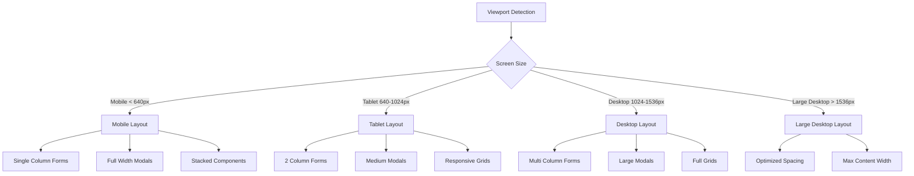

# UI Responsiveness U

pgrade Plan

## Overview

This plan implements a comprehensive responsive design system that ensures all UI components (modals, forms, pages, tables) dynamically adjust to screen size and resolution. The goal is to eliminate scrolling issues on desktop while ensuring full mobile functionality.

## Current State Analysis

### Issues Identified

1. **Modal Component** (`components/ui/Modal.tsx`)

- Fixed max-height (`max-h-[90vh] sm:max-h-[96vh]`) may not account for all screen sizes
- Content area uses `overflow-y-auto` which can hide content
- Size classes don't adapt to viewport dimensions dynamically

2. **Forms with Many Fields**

- `StaffForm.tsx` uses fixed height (`h-[80vh]`) which doesn't adapt
- `InvoiceBillForm.tsx` has extensive fields that may overflow
- `ContactForm.tsx` uses grid layouts that may not stack properly on small screens
- `ProjectAgreementForm.tsx` has complex multi-column layouts

3. **Page Layouts**

- `App.tsx` uses fixed padding (`p-4 md:p-6`) that may not scale
- Some pages use `overflow-hidden` which can cut off content
- Fixed layout pages (RENTAL, PROJECT, etc.) may not adapt well

4. **Mobile Detection**

- Inconsistent use of `window.innerWidth < 768` vs Tailwind breakpoints
- Some components duplicate mobile detection logic

5. **Tables and Grids**

- Tables may overflow horizontally on small screens
- Grid layouts may not collapse properly on mobile

## Architecture

### Responsive Breakpoint System




### Dynamic Sizing Strategy

1. **Viewport-Based Calculations**: Use CSS custom properties and viewport units
2. **Flexible Containers**: Replace fixed heights with flexbox/grid that adapts
3. **Content-Aware Sizing**: Calculate optimal sizes based on content and available space
4. **Progressive Enhancement**: Start mobile-first, enhance for larger screens

## Implementation

### 1. Enhanced Modal Component

**File**: `components/ui/Modal.tsx`**Changes**:

- Replace fixed max-height with dynamic calculation based on viewport
- Add viewport height detection hook
- Implement size classes that adapt to screen dimensions
- Add `maxContentHeight` prop for content-specific sizing
- Ensure modal content is always fully visible without scrolling when possible
- Add mobile-specific full-screen mode option

**Key Features**:

- Dynamic max-height: `calc(100vh - 2rem)` on mobile, `calc(100vh - 4rem)` on desktop
- Responsive padding: `p-4` mobile, `p-6` tablet, `p-8` desktop
- Content area uses flexbox with `min-h-0` to prevent overflow
- Optional full-screen mode for mobile (`fullScreen` prop)

### 2. Responsive Form System

**Files to Update**:

- `components/payroll/StaffForm.tsx`
- `components/invoices/InvoiceBillForm.tsx`
- `components/settings/ContactForm.tsx`
- `components/projectManagement/ProjectAgreementForm.tsx`
- `components/rentalAgreements/RentalAgreementForm.tsx`
- `components/projectManagement/ProjectContractForm.tsx`
- `components/settings/PropertyForm.tsx`
- `components/settings/UnitForm.tsx`
- `components/settings/BuildingForm.tsx`
- All other form components

**Changes**:

- Replace fixed heights with flex containers
- Use responsive grid: `grid-cols-1 sm:grid-cols-2 lg:grid-cols-3 xl:grid-cols-4`
- Implement field grouping with collapsible sections for mobile
- Add form sections that stack on mobile, side-by-side on desktop
- Ensure all form fields are visible without horizontal scrolling
- Use `min-h-0` on scrollable containers to prevent overflow

**Pattern**:

```tsx
<form className="flex flex-col h-full min-h-0">
  <div className="flex-shrink-0">{/* Header/Tabs */}</div>
  <div className="flex-grow min-h-0 overflow-y-auto">
    <div className="grid grid-cols-1 sm:grid-cols-2 lg:grid-cols-3 gap-4">
      {/* Form fields */}
    </div>
  </div>
  <div className="flex-shrink-0">{/* Actions */}</div>
</form>
```


### 3. Viewport Detection Hook

**New File**: `hooks/useViewport.ts`**Purpose**: Centralized viewport size detection and breakpoint utilities**Features**:

- Track viewport width and height
- Provide breakpoint flags (isMobile, isTablet, isDesktop, isLargeDesktop)
- Debounced resize handling
- SSR-safe implementation

### 4. Page Layout Adjustments

**File**: `App.tsx`**Changes**:

- Replace fixed padding with responsive padding
- Adjust page container heights based on available viewport
- Ensure pages account for header, footer, and sidebars
- Use CSS Grid or Flexbox for main layout

**Key Updates**:

- Main container: `min-h-0` to prevent overflow
- Page wrapper: `h-full overflow-y-auto` with proper padding
- Responsive spacing: `p-2 sm:p-4 md:p-6 lg:p-8`

### 5. Table Responsiveness

**Files to Update**:

- `components/transactions/LedgerTable.tsx`
- `components/invoices/InvoicesPage.tsx`
- `components/bills/BillsPage.tsx`
- All table components

**Changes**:

- Add horizontal scroll wrapper for small screens
- Implement card view for mobile (alternative to table)
- Use `overflow-x-auto` with proper min-width
- Sticky columns for important data (date, amount)
- Responsive column hiding on small screens

### 6. Mobile UI Enhancements

**Files to Update**:

- `components/mobile/MobilePaymentsPage.tsx`
- `components/layout/Footer.tsx`
- `components/layout/Header.tsx`
- `components/layout/Sidebar.tsx`

**Changes**:

- Ensure touch targets are at least 44x44px
- Increase spacing between interactive elements
- Full-screen modals on mobile when appropriate
- Bottom sheet pattern for mobile modals
- Swipe gestures where applicable
- Safe area insets for notched devices

### 7. Component-Specific Fixes

#### Settings Page

**File**: `components/settings/SettingsPage.tsx`

- Responsive category sidebar (drawer on mobile)
- Grid layouts that collapse to single column
- Form modals sized appropriately

#### Dashboard

**File**: `components/dashboard/DashboardPage.tsx`

- KPI cards responsive grid
- Charts that scale with container
- Widget layouts that stack on mobile

#### Reports

**Files**: All report components in `components/reports/`

- Print-friendly layouts
- Responsive table wrappers
- Chart containers that adapt

### 8. Global CSS Updates

**File**: `index.css`**Additions**:

- CSS custom properties for spacing scales
- Viewport-based font sizing utilities
- Safe area inset variables for mobile
- Responsive utility classes

**Example**:

```css
:root {
  --viewport-padding-mobile: 1rem;
  --viewport-padding-tablet: 1.5rem;
  --viewport-padding-desktop: 2rem;
  --safe-area-top: env(safe-area-inset-top);
  --safe-area-bottom: env(safe-area-inset-bottom);
}
```


### 9. Form Field Component Updates

**File**: `components/ui/Input.tsx`**Changes**:

- Ensure proper sizing on all screen sizes
- Touch-friendly on mobile (already has `py-3` on mobile)
- Responsive label positioning

**File**: `components/ui/Select.tsx`**Changes**:

- Full width on mobile
- Proper dropdown positioning on small screens

**File**: `components/ui/DatePicker.tsx`**Changes**:

- Mobile-optimized calendar picker
- Proper z-index for modals

### 10. Testing & Validation

**Test Cases**:

1. **Desktop Resolutions**: 1920x1080, 1366x768, 2560x1440, 3840x2160
2. **Tablet**: 768x1024, 1024x768
3. **Mobile**: 375x667 (iPhone SE), 390x844 (iPhone 12), 428x926 (iPhone 13 Pro Max)
4. **Form Testing**: All forms should show all fields without scrolling on desktop
5. **Modal Testing**: All modals should fit content without cutting off
6. **Table Testing**: Tables should scroll horizontally on mobile, not break layout

## Implementation Order

1. **Phase 1: Foundation** (Core utilities and hooks)

- Create `useViewport` hook
- Update global CSS with responsive variables
- Enhance Modal component

2. **Phase 2: Forms** (Most critical user-facing components)

- Update all form components with responsive layouts
- Implement field grouping for mobile
- Test form visibility on all screen sizes

3. **Phase 3: Pages** (Page-level layouts)

- Update App.tsx layout system
- Fix page containers and spacing
- Ensure proper overflow handling

4. **Phase 4: Tables & Lists** (Data display components)

- Make all tables responsive
- Add mobile card views where appropriate
- Fix horizontal scrolling issues

5. **Phase 5: Mobile Enhancements** (Mobile-specific improvements)

- Touch target sizing
- Bottom sheet modals
- Safe area handling
- Gesture support

6. **Phase 6: Polish & Testing** (Final adjustments)

- Cross-browser testing
- Device testing
- Performance optimization
- Accessibility checks

## Success Criteria

1. ✅ All form fields visible without scrolling on desktop (1920x1080 and above)
2. ✅ All modals fit content without cutting off on any screen size
3. ✅ Mobile UI fully functional with no horizontal scrolling
4. ✅ Touch targets meet minimum 44x44px on mobile
5. ✅ Tables scroll horizontally on mobile without breaking layout
6. ✅ Components adapt smoothly between breakpoints
7. ✅ No content hidden or cut off on any resolution
8. ✅ Forms use appropriate layouts for screen size (single column mobile, multi-column desktop)

## Files to Modify

### Core Components

- `components/ui/Modal.tsx`
- `components/ui/Input.tsx`
- `components/ui/Select.tsx`
- `components/ui/DatePicker.tsx`
- `components/ui/Button.tsx`
- `components/ui/Tabs.tsx`

### Forms (20+ files)

- All files in `components/*/` ending with `Form.tsx`
- All modal forms

### Pages

- `App.tsx`
- `components/dashboard/DashboardPage.tsx`
- `components/settings/SettingsPage.tsx`
- All page components

### Layout

- `components/layout/Header.tsx`
- `components/layout/Sidebar.tsx`
- `components/layout/Footer.tsx`

### Tables & Lists

- All table components
- All list components

### Global

- `index.css`
- `hooks/useViewport.ts` (new)

## Notes