# User Consent Update Mechanism Implementation

## Problem

Currently, the app automatically reloads when a new service worker version is detected via the `controllerchange` event listener in `PWAContext.tsx` (lines 80-87). This happens even without user consent, causing unexpected page reloads.

## Solution

Remove the automatic reload mechanism and ensure updates only occur when the user explicitly clicks "Update Now" in the update notification.

## Changes Required

### 1. Remove Automatic Reload in PWAContext

**File**: `context/PWAContext.tsx`

- **Remove lines 80-87**: The `controllerchange` event listener that automatically reloads the page
- **Keep existing functionality**: The `applyUpdate()` function (lines 120-130) already correctly handles user-initiated updates by:
  - Sending `SKIP_WAITING` message to service worker
  - Reloading after a 500ms delay

**Rationale**: The service worker is already configured correctly in `sw.js` to wait for user action (no `skipWaiting()` on install). The `controllerchange` listener was causing premature reloads before user consent.

### 2. Optional: Improve App.tsx Update Handler

**File**: `App.tsx` (lines 622-638)

- **Current**: Manual service worker update handling in `VersionUpdateNotification`'s `onUpdateRequested` prop
- **Option**: Use PWA context's `applyUpdate()` method for consistency
- **Decision**: Keep current implementation as it works correctly, but could be refactored later for consistency

## Current Flow (After Fix)

```mermaid
sequenceDiagram
    participant User
    participant App
    participant PWAContext
    participant ServiceWorker
    participant VersionNotification

    Note over ServiceWorker: New version detected
    ServiceWorker->>PWAContext: updatefound event
    PWAContext->>PWAContext: setIsUpdateAvailable(true)
    PWAContext->>VersionNotification: isUpdateAvailable = true
    VersionNotification->>User: Show update notification
    
    Note over User: User continues working
    User->>VersionNotification: Click "Later" or dismiss
    VersionNotification->>VersionNotification: Hide notification (no reload)
    
    Note over User: User decides to update
    User->>VersionNotification: Click "Update Now"
    VersionNotification->>App: onUpdateRequested()
    App->>ServiceWorker: postMessage({ type: 'SKIP_WAITING' })
    ServiceWorker->>ServiceWorker: skipWaiting() (activate)
    ServiceWorker->>App: controllerchange event
    Note over App: No automatic reload listener
    App->>App: Manual reload (from onUpdateRequested)
    App->>User: Page reloads with new version
```

## Files to Modify

1. **`context/PWAContext.tsx`**

   - Remove automatic `controllerchange` listener (lines 80-87)
   - No other changes needed - `applyUpdate()` already handles user-initiated updates correctly

## Testing Checklist

- [ ] Deploy a new version to trigger update detection
- [ ] Verify update notification appears without automatic reload
- [ ] Verify "Later" button dismisses notification without reload
- [ ] Verify "Update Now" button triggers reload and applies update
- [ ] Verify user can continue working with old version until they choose to update
- [ ] Verify no automatic relo