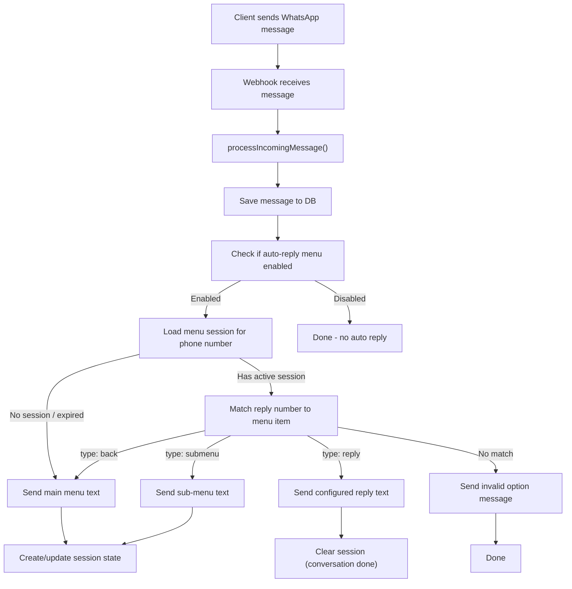

# WhatsApp Auto-Reply Menu

## Architecture Overview




## Data Model

### Menu Configuration (stored in `app_settings`)

Key: `whatsapp_auto_menu`, stored as JSONB in the existing `app_settings` table via the existing `POST /api/app-settings` endpoint. No migration needed for config storage.

```json
{
  "enabled": true,
  "welcomeMessage": "Welcome! Please select an option:",
  "menuItems": [
    {
      "id": "uuid",
      "number": "1",
      "label": "Our Services",
      "type": "reply",
      "replyText": "We offer accounting and bookkeeping.",
      "subMenu": null
    },
    {
      "id": "uuid",
      "number": "2",
      "label": "Support",
      "type": "submenu",
      "replyText": null,
      "subMenu": {
        "message": "Support options:",
        "items": [
          { "id": "uuid", "number": "1", "label": "Technical", "type": "reply", "replyText": "Email support@..." },
          { "id": "uuid", "number": "0", "label": "Back to Main", "type": "back", "replyText": null }
        ]
      }
    }
  ],
  "invalidOptionMessage": "Invalid option. Please reply with a valid number.",
  "sessionTimeoutMinutes": 30
}
```

### Session Tracking (new table)

A new `whatsapp_menu_sessions` table to track which menu level each phone number is currently at:

```sql
CREATE TABLE IF NOT EXISTS whatsapp_menu_sessions (
    id TEXT PRIMARY KEY,
    tenant_id TEXT NOT NULL REFERENCES tenants(id) ON DELETE CASCADE,
    phone_number TEXT NOT NULL,
    current_menu_path TEXT NOT NULL DEFAULT 'root',
    last_interaction_at TIMESTAMP NOT NULL DEFAULT NOW(),
    created_at TIMESTAMP NOT NULL DEFAULT NOW(),
    UNIQUE(tenant_id, phone_number)
);
```

- `current_menu_path`: tracks position in menu tree (e.g., `"root"`, `"item_2"` for submenu of item 2)
- Session expires after `sessionTimeoutMinutes` -- on next message, main menu is resent

---

## Files to Create / Modify

### 1. New File: `components/settings/WhatsAppMenuForm.tsx`

A new React component (modal form) for designing the WhatsApp auto-reply menu. Follows the same pattern as [WhatsAppConfigForm.tsx](components/settings/WhatsAppConfigForm.tsx).

**UI Features:**

- Toggle to enable/disable auto-reply menu
- Editable "Welcome Message" textarea
- Editable "Invalid Option Message" textarea
- Session timeout (minutes) input
- Dynamic list of menu items, each with:
  - Number (e.g., "1", "2", "3")
  - Label (display text)
  - Type selector: "Reply" or "Sub-Menu"
  - If Reply: configurable reply text (textarea)
  - If Sub-Menu: nested item list with same structure (1 level deep for simplicity)
- Add/remove menu items buttons
- Save button that POSTs to `/api/app-settings` with key `whatsapp_auto_menu`
- Load existing config on mount via `GET /api/app-settings/whatsapp_auto_menu`

### 2. Modify: [components/settings/SettingsPage.tsx](components/settings/SettingsPage.tsx)

- Import `WhatsAppMenuForm`
- Add `'whatsapp-menu'` to the `activePreferenceModal` state type (line 115)
- Add a 4th action card in `renderCommunicationBranding()` (line 689-695):
  - Title: "WhatsApp Menu"
  - Description: "Design auto-reply menus for incoming WhatsApp messages."
  - onClick: `setActivePreferenceModal('whatsapp-menu')`
- Add corresponding Modal (after line 982):
  ```tsx
  <Modal isOpen={activePreferenceModal === 'whatsapp-menu'} onClose={() => setActivePreferenceModal(null)} title="WhatsApp Auto-Reply Menu" size="xl">
      <WhatsAppMenuForm />
  </Modal>
  ```

### 3. New Migration: `server/migrations/20260210_add_whatsapp_menu_sessions.sql`

Creates the `whatsapp_menu_sessions` table for tracking conversation state.

### 4. Modify: [server/services/whatsappApiService.ts](server/services/whatsappApiService.ts)

Add auto-reply logic after the message is saved in `processIncomingMessage()` (after line 1033, after the WebSocket emit):

- New private method: `handleAutoReplyMenu(tenantId, phoneNumber, messageText, contactId)`
  - Load menu config from `app_settings` where key = `whatsapp_auto_menu`
  - If not enabled, return
  - Load session from `whatsapp_menu_sessions` for this phone number
  - If no session or session expired: format and send main menu, create/update session with path `"root"`
  - If session exists at `"root"`: match `messageText.trim()` against menu item numbers
    - If match and type is `"reply"`: send reply text, delete session
    - If match and type is `"submenu"`: send sub-menu text, update session path to item ID
    - If no match: send invalid option message
  - If session at a sub-menu path: match against sub-menu items
    - If match and type is `"reply"`: send reply, delete session
    - If match and type is `"back"`: send main menu, update session to `"root"`
    - If no match: send invalid option message
  - Uses existing `sendTextMessage()` method to send replies
- New private method: `formatMenuText(welcomeMessage, menuItems)` -- formats the menu as a numbered text list for sending

### 5. No new API routes needed

The menu config is stored/retrieved via the existing `app-settings` API. The auto-reply logic runs server-side automatically in the webhook handler.

---

## Key Design Decisions

- **Sub-menu depth limited to 1 level** to keep UI manageable (main menu -> sub-menu -> reply). Can be extended later.
- **Session-based state tracking** using a DB table (survives server restarts, unlike in-memory).
- **Auto-reply sends as regular text messages** using the existing `sendTextMessage()` -- these appear in the WhatsApp chat window as outgoing messages.
- **Configurable session timeout** to reset idle conversations back to the main menu.
- **Menu config stored in `app_settings**` (JSONB) -- no new config table needed, follows existing patterns.

