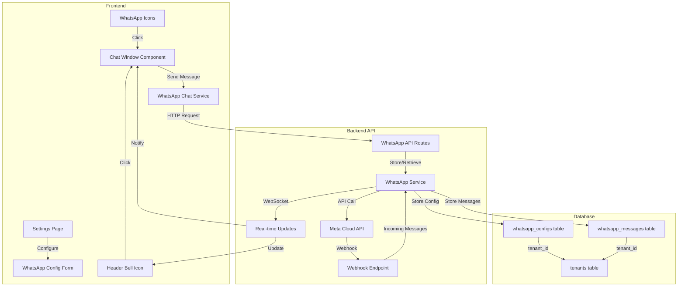

# WhatsApp Business API Integration Plan

## Overview

This plan implements WhatsApp Business API integration using Meta's Cloud API with webhooks for real-time incoming messages. The integration is multi-tenant aware, allowing each organization to configure their own WhatsApp Business account, API credentials, and phone number.

## Architecture



## Part 1: API Integration (Backend)

### 1.1 Database Schema

**File:** `server/migrations/add-whatsapp-integration.sql`

Create two new tables:

1. **`whatsapp_configs` table** - Stores organization-level WhatsApp API configuration:

   - `id` (TEXT PRIMARY KEY)
   - `tenant_id` (TEXT NOT NULL, FOREIGN KEY to tenants)
   - `api_key` (TEXT NOT NULL) - Encrypted WhatsApp Business API access token
   - `api_secret` (TEXT) - Optional API secret if required
   - `phone_number_id` (TEXT NOT NULL) - WhatsApp Business Phone Number ID
   - `business_account_id` (TEXT) - WhatsApp Business Account ID
   - `verify_token` (TEXT) - Webhook verification token
   - `webhook_url` (TEXT) - Webhook URL endpoint
   - `is_active` (BOOLEAN DEFAULT TRUE)
   - `created_at` (TIMESTAMP)
   - `updated_at` (TIMESTAMP)

2. **`whatsapp_messages` table** - Stores message history:

   - `id` (TEXT PRIMARY KEY)
   - `tenant_id` (TEXT NOT NULL, FOREIGN KEY to tenants)
   - `contact_id` (TEXT, FOREIGN KEY to contacts) - Links to contact
   - `phone_number` (TEXT NOT NULL) - Recipient/sender phone number
   - `message_id` (TEXT UNIQUE) - WhatsApp message ID from API
   - `direction` (TEXT) - 'outgoing' or 'incoming'
   - `status` (TEXT) - 'sent', 'delivered', 'read', 'failed', 'received'
   - `message_text` (TEXT)
   - `media_url` (TEXT) - Optional media attachment URL
   - `media_type` (TEXT) - 'image', 'video', 'document', etc.
   - `timestamp` (TIMESTAMP NOT NULL)
   - `created_at` (TIMESTAMP)
   - `read_at` (TIMESTAMP) - When message was read (for incoming)

Add indexes for:

- `tenant_id` on both tables
- `phone_number` on whatsapp_messages
- `contact_id` on whatsapp_messages
- `message_id` on whatsapp_messages (UNIQUE)
- `timestamp` on whatsapp_messages for sorting

### 1.2 Backend Service

**File:** `server/services/whatsappApiService.ts`

Create a service that handles:

- **Initialization**: Load tenant WhatsApp config from database
- **Send Message**: Send text/media messages via Meta Cloud API
- **Message Status**: Track delivery/read status
- **Webhook Processing**: Process incoming webhook events
- **Webhook Verification**: Verify webhook during Meta setup

Key methods:

```typescript
- initializeConfig(tenantId: string): Promise<WhatsAppConfig>
- sendTextMessage(tenantId: string, phoneNumber: string, message: string): Promise<MessageResponse>
- sendTemplateMessage(tenantId: string, phoneNumber: string, templateName: string, params: any[]): Promise<MessageResponse>
- verifyWebhook(mode: string, token: string, challenge: string): string | null
- processWebhook(tenantId: string, payload: any): Promise<void>
- getMessageStatus(tenantId: string, messageId: string): Promise<MessageStatus>
```

### 1.3 API Routes

**File:** `server/api/routes/whatsapp.ts`

Endpoints:

- `GET /api/whatsapp/config` - Get current tenant's WhatsApp configuration
- `POST /api/whatsapp/config` - Create/update WhatsApp configuration
- `DELETE /api/whatsapp/config` - Delete/disconnect WhatsApp configuration
- `POST /api/whatsapp/send` - Send a message
  - Body: `{ contactId?: string, phoneNumber: string, message: string }`
- `GET /api/whatsapp/messages` - Get message history
  - Query params: `contactId`, `phoneNumber`, `limit`, `offset`
- `GET /api/whatsapp/messages/:messageId/status` - Get message status
- `GET /api/whatsapp/unread-count` - Get count of unread messages
- `POST /api/whatsapp/messages/:messageId/read` - Mark message as read

**Public Webhook Endpoint** (no tenant middleware):

- `GET /api/whatsapp/webhook` - Webhook verification (Meta requirement)
  - Query params: `hub.mode`, `hub.verify_token`, `hub.challenge`
- `POST /api/whatsapp/webhook` - Receive webhook events
  - Headers: `X-Hub-Signature-256` for verification
  - Body: Meta webhook payload

**File:** `server/api/index.ts`

- Register WhatsApp routes: `app.use('/api/whatsapp', tenantMiddleware(pool), whatsappRouter)`
- Register webhook route separately (before tenant middleware): `app.use('/api/whatsapp/webhook', whatsappWebhookRouter)`

### 1.4 Webhook Security

**File:** `server/middleware/whatsappWebhookMiddleware.ts`

Middleware to:

- Verify webhook signature using `X-Hub-Signature-256`
- Extract tenant ID from webhook payload or phone number mapping
- Validate webhook structure
- Rate limiting for webhook endpoint

### 1.5 Encryption

**File:** `server/services/encryptionService.ts`

Service to encrypt/decrypt sensitive data:

- Encrypt `api_key` and `api_secret` before storing in database
- Use environment variable `WHATSAPP_ENCRYPTION_KEY` for encryption
- Decrypt when retrieving config for API calls

## Part 2: UI Updates (Frontend)

### 2.1 Settings Configuration Page

**File:** `components/settings/WhatsAppConfigForm.tsx`

New component for WhatsApp API configuration with form fields:

- **API Key/Access Token** (password input, required)
- **Phone Number ID** (text input, required)
- **Business Account ID** (text input, optional)
- **Webhook Verify Token** (text input, required for webhook setup)
- **Status Indicator** (connected/disconnected/error)
- **Test Connection Button** (validates API credentials)
- **Save/Update Button**
- **Delete/Disconnect Button**

Add validation:

- API key format validation
- Phone number ID format validation
- Test API connection on save

**File:** `components/settings/SettingsPage.tsx`

- Add new setting category: "WhatsApp Integration" under "Communication" section
- Add icon card similar to "Messaging Templates"
- Open `WhatsAppConfigForm` modal when clicked

### 2.2 WhatsApp Chat Service

**File:** `services/whatsappChatService.ts`

Service to handle:

- Fetching messages for a contact
- Sending messages via API
- Real-time message updates via WebSocket
- Unread message count
- Mark messages as read

Key methods:

```typescript
- getMessages(contactId: string, limit?: number, offset?: number): Promise<WhatsAppMessage[]>
- sendMessage(contactId: string, phoneNumber: string, message: string): Promise<WhatsAppMessage>
- getUnreadCount(): Promise<number>
- markAsRead(messageId: string): Promise<void>
- subscribeToUpdates(callback: (message: WhatsAppMessage) => void): () => void
```

### 2.3 WhatsApp Chat Window Component

**File:** `components/whatsapp/WhatsAppChatWindow.tsx`

New dynamic chat window component with:

- **Header**: Contact name, phone number, status indicator
- **Message List**: Scrollable list of messages (grouped by date)
  - Outgoing messages (right-aligned, green)
  - Incoming messages (left-aligned, white/gray)
  - Timestamp for each message
  - Read/delivered status indicators
  - Message status icons (sending, sent, delivered, read, failed)
- **Input Area**: 
  - Text input field
  - Send button
  - Optional: Attachment button (for future media support)
- **Loading States**: When fetching messages
- **Error Handling**: Display errors when API calls fail

Features:

- Auto-scroll to bottom on new messages
- Load more messages on scroll up (pagination)
- Real-time updates via WebSocket
- Keyboard shortcuts (Enter to send, Shift+Enter for new line)

**Props:**

```typescript
interface WhatsAppChatWindowProps {
  isOpen: boolean;
  onClose: () => void;
  contactId?: string; // If opening for specific contact
  phoneNumber?: string; // If no contact ID
  contactName?: string; // Display name
  initialMessage?: string; // Pre-filled message
}
```

### 2.4 Update Existing WhatsApp Icon Handlers

Update all components that currently use `WhatsAppService.sendMessage()` to use the new chat window:

**Files to update:**

- `components/contacts/ContactsPage.tsx` - Replace WhatsApp icon click to open chat window
- `components/vendors/VendorDirectoryPage.tsx` - Replace WhatsApp click handler
- `components/invoices/InvoiceDetailView.tsx` - Replace WhatsApp button to open chat with pre-filled invoice message
- `components/reports/BrokerFeeReport.tsx` - Replace WhatsApp handler
- `components/reports/TenantLedgerReport.tsx` - Replace WhatsApp handler
- `components/reports/ProjectInvestorReport.tsx` - Replace WhatsApp handler
- `components/reports/ClientLedgerReport.tsx` - Replace WhatsApp handler
- `components/loans/LoanManagementPage.tsx` - Replace WhatsApp handler
- `components/rentalManagement/RentalBillsPage.tsx` - Replace WhatsApp handler
- `components/projectManagement/ProjectContractDetailModal.tsx` - Replace WhatsApp handler

**Pattern for updates:**

1. Import `WhatsAppChatWindow` component
2. Add state for chat window: `const [chatWindow, setChatWindow] = useState<{isOpen: boolean, contactId?: string, phoneNumber?: string, contactName?: string, initialMessage?: string}>({isOpen: false})`
3. Replace `WhatsAppService.sendMessage()` call with: `setChatWindow({isOpen: true, contactId: contact.id, phoneNumber: contact.contactNo, contactName: contact.name, initialMessage: generatedMessage})`
4. Render `<WhatsAppChatWindow {...chatWindow} onClose={() => setChatWindow({isOpen: false})} />`

### 2.5 Header Notification Bell

**File:** `components/layout/Header.tsx`

Update the notification bell icon:

- Add state for unread message count: `const [unreadCount, setUnreadCount] = useState(0)`
- Fetch unread count on mount and periodically (every 30 seconds)
- Subscribe to WebSocket updates for real-time unread count
- Display badge with unread count when > 0
- On click, open WhatsApp chat window with contact list view (showing all contacts with unread messages)
- Add pulse animation when new messages arrive

**New Component:** `components/whatsapp/WhatsAppNotificationsList.tsx`

- Modal/list showing contacts with unread messages
- Clicking a contact opens the chat window for that contact
- Option to mark all as read

### 2.6 Update WhatsApp Service

**File:** `services/whatsappService.ts`

Update existing service to:

- Check if WhatsApp API is configured for current tenant
- If configured: Use API integration (via `whatsappChatService`)
- If not configured: Fall back to `wa.me` URL scheme (current behavior)
- This maintains backward compatibility

### 2.7 Context/State Management

**File:** `context/WhatsAppContext.tsx` (Optional, but recommended)

Create context to manage:

- WhatsApp configuration status
- Unread message count
- Active chat window state
- Message cache

This allows components to subscribe to WhatsApp-related state without prop drilling.

## Implementation Todos

### Backend Implementation

- [ ] Create database migration for `whatsapp_configs` and `whatsapp_messages` tables
- [ ] Implement `whatsappApiService.ts` with Meta Cloud API integration
- [ ] Create encryption service for API credentials
- [ ] Implement WhatsApp API routes (`whatsapp.ts`)
- [ ] Create webhook middleware for signature verification
- [ ] Implement webhook endpoint (public, no auth)
- [ ] Add WebSocket support for real-time message updates
- [ ] Add WhatsApp routes to main API router
- [ ] Test webhook verification with Meta
- [ ] Test sending messages via API
- [ ] Test receiving webhooks from Meta

### Frontend Implementation

- [ ] Create `WhatsAppConfigForm` component for settings
- [ ] Add WhatsApp Integration section to Settings page
- [ ] Create `whatsappChatService.ts` for API communication
- [ ] Create `WhatsAppChatWindow` component
- [ ] Create `WhatsAppNotificationsList` component
- [ ] Update Header notification bell with unread count
- [ ] Update all existing WhatsApp icon click handlers
- [ ] Update `whatsappService.ts` to use API when configured
- [ ] Implement WebSocket client subscription for real-time updates
- [ ] Add error handling and loading states
- [ ] Test chat window with various scenarios
- [ ] Test notification bell functionality

### Integration & Testing

- [ ] Test configuration flow end-to-end
- [ ] Test sending messages from chat window
- [ ] Test receiving messages via webhook
- [ ] Test notification bell updates
- [ ] Test multi-tenant isolation (different configs per tenant)
- [ ] Test fallback to wa.me when API not configured
- [ ] Performance testing with large message history
- [ ] Security audit of webhook endpoint

## Dependencies

**Backend:**

- `axios` or `node-fetch` for HTTP requests to Meta API
- `crypto` (built-in) for webhook signature verification
- `@types/crypto-js` for encryption (or use built-in crypto)

**Frontend:**

- No new dependencies required (uses existing React, TypeScript setup)

## Environment Variables

Add to `.env`:

```
WHATSAPP_ENCRYPTION_KEY=your-32-character-encryption-key
WHATSAPP_WEBHOOK_SECRET=your-webhook-secret-for-signature-verification
META_API_VERSION=v21.0  # Latest WhatsApp Business API version
```

## API Documentation References

- Meta WhatsApp Business Cloud API: https://developers.facebook.com/docs/whatsapp/cloud-api
- Webhook Setup: https://developers.facebook.com/docs/whatsapp/cloud-api/webhooks
- Message Templates: https://developers.facebook.com/docs/whatsapp/business-management-api/message-templates

## Notes

1. **Backward Compatibility**: The existing `wa.me` URL scheme will continue to work when API is not configured, ensuring existing functionality is not broken.

2. **Tenant Isolation**: All WhatsApp configurations and messages are scoped by `tenant_id` to ensure proper multi-tenant isolation.

3. **Webhook URL**: The webhook URL will need to be publicly accessible. Format: `https://your-domain.com/api/whatsapp/webhook`. This must be configured in Meta's App Dashboard.

4. **Message Templates**: Meta requires message templates for initial outbound messages to new contacts. Consider adding template management in a future phase.

5. **Rate Limiting**: Meta has rate limits for API calls. Implement rate limiting and error handling to gracefully handle rate limit errors.

6. **Media Support**: Phase 1 focuses on text messages. Media support (images, documents) can be added in Phase 2.

7. **Encryption**: API keys should be encrypted at rest. Use the encryption service to encrypt/decrypt sensitive credentials.

8. **Real-time Updates**: Use WebSocket service (already exists in codebase) to push real-time message updates to connected clients.