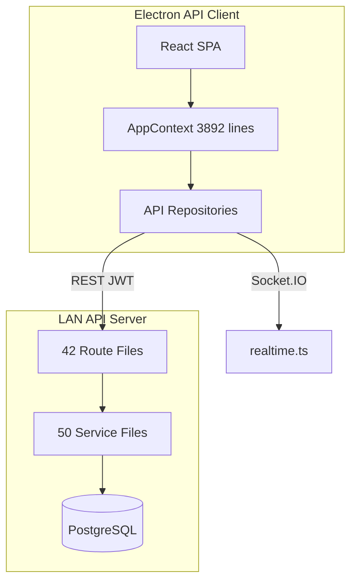
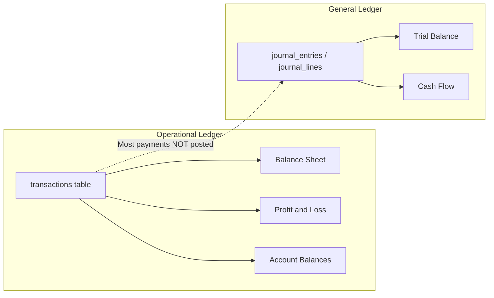

# PBooksPro Pre-Production System Audit Report

**Audit Date:** June 6, 2026  
**Target Deployment:** LAN multi-user (Express/PostgreSQL API server + Electron API clients)  
**Auditor Role:** Senior Software Architect, ERP Consultant, Financial Systems Auditor  
**Codebase Version:** 1.2.290 (package.json)  
**Scope:** Full application — backend, frontend, Electron shell, database schema, financial engines

---

# Executive Summary

PBooksPro is a hybrid finance/ERP desktop application evolving from a local SQLite monolith toward a LAN multi-user PostgreSQL API. The system covers project selling, rental management, AP/AR, payroll, construction PM, and financial reporting. For **LAN/PostgreSQL deployment**, the architecture is pragmatic and functional for single-tenant LAN use, but **critical accounting and security gaps prevent safe use for real-world financial transactions without remediation**.

The most severe finding is a **split-ledger architecture**: operational payments live in the `transactions` table (driving Balance Sheet, P&L, and account balances), while Trial Balance and Cash Flow derive from `journal_entries`/`journal_lines` — and most payment flows never post journals. Financial reports therefore **cannot reconcile** with each other or with auditor expectations.

Secondary critical gaps include **missing server-side RBAC** on financial write APIs (UI role gating only), **no migration version tracking**, and **performance risks** from loading up to 500,000 transactions into client memory on startup.

## Scores

| Phase | Score | Status |
|-------|-------|--------|
| Architecture | 58/100 | Needs improvement |
| Database | 62/100 | Acceptable with gaps |
| Accounting | 42/100 | **Not production-ready** |
| Financial Reliability | 65/100 | Acceptable with critical gaps |
| Security | 48/100 | **Not production-ready** |
| Performance | 45/100 | **Not production-ready at scale** |
| Code Quality | 52/100 | Needs improvement |
| UX | 63/100 | Acceptable |
| Reporting | 55/100 | Misleading reconciliation UI |
| Production Readiness | 46/100 | **Not production-ready** |

**Overall Weighted Score: 53/100**

## Go-Live Verdict

- [ ] Not Ready
- [x] **Ready with Fixes**
- [ ] Production Ready

**Justification:** Core business workflows (invoicing, bill payment, rental agreements, project selling, payroll) are implemented and usable on LAN/PostgreSQL. Journal posting, vendor advance settlement, and contractor billing demonstrate sound double-entry patterns where applied. However, **four critical blockers** (split ledger, missing API RBAC, account balance source mismatch, migration system) must be resolved before processing real financial transactions. Security hardening (JWT revalidation, login rate limiting, journal immutability on PostgreSQL) is required before multi-user production. Performance remediation is required before tenants exceed ~10,000 transactions.

---

# Critical Issues

Issues that **MUST** be fixed before go-live on LAN/PostgreSQL.

## Critical Severity

| ID | Module | Issue | Evidence | Remediation |
|----|--------|-------|----------|-------------|
| C1 | Accounting / GL | **Split ledger** — payments/receipts in `transactions`; TB/CF from `journal_lines`; BS/P&L from transactions. Most payments never post journals. | `components/reports/balanceSheetEngine.ts:4`, `backend/src/services/cashFlowReportService.ts`, `backend/src/services/transactionsService.ts` (no journal posting) | Unify: post journal entries for all payment/receipt/accrual flows OR migrate all reports to a single source of truth |
| C2 | Security / All financial APIs | **No server-side RBAC** on bills, transactions, invoices, payroll, accounts — only `authMiddleware`. `requireLedgerRole` used in journal routes only. | `backend/src/middleware/authMiddleware.ts`, `backend/src/routes/journalRoutes.ts` vs `billsRoutes.ts`, `transactionsRoutes.ts` | Add role middleware per route group matching frontend role matrix |
| C3 | Chart of Accounts | **Account balances ≠ GL balances** — `accountsService` derives balance from transactions, not `journal_lines`. | `backend/src/services/accountsService.ts` `ACCOUNT_BALANCE_CASE` | Derive account balances from journal lines once ledger is unified |
| C4 | Platform / Migrations | **No migration version tracking** — all 60 SQL files re-executed every run. Non-idempotent backfills will fail on re-run. | `backend/src/migrate.ts` | Add `schema_migrations` table; run each migration once; make backfills idempotent |

## High Severity

| ID | Module | Issue | Evidence | Remediation |
|----|--------|-------|----------|-------------|
| H1 | Journal / GL | No PostgreSQL journal immutability triggers (SQLite has them) | `electron/schema.sql:1207-1217` vs `database/migrations/001_lan_core.sql` | Add `BEFORE UPDATE/DELETE` triggers on PG journal tables |
| H2 | Authentication | JWT 7-day tokens without DB revalidation of `is_active`/role | `backend/src/auth/jwt.ts`, `backend/src/middleware/authMiddleware.ts` | Revalidate user on each request or use short-lived tokens + refresh |
| H3 | Authentication | No login rate limiting (registration limited only) | `backend/src/routes/authRoutes.ts` | Add rate limiter on `/auth/login` |
| H4 | AP/AR | Client-supplied `paid_amount` on invoice/bill save; recalc only on transaction CRUD | `backend/src/services/invoicesService.ts`, `billsService.ts` | Server-authoritative recalc on every invoice/bill save |
| H5 | State Sync | Bulk state load up to 500k transactions; AppContext init uses parallel `loadState()` not bulk | `backend/src/services/appStateBulkService.ts`, `context/AppContext.tsx` | Paginate/chunk; use bulk endpoint; cap limits |
| H6 | Journal / GL | GL running balance misclassifies BANK/CASH account types | `backend/src/services/journalService.ts` `normalBalanceDirection()` | Treat `bank`, `cash`, `asset` as debit-normal |
| H7 | Multi-user | Record locks only on agreements/invoices — not bills, payroll, rental | `recordLocksService.ts` usage in services | Extend lock enforcement to contested entities |

## Medium Severity

| ID | Module | Issue |
|----|--------|-------|
| M1 | Security | Public LAN introspection: `/api/discover`, `/api/server/connected-clients`, `/api/auth/tenants` |
| M2 | Security | CORS `origin: '*'` on API and Socket.IO |
| M3 | Journal | Reversal entries always post to today's date — period distortion |
| M4 | Personal Finance | Tenant-wide data — any user sees all personal transactions |
| M5 | Reporting | Custom report builder PG-only; aggregates UI incomplete |
| M6 | Code Quality | Frontend `strict: false` — type safety gaps in financial UI |
| M7 | Database | `transactions` table missing FKs on invoice_id, bill_id, building_id, payslip_id |
| M8 | Database | Denormalized `owner_balances`/`monthly_owner_summary` without FK constraints |
| M9 | UX | Inventory module stub — role exists in user management but no route |
| M10 | Production | Raw error messages returned to clients in production |
| M11 | Production | No structured logging, metrics, or APM |
| M12 | Security | Weak password policy (6 chars register; admin create min 1) |
| M13 | Security | Dev seed creates default admin passwords when `SEED_DEV_USER=1` |
| M14 | Database | Two Trial Balance API endpoints with different shapes |
| M15 | Reporting | `reportDefinitions.ts` incomplete — global search misses many reports |

## Low Severity

| ID | Module | Issue |
|----|--------|-------|
| L1 | Architecture | No dependency injection framework — direct imports throughout |
| L2 | Database | Duplicate index `idx_sales_returns_agreement_id` in SQLite schema |
| L3 | UX | `Page.marketing` enum dead; marketing works as Project Selling sub-tab |
| L4 | UX | Contacts page mounted but not in primary navigation |
| L5 | UX | Loans functional but buried under Personal Transactions |
| L6 | Code Quality | `entityListStubsRoutes` returns empty lists for quotations/documents |
| L7 | Code Quality | Dead client paths: `/state/bulk-chunked`, `/state/critical` (no backend routes) |
| L8 | Reporting | `ProjectReport.tsx` appears orphaned — no imports found |
| L9 | Security | JWT stored in localStorage — XSS would steal token |
| L10 | Database | SQLite vs PG schema drift (units column names, sales_returns FKs) |

---

# Phase-by-Phase Analysis

## Phase 1 — Architecture Review

**Score: 58/100**

### Findings

PBooksPro uses a **hybrid Electron + React + Vite** desktop client with an optional **Express/PostgreSQL LAN API**. The backend follows a flat **routes → services** pattern (42 route files, 50 service files) with SQL embedded in services. Only the custom reporting module uses a layered repository/validator pattern. There is **no dependency injection** — singletons (`getPool()`, `getQueryClient()`) and direct imports throughout.

The frontend is dominated by a **3,892-line `AppContext.tsx`** reducer holding the entire application state, with persistence, API sync, payroll side effects, rental reconciliation, and socket handling all in one file. A newer pattern uses React Query + Zustand in `modules/project-profitability` and `modules/investor-fund-availability`, but **168 components still use `useAppContext()`** vs ~28 using selective subscription hooks.

**Dual persistence** is the largest structural concern: every domain has both SQLite repositories (`services/database/repositories/`) and API repositories (`services/api/repositories/`), with AppContext choosing the path based on session mode. Financial engines (`balanceSheetEngine`, `profitLossEngine`, `cashFlowEngine`) live in `components/reports/` and are esbuild-bundled into `backend/dist/*.mjs` at build time.

Navigation is state-driven via a `Page` enum in `types.ts` — no React Router. Lazy loading with LRU page-group caching (max 3 groups).

### Risks

- AppContext god-object makes changes high-risk and causes widespread re-renders
- Dual SQLite/API stacks double maintenance burden and sync risk
- Manually duplicated payroll/trial-balance cores between frontend and backend
- Business logic scattered across components, utils, and services
- Frontend `strict: false` vs backend `strict: true` — type safety mismatch

### Recommendations

1. Decompose AppContext into domain-specific contexts or complete selective-state migration
2. Consolidate to API-only path for LAN deployment; deprecate dual-stack where possible
3. Extract shared financial logic into a single package consumed by both tiers
4. Introduce route-level middleware composition for cross-cutting concerns (RBAC, validation)
5. Adopt React Query as primary data layer for LAN mode; reduce AppContext to UI state only

---

## Phase 2 — Database Audit

**Score: 62/100**

### Findings

PostgreSQL schema is defined across **60 migration files** in `database/migrations/` (001–060), applied by `backend/src/migrate.ts` which runs all `.sql` files in sorted order with **no version tracking table**.

**~59 tables** on PostgreSQL including tenant-scoped business entities, journal/GL tables, payroll, contractor billing, record locks, custom reports, and denormalized rental rollup tables (`owner_balances`, `monthly_owner_summary`).

**Multi-tenant pattern:** `tenant_id TEXT` on nearly all business tables with composite uniqueness (e.g., `(tenant_id, invoice_number)`). PostgreSQL enforces `tenant_id REFERENCES tenants(id) ON DELETE CASCADE` on ~15+ tables. **No row-level security** — isolation is application-layer only.

**Foreign key gaps (high impact):**
- `transactions`: no FK on `invoice_id`, `bill_id`, `building_id`, `property_id`, `unit_id`, `payslip_id`, `contract_id`, `agreement_id` (intentionally loose for sync ordering on some)
- `invoices`/`bills`: no FK on `contact_id`, `project_id`, `building_id` on PostgreSQL
- `journal_lines.project_id`: no FK to projects
- `documents`: polymorphic `entity_id`/`entity_type` with no FK
- Denormalized rollup tables: no FKs on `owner_id`, `property_id`

**Journal immutability:** SQLite has `BEFORE UPDATE/DELETE` triggers on journal tables. PostgreSQL has line-level CHECK constraints and `ON DELETE RESTRICT` but **no immutability triggers**.

**Indexes:** Good coverage on transactions (tenant, date, updated_at, FK composites). Gaps: no index on `transactions(tenant_id, payslip_id)`, no composite `(tenant_id, account_id)` on journal_lines.

### Risks

- Orphan records in transactions referencing deleted invoices/bills/properties
- Denormalized rollup tables can drift from source data
- Migration re-runs will fail on non-idempotent backfills (043, 052)
- Direct DB access can modify journal entries on PostgreSQL
- SQLite/PG schema drift if local mode is also used

### Recommendations

1. Add `schema_migrations` table immediately
2. Add PostgreSQL journal immutability triggers
3. Add missing FKs on transactions (at least invoice_id, bill_id) with NOT VALID + VALIDATE
4. Add FK constraints on denormalized rollup tables or replace with materialized views
5. Add entry-level balance CHECK constraint or trigger on journal_entries
6. Consolidate partial unique indexes (payslips, pm_cycle_allocations) consistently

---

## Phase 3 — Accounting Audit

**Score: 42/100 — CRITICAL**

### Findings

PBooksPro operates a **dual-ledger system**:

| Ledger | Table(s) | Used By | Posting Coverage |
|--------|----------|---------|------------------|
| Operational | `transactions` | Balance Sheet, P&L, Account Balances, most reports | All payments/receipts/expenses |
| General Ledger | `journal_entries` + `journal_lines` | Trial Balance, Cash Flow, General Ledger | Manual journals, investor flows, contractor billing, vendor advance settlement only |

The balance sheet engine explicitly documents this: *"Trial Balance (journal) is the double-entry check for posted GL activity; this report uses transactions until migration is complete."* (`balanceSheetEngine.ts:4`)

**Where journal posting works well:**
- `validateBalanced()` enforces debits = credits with `MONEY_EPSILON = 0.005`
- Minimum 2 lines, no dual-sided lines, account existence validated
- Reversal pattern: swap debits/credits, link in `journal_reversals`, block double-reversal
- Vendor advance settlement: atomic journal + clearings + advance balance + mirrored cash transaction
- Contractor billing: advance and bill approval post proper double-entry journals
- Audit log on journal create/reverse

**Where accounting fails:**
- Standard invoice payments (`Income` transaction) — no journal
- Standard bill payments (`Expense` transaction) — no journal
- Transfers/loans — no journal mirror
- Payroll — uses transactions + payrollLedgerCore subledger, not GL journals
- No accrual journals on invoice issuance or bill receipt
- AR/AP on Balance Sheet derived from invoice/bill `paid_amount`, not from `sys-acc-ar`/`sys-acc-ap` journal balances
- Account API balance computed from transactions, not journal_lines
- Reversal entries always dated today, not original entry date

### Risks

- **Financial statements cannot reconcile** — TB balanced while BS/P&L show different economic reality
- Auditors will reject the system as not double-entry
- Cash Flow report empty/misleading for tenants using normal payment flows
- Retained earnings on BS derived from transaction-based P&L, not GL equity accounts
- Category name heuristics (`'Owner Equity'`, `'Security Deposit'`) fragile for liability/equity classification

### Recommendations

1. **Priority 1:** Post journal entries for every payment, receipt, transfer, and accrual
2. Derive all account balances from journal_lines
3. Migrate BS/P&L engines to journal-based calculation
4. Add accrual posting on invoice/bill creation
5. Fix reversal dating to use original entry date or explicit parameter
6. Fix `normalBalanceDirection()` for BANK/CASH types
7. Consolidate to single Trial Balance API endpoint

---

## Phase 4 — Financial Transaction Audit

**Score: 65/100**

### Findings

**Atomicity patterns (strong):**
- Central `withTransaction()` helper in `backend/src/db/pool.ts` used across 30+ route/service files
- Vendor settlement uses `FOR UPDATE` row locks on bills, advances, journal, clearings
- Optimistic concurrency via `version` column on transactions, accounts, invoices, bills
- Expense cash validation prevents overdraft on project bank/cash accounts

**Atomicity gaps:**
- Invoice/bill upsert + separate payment transaction are not one atomic business event unless client batches them
- `paid_amount` persisted from client on invoice/bill save without server recalculation
- No nested transaction/savepoint support
- `createTransaction` inside vendor settlement assumes caller holds transaction — fragile if called standalone

**Race conditions:**
- Record lock acquire can throw 23505 (unique constraint) without retry
- Concurrent invoice payment + bill save could interleave aggregate recalculations

**Duplicate posting risks:**
- Investor flows double-write: journal + mirrored Transfer transaction
- Vendor advance settlement double-writes: journal + Expense transaction for cash leg (hits P&L via transaction AND expense account via journal)

### Risks

- Partial failures on multi-step client workflows leave inconsistent subledger state
- Client-supplied paid_amount creates AR/AP drift
- Double-write paths increase sync burden and reconciliation complexity

### Recommendations

1. Server-authoritative paid_amount on every invoice/bill save
2. Wrap invoice payment + invoice update in single API endpoint where possible
3. Add savepoint support for complex multi-step operations
4. Handle record lock 23505 with retry or user-friendly conflict message
5. Document and eventually eliminate double-write patterns as ledger unifies

---

## Phase 5 — Security Audit

**Score: 48/100 — NOT PRODUCTION-READY**

### Findings

**Authentication (adequate basics):**
- bcrypt password hashing (cost 10)
- JWT with `JWT_SECRET` minimum 16 characters enforced
- Bearer token in Authorization header
- Self-signup disabled by default (`ALLOW_SELF_SIGNUP` env var)

**Authentication gaps:**
- JWT lifetime 7 days, no refresh/revocation mechanism
- `authMiddleware` trusts JWT payload without DB revalidation — deactivated users and role changes persist until token expiry
- No rate limiting on `/auth/login` (registration limited to 5/15 min only)
- Weak password policy: register min 6 chars; admin user create accepts `password.min(1)`
- Dev seed creates default admin passwords when `SEED_DEV_USER=1` or `NODE_ENV=development`

**Authorization (critical gap):**
- `requireLedgerRole` (Admin/Accountant/Accounts/Super_Admin) used **only** on journal and investor journal routes
- All other financial write routes require only `authMiddleware` — any authenticated role can mutate data
- Frontend role matrix (Manager/Cashier/POS) is **not mirrored server-side**
- Default DB role is `'viewer'` but no server enforcement of read-only

**SQL injection:** Low risk — parameterized queries throughout; custom report SQL built from field registry allowlist with bound parameters.

**Input validation:** Zod used in only ~6 route files; most routes pass `req.body` directly to services.

**CSRF:** Not applicable to Bearer token model. Would matter if cookie auth added.

**XSS:** Chat renders as text nodes (good). `dangerouslySetInnerHTML` used in print/report flows. No CSP or security headers (`helmet` not used).

**Secrets:** `.env` gitignored. Root `.env.example` contains real-looking credentials. JWT in localStorage (XSS risk).

**Public endpoints:** `/api/discover`, `/api/health`, `/api/auth/tenants`, `/api/server/connected-clients` — no authentication required.

### Risks

- Any authenticated LAN user can create/delete financial transactions via API
- Brute-force login on LAN-exposed server
- Deactivated users retain 7-day access window
- LAN introspection exposes tenant IDs, connected user names

### Recommendations

1. Implement server-side RBAC middleware for all route groups (critical)
2. Add login rate limiting
3. Revalidate user is_active/role from DB on each request
4. Shorten JWT lifetime; add refresh token flow
5. Expand Zod validation to all write endpoints
6. Protect or restrict public introspection endpoints
7. Add helmet + security headers; document TLS termination for reverse proxy
8. Enforce strong password policy in production
9. Remove/redact credentials from `.env.example`

---

## Phase 6 — Performance Audit

**Score: 45/100 — NOT PRODUCTION-READY AT SCALE**

### Findings

**Backend:**
- `appStateBulkService` loads up to **500,000 transactions** per tenant snapshot
- N+1 in payroll payslip generation: per-employee SELECT inside loop
- N+1 in stateChanges category merge: `getCategoryById` per PL-mapping delta
- Sequential bulk create in personalTransactions
- Backend report services (TB, P&L, BS) aggregate in SQL — good pattern

**Frontend:**
- AppContext init uses parallel `loadState()` (27 API calls) not `loadStateBulk()` — only used in Import wizard and Project Equity
- **168 components** use `useAppContext()` causing re-render on any state mutation
- **~75 files** scan full `state.transactions` array client-side for reports
- Worst offenders: `OwnerPayoutsReport.tsx` (1,505 lines, 13+ transaction scans), `RentalBillsDashboard.tsx` (34 references)
- React Query adopted in only 12 files; overlaps with AppContext as duplicate source of truth

**Large files (maintenance/parse cost):**
- `AppContext.tsx`: 3,892 lines
- `appStateApi.ts`: 2,562 lines
- `PayrollHub.tsx`: 2,067 lines
- `payrollService.ts`: 1,600 lines

### Risks

- OOM and multi-minute startup for tenants with >50k transactions
- Editing one transaction re-renders all mounted report components
- Payroll generation slows linearly with employee count
- Client-side report aggregation becomes unusable at scale

### Recommendations

1. Switch AppContext init to `loadStateBulk()` with pagination/cursor for transactions
2. Cap bulk transaction limit (e.g., 50k with "load more" pattern)
3. Move heavy reports to server-side aggregation APIs
4. Complete selective-state hook migration for report/dashboard components
5. Batch payroll payslip queries; batch stateChanges category lookups
6. Add `idx_transactions(tenant_id, payslip_id)` index

---

## Phase 7 — Code Quality Audit

**Score: 52/100**

### Findings

**Type safety:**
- Backend: `strict: true` (good)
- Frontend: `strict: false`, `noImplicitAny: false`, `strictNullChecks: false` (bad for financial app)
- Widespread `any` in API normalization (`appStateApi.ts`)

**Testing:**
- **11 test files total** covering financial engines, date utils, payroll ledger core, contractor FIFO, rental reconcile, property ownership
- No component tests, no route integration tests, no E2E tests
- Critical paths untested: bulk sync, payroll generation, vendor settlement, 150+ reports

**Error handling:**
- Backend: consistent `sendSuccess`/`sendFailure`/`handleRouteError` with PG error mapping
- Frontend: `loadState()` masks 27 per-entity failures as empty arrays (`.catch(() => [])`) — partial load failures invisible
- Production returns raw `Error.message` to clients

**Code organization:**
- 50 backend service files with SQL embedded (no repository layer except reporting)
- Duplicated logic: trial balance core, payroll ledger core, global system chart constants, API normalization
- Dead/orphan code: `ProjectReport.tsx`, `/state/bulk-chunked` client paths, `Page.marketing` enum

### Risks

- Type errors in financial calculations go undetected until runtime
- Untested posting flows can silently corrupt ledger
- Masked load failures present empty data as if valid

### Recommendations

1. Enable `strictNullChecks` incrementally on frontend
2. Add integration tests for journal posting, vendor settlement, invoice payment flows
3. Fail loud on partial state load failures in API mode
4. Sanitize production error responses
5. Split large service files (payrollService, transactionsService)
6. Remove dead code paths

---

## Phase 8 — User Experience Audit

**Score: 63/100**

### Findings

**Navigation:** Sidebar groups (Overview, Financials, Selling, Construction, Rental, People, System) with license gating. Lazy loading with LRU page caching. Project/Rental sub-nav with sessionStorage memory.

**Gaps:**
- Inventory module exists (`InventoryPage.tsx`) but shows "coming soon" — not routed in App.tsx; "Inventory Manager" role in user management has no app entry
- Contacts page mounted but not in sidebar (accessed via Settings)
- Loans fully functional (~440 lines) but buried under Personal Transactions → Loan manager tab
- `Page.marketing` enum value unused; marketing works as Project Selling sub-tab

**Forms:** Shared `Input` component with error/aria support. Dominant pattern is imperative validation + `showAlert()` dialogs — no app-wide schema library (Zod/yup/react-hook-form). ERP validation framework in `components/erp/validation.ts` is demo-only.

**Notifications:** Central `NotificationContext` with toasts (3s auto-dismiss, 12s for errors with retry), alerts, confirms, progress overlay. Widely adopted (~30+ components).

**Data tables:** `@tanstack/react-table` in 3 modules only. Most screens use hand-rolled tables. `SmartTable` (virtualized, react-window) exists but rarely adopted.

**Search:** Global header search modal with context-aware results (max 20). Report toolbar with date pills and ComboBox filters.

**Accessibility:** Strong in payroll/loans (aria-labels). Weak on mobile footer nav, most data tables (no scope/keyboard nav), search modal (no dialog semantics). Right-click disabled globally in App.tsx.

**Mobile:** Bottom nav (4 items), sidebar drawer, viewport CSS variables, mobile offline banner, custom on-screen keyboard. Complex modules use horizontal scroll only — no dedicated mobile report layouts.

### Risks

- Users cannot discover loans, contacts, or inventory features
- Inconsistent validation leads to bad data entry
- Accessibility gaps may violate compliance requirements

### Recommendations

1. Wire inventory into navigation or remove role references
2. Add contacts and loans to primary navigation
3. Adopt schema-based validation for financial forms
4. Improve table accessibility (scope, keyboard nav)
5. Complete `reportDefinitions.ts` for global report search

---

## Phase 9 — Reporting Audit

**Score: 55/100**

### Findings

**35+ report screens** in `components/reports/` covering rental (13), project (15+), vendor, dashboard, and admin financial statements.

**Export:** Excel via `exportService.ts` on most reports. Print → PDF via browser print. Direct PDF download only for custom reports (API) and project profitability module. CSV via settings bulk export.

**Reconciliation UI (good where data is consistent):**
- Trial Balance: red alert banner when `!data.isBalanced`
- Balance Sheet: "Balanced" badge vs "Discrepancy" with debug modal
- P&L: issue list with structured vs legacy net profit comparison
- Cash Flow: reconciliation mismatch panel with discrepancy amount

**Critical reporting flaw:** Reconciliation UI validates internal consistency within each report's data source, but **reports use different data sources** (transactions vs journals). A balanced Trial Balance does not mean Balance Sheet is correct.

**Custom Report Builder:**
- Production-ready for Project Selling on PostgreSQL API only
- Field picker, 14 filter operators, sort, pagination, formula columns, template save/load
- Aggregates UI read-only empty — defaults to COUNT on first field when grouping
- Single module registry (`project_selling` only)
- Unavailable in local-only SQLite mode

**Backend report services** aggregate in SQL (good). Many UI reports never use them — client-side transaction scanning instead.

### Risks

- Users trust reconciliation badges without understanding split-ledger issue
- Custom reports unusable for rental/construction/ledger modules
- Report performance degrades with transaction volume

### Recommendations

1. Unify data sources before relying on reconciliation UI for audit compliance
2. Add warning banner on all financial reports explaining ledger migration status
3. Expand custom report builder to additional modules
4. Migrate client-side reports to server-side aggregation APIs
5. Complete aggregates UI in custom report builder

---

## Phase 10 — Production Readiness Audit

**Score: 46/100 — NOT PRODUCTION-READY**

### Findings

**Environment configuration:**
- Documented env vars: `DATABASE_URL`, `JWT_SECRET`, `PORT`, `SEED_DEV_USER`, `ALLOW_SELF_SIGNUP`, `ENABLE_DB_BACKUP_RESTORE`, `PG_POOL_MAX`
- Server binds `0.0.0.0` (all interfaces) — intentional for LAN but requires firewall
- No HTTPS/TLS in backend; no `trust proxy` configuration
- UDP discovery broadcasts server IP/port every 3s

**Logging:** Ad-hoc `console.error` only. No structured logging, request IDs, or correlation IDs.

**Monitoring:** No metrics, APM, or error tracking (Sentry, etc.).

**Backup:**
- Admin-only (`requireOrgUserAdmin`)
- Disabled by default on non-localhost DB unless `ENABLE_DB_BACKUP_RESTORE=true`
- Full DB dump via `pg_dump` — all tenants included
- Restore replaces entire DB (`pg_restore --clean`) — no backup-before-restore, no confirmation token
- Requires `pg_dump`/`pg_restore` on PATH

**Migration:**
- No `schema_migrations` table
- All 60 files re-executed on every `npm run migrate`
- No down migrations, no checksums
- Data backfills (043, 045, 048, 049, 050, 059) re-execute — idempotent by design but slow

**Deployment:**
- Electron builder configs for API server, API client, and staging
- Release server packaged distribution in `release-server/PBooksPro-Server/`
- Health endpoint at `/health`
- No CI/CD pipeline evidence in audit scope

### Risks

- Migration failures on upgrade block deployment
- No visibility into production errors or performance
- Full DB restore without safeguards can destroy data
- LAN exposure without TLS — credentials in transit if not on isolated network

### Recommendations

1. Implement migration versioning immediately
2. Add structured logging (pino/winston) with request IDs
3. Sanitize production error responses
4. Document TLS termination (nginx/reverse proxy) for LAN deployment
5. Add backup-before-restore and confirmation token
6. Consider per-tenant backup for multi-tenant deployments
7. Add health check with DB connectivity and migration version
8. Disable dev seed in production builds

---

# Module-by-Module Analysis

## Core Accounting & GL

### 1. Chart of Accounts

**Findings:** Shared system chart via `GLOBAL_SYSTEM_TENANT_ID = '__system__'`. Canonical accounts seeded in tenantBootstrap (cash, AR, AP, etc.). System account identity protected from name/type changes. Hierarchy via parent_account_id, account_code, sub_type, bs_position, bs_term, bs_group_key. Optimistic concurrency via version. Balance derived from transactions at read time for system accounts.

**Risks:** Stored balance column can be stale. Type casing inconsistent (BANK/ASSET vs lowercase asset). Balance source is transactions, not journals.

**Impact:** Account list shows balances that disagree with Trial Balance.

**Recommended Fix:** Derive balances from journal_lines after ledger unification. Normalize account type casing. Make balance column read-only/computed.

### 2. Categories & P&L Mapping

**Findings:** Categories with parent hierarchy, pl_category_mapping for P&L classification, cashflow_category_mapping for cash flow sections. Unique constraints on mappings per tenant.

**Risks:** Category soft-delete SET NULL on transactions creates semantic orphans. P&L mapping gaps produce warnings in P&L engine but don't block operations.

**Impact:** Misclassified revenue/expense in P&L reports.

**Recommended Fix:** Validate mapping completeness before period close. Block category delete if referenced.

### 3. Transactions

**Findings:** Primary operational ledger. Types: Income, Expense, Transfer. Links to invoices, bills, payslips, projects, accounts. Expense cash validation prevents overdraft. Optimistic locking via version. withTransaction on CRUD. Recalculates invoice/bill/payslip aggregates on linked changes. Vendor settlement mirror transactions protected from edit/delete.

**Risks:** No journal posting. No FK on most reference columns. 500k load limit. Client-side scanning in 75+ files.

**Impact:** Core payment flows work but don't feed GL. Performance degrades at scale.

**Recommended Fix:** Post journal mirror on every transaction create/update/delete. Add missing FKs. Paginate client loads.

### 4. Journal / GL

**Findings:** Strong validation (balanced entries, min 2 lines, account existence). Immutability via app logic (no update/delete). Reversal with audit log. General ledger report with running balances. Two TB endpoints.

**Risks:** Only manual/API journal and subset of flows post here. PG lacks immutability triggers. BANK/CASH normal balance misclassified. Reversal dates always today.

**Impact:** GL is incomplete picture of business activity.

**Recommended Fix:** Expand posting to all flows. Add PG triggers. Fix normalBalanceDirection. Allow reversal date parameter.

### 5. Investor Journal

**Findings:** Contribution, withdrawal, profit allocation, inter-project transfer posting via investorJournalPostingService. requireLedgerRole enforced. Double-writes journal + mirrored Transfer transaction.

**Risks:** Double-write sync burden. investor_id/project_id metadata on PG only (migration 042).

**Impact:** Investor equity tracking works but duplicates data across ledgers.

**Recommended Fix:** Eliminate transaction mirror once reports use journals. Ensure SQLite schema parity for investor metadata.

### 6. Trial Balance

**Findings:** SQL aggregation via trialBalanceReportService. Pure presentation in trialBalanceCore.ts. Period and cumulative basis. Balance check on net and gross totals. Includes system accounts. Tested (trialBalanceCore.test.ts).

**Risks:** Only shows accounts with journal activity — not full COA. Reflects partial ledger. Two API endpoints.

**Impact:** Balanced TB gives false confidence when most activity is in transactions.

**Recommended Fix:** Unify ledger first. Show zero-balance accounts option. Consolidate to single endpoint.

### 7. Balance Sheet

**Findings:** IFRS/GAAP layout from balanceSheetEngine.ts (bundled to backend). AR from unpaid installment invoices. AP from unpaid bills. Retained earnings from cumulative P&L. Built-in equation check with debug modal.

**Risks:** Transaction-based, not journal-based. AR/AP from operational subledger, not GL accounts. Scans up to 500k transactions. Category name heuristics for equity/liability.

**Impact:** Balance sheet will not match Trial Balance.

**Recommended Fix:** Migrate to journal-based calculation. Use account IDs not category names.

### 8. Cash Flow

**Findings:** LAN API uses cashFlowJournalReportService — journal_lines on bank/cash accounts only. Direct method with section classification. Reconciliation check (opening + net change vs closing). Project filter on journal_lines.project_id.

**Risks:** Empty/misleading when cash movements are in transactions without journal mirrors. Heuristic sibling classification. Project-scoped CF excludes NULL project_id lines.

**Impact:** Cash flow statement unusable for most tenants.

**Recommended Fix:** Post journals for all cash movements. Improve classification via cashflow_category_mapping.

---

## AP/AR & Billing

### 9. Customer Invoices

**Findings:** CRUD/upsert with record locks. Unique invoice number per tenant. paid_amount and status from client on save. Payment truth from Income transaction sum via recalculateInvoicePaymentAggregates. Draft invoices skip payment recalc.

**Risks:** Client-supplied paid_amount can drift. No accrual journal on issuance. Lock enforcement present.

**Impact:** AR subledger can show incorrect outstanding amounts.

**Recommended Fix:** Server-recalculate paid_amount on every save. Post AR accrual journal on invoice creation.

### 10. Vendor Bills

**Findings:** Similar to invoices. Payment from Expense/Income transactions + vendor_bill_advance_clearings. Batch advance settlement well-designed (FOR UPDATE, balanced JE, clearing rows, cash mirror). Regular bill pay is Expense transaction only — no journal.

**Risks:** Same paid_amount drift. Settlement double-writes journal + transaction.

**Impact:** AP tracking works operationally but not in GL.

**Recommended Fix:** Server-authoritative paid_amount. Journal for regular bill pay. Document settlement double-write until unified.

### 11. Vendor Directory

**Findings:** Standard CRUD with tenant scoping. Links to bills, transactions, contractor tables. Vendor comparison and ledger reports available.

**Risks:** No unique constraint on vendor name per tenant (depends on implementation).

**Impact:** Low — supporting module.

**Recommended Fix:** Add unique vendor name/code per tenant if not present.

### 12. Contractor Billing

**Findings:** Separate from generic bills table. Advance posting: Dr advance asset / Cr cash. Bill approval: Dr expense / Cr advance + residual. Proper journal posting. FIFO advance allocation tested (contractorFifo.test.ts).

**Risks:** Isolated from main bills flow — users may confuse the two systems.

**Impact:** Contractor flows are accounting-correct where used.

**Recommended Fix:** Document distinction clearly in UI. Consider merging with vendor bills long-term.

### 13. Vendor Advance Settlement

**Findings:** Atomic batch settlement with row locks, balanced journal, clearing records, advance balance update, optional cash mirror transaction. Reversal service tightly scoped with advance restoration and clearing deletion.

**Risks:** Cash mirror creates duplicate P&L impact via transaction + journal.

**Impact:** Best-in-class atomicity pattern in the codebase — model for other flows.

**Recommended Fix:** Preserve pattern. Eliminate cash mirror once ledger unified.

### 14. Sales Returns

**Findings:** Links to project agreements. Refund bill reference. SQLite has FK on agreement_id; PostgreSQL does not (schema drift).

**Risks:** Orphan returns on PG if agreement deleted.

**Impact:** Refund tracking may break on PG deployment.

**Recommended Fix:** Add FK on PG sales_returns.agreement_id.

### 15. Recurring Invoice Templates

**Findings:** Links to contacts, properties, buildings, agreements. CASCADE delete on contact/property/building — deletes templates rather than soft-invalidating.

**Risks:** Data loss on parent entity delete.

**Impact:** Templates vanish unexpectedly.

**Recommended Fix:** Change CASCADE to SET NULL or soft-invalidate.

### 16. Payments Page / Transaction UI

**Findings:** Primary UI for recording payments/receipts. Links to invoices, bills, accounts. Expense cash validation in UI flow.

**Risks:** No journal posting triggered from UI saves.

**Impact:** Users believe they are posting to GL but are not.

**Recommended Fix:** Add journal posting on save. Show GL impact preview.

---

## Project Selling

### 17. Projects

**Findings:** Core entity for construction and selling. Links to units, agreements, budgets, transactions. Tenant-scoped with version.

**Risks:** Standard CRUD — no major accounting concerns.

**Impact:** Foundation module — stable.

**Recommended Fix:** None critical.

### 18. Project Agreements

**Findings:** Sales agreements with units junction table, installment linkage, category mappings for revenue/expense. Record lock enforcement on save. Unit replacement batched.

**Risks:** Category ID columns unenforced by FK. Complex form (1,297 lines).

**Impact:** Agreement data drives invoicing and BS AR calculation.

**Recommended Fix:** Add FK on category references. Split form component.

### 19. Installment Plans

**Findings:** Marketing/sales pipeline with amenities, discounts, payment schedules. Links to project, unit, categories. CASCADE on project/unit delete.

**Risks:** Pipeline data lost on project delete. Category refs unenforced.

**Impact:** Sales workflow functional but fragile on delete.

**Recommended Fix:** Soft-delete instead of CASCADE. Validate category refs.

### 20. Plan Amenities

**Findings:** Configurable amenities for installment plans. Standard CRUD.

**Risks:** Low.

**Impact:** Supporting module.

**Recommended Fix:** None critical.

### 21. Contracts

**Findings:** Construction contracts with contract_categories junction. Links to bills. Partial unique index on PG.

**Risks:** Standard module.

**Impact:** Contract billing tracking.

**Recommended Fix:** None critical.

### 22. Project Received Assets

**Findings:** Non-cash asset receipts linked to project, contact, invoice, account. SQLite has FKs; PG has zero FKs (migration 016).

**Risks:** Orphan records on PG.

**Impact:** Asset tracking unreliable on LAN deployment.

**Recommended Fix:** Add FKs on PG project_received_assets.

### 23. Project Profitability Module

**Findings:** Newer vertical slice with React Query + Zustand. Server-side profitability API. Full PDF/CSV/Excel export. financialFormat utils.

**Risks:** Separate from main AppContext — good pattern but isolated.

**Impact:** Best-architected module in the codebase.

**Recommended Fix:** Use as template for other module migrations.

---

## Rental Management

### 24. Rental Agreements

**Findings:** Property, tenant, owner, broker linkage. Renewal chain via previous_agreement_id (no FK). Rent escalation, security deposit tracking. Reconciliation service (rentalAgreementReconcile.ts) with tests.

**Risks:** PG lacks property_id FK (SQLite has it). Renewal chain can break. Soft-delete uniqueness differs SQLite vs PG for pm_cycle.

**Impact:** Core rental module — functional with schema drift risks.

**Recommended Fix:** Align PG FKs with SQLite. Add FK on previous_agreement_id.

### 25. Rental Owner Summaries

**Findings:** Denormalized owner_balances and monthly_owner_summary tables maintained by API. No FK constraints. Backfill migration (052).

**Risks:** Rollups drift from source transactions. No FK on owner_id/property_id.

**Impact:** Owner payout reports may show stale data.

**Recommended Fix:** Add FKs or replace with materialized views. Add reconciliation check.

### 26. Buildings / Properties / Units

**Findings:** Property hierarchy. PG uses owner_contact_id/unit_number; SQLite uses contact_id/name (schema drift). Owner on properties FK RESTRICT.

**Risks:** Column name drift between SQLite and PG breaks local/API parity.

**Impact:** Unit data may not sync correctly between modes.

**Recommended Fix:** Document PG as canonical for LAN. Align SQLite if dual-mode needed.

### 27. PM Cycle Allocations

**Findings:** Project cycle billing allocations. Links to project (FK), bill (SET NULL). Partial unique on PG (WHERE deleted_at IS NULL); full unique on SQLite.

**Risks:** SQLite blocks cycle re-run after soft delete.

**Impact:** Cycle management differs by deployment mode.

**Recommended Fix:** Align SQLite to PG partial unique pattern.

### 28. Recurring Templates (Rental)

**Findings:** Same as #15 — used in rental context for recurring rent invoices.

**Risks:** CASCADE delete on parent entities.

**Impact:** Template loss on contact/property delete.

**Recommended Fix:** SET NULL or soft-invalidate.

### 29. Rental Reports (13 components)

**Findings:** Owner payouts, tenant ledger, BM analysis, broker fees, security deposits, receivables, service charges, etc. Most scan state.transactions client-side.

**Risks:** Performance at scale. OwnerPayoutsReport is 1,505 lines with 13+ transaction scans.

**Impact:** Reports slow/unusable with large transaction volumes.

**Recommended Fix:** Migrate to server-side aggregation APIs.

---

## Construction / PM

### 30. Budgets

**Findings:** Category + project budget with unique constraint. CASCADE on category or project delete — budget rows vanish.

**Risks:** Budget data lost on entity delete.

**Impact:** Budget vs actual reporting (ProjectBudgetReport) scans all transactions.

**Recommended Fix:** Soft-delete budgets. Server-side budget report API.

### 31. PM Config

**Findings:** PM cycle configuration UI. Links to pm_cycle_allocations.

**Risks:** Configuration-only module.

**Impact:** Low.

**Recommended Fix:** None critical.

### 32. Project Management UI

**Findings:** Dual mode (construction vs selling). 20+ sub-views. Sub-page memory via sessionStorage. Large component tree.

**Risks:** Complexity makes testing difficult.

**Impact:** Primary navigation hub — functional.

**Recommended Fix:** Continue modular extraction pattern from project-profitability.

---

## Payroll

### 33. Payroll Runs & Payslips

**Findings:** Full payroll lifecycle in 1,600-line payrollService. Departments, grades, employees, runs, payslips, salary components. Payslip generation with N+1 query pattern. Payment via transactions (not journals). Partial unique on payslips (PG).

**Risks:** N+1 in payslip generation. No GL posting. No record locks. payrollLedgerCore duplicated frontend/backend.

**Impact:** Payroll works operationally but not in GL. Slow with many employees.

**Recommended Fix:** Batch payslip queries. Add journal posting for payroll. Extend record locks.

### 34. Payroll Ledger

**Findings:** Employee running ledger in payroll_transactions table (PG only, migration 055). payrollLedgerCore shared logic with tests.

**Risks:** Subledger separate from GL. Sync between payslip paid state and transactions mirrored in comments.

**Impact:** Employee balance tracking works within payroll module.

**Recommended Fix:** Integrate with GL journal posting.

### 35. Payroll UI

**Findings:** PayrollHub (2,067 lines). Settings, employee list, run management, bulk pay, payslip edit modals. Good accessibility (aria-labels).

**Risks:** Large monolithic component.

**Impact:** Functional UI with good a11y in this module.

**Recommended Fix:** Split into sub-components. Add record lock indicators.

---

## CRM & Contacts

### 36. Contacts

**Findings:** Customer/owner/tenant contact management. Links to properties, agreements, invoices. RESTRICT on delete when referenced.

**Risks:** Contacts page not in primary navigation — accessed via Settings.

**Impact:** Discoverability problem.

**Recommended Fix:** Add to sidebar navigation.

### 37. Customer Management UI

**Findings:** Contact list with balances, linked to invoices and agreements. Part of Settings and search modal.

**Risks:** Same navigation gap as #36.

**Impact:** Users may not find contact management.

**Recommended Fix:** Promote to primary nav.

---

## Investment Management

### 38. Investment Management UI

**Findings:** Investor equity tracking, fund management. Links to investor journal posting.

**Risks:** Depends on investor journal (double-write pattern).

**Impact:** Functional for investor tracking.

**Recommended Fix:** Unify ledger to eliminate double-write.

### 39. Investor Fund Availability Module

**Findings:** Newer module with React Query + Zustand. Fund availability calculations. financialFormat utils duplicated from project-profitability.

**Risks:** Duplicated utils.

**Impact:** Good architecture pattern.

**Recommended Fix:** Extract shared financialFormat to common utils.

---

## Personal Finance & Loans

### 40. Personal Transactions

**Findings:** Personal categories, transactions, tasks. Tenant-wide — not per-user. Any tenant user sees all personal data.

**Risks:** Privacy violation in multi-user LAN deployment.

**Impact:** Personal finance data exposed to all users in tenant.

**Recommended Fix:** Add user_id scoping to personal finance tables and queries.

### 41. Personal Categories / Tasks

**Findings:** Supporting entities for personal finance module.

**Risks:** Same tenant-wide exposure.

**Impact:** Low individually.

**Recommended Fix:** Scope to user.

### 42. Loan Management

**Findings:** Full implementation (~440 lines). Sidebar, detail panel, CRUD, WhatsApp, print, Excel export, LoanAnalysisReport. Accessible via Personal Transactions tab only — not in primary nav.

**Risks:** Buried navigation. No server-side RBAC specific to loans.

**Impact:** Feature exists but hard to discover.

**Recommended Fix:** Add to sidebar. Add role check if needed.

---

## Reporting Platform

### 43. Custom Report Builder

**Findings:** Full-featured for project_selling on PostgreSQL. Field registry, SQL compiler, formula evaluator, Zod validation, audit repo, render formats (CSV/XLSX/PDF). Role gating via reportCapability middleware. Rate limited (60/min). Statement timeout 35s.

**Risks:** Single module only. Aggregates UI incomplete. Unavailable in local-only mode.

**Impact:** Powerful but limited scope.

**Recommended Fix:** Add rental/construction modules to registry. Complete aggregates UI.

### 44. Standard Reports

**Findings:** 35 report screens. Reconciliation UI on financial statements. Excel + print export. reportDefinitions.ts incomplete (22 of 35+ entries).

**Risks:** Split-ledger makes reconciliation misleading. Client-side performance. Orphan ProjectReport.tsx.

**Impact:** Reports exist but cannot be trusted for audit until ledger unified.

**Recommended Fix:** Unify ledger. Complete reportDefinitions. Remove orphan files.

### 45. Export / Print

**Findings:** exportService.ts for Excel. Print via PrintContext + browser print. elementToPdf.ts (jsPDF) available but rarely used. Custom reports have server-side PDF.

**Risks:** No direct PDF for standard reports.

**Impact:** Users must print-to-PDF manually.

**Recommended Fix:** Add PDF export to major reports or document print workflow.

---

## Platform & Infrastructure

### 46. Authentication

**Findings:** bcrypt, JWT, tenant scoping. Register/login validated with Zod. Self-signup disabled by default.

**Risks:** 7-day tokens, no revalidation, no login rate limit, weak password policy, dev seed defaults.

**Impact:** Authentication works but not hardened for production.

**Recommended Fix:** See Phase 5 recommendations.

### 47. User Management & RBAC

**Findings:** User CRUD with requireOrgUserAdmin. Any role string accepted from API. Frontend role matrix not enforced server-side.

**Risks:** Admin can assign arbitrary roles. No read-only enforcement for viewer role.

**Impact:** Role system is UI-only decoration for most operations.

**Recommended Fix:** Enum-validate roles. Implement server-side RBAC middleware.

### 48. State Sync / Bulk Load

**Findings:** GET /api/state/bulk (full snapshot), GET /api/state/changes?since= (incremental). appStateBulkService loads 500k transactions. Socket.IO entity events for realtime invalidation.

**Risks:** 500k limit, AppContext uses parallel loadState not bulk, dead client paths for chunked/critical endpoints.

**Impact:** Startup performance bottleneck.

**Recommended Fix:** Paginate, use bulk endpoint, implement or remove dead paths.

### 49. Record Locks

**Findings:** TTL-based (10 min), acquire/refresh/release/force. Force requires admin. Audited. Unique constraint prevents duplicate locks.

**Risks:** Only enforced on agreements and invoices. 23505 race not handled.

**Impact:** Multi-user edit conflicts on bills, payroll, rental.

**Recommended Fix:** Extend to all contested entities. Handle 23505 with retry.

### 50. Realtime / Presence

**Findings:** Socket.IO with JWT handshake. Tenant-scoped rooms. In-memory presence per process. Entity events emitted from routes.

**Risks:** In-memory presence incorrect with multiple API instances. CORS origin '*'. Public connected-clients endpoint.

**Impact:** Works for single-server LAN. Breaks with horizontal scaling.

**Recommended Fix:** Document single-server limitation. Protect introspection endpoints.

### 51. Database Backup

**Findings:** Admin-only. pg_dump/pg_restore. Disabled on non-localhost by default. Temp files cleaned in finally.

**Risks:** Full DB restore without confirmation. All tenants in one dump. Requires pg tools on PATH.

**Impact:** Backup exists but restore is dangerous.

**Recommended Fix:** Add confirmation token. Backup-before-restore. Document pg tools requirement.

### 52. Migrations

**Findings:** 60 SQL files, sorted execution, no version table. IF NOT EXISTS pattern on many DDL. Data backfills in 043, 045, 048, 049, 050, 059.

**Risks:** Re-run failures. No rollback. Slow on every invoke.

**Impact:** Deployment and upgrade risk.

**Recommended Fix:** Add schema_migrations table immediately.

---

## Incomplete / Stub Modules

### 53. Inventory

**Findings:** InventoryPage.tsx shows "coming soon". PurchasesTab uses localStorage only. "Inventory Manager" role in user management. Import schema supports InventoryItems. Not routed in App.tsx.

**Risks:** Role exists but feature doesn't. Users expect functionality.

**Impact:** Not ready for use. Misleading role assignment.

**Recommended Fix:** Remove role references or implement module.

### 54. Quotations / Documents

**Findings:** entityListStubsRoutes returns empty arrays. documents table exists with polymorphic refs. No FK enforcement.

**Risks:** Features silently empty in API mode.

**Impact:** Document management unavailable.

**Recommended Fix:** Implement or remove from loadState fetch list.

### 55. Marketing

**Findings:** MarketingPage.tsx (~2,800 lines) fully implemented as Project Selling tab. Page.marketing enum unused.

**Risks:** Dead enum value. Feature works but nested.

**Impact:** Low — functional within project selling.

**Recommended Fix:** Remove dead Page enum value.

---

# Technical Debt Report

## Refactoring Opportunities

| Priority | Item | Effort | Impact |
|----------|------|--------|--------|
| P0 | Unify split ledger (transactions → journal posting) | High | Critical — enables audit compliance |
| P0 | Server-side RBAC middleware | Medium | Critical — prevents unauthorized mutations |
| P0 | Migration versioning (schema_migrations) | Low | Critical — enables safe deployments |
| P1 | Decompose AppContext.tsx (3,892 lines) | High | High — reduces re-render blast radius |
| P1 | Migrate client-side reports to server APIs | High | High — performance at scale |
| P1 | Consolidate dual SQLite/API repository stacks | High | Medium — reduces maintenance |
| P2 | Extract shared financialFormat, trialBalanceCore, payrollLedgerCore | Medium | Medium — reduces sync risk |
| P2 | Split payrollService.ts (1,600 lines) | Medium | Medium — maintainability |
| P2 | Enable frontend strictNullChecks incrementally | Medium | Medium — type safety |
| P3 | Adopt SmartTable across modules | Medium | Low — UI consistency |
| P3 | Remove dead code (ProjectReport.tsx, Page.marketing, stub routes) | Low | Low — clarity |

## Cleanup Opportunities

- Remove dead client paths: `/state/bulk-chunked`, `/state/critical`
- Remove duplicate index `idx_sales_returns_agreement_id` in SQLite schema
- Consolidate two Trial Balance API endpoints
- Complete `reportDefinitions.ts` entries
- Remove or implement `entityListStubsRoutes` entities
- Align SQLite schema with PostgreSQL for LAN-primary deployment

## Performance Improvements

- Switch AppContext init from `loadState()` to `loadStateBulk()` with pagination
- Cap transaction bulk load below 500k
- Batch payroll payslip generation queries
- Batch stateChanges category lookups
- Add `idx_transactions(tenant_id, payslip_id)` index
- Complete useSelectiveState migration (168 → 28 components)
- Move OwnerPayoutsReport, RentalBillsDashboard to server-side aggregation

---

# Go-Live Readiness

## Final Verdict

- [ ] Not Ready
- [x] **Ready with Fixes**
- [ ] Production Ready

## Justification

PBooksPro has substantial ERP functionality implemented across project selling, rental management, AP/AR, payroll, and financial reporting. The LAN/PostgreSQL deployment path is functional for development and pilot use. Vendor advance settlement, contractor billing, and journal posting demonstrate that the team understands double-entry accounting principles.

However, the system **cannot safely handle real-world financial transactions** until:

1. **The split ledger is unified** — without this, financial statements are irreconcilable and audit-noncompliant
2. **Server-side RBAC is implemented** — without this, any authenticated user can mutate financial data
3. **Migration versioning is added** — without this, deployments and upgrades are fragile
4. **Account balances derive from a single source** — without this, UI misleads users

These four items are **hard blockers**. Items in Phase B (journal immutability, JWT hardening, record lock extension, bulk load pagination, structured logging) are **required before multi-user production** but can follow immediately after blockers.

## Remediation Roadmap

### Phase A — Blockers (before any real transactions)

| # | Action | Owner | Est. Effort |
|---|--------|-------|-------------|
| A1 | Unify ledger: post journal entries for all payment/receipt/accrual flows | Backend | 3-4 weeks |
| A2 | Implement server-side RBAC on all financial write routes | Backend | 1 week |
| A3 | Add schema_migrations table and idempotent migration policy | Backend/DevOps | 2-3 days |
| A4 | Server-authoritative paid_amount recalculation on invoice/bill save | Backend | 2-3 days |
| A5 | Fix BANK/CASH normal balance in journalService GL report | Backend | 1 day |

### Phase B — Hardening (before multi-user production)

| # | Action | Owner | Est. Effort |
|---|--------|-------|-------------|
| B1 | PostgreSQL journal immutability triggers | Backend/DBA | 1 day |
| B2 | JWT revalidation + login rate limiting | Backend | 2-3 days |
| B3 | Extend record locks to bills, payroll, rental agreements | Backend + Frontend | 1 week |
| B4 | Paginate/chunk bulk state load; switch AppContext to bulk endpoint | Backend + Frontend | 1 week |
| B5 | Structured logging + sanitized production error responses | Backend | 2-3 days |
| B6 | Protect public LAN introspection endpoints | Backend | 1 day |
| B7 | Enforce strong password policy; disable dev seed in production | Backend/DevOps | 1 day |

### Phase C — Scale & Polish (before growth)

| # | Action | Owner | Est. Effort |
|---|--------|-------|-------------|
| C1 | Move heavy reports to server-side aggregation | Backend + Frontend | 2-3 weeks |
| C2 | Frontend strictNullChecks incrementally | Frontend | 2 weeks |
| C3 | Expand test suite (integration tests for posting flows) | QA/Backend | 2 weeks |
| C4 | Wire inventory or remove role references | Frontend | 1-2 days |
| C5 | Complete custom report builder aggregates + additional modules | Backend + Frontend | 2 weeks |
| C6 | Decompose AppContext into domain contexts | Frontend | 3-4 weeks |
| C7 | Add per-tenant backup option | Backend/DevOps | 1 week |
| C8 | Document TLS termination for LAN deployment | DevOps | 1 day |

---

## Appendix: Deployment Architecture

## Appendix: Split-Ledger Data Flow

---

*End of audit report. No code changes were made. Remediation should be requested in a follow-up session.*
