# Biz Planet: Buyer → Registered Supplier PO Flow

This document describes the end-to-end flow when a **buyer** initiates a Purchase Order (PO) to a **registered supplier** in Biz Planet.

## Flowchart

```mermaid
flowchart TD
    %% Buyer creates PO
    A[Buyer Dashboard<br/>Create PO] --> B[Submit PO to Supplier]
    B --> C[PO Created & Sent]

    %% Supplier receives PO
    C --> D[Supplier Dashboard<br/>New PO Displayed]
    D --> E{Supplier Opens PO?}

    %% Supplier opens PO
    E -->|Yes| F[Lock PO Record<br/>for Other Users]
    F --> G[Supplier Views PO]

    %% Buyer attempts to open PO
    G --> H{Buyer Opens PO?}
    H -->|PO Locked| I[Access Denied / Read Only]
    H -->|Not Locked| J[Buyer Opens PO for Editing]
    J --> K[Lock PO Record<br/>for Other Users]

    %% Buyer submits revision
    K --> L[Buyer Submits PO Revision]
    L --> M[Unlock PO Record]

    %% Supplier sees updated PO
    M --> N[Supplier Dashboard<br/>PO Updated with Revision]
    N --> O[Supplier Opens PO]
    O --> P[Lock PO Record]

    %% Supplier converts to invoice
    P --> Q[Convert PO to Invoice]
    Q --> R[Save Invoice<br/>with Income Category]

    %% Buyer receives invoice
    R --> S[Buyer Dashboard<br/>Invoice Received]
    S --> T[Record as Bill<br/>in Project with Expense Category]

    %% Delivery phase
    T --> U[Supplier Updates Invoice Status<br/>Delivery In Progress]
    U --> V[Buyer Project<br/>Confirm Delivery / Receive Items]

    %% Delivery confirmation
    V --> W[Supplier Status Updated<br/>Confirmed Delivered]

    %% Payment phase
    W --> X[Buyer Project<br/>Update Status for Payment]
    X --> Y[Buyer Makes Payment]
    Y --> Z[Buyer Project<br/>Status = Paid<br/>Expense Recorded]

    %% Supplier payment confirmation
    Z --> AA[Supplier Dashboard<br/>Status = Paid]
    AA --> AB[Income Updated<br/>Process Closed]
```

## Phase Summary

| Phase | Actor | Steps |
|-------|--------|--------|
| **1. Create & Send** | Buyer | Create PO on Buyer Dashboard → Submit to Supplier → PO status: Created & Sent |
| **2. Supplier Receives** | Supplier | New PO appears on Supplier Dashboard → Supplier may open PO (locks record for others) |
| **3. Locking** | Both | When one party opens PO for edit/view, record is locked; other party sees Access Denied or Read Only |
| **4. Revision** | Buyer | Buyer opens PO (when not locked) → Edits → Submits revision → PO unlocked; Supplier sees updated PO |
| **5. Invoice** | Supplier | Supplier opens PO → Converts PO to Invoice → Saves invoice with Income Category |
| **6. Bill** | Buyer | Buyer Dashboard shows invoice received → Buyer records as Bill in project with Expense Category |
| **7. Delivery** | Supplier → Buyer | Supplier sets status to Delivery In Progress → Buyer (project) confirms delivery / receives items → Supplier status: Confirmed Delivered |
| **8. Payment** | Buyer | Buyer project: Update status for payment → Buyer makes payment → Status = Paid, expense recorded |
| **9. Close** | Supplier | Supplier Dashboard shows Status = Paid → Income updated → Process closed |

## Key Behaviors

- **PO locking**: Only one user (buyer or supplier) can have the PO open for editing at a time; the other gets read-only or access denied.
- **Revisions**: Buyer can submit PO revisions when the PO is not locked by the supplier; after submit, the record is unlocked and the supplier sees the updated PO.
- **Invoice from PO**: Supplier converts the PO to an invoice and assigns an income category.
- **Bill from invoice**: Buyer records the invoice as a bill in the project with an expense category.
- **Delivery and payment**: Status flows from delivery in progress → confirmed delivered → payment → paid; buyer records expense, supplier sees income updated.

## Related

- **Implementation plan**: `.cursor/plans/procurement-to-pay_p2p_system_implementation_fdedd9a1.plan.md`
- **Buyer UI**: `components/bizPlanet/BuyerDashboard.tsx`
- **Supplier UI**: `components/bizPlanet/SupplierPortal.tsx`
- **PO API**: `server/api/routes/purchaseOrders.ts`
- **P2P Invoices**: `server/api/routes/p2pInvoices.ts`
- **P2P Bills**: `server/api/routes/p2pBills.ts`
