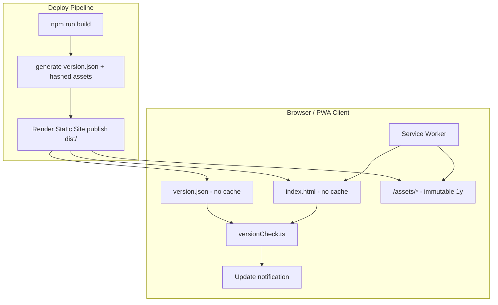
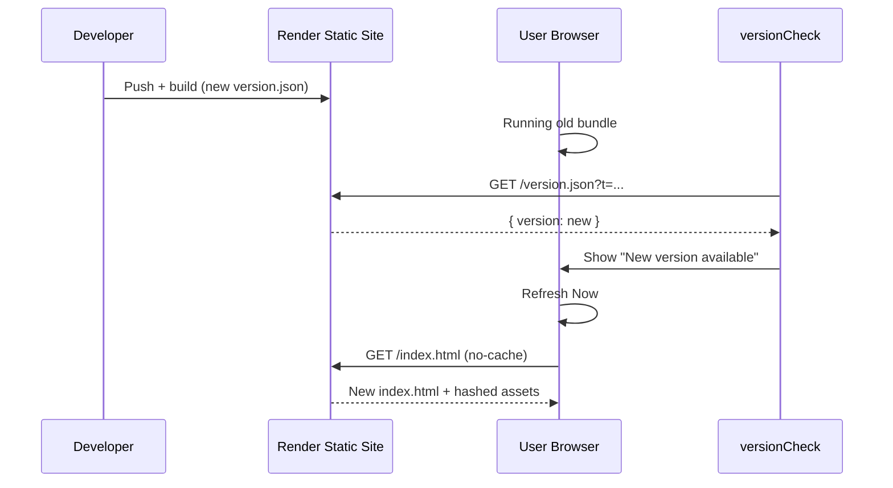

# PBooks Pro Cloud — Cache Strategy & Version Management

**Last updated:** 2026-06-12

This document describes how PBooks Pro Cloud ensures users always receive the latest frontend build after deployment on Render (with optional Cloudflare CDN in front).

---

## Architecture Overview



---

## Audit Summary (pre-upgrade)

| Area | Finding | Resolution |
|------|---------|------------|
| Vite asset hashing | Already configured (`[name]-[hash].js`) | Verified — no change needed |
| `index.html` caching | No explicit cache headers | `public/_headers` — `no-cache` |
| `version.json` | Did not exist | Generated on every build |
| Version check | API `/app-info/version` only; cloud had updates disabled | `services/versionCheck.ts` fetches `/version.json` |
| Service worker | Cache-first for all assets; stale `CACHE_NAME` | Network-only for shell; immutable cache for `/assets/*`; `skipWaiting` + `clientsClaim` |
| PWA plugin | Not used (`vite-plugin-pwa` / Workbox absent) | Custom `sw.js` retained |
| Cloudflare | Website documented; app had no `_headers` | `public/_headers` + guide below |
| About screen | Edition/version only | Build date, environment, API URL added |

---

## Asset Hashing

Vite `rollupOptions.output` (in `vite.config.ts`):

- `assets/[name]-[hash].js`
- `assets/[name]-[hash].[ext]`

**Only** paths matching `/assets/*-<hash>.*` receive long-term caching.

---

## Cache Headers (`public/_headers`)

Copied to `dist/` by Vite static asset pipeline.

| Path | Cache-Control |
|------|---------------|
| `/index.html` | `no-cache, must-revalidate` |
| `/version.json` | `no-cache, must-revalidate` |
| `/manifest.json` | `no-cache, must-revalidate` |
| `/sw.js` | `no-cache, must-revalidate` |
| `/env-config.json` | `no-cache, must-revalidate` |
| `/assets/*` | `public, max-age=31536000, immutable` |

---

## Version File (`version.json`)

Generated during every `vite build` by the `write-deployment-artifacts` plugin.

```json
{
  "version": "2026.06.12.abc1234",
  "buildTime": "2026-06-12T12:00:00.000Z",
  "packageVersion": "1.2.366"
}
```

- **version** — `YYYY.MM.DD.<sequence>` where sequence is `RENDER_GIT_COMMIT` prefix (7 chars) or build minute.
- **buildTime** — ISO-8601 UTC timestamp.
- **packageVersion** — `package.json` semver (informational).

Also injected into the bundle as `import.meta.env.VITE_APP_BUILD_VERSION` and `VITE_APP_BUILD_TIME`.

---

## Client Version Check (`services/versionCheck.ts`)

| Trigger | Behavior |
|---------|----------|
| App startup | Check after 5s delay |
| Background | Every 5 minutes (`300000` ms) |
| Fetch URL | `/version.json?t=<timestamp>` with `cache: 'no-store'` |
| Compare | String equality with embedded `VITE_APP_BUILD_VERSION` |
| On mismatch | Non-blocking toast: **Refresh Now** / **Later** |

Skipped for Electron (`file://`) and offline SQLite (`VITE_LOCAL_ONLY=true`).

---

## Service Worker (`sw.js`)

| Request type | Strategy |
|--------------|----------|
| `index.html`, `version.json`, `manifest.json`, `sw.js` | Network only (`cache: no-store`) |
| `/assets/*-<hash>.*` | Cache-first (immutable) |
| API routes | Not intercepted |
| New deploy | `skipWaiting()` + `clients.claim()`; cache key `pbookspro-<version>` |

---

## Version Update Workflow



---

## Render Deployment Checklist

- [ ] Build command includes `npm run build` with `VITE_LOCAL_ONLY=false` and correct `VITE_API_URL`
- [ ] Publish directory: `dist`
- [ ] `dist/version.json` exists after build and version changes each deploy
- [ ] `dist/assets/*` files include content hashes in filenames
- [ ] `dist/_headers` present (from `public/_headers`)
- [ ] `dist/sw.js` contains deployment-specific cache name (not `__BUILD_CACHE_NAME__`)
- [ ] Old hashed assets in `dist/assets/` are replaced (clean build — Render runs fresh `npm run build`)
- [ ] Smoke test: open `https://app.pbookspro.com/version.json` — must not be cached (check response headers)
- [ ] Smoke test: deploy, keep tab open 5+ min, confirm update notification

---

## Cloudflare Configuration

See [CLOUDFLARE_APP_CACHE.md](./CLOUDFLARE_APP_CACHE.md) for Page Rules / Cache Rules on `app.pbookspro.com`.

---

## Testing

```powershell
npm run test:version-check
```

Covers version comparison logic and cache-bust URL generation for scenarios 1–3.
