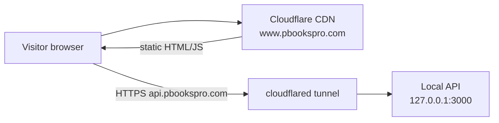

# Cloudflare website + local API

Your setup: **static site on Cloudflare** (`www.pbookspro.com`) and **API running locally** (`localhost:3000`).

Browsers on the public site **cannot** call `localhost`. You need (1) a fresh website deploy and (2) a **public URL** for the API that points at your machine.

---

## Current gap

| Item | Status |
|------|--------|
| Live site content | Often **out of date** vs repo — redeploy `website/dist/` |
| Live `demo-config.js` | May still hardcode `http://localhost:3000/api` — fixed in repo (auto-detect + build override) |
| Public API | Local `:3000` is not reachable from visitors — use **Cloudflare Tunnel** or deploy API to `api.pbookspro.com` |

---

## Step 1 — Enable website funnels on the API

Copy flags from `backend/.env.local.example` into `backend/.env`:

```env
ALLOW_TRIAL_SIGNUP=true
MARKETING_LEADS_ENABLED=true
SUPPORT_TICKETS_ENABLED=true
DEMO_BOOKING_ENABLED=true
```

Rebuild and restart so new routes are loaded:

```powershell
cd "C:\My Projects\PBooksPro -Local DB only"
npm run build:backend
# Stop the old API process, then start again (e.g. npm run dev:api or your usual command)
```

Verify:

```powershell
npm run verify:api
```

Expected: `trial config`, `demo booking config`, and `marketing leads` return **200** (not 401/503).

---

## Step 2 — Expose local API with Cloudflare Tunnel

Install [cloudflared](https://developers.cloudflare.com/cloudflare-one/connections/connect-networks/downloads/) and authenticate:

```powershell
cloudflared tunnel login
```

Create a tunnel (once):

```powershell
cloudflared tunnel create pbookspro-api
```

Add a public hostname in Cloudflare Zero Trust → **Networks → Tunnels → your tunnel → Public Hostname**:

| Field | Value |
|-------|-------|
| Subdomain | `api` |
| Domain | `pbookspro.com` |
| Service type | HTTP |
| URL | `http://127.0.0.1:3000` |

Or use a config file (`%USERPROFILE%\.cloudflared\config.yml`):

```yaml
tunnel: <TUNNEL-UUID>
credentials-file: C:\Users\<you>\.cloudflared\<TUNNEL-UUID>.json

ingress:
  - hostname: api.pbookspro.com
    service: http://127.0.0.1:3000
  - service: http_status:404
```

Run the tunnel (keep this running while the site is live):

```powershell
cloudflared tunnel run pbookspro-api
```

Test from any machine:

```powershell
curl https://api.pbookspro.com/health
curl https://api.pbookspro.com/api/trial/config
```

---

## Step 3 — Build and redeploy the website

Production hostnames (`www.pbookspro.com`) automatically use `https://api.pbookspro.com/api` — no build override needed once the tunnel works.

Optional build-time overrides (staging subdomain, custom API URL):

```powershell
$env:PBBOOKS_API_URL="https://api.pbookspro.com/api"
$env:PBBOOKS_APP_URL="https://app.pbookspro.com"
$env:PBBOOKS_CALENDLY_URL="https://calendly.com/your-team/pbookspro-demo"
$env:PBBOOKS_GTM_ID="GTM-XXXXXXX"
$env:PBBOOKS_GA4_ID="G-XXXXXXXXXX"

npm run build:website
npm run smoke:website
```

Deploy **only** the contents of `website/dist/` to Cloudflare.

### Cloudflare Pages

| Setting | Value |
|---------|-------|
| Build command | `npm run build:website` |
| Build output directory | `website/dist` |
| Root directory | repo root (or set working dir) |

Add build environment variables in Pages → Settings → Environment variables (`PBBOOKS_GTM_ID`, etc.).

### Cloudflare R2 / manual upload

Upload everything inside `website/dist/` and replace the existing site. Ensure `_headers` is deployed (CSP/HSTS).

---

## Step 4 — Staging smoke test (live site)

From `doc/PHASE2_STAGING_CHECKLIST.md`:

1. Open `https://www.pbookspro.com/download.html` — start trial (should redirect via exchange code, not JWT in URL).
2. Open `https://www.pbookspro.com/demo.html` — submit demo request.
3. Open `https://www.pbookspro.com/contact.html` — submit contact form.
4. Open `https://www.pbookspro.com/support.html` — create support ticket.

Watch the local API logs while testing.

---

## Architecture



---

## Troubleshooting

| Symptom | Fix |
|---------|-----|
| Forms fail with network/CORS errors | Tunnel not running or DNS not pointing to tunnel |
| 401 on `/api/trial/config` | Rebuild + restart API (`npm run build:backend`) |
| 503 on `/api/marketing/leads` | Set `MARKETING_LEADS_ENABLED=true` in `backend/.env` |
| Site still calls `localhost` | Redeploy latest `website/dist/`; hard-refresh or purge Cloudflare cache |
| CORS blocked | API must allow `https://www.pbookspro.com` — check backend CORS config |

---

## Production path (when ready)

Replace the tunnel with a hosted API on `api.pbookspro.com` (VPS, Railway, etc.). The website config stays the same — no redeploy required if the hostname is unchanged.
