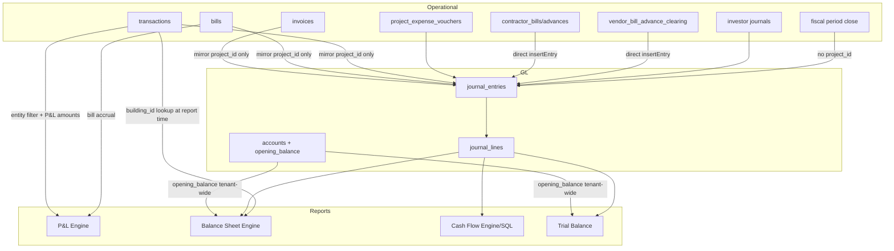

# PBooksPro Financial Statement Audit — Project/Building Filter Validation

**Audit date:** June 14, 2026  
**Scope:** Profit & Loss, Balance Sheet, Cash Flow, Trial Balance  
**Verdict:** Company-wide statements are structurally sound. **Project/building filtered statements are incorrect by design and by implementation gaps** — not merely a bug in one query, but a partial dimension model applied inconsistently across posting, storage, and reporting.

---

## Executive Summary

Filtered financial statements fail for three overlapping reasons:

1. **Incomplete GL dimensions** — Only `project_id` exists on `journal_lines` / `journal_entries`. There is no `building_id` or `cost_center_id` on the GL. Building scope is inferred at report time from linked `transactions`, which misses invoice/bill mirrors, manual journals, contractor billing, fiscal close, and investor entries.

2. **Opening balances are tenant-wide** — `accounts.opening_balance` has no project/building allocation. Scoped reports deliberately exclude opening balances, which breaks `Assets = Liabilities + Equity` for filtered views.

3. **Inconsistent filter application** — P&L filters operational data (transactions + bills). Balance Sheet filters journal lines with runtime fallbacks. Cash Flow API uses SQL scope that differs from the local transaction engine. Trial Balance API has **no entity filter at all**.

---

## 1. Database Layer — Tables & Dimensions

### Dependency map (transaction → GL → reports)



### Dimension column matrix

| Table | tenant_id | project_id | building_id | cost_center_id | organization_id |
|-------|-----------|------------|-------------|----------------|-----------------|
| **journal_entries** | ✓ | ✓ (042) | ✗ | ✗ | ✗ (use tenant_id) |
| **journal_lines** | via JE | ✓ (041) | ✗ | ✗ | ✗ |
| **accounts** | ✓ | ✗ | ✗ | ✗ | ✗ |
| **transactions** | ✓ | ✓ | ✓ | ✗ | ✗ |
| **invoices** | ✓ | ✓ | ✓ | ✗ | ✗ |
| **bills** | ✓ | ✓ | ✓ | ✗ | ✗ |
| **contracts** | ✓ | ✓ (FK) | ✗ | ✗ | ✗ |
| **project_expense_vouchers** | ✓ | ✓ | ✗ | ✗ | ✗ |
| **contractor_bills/advances** | ✓ | ✓ | ✗ | ✗ | ✗ |
| **payroll_departments** | ✓ | ✗ | ✗ | cost_center_code (TEXT) | ✗ |
| **unposted_transactions** | ✓ | ✓ | ✗ | cost_center_code (TEXT) | ✗ |

**Not in PostgreSQL migrations:** dedicated `receipts`, `payments`, `inventory`, `fixed_assets`, or `cost_centers` tables. Receipts/payments are `transactions` rows. Opening balances live on `accounts.opening_balance` (migration `038`), not as journal entries.

**Key migrations:**

- `database/migrations/041_journal_lines_project_id.sql`
- `database/migrations/042_journal_entries_investor_metadata.sql`
- `database/migrations/038_accounts_opening_balance.sql`
- `database/migrations/034_accounts_balance_sheet_tags.sql`
- `database/migrations/035_pl_category_mapping.sql`
- `database/migrations/036_cashflow_category_mapping.sql`

### Schema definition file paths

| Path | Role |
|------|------|
| `database/migrations/*.sql` | Canonical PostgreSQL schema |
| `services/database/schema.ts` | SQLite offline client DDL |
| `electron/schema.sql` | Electron SQLite bootstrap |
| `shared/financial-core/types.ts` | Journal entry/line TypeScript types |
| `shared/financial-core/journalEngine.ts` | GL write path |
| `shared/financial-core/journalLedgerCore.ts` | GL balance / scope logic |
| `shared/financial-core/ledgerReports.ts` | GL report queries |
| `shared/financial-core/trialBalanceCore.ts` | Trial balance + opening equity |
| `backend/src/modules/accounting/repositories/JournalRepository.ts` | PostgreSQL journal CRUD |
| `backend/src/modules/accounting/repositories/AccountRepository.ts` | Chart of accounts + opening balance |
| `backend/src/services/transactionJournalPostingService.ts` | Mirrors transactions → journal |

---

## 2. General Ledger Audit — Posting Sources

### Dimension propagation matrix

| Posting source | File | Via FPS? | project_id | building_id | cost_center |
|----------------|------|----------|------------|-------------|-------------|
| Receipts / payments / transfers | `transactionJournalPostingService.ts` | Yes | ✓ | **Dropped** | N/A |
| Invoices (AR mirror) | `invoiceJournalPostingService.ts` | Yes | ✓ | **Dropped** | N/A |
| Bills (AP mirror) | `billJournalPostingService.ts` | Yes | ✓ | **Dropped** | N/A |
| Project expense vouchers | `pevJournalPostingService.ts` | Yes | ✓ | N/A | N/A |
| Manual journal vouchers | `journalRoutes.ts` | Yes | If client sends | No API field | N/A |
| Investor journals | `investorJournalPostingService.ts` | Yes | ✓ required | ✗ | N/A |
| Contractor advance/bill | `contractorBillingService.ts` | **Bypass** | ✓ | ✗ | N/A |
| Vendor advance settlement | `vendorBillAdvanceSettleService.ts` | **Bypass** | ✓ | **Dropped** | N/A |
| Fiscal period close | `fiscalPeriodCloseService.ts` | Yes | **Dropped** | ✗ | N/A |
| Opening balances | `trialBalanceCore.ts` | N/A (not JE) | N/A | N/A | N/A |
| Payroll | — | **No GL integration** | ✗ | ✗ | ✗ |
| Inventory / fixed assets | — | **No GL posting** | ✗ | ✗ | ✗ |

### Gateway architecture

- **Gateway:** `backend/src/modules/accounting/services/FinancialPostingService.ts`
- **Persistence:** `backend/src/modules/accounting/repositories/JournalRepository.ts` → `insertEntry()` → `persistEntryRow()` + `persistLines()`

### Direct `JournalRepository.insertEntry` bypasses (not through FPS)

| File | Functions | Gap |
|------|-----------|-----|
| `contractorBillingService.ts` | `createContractorAdvance`, `approveContractorBill` | Skips period-lock gateway + `emitFinancialPosted` |
| `vendorBillAdvanceSettleService.ts` | settlement loop | Same |
| `journalService.ts` | `insertJournalEntry` / `createJournalEntry` | Thin wrapper |
| `vendorBillAdvanceSettlementReverseService.ts` | `reverseVendorBillAdvanceSettlement` | Uses repo, not `FPS.reverseJournal` |

### Evidence — project only, building dropped at posting

`transactionJournalPostingService.ts` only maps `project_id`:

```typescript
function txProjectId(row: TransactionRow): string | null {
  const p = row.project_id;
  return p != null && String(p).trim() !== '' ? String(p).trim() : null;
}
// ...
const projectId = txProjectId(row);
// lines: { accountId, debitAmount, creditAmount, projectId }
```

`billJournalPostingService.ts` — same pattern; `BillRow.building_id` never read.

### Report workaround (not stored on GL)

`shared/financial-core/journalLedgerCore.ts` resolves **building** only when `journal_entries.source_module = 'transaction'` by looking up `transactions.building_id` via `source_id`. Journal entries from PEV, contractor billing, period close, vendor advance settlement, etc. have **no building_id path** unless inferred indirectly.

---

## 3. Profit & Loss Audit

### Data path

1. `computeProjectProfitLossTotals()` in `components/reports/projectProfitLossComputation.ts`
2. Bill accrual (`runPlBillAccrual`) — filtered by project/building on bill fields
3. Transaction loop — filtered via `transactionMatchesFinancialEntityScope()`
4. When journal ledger is loaded (API always), only mirrored transactions are included (`requireJournalMirror: true`)

### Core files

| Path | Role |
|------|------|
| `components/reports/profitLossEngine.ts` | IFRS-style layout |
| `components/reports/projectProfitLossComputation.ts` | Single source of amounts |
| `backend/src/services/profitLossReportService.ts` | API service |
| `backend/src/modules/accounting/routes/profitLossRoutes.ts` | `GET /api/reports/profit-loss` |
| `components/reports/financialEntityScope.ts` | Unified project/building scope |

### Filter behavior

| Filter | Expected | Actual |
|--------|----------|--------|
| Project A | Revenue(A) − Expenses(A) | ✓ Mostly correct for tagged transactions/bills |
| Building B | Revenue(B) − Expenses(B) | ✓ On operational data; bill building resolved via property |
| Consolidated | All company P&L | **Excludes unscoped transactions** (no project AND no building) |

Consolidated exclusion logic in `projectProfitLossComputation.ts`:

```typescript
} else if (!projectId && !buildingId) {
    return;
}
```

### P&L issues

| Issue | Root cause | Severity |
|-------|------------|----------|
| Company overhead missing from consolidated P&L | Unscoped transactions dropped when filter = `all` | **High** |
| Bill accrual vs payment double-count risk | Mitigated by `processedBills` set, but scope must match on both legs | Medium |
| Journal mirror requirement | Non-mirrored transactions excluded when `requireJournalMirror: true` | Medium |
| Building on bill-only expense (no payment tx) | Bill accrual uses `bill.buildingId`; journal mirror has no building | Low (P&L uses bills, not journal) |

### Diagnostic SQL — P&L revenue by project (operational)

```sql
-- Compare P&L income transactions vs journal mirror for a project
SELECT
  t.project_id,
  SUM(CASE WHEN t.type = 'Income' THEN t.amount ELSE 0 END) AS tx_income,
  COUNT(*) FILTER (WHERE t.type = 'Income') AS tx_count
FROM transactions t
WHERE t.tenant_id = $1
  AND t.deleted_at IS NULL
  AND t.date BETWEEN $2 AND $3
  AND t.project_id = $4
GROUP BY t.project_id;

-- Journal mirror check: income lines with project attribution
SELECT
  COALESCE(jl.project_id, je.project_id) AS project_id,
  SUM(jl.credit_amount - jl.debit_amount) AS net_pl_effect
FROM journal_lines jl
JOIN journal_entries je ON je.id = jl.journal_entry_id
JOIN accounts a ON a.id = jl.account_id
WHERE je.tenant_id = $1
  AND je.entry_date BETWEEN $2 AND $3
  AND a.id IN ('sys-acc-income-summary', 'sys-acc-expense-summary')
  AND COALESCE(jl.project_id, je.project_id) = $4
GROUP BY 1;
```

---

## 4. Balance Sheet Audit

### Calculation path (journal mode — API default)

1. `computeAccountBalancesFromJournal()` — scoped journal aggregation
2. Opening balances merged **only when consolidated**
3. Retained earnings = cumulative P&L from `2000-01-01` through as-of date, scoped
4. Synthetic "Current Year Earnings" gap line when summary accounts absent

### Core files

| Path | Role |
|------|------|
| `components/reports/balanceSheetEngine.ts` | Main engine |
| `backend/src/services/balanceSheetReportService.ts` | API service |
| `backend/src/modules/accounting/routes/balanceSheetRoutes.ts` | `GET /api/reports/balance-sheet` |

### Opening balance handling (critical)

In `shared/financial-core/journalLedgerCore.ts`:

```typescript
/** Opening balances are tenant-wide; exclude on project/building-scoped reports. */
if (!isJournalEntityScopeActive(options)) {
  for (const acc of input.accounts) {
    const ob = roundMoney(Number(acc.openingBalance ?? 0));
    // ... merges opening_balance into account balances
  }
}
```

Synthetic Opening Balance Equity is also consolidated-only in `balanceSheetEngine.ts`:

```typescript
/** Journal: offset bank/cash opening_balance with synthetic equity (consolidated only). */
if (useJournal && !scopeTargetsProject(entityScope) && !scopeTargetsBuilding(entityScope)) {
  // ... adds OPENING_BALANCE_EQUITY_ID line
}
```

### Why filtered BS cannot balance

For Project A:

| Component | Scoped? | Problem |
|-----------|---------|---------|
| Bank/Cash opening balance | ✗ Excluded | Cash asset starts at 0, but P&L shows project profit |
| AR from invoices | Partial | Invoice mirror has `project_id`; payment tx may share bank account |
| AP from bills | Partial | Same as AR |
| Retained earnings | ✓ Scoped cumulative P&L | Correct for P&L activity only |
| Share capital / loans | ✗ Not dimensioned | Whole-company balances appear or disappear inconsistently |
| Shared bank accounts | ✗ | All project payments hit same bank GL account |

**Expected result:** `Assets ≠ Liabilities + Equity` for project/building filters. The engine may emit `EQUATION_IMBALANCE` validation warnings — this is a **conceptual limitation**, not just a bug.

### Account classification for filtering

| Account type | Realistic project filter? | Recommendation |
|--------------|---------------------------|----------------|
| Project revenue / expense (clearing → summary) | ✓ Yes | Filter by `journal_lines.project_id` |
| AR / AP on project invoices/bills | ✓ Partial | Filter by source document project |
| Bank / Cash | ✗ Shared resource | **Never filter** OR allocate by % / dedicated sub-accounts |
| Inventory (units memo) | ✓ Project units only | Already scoped in engine |
| Fixed assets | ✗ No GL module | N/A |
| Retained earnings | ✗ Company-level | Show as "Project Net Position" not retained earnings |
| Share capital | ✗ Company-level | Exclude from project BS |
| Opening Balance Equity | ✗ Tenant-wide | Exclude from project BS (current behavior) |

---

## 5. Cash Flow Statement Audit

### Two engines (same UI, different results)

| Mode | Engine | Data source |
|------|--------|-------------|
| Local SQLite | `components/reports/cashFlowEngine.ts` | Transactions (IAS 7 direct method) |
| LAN/API | `backend/src/services/cashFlowJournalReportService.ts` | Journal lines on Bank/Cash accounts only |

### Building filter — SQL limitation

In `cashFlowJournalReportService.ts`, building scope requires `source_module='transaction'`:

```sql
AND EXISTS (
  SELECT 1 FROM journal_entries je_scope
  INNER JOIN transactions t_scope ON t_scope.id = je_scope.source_id
    AND je_scope.source_module = 'transaction'
  WHERE je_scope.id = jl.journal_entry_id AND t_scope.building_id = $n
)
```

**Invisible in building-scoped cash flow:**

- Manual journal vouchers affecting bank
- Invoice/bill posting entries (source_module = `bill` / `invoice`)
- Contractor billing entries
- Investor equity movements
- Fiscal close entries

### Project filter — partial COALESCE chain

Project filter uses `jl.project_id → je.project_id → t.project_id` (transaction source only). Invoice/bill mirrors with `project_id` on the entry but not the cash leg may still match if entry-level project is set — but **building filter has no equivalent fallback for bills/invoices**.

### Cash flow reconciliation

API reconciles opening + net change = closing on **scoped** journal cash lines. Because opening cash excludes tenant opening balances for scoped views, **negative opening cash** is possible (`flags.negative_opening_cash`).

---

## 6. Trial Balance Verification

### Current state

| Path | Entity filter | Balanced? |
|------|---------------|-----------|
| API `GET /api/reports/trial-balance` | **None** — tenant-wide only | ✓ Debits = Credits (by design) |
| UI with project/building filter | Transaction fallback (`trialBalanceFromTransactions.ts`) | ✗ Often unbalanced |
| Journal TB with scope (client) | `buildTrialBalanceFromJournal()` skips opening balances | ✗ Unbalanced for scoped views |

`trialBalanceRoutes.ts` accepts only `from`, `to`, `basis` — no `projectId` or `buildingId`.

`JournalRepository.aggregateTrialBalanceRows()` has no dimension SQL — tenant-wide `GROUP BY account_id` only.

### Diagnostic queries

**1. Tenant-wide TB balance check (should always balance)**

```sql
SELECT
  COALESCE(SUM(jl.debit_amount), 0) AS total_debits,
  COALESCE(SUM(jl.credit_amount), 0) AS total_credits,
  COALESCE(SUM(jl.debit_amount), 0) - COALESCE(SUM(jl.credit_amount), 0) AS diff
FROM journal_lines jl
JOIN journal_entries je ON je.id = jl.journal_entry_id
WHERE je.tenant_id = $1
  AND je.entry_date <= $2;
```

**2. Project-scoped TB (current journal model — will NOT balance if shared accounts used)**

```sql
WITH scoped_lines AS (
  SELECT jl.*
  FROM journal_lines jl
  JOIN journal_entries je ON je.id = jl.journal_entry_id
  LEFT JOIN transactions t ON t.id = je.source_id AND je.source_module = 'transaction'
  WHERE je.tenant_id = $1
    AND je.entry_date BETWEEN $2 AND $3
    AND COALESCE(
      NULLIF(TRIM(jl.project_id), ''),
      NULLIF(TRIM(je.project_id), ''),
      CASE WHEN je.source_module = 'transaction' THEN NULLIF(TRIM(t.project_id), '') END
    ) = $4
)
SELECT
  SUM(debit_amount) AS debits,
  SUM(credit_amount) AS credits,
  SUM(debit_amount) - SUM(credit_amount) AS imbalance
FROM scoped_lines;
```

**3. Find journal entries missing project attribution**

```sql
SELECT je.source_module, COUNT(*) AS cnt
FROM journal_entries je
LEFT JOIN journal_lines jl ON jl.journal_entry_id = je.id
WHERE je.tenant_id = $1
  AND COALESCE(jl.project_id, je.project_id) IS NULL
GROUP BY je.source_module
ORDER BY cnt DESC;
```

**4. Building filter blind spots**

```sql
-- Journal entries with building on source bill/invoice but no transaction link
SELECT je.id, je.source_module, je.source_id, b.building_id
FROM journal_entries je
JOIN bills b ON b.id = je.source_id AND je.source_module = 'bill'
WHERE je.tenant_id = $1
  AND b.building_id = $2
  AND NOT EXISTS (
    SELECT 1 FROM transactions t
    WHERE t.bill_id = b.id AND t.building_id = b.building_id
  );
```

---

## 7. Financial Reporting Design Review

### Conceptual correctness

**Project-wise P&L** — Valid accounting concept (project profitability / job costing). Current implementation is **mostly workable** for construction/real-estate project tagging.

**Project-wise Balance Sheet** — **Not a standard GAAP/IFRS balance sheet** unless:

- Each project has dedicated bank sub-accounts
- AR/AP are project-specific
- Equity is allocated (investor module partially supports this)
- Opening balances are allocated to projects

What users likely want vs what accounting allows:

| User expectation | Accounting reality | Current system |
|------------------|-------------------|----------------|
| "Project A balance sheet" | Segment reporting / project net position | Partial journal filter + no opening balances |
| "Building B cash flow" | Property-level cash tracking | Only transaction-linked bank movements |
| "Trial balance for Project A" | Must still balance double-entry | **Does not balance** when scoped |

### Account classification

**Project-specific (should be filtered):**

- Project revenue & direct expenses (P&L categories)
- Project bills / invoices (AP/AR accruals)
- Project expense vouchers
- Contractor billing
- Investor equity per project

**Company-level (should NOT be filtered, or shown separately):**

- Retained earnings / share capital
- Corporate tax
- Head office expenses (unless tagged)
- General bank accounts (unless sub-ledger per project)
- Opening balances
- Fiscal close entries

**Optionally allocated:**

- Shared bank account balances (by payment allocation %)
- Payroll (via cost_center_code — not wired to GL)
- Overhead allocation to projects

---

## 8. Root Cause Analysis — Issue Register

| # | Issue | Root cause | Affected reports | Severity | Recommended fix |
|---|-------|------------|------------------|----------|-----------------|
| 1 | Filtered BS doesn't balance | Opening balances tenant-wide, excluded from scope; shared bank/AR/AP | Balance Sheet | **Critical** | Rename to "Project Net Position"; don't claim GAAP BS; OR allocate opening balances |
| 2 | building_id lost at GL posting | No column on journal tables; not copied from source docs | BS, CF, TB (building) | **Critical** | Migration: `journal_lines.building_id`; propagate in all posting services |
| 3 | Building CF misses non-transaction entries | `entityScopeJournalSql` requires `source_module='transaction'` | Cash Flow (API) | **High** | Store building_id on journal lines; update SQL scope |
| 4 | TB API has no entity filter | Route/service never accept projectId/buildingId | Trial Balance | **High** | Add scoped TB endpoint using dimension-aware aggregation |
| 5 | Entity-scoped TB uses transaction fallback | Journal lines not fully tagged; opening balances skipped | Trial Balance (UI) | **High** | Fix GL dimensions first, then journal-scoped TB |
| 6 | Consolidated P&L excludes overhead | `!projectId && !buildingId → return` | P&L (consolidated) | **High** | Include unscoped txs in consolidated view |
| 7 | CF API vs local engine divergence | Two separate implementations | Cash Flow | **High** | Unify on journal-based engine with shared scope helper |
| 8 | Invoice/bill mirrors drop building_id | Posting services only pass projectId | BS, CF (building) | **High** | Propagate building_id at posting |
| 9 | Fiscal close strips dimensions | `consolidateJournalLines()` merges by accountId only | BS, TB (project) | **Medium** | Post closing entries per project OR exclude from project reports |
| 10 | Contractor/vendor settlement bypass FPS | Direct `JournalRepository.insertEntry` | All GL reports | **Medium** | Route through FinancialPostingService; add dimensions |
| 11 | No cost_center_id on GL | Schema gap; payroll not integrated | All | **Medium** | Add cost_center_id column + payroll GL posting |
| 12 | SQLite schema lags PostgreSQL | `journal_entries.project_id` missing locally | Local reports | **Medium** | Align SQLite schema with PG migrations |
| 13 | Payroll has no journal integration | No posting path | P&L, BS | **Medium** | Post payroll to GL with project/cost center |
| 14 | No inventory/fixed asset GL | No modules | BS, CF | **Low** | Future modules with dimensions from day one |

---

## 9. Recommended Architecture — Dimension Framework

### Phase 1 — Schema (migration `121_journal_dimensions.sql`)

```sql
ALTER TABLE journal_lines ADD COLUMN IF NOT EXISTS building_id TEXT;
ALTER TABLE journal_lines ADD COLUMN IF NOT EXISTS cost_center_id TEXT;
ALTER TABLE journal_entries ADD COLUMN IF NOT EXISTS building_id TEXT;

CREATE INDEX idx_journal_lines_tenant_building ON journal_lines (building_id)
  WHERE building_id IS NOT NULL;
CREATE INDEX idx_journal_lines_tenant_project ON journal_lines (project_id)
  WHERE project_id IS NOT NULL;
```

Optional: `opening_balance_allocations(tenant_id, account_id, project_id, building_id, amount)`.

### Phase 2 — Posting (single propagation helper)

```typescript
// shared/financial-core/journalDimensions.ts
export function resolveJournalDimensions(source: {
  projectId?: string | null;
  buildingId?: string | null;
  costCenterId?: string | null;
}): { projectId: string | null; buildingId: string | null; costCenterId: string | null }
```

Apply in every posting service and `FinancialPostingService.postJournal()`.

### Phase 3 — Unified scope query

Replace scattered `journalLineMatchesEntityScope` / `entityScopeJournalSql` with one module:

```typescript
// shared/financial-core/dimensionScope.ts
export function buildJournalScopeSql(options: DimensionScopeOptions): { sql: string; params: unknown[] }
export function journalLineMatchesScope(line, entry, options, lookups): boolean
```

Rules:

- Line dimensions override entry dimensions
- Fallback to source document lookup table (transactions, bills, invoices) cached at report load
- **Never** infer building only from transactions when source is bill/invoice

### Phase 4 — Report semantics

| Report | Consolidated | Project/Building scoped |
|--------|--------------|-------------------------|
| P&L | Full company incl. overhead | Project profitability |
| Balance Sheet | GAAP balance sheet | **"Project Financial Position"** — not labeled "Balance Sheet" |
| Cash Flow | IAS 7 statement | Project/building cash activity |
| Trial Balance | Standard TB | Dimension TB with explicit imbalance warning if shared accounts present |

### Phase 5 — Opening balance strategy (pick one)

**Option A — Exclude from scoped reports (current):** Document clearly; show "Activity-only position."

**Option B — Allocation table:** Admin allocates opening balances to projects/buildings; must sum to account total.

**Option C — Sub-ledger accounts:** Separate bank account per project (operational fix, no schema change).

---

## 10. Deliverables

### 10.1 Incorrect / incomplete SQL queries

| Location | Problem |
|----------|---------|
| `JournalRepository.aggregateTrialBalanceRows()` | No project/building filter |
| `cashFlowJournalReportService.entityScopeJournalSql()` — building branch | Only `source_module='transaction'` |
| `cashFlowJournalReportService.sumCashBalanceThrough()` | Same building limitation; no opening balance for scope |
| Trial Balance API route | No scope parameters at all |

### 10.2 Missing ProjectId/BuildingId propagation points

1. `transactionJournalPostingService.ts` — building_id
2. `invoiceJournalPostingService.ts` — building_id
3. `billJournalPostingService.ts` — building_id
4. `vendorBillAdvanceSettleService.ts` — building_id
5. `fiscalPeriodCloseService.ts` — project_id (closing entries)
6. `contractorBillingService.ts` — building_id (if added to schema)
7. Manual journal API — building_id, cost_center_id fields
8. Payroll module — entire GL path missing
9. `shared/financial-core/journalEngine.ts` (SQLite) — entry-level project_id

### 10.3 Recommended code fixes (priority order)

1. Add `building_id` to journal schema + all posting services
2. Unify `journalLineMatchesEntityScope` and `entityScopeJournalSql` into shared module
3. Fix consolidated P&L to include unscoped transactions
4. Add `projectId`/`buildingId` to Trial Balance API + repository SQL
5. Route contractor/vendor settlement through `FinancialPostingService`
6. Align cash flow: deprecate dual engines; use one journal-based path
7. UI: relabel scoped Balance Sheet → "Project Financial Position" with disclaimer
8. Add opening balance allocation (if product requires true project BS)

### 10.4 Database schema improvements

- `journal_lines.building_id`, `journal_lines.cost_center_id`
- `journal_entries.building_id`
- Optional `dimension_allocations` for opening balances
- `cost_centers` reference table (replace free-text `cost_center_code`)
- Indexes on `(tenant_id, project_id)`, `(tenant_id, building_id)` on journal_lines

### 10.5 Performance impact assessment

| Change | Impact |
|--------|--------|
| Add columns to journal_lines | Low — nullable, backfill async |
| Scope SQL with EXISTS on transactions | **Medium** — already used in CF; add indexes on `transactions(building_id)`, `journal_entries(source_module, source_id)` |
| Backfill building_id on historical lines | One-time batch job; ~O(entries) |
| Dimension-aware TB GROUP BY | Similar to current aggregate; filter reduces row count |
| Report load (full state) | Unchanged — in-memory filtering already loads all journal lines |

Recommended index additions:

```sql
CREATE INDEX idx_journal_entries_source ON journal_entries (tenant_id, source_module, source_id);
CREATE INDEX idx_transactions_building ON transactions (tenant_id, building_id) WHERE building_id IS NOT NULL;
```

### 10.6 Automated test cases

Existing tests (`tests/balanceSheetEngine.test.ts`, `tests/cashFlowEngine.test.ts`) cover project filters with **synthetic balanced data**. **Missing tests:**

```typescript
// tests/dimensionReporting.test.ts (recommended)

describe('Dimension integrity', () => {
  it('tenant-wide trial balance: debits equal credits');
  it('project-scoped P&L: excludes other project transactions');
  it('project-scoped P&L consolidated: includes unscoped overhead');
  it('project-scoped BS: documents equation imbalance when opening balance excluded');
  it('building-scoped CF API: includes bill-posted bank entries after building_id fix');
  it('posting: transaction with building_id propagates to all journal lines');
  it('posting: invoice mirror propagates building_id from invoice row');
  it('TB API with projectId: debits equal credits when no shared accounts');
  it('cross-report: scoped P&L net profit matches BS equity change line');
});
```

---

## Implementation Roadmap

| Phase | Duration | Deliverable |
|-------|----------|-------------|
| **0 — Document** | 1 week | UI disclaimers on scoped BS/CF/TB; fix consolidated P&L overhead exclusion |
| **1 — Schema + posting** | 2–3 weeks | `building_id` on journal; propagate all posting sources; backfill script |
| **2 — Unified scope** | 1–2 weeks | Single dimension scope module; fix CF SQL; TB API filters |
| **3 — Report semantics** | 1 week | Rename scoped BS; reconciliation checks between P&L and position report |
| **4 — Opening balances** | 2–4 weeks | Allocation UI + table (if required) |
| **5 — Cost center + payroll** | 4+ weeks | cost_centers table; payroll GL integration |

---

## Conclusion

Project/building filtered reports are incorrect because **PBooksPro implements partial dimensional tagging**: `project_id` on some GL lines, `building_id` only on operational tables, opening balances at company level, and **inconsistent filter logic** across P&L (transactions), Balance Sheet (journal + fallbacks), Cash Flow (two engines), and Trial Balance (no API filter).

Company-wide statements work because the full journal ledger balances and opening balances are included. Scoped statements mix filtered activity with unfiltered structural accounts (or exclude structural accounts entirely), which **cannot satisfy** `Assets = Liabilities + Equity` without dimensional allocation of opening balances and shared balance sheet accounts.

The fastest user-visible improvement is **Phase 0** (P&L overhead fix + UI disclaimers). The durable fix is **Phase 1–2** (store and query `building_id` on every journal line, unify scope logic). True project balance sheets require **Phase 4** (opening balance allocation) or dedicated sub-accounts per project.

---

## API Endpoints Reference

| Report | Endpoint | Service |
|--------|----------|---------|
| P&L | `GET /api/reports/profit-loss?from=&to=&projectId=&buildingId=` | `profitLossReportService.ts` |
| Balance Sheet | `GET /api/reports/balance-sheet?date=&projectId=&buildingId=` | `balanceSheetReportService.ts` |
| Cash Flow | `GET /api/reports/cash-flow?from=&to=&projectId=&buildingId=` | `cashFlowReportService.ts` → `cashFlowJournalReportService.ts` |
| Trial Balance | `GET /api/reports/trial-balance?from=&to=&basis=` | `trialBalanceReportService.ts` |
| Reconciliation | `GET /api/reports/reconciliation/certification?from=&to=&projectId=` | `financialReconciliationService.ts` |

Client wrapper: `services/api/financialReportsApi.ts`
