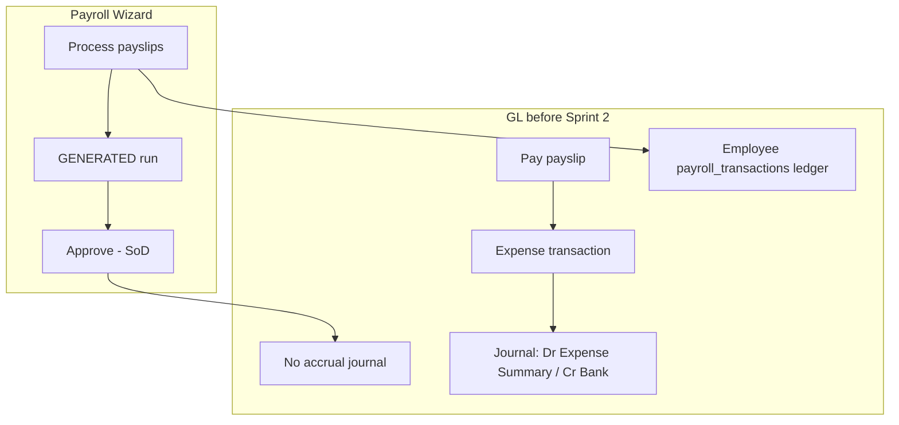
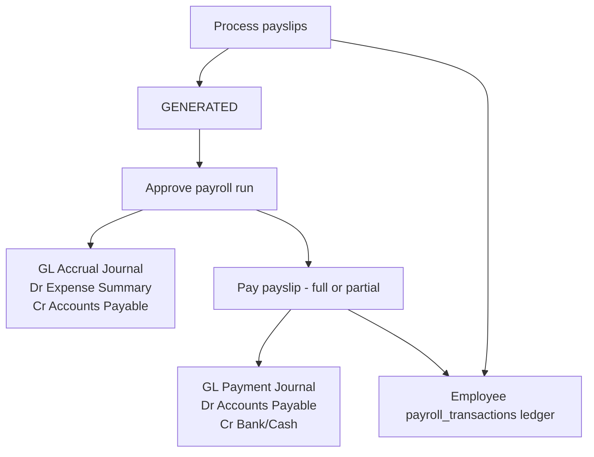

# Payroll Accounting Verification — Sprint 2

**Document ID:** PAYROLL-ACCT-001  
**Policy:** Option A — accrual on **payroll approval**  
**Last updated:** 2026-06-22  

---

## A. Current accounting flow (before Sprint 2)

**Problem:** Expense was recognized only at **payment**, not at approval. No Payroll Payable balance. AP not used for payroll.

---

## B. Accrual design (Option A — implemented)

### Policy decision: **Option A (Approve)**

| | Option A — Approve | Option B — Generate |
|--|-------------------|---------------------|
| **When expense recognized** | When run is independently approved | When payslips are processed |
| **Accounting correctness** | Expense matches management approval; liability until paid | Expense before formal approval |
| **Reversal complexity** | Unapprove reverses accrual (if unpaid) | Must reverse on unprocess/edit |
| **Reporting** | P&L reflects approved payroll only | P&L may include unapproved runs |

**Recommendation:** **Option A** — aligns with SoD approval gate and matches vendor bill pattern (accrue on approval/issue, settle on payment).

### Target flow (after Sprint 2)

### Journal reference storage (no schema migration)

| Field | Storage |
|-------|---------|
| `payroll_run_id` | `journal_entries.source_id` |
| `source_module` | `payroll_run` |
| Period | `journal_entries.description` + run `month`/`year` |
| Approval user | `journal_entries.created_by` |
| Posting timestamp | `journal_entries.created_at` |
| Duplicate prevention | `findActivePayrollRunAccrualJournalId` — skip if active non-reversed entry exists |

---

## C. Journal entry examples

**Assumptions:** June 2026 payroll approved; total net payroll **PKR 500,000**; default category/project from Payroll Settings.

### 1. On approval (accrual)

| Account | Debit | Credit |
|---------|------:|-------:|
| Expense Summary (`sys-acc-expense-summary`) | 500,000 | |
| Accounts Payable (`sys-acc-ap`) | | 500,000 |

Reference: `PAYROLL:pr_<runId>`  
Description: `Payroll accrual — June 2026`

### 2. On full payment (one employee, net 50,000)

| Account | Debit | Credit |
|---------|------:|-------:|
| Accounts Payable | 50,000 | |
| Bank — selected payment account | | 50,000 |

Source: `transaction` module mirror for expense linked to `payslip_id`.

### 3. Partial payment (30,000 of 50,000 net)

Same pattern; **Dr AP 30,000 / Cr Bank 30,000**. Remaining AP 20,000 until further payment. Employee ledger shows payable balance.

### 4. Advance recovery

Overpayment creates employee **advance** (credit balance) in `payroll_transactions` ledger; subsequent payslip payment may apply advance in `PaySalaryModal` — GL still **Dr AP / Cr Bank** for cash outflow; advance logic remains in employee sub-ledger.

### 5. Unapprove (no payments recorded)

Reverse accrual journal:

| Account | Debit | Credit |
|---------|------:|-------:|
| Accounts Payable | 500,000 | |
| Expense Summary | | 500,000 |

Blocked if any payslip has `paid_amount > 0`.

---

## D. Files changed

| File | Change |
|------|--------|
| `backend/src/modules/payroll/services/payroll/payrollJournalPostingService.ts` | **New** — accrual build/post/reverse |
| `backend/src/modules/payroll-attendance/attendanceSummary.service.ts` | Post accrual on approve; reverse on unapprove; require payslips |
| `backend/src/modules/accounting/services/transactionJournalPostingService.ts` | Payslip payments **Dr AP** (not expense) |
| `backend/src/modules/accounting/services/FinancialPostingService.ts` | Payroll accrual reverse helper |
| `backend/src/services/payrollJournalPosting.test.ts` | **New** unit tests |
| `backend/src/services/transactionJournalPosting.test.ts` | Payslip settlement test |
| `components/payroll/settings/GLDefaultsSettings.tsx` | Accrual/settlement help text |

---

## E. Test cases (finance verification)

| ID | Scenario | Steps | Expected GL |
|----|----------|-------|-------------|
| ACCT-01 | Full accrual on approve | Wizard → process → approve (approver) | One `payroll_run` journal; Dr Expense = run total; Cr AP = run total |
| ACCT-02 | Duplicate approve | Approve same run twice (retry) | Second call idempotent; no duplicate accrual |
| ACCT-03 | Full payment | Pay one payslip in full | Dr AP / Cr Bank = payment amount; **no** second expense debit |
| ACCT-04 | Partial payment | Pay 40% of net | Dr AP / Cr Bank = partial; employee ledger remaining payable |
| ACCT-05 | Bulk pay | Bulk pay multiple payslips | Sum of AP debits = sum of payments |
| ACCT-06 | Unapprove | Unapprove with zero payments | Accrual reversed; AP and expense net to zero for run |
| ACCT-07 | Unapprove blocked | Pay then unapprove | 403 — cannot unapprove |
| ACCT-08 | Approve without payslips | Approve GENERATED run with 0 payslips | 400 validation error |
| ACCT-09 | Trial balance | After approve + partial pays | AP balance = accrual − payments posted |
| ACCT-10 | Audit | Approve run | `payroll.run.approved` + `payroll.run.accrual_posted` in audit log |

---

## F. Reversal impact analysis

| Event | Payroll status | Payments | Accrual GL | Payment GL | Action |
|-------|----------------|----------|------------|------------|--------|
| **Unapprove** | APPROVED → GENERATED | None | Reversed | — | Supported |
| **Reverse approved** (future) | APPROVED → void/reversed | None | Reverse accrual | — | Use unapprove today |
| **Reverse approved** | APPROVED | Some paid | Accrual + payments | Must reverse payments first | Block unapprove; reverse txs in Accounting |
| **Paid payroll reverse** | PAID | All paid | Accrual remains | Reverse each payment tx | Manual payment reversal + finance review |
| **Void payslip** | APPROVED | Unpaid | Accrual unchanged* | — | *Future: adjust accrual if payslip removed post-approve |

---

## G. Finance sign-off report (template)

| Check | Result | Sign-off |
|-------|--------|----------|
| Accrual posts on independent approval | Pass / Fail | |
| Expense not duplicated on payment | Pass / Fail | |
| AP balance reconciles to unpaid payroll | Pass / Fail | |
| Partial payments reduce AP correctly | Pass / Fail | |
| Unapprove reverses accrual when unpaid | Pass / Fail | |
| Employee ledger matches payment history | Pass / Fail | |
| Category/project dimensions on accrual | Pass / Fail | |

**Finance lead:** _________________ **Date:** _________

---

## H. Remaining accounting gaps (post-Sprint 2)

1. **Post-approve payslip edit** — accrual amount not auto-reposted if payslips change after approval (run locked when APPROVED; low risk).
2. **Void payslip after approve** — accrual not auto-adjusted; finance may need manual journal.
3. **Runs approved before Sprint 2** — no accrual journal; payments used expense-summary debit (legacy). Re-approve or manual adjusting entry if needed.
4. **Dedicated payroll payable account** — uses shared `sys-acc-ap` (same as vendor bills); acceptable for v1, document in COA policy.
