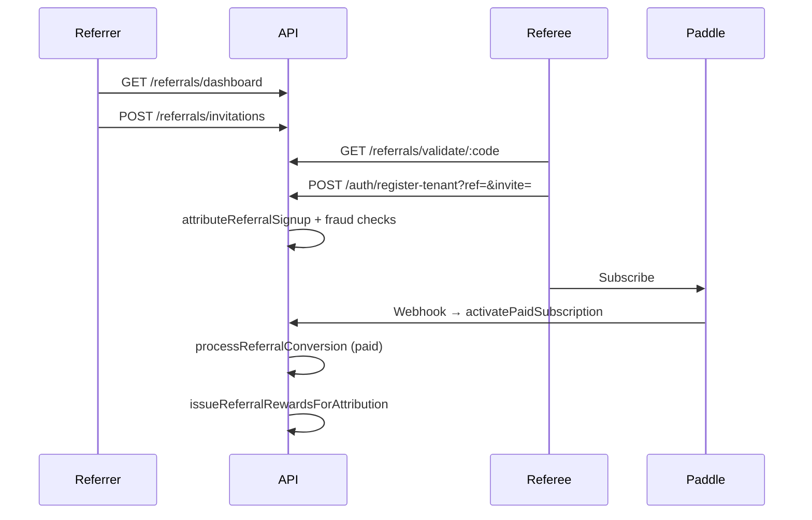

# Referral Program — Architecture & Implementation Plan

> **Goal:** Tenant referral growth loop with codes, tracking, rewards, email invitations, fraud controls, and super-admin management — extensible for free months, discount credits, and plan upgrades.

**Architecture:** PostgreSQL schema (`084_referral_program.sql`) stores codes, invitations, attributions, rewards, credit balances, and fraud reviews. Backend services handle attribution at signup and conversion at paid subscription activation (Paddle webhook path via `activatePaidSubscription`). Tenant UI lives in Billing Portal → Referral Program; super-admin UI in Settings → Referral Admin.

**Tech stack:** Express + PostgreSQL, nodemailer (SMTP), React billing portal, shared TypeScript types.

---

## Data model

| Table | Purpose |
|-------|---------|
| `referral_program_config` | Singleton program rules and default reward types |
| `referral_codes` | One code per referrer tenant + funnel counters |
| `referral_invitations` | Email invites with expiring tokens |
| `referral_attributions` | Referee ↔ referrer linkage and lifecycle status |
| `referral_events` | Analytics / audit event stream |
| `referral_rewards` | Issued rewards (pending → approved → applied) |
| `referral_credit_balances` | Discount credits, free months, pending plan upgrades |
| `referral_fraud_reviews` | Anti-fraud queue for admin resolution |

## Reward types (future-ready)

| Type | `reward_value` shape | Application |
|------|---------------------|-------------|
| `free_months` | `{ "months": 1 }` | Extends `subscriptions.trial_end_date` via `extendSubscriptionTrialByMonths` |
| `discount_credit` | `{ "creditCents": 5000, "currency": "USD" }` | Stored in `referral_credit_balances` for Paddle checkout (integrate at checkout) |
| `plan_upgrade` | `{ "planCode": "professional", "billingCycle": "monthly" }` | Stored as `plan_upgrade_pending` for billing flow |

## Lifecycle



## Anti-fraud controls

- Self-referral blocked (referee tenant ≠ referrer tenant)
- Same email domain as referrer users (configurable)
- Monthly referral cap per referrer
- Duplicate referee email rejected
- IP cluster detection (same IP hash, 7-day window)
- High fraud score → manual review; auto-approve rewards only when score &lt; 25

## API surface

### Public
- `GET /api/referrals/validate/:code`
- `POST /api/referrals/click`
- `GET /api/referrals/invite/:token`

### Tenant (auth + `users.read`)
- `GET /api/referrals/dashboard`
- `POST /api/referrals/invitations`

### Super-admin
- `GET /api/admin/referrals/stats`
- `GET /api/admin/referrals/attributions`
- `GET /api/admin/referrals/fraud`
- `GET /api/admin/referrals/rewards/pending`
- `GET/PUT /api/admin/referrals/config`
- `POST /api/admin/referrals/rewards/:id/approve|reject`
- `POST /api/admin/referrals/fraud/:id/resolve`

## Email templates

Defined in `backend/src/constants/referralProgram.ts` and rendered in `referralEmailService.ts`:

- `referral_invitation` — primary invite
- `referral_invitation_reminder` — follow-up (scheduler TBD)
- `referral_reward_earned` — reward notification

## Environment variables

```env
REFERRAL_SIGNUP_BASE_URL=https://app.pbookspro.com
REFERRAL_SMTP_HOST=          # falls back to MARKETING_SMTP_* / DR_SMTP_*
REFERRAL_SMTP_PORT=587
REFERRAL_SMTP_USER=
REFERRAL_SMTP_PASS=
REFERRAL_EMAIL_FROM=hello@pbookspro.com
```

## Deployment checklist

- [ ] Run migration: `npm run migrate --prefix backend`
- [ ] Configure SMTP for invitation emails
- [ ] Set `REFERRAL_SIGNUP_BASE_URL` to production signup URL
- [ ] Wire discount credits into Paddle checkout (phase 2)
- [ ] Add reminder email scheduler (phase 2)

## File index

```
database/migrations/084_referral_program.sql
shared/referrals/referralTypes.ts
backend/src/constants/referralTypes.ts
backend/src/constants/referralProgram.ts
backend/src/services/referrals/*.ts
backend/src/routes/referralRoutes.ts
backend/src/routes/adminReferralRoutes.ts
components/referrals/ReferralDashboard.tsx
components/referrals/AdminReferralDashboard.tsx
services/api/referralApi.ts
services/api/adminReferralApi.ts
```
