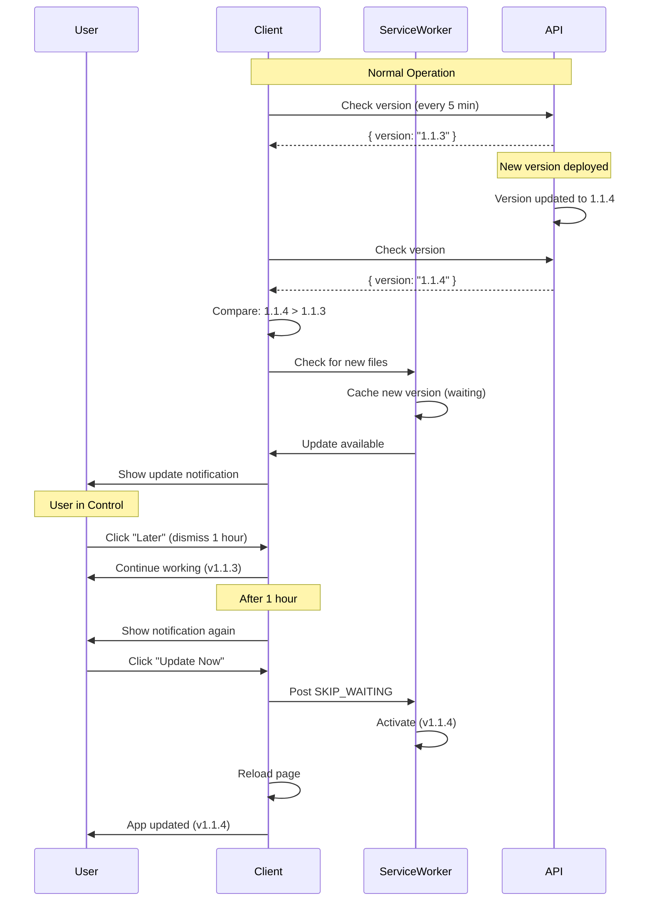

# Version Update System Documentation

## Overview

PBooksPro implements a user-controlled version update system. When a new version is deployed, users are notified but can continue working until they explicitly choose to update. Updates do NOT happen automatically on refresh.

## How It Works

### Version Detection

1. **API Version Endpoint**: Server exposes `/api/app-info/version` that returns current server version from `package.json`

2. **Client Version Injection**: Client version is injected at build time from `package.json` via Vite configuration

3. **Periodic Checking**: Client checks for updates every 5 minutes in the background (not on every page load)

4. **Version Comparison**: Client compares server version vs client version using semantic versioning (x.y.z)

### Update Flow



## Components

### Version Service (`services/versionService.ts`)

- Checks API for current server version
- Compares versions using semantic versioning
- Manages periodic checking (every 5 minutes)
- Stores last known version in localStorage

### Update Notification Component (`components/ui/VersionUpdateNotification.tsx`)

- Displays non-intrusive notification when update available
- Shows current and new version numbers
- Provides "Update Now" and "Later" buttons
- Remembers dismissal preferences (localStorage)

### Service Worker (`sw.js`)

- Caches new version when available
- **Does NOT** automatically activate (`skipWaiting()` removed)
- Waits for user action before activating
- Responds to `SKIP_WAITING` message from client

### PWA Context (`context/PWAContext.tsx`)

- Manages service worker registration
- Detects when new version is available
- Provides `applyUpdate()` method to trigger update
- Handles page reload after update activation

## User Experience

### Notification Behavior

- **Location**: Top-right corner, fixed position
- **Visibility**: Only appears when new version is detected
- **Dismissal Options**:
  - **"Later"**: Dismisses for 1 hour
  - **Close (X)**: Dismisses for 24 hours
  - Notification reappears after dismissal period expires

### Update Process

1. **Detection**: Update detected in background (every 5 minutes)
2. **Notification**: User sees notification without disruption
3. **User Choice**: User can continue working or update now
4. **Activation**: Only when user clicks "Update Now" does:
   - Service worker activate new version
   - Page reload with new version
   - Old version remains active until user chooses

## Key Features

### No Automatic Updates

- **No auto-refresh on page reload**
- **No forced updates**
- **User stays in control**

### Background Checking

- Checks every 5 minutes (not on every page load)
- Does not impact performance
- Silent operation until update available

### Persistent Preferences

- Dismissed notifications remembered (localStorage)
- Respects user's "Later" preferences
- Avoids notification spam

### Graceful Degradation

- If version check fails, app continues normally
- Network errors don't break the app
- Fallback to simple reload if service worker unavailable

## Configuration

### Version Format

Uses semantic versioning from `package.json`:
```json
{
  "version": "1.1.3"
}
```

### Check Interval

Default: 5 minutes (300,000 ms)
Configured in: `services/versionService.ts`

```typescript
private checkInterval: number = 5 * 60 * 1000; // 5 minutes
```

### Dismissal Periods

- **"Later" button**: 1 hour
- **Close (X) button**: 24 hours

Both stored in localStorage as `version_update_dismissed_until`

## Testing

### Test Update Flow

1. **Update Version**:
   ```bash
   # In package.json, change version
   "version": "1.1.4"
   ```

2. **Deploy to Production**:
   ```bash
   git add package.json
   git commit -m "Bump version to 1.1.4"
   git push origin main
   ```

3. **Verify**:
   - Wait up to 5 minutes for version check
   - Notification should appear
   - Test "Later" dismissal
   - Test "Update Now" button
   - Verify app reloads with new version

### Test Staging

1. Deploy new version to staging branch
2. Test with staging environment
3. Verify notification appears
4. Test update flow

## API Endpoint

### GET `/api/app-info/version`

Returns current application version information.

**Response**:
```json
{
  "version": "1.1.3",
  "buildDate": "2024-01-15T10:30:00.000Z",
  "environment": "production"
}
```

**Implementation**: `server/api/routes/app-info.ts`

## Troubleshooting

### Notification not appearing

- Check that version was bumped in `package.json`
- Verify API endpoint returns correct version: `/api/app-info/version`
- Check browser console for version check errors
- Verify service worker is registered (DevTools → Application → Service Workers)

### Update not applying

- Check service worker status (DevTools → Application → Service Workers)
- Verify `SKIP_WAITING` message is sent
- Check browser console for errors
- Try hard refresh (Ctrl+Shift+R) if stuck

### Version check failing

- Verify API endpoint is accessible
- Check CORS settings if cross-origin
- Verify network connectivity
- Check browser console for errors

## Important Notes

- **Version is injected at build time** - changes require rebuild
- **Service worker must be registered** for updates to work
- **Browser must support service workers** (all modern browsers)
- **Updates are user-initiated** - no automatic refresh
- **Old version remains active** until user updates
