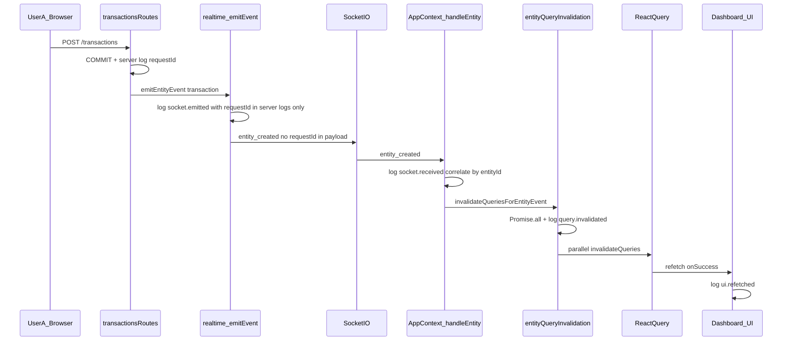
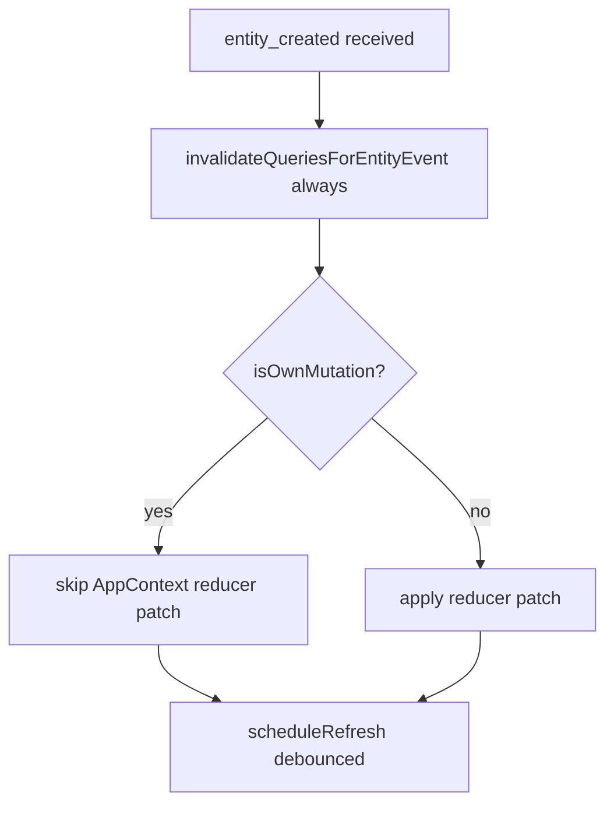
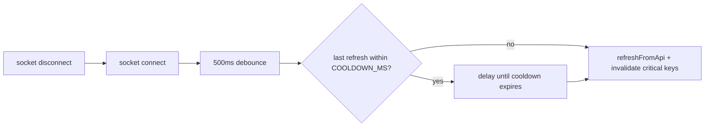

# Phase 1: Multi-User Synchronization Hardening (v2)

**Date:** June 2026  
**Status:** Plan -- awaiting approval before implementation  
**Supersedes:** [multi-user-synchronization-phase1-plan.md](./multi-user-synchronization-phase1-plan.md)  
**Reference:** [multi-user-synchronization-review.md](./multi-user-synchronization-review.md)  
**Scope:** Phase 1 objectives plus mandatory corrections from architecture review (CORS, C-5, stale-time policy, tracing security, reconnect cooldown, selling-analytics logging).

---

## Objectives

1. Fix React Query stale times (per-query overrides for financial and operational data only; **global default stays 5 minutes**).
2. Add reconnect refresh logic with cooldown to prevent starvation on unstable networks.
3. Convert sequential invalidations to `Promise.all`.
4. Centralize `notification_created` listeners and remove duplicate hook listeners in **one atomic deployment step**.
5. Add WhatsApp listeners on the real Socket.IO client.
6. Add instrumentation/logging to trace the pipeline (server-side correlation only -- **no request IDs on socket payloads**).
7. **(New)** Restrict Socket.io CORS to an explicit allowlist (remove `cors: { origin: '*' }`).
8. **(New)** Fix own-mutation `scheduleRefresh()` skip (review section C-5).
9. **(New)** Log selling-analytics invalidation failures instead of silent `catch {}`.
10. **(New)** Resolve `refetchOnWindowFocus` vs AppContext tab-visibility refresh overlap.

---

## Changes from v1 (Claude review corrections)

| # | Correction | v1 | v2 |
|---|------------|----|----|
| 1 | CORS allowlist | Out of scope | In scope -- shared allowlist for Socket.io |
| 2 | Own-mutation `scheduleRefresh()` skip (C-5) | Unchanged behavior | `scheduleRefresh()` runs for own mutations; reducer patch still skipped |
| 3 | Global stale time | Lowered to 2 min | **Kept at 5 min** (`QUERY_STALE_MS`) |
| 4 | Per-query stale times | Financial + operational + reference + static tiers | **Financial + operational only** via `setQueryDefaults` |
| 5 | Notification listeners | Add in AppContext, remove from hooks in separate steps | **Single atomic step** -- deploy together |
| 6 | Backend tracing order | Step 6 (late) | **Step 1** -- backend trace hooks first |
| 7 | Selling analytics | Silent `catch {}` | `logger.warn` / `rtTrace` on import or invalidation failure |
| 8 | Reconnect refresh | 500ms debounce only | Debounce **plus** cooldown window (reuse `COOLDOWN_MS` pattern) |
| 9 | Focus refresh overlap | Enable `refetchOnWindowFocus` without analysis | Explicit policy -- see Focus refresh policy |
| 10 | Trace correlation | `traceId` on socket payload from `requestId` | **Server logs only**; client uses entity id + timestamp; no `requestId` broadcast to tenant |

---

## Focus refresh policy (item 9)

**Current behavior:**

| Mechanism | File | What it does |
|-----------|------|--------------|
| `refetchOnWindowFocus: false` (global) | `config/queryClient.ts` | React Query does not refetch on tab focus |
| Tab visibility listener | `context/AppContext.tsx` ~2127 | After 1.2s debounce, calls `refreshFromApi()` (full incremental AppState sync) |

**v2 decision -- layered, non-duplicative:**

1. **Enable `refetchOnWindowFocus: true`** only on financial query key prefixes (`ledger`, `invoices`, `transactions`, `dashboardMetrics`). This refreshes mounted React Query caches cheaply when the user returns to the tab.
2. **Keep** AppContext tab-visibility `refreshFromApi`, but add a **30s cooldown** since last `refreshFromApi` (share `lastRefreshAt` ref already used by `scheduleRefresh`). Skip the visibility-triggered full sync if a refresh ran within the cooldown window.
3. **Rationale:** React Query handles stale **mounted** financial queries; AppContext incremental sync remains the fallback for AppState entities not covered by React Query. The cooldown prevents both firing back-to-back on every tab switch.

**Do not** enable global `refetchOnWindowFocus` -- only the financial prefixes above.

---

## Architecture (Phase 1 Target)

**Own-mutation path (C-5 fix):**

**Reconnect with cooldown:**

---

## Implementation Plan

### 1. Backend tracing (first)

**Files:** `backend/src/core/realtime.ts`, `backend/src/modules/accounting/routes/transactionsRoutes.ts`

- Add `DEBUG_REALTIME=true` gated logging in `emitEvent()`.
- Include `requestId` from route context **in server log metadata only** -- not attached to socket body.
- Log `transaction.persisted` in `transactionsRoutes.ts` after COMMIT, before `emitEntityEvent`.
- **Do not** add `traceId` / `requestId` fields to `RealtimePayload` or socket emit body.

### 2. Frontend trace utility + logger category

**New file:** `services/realtime/realtimeTrace.ts`  
**File:** `services/logger.ts` -- add `'realtime'` to `allowedCategories`

- Gated by `import.meta.env.VITE_DEBUG_REALTIME === 'true'`.
- Client correlation: `entityType`, `entityId`, `action`, `ts` from socket payload -- **not** HTTP `requestId`.
- **Not in scope:** `services/api/client.ts` changes to propagate `X-Request-Id` to socket layer.

### 3. Parallel invalidation + selling-analytics logging

**File:** `services/realtime/entityQueryInvalidation.ts`

- Convert independent `await` chains to `Promise.all` within each block.
- Replace silent `catch {}` in `invalidateSellingAnalytics()` with `logger.warnCategory('realtime', ...)` and `rtTrace('selling_analytics.invalidate_failed', ...)`.
- Add `query.invalidated` trace with keys + `durationMs`.

### 4. Socket.io CORS allowlist

**Files:** `backend/src/core/realtime.ts`, new `backend/src/config/corsOrigins.ts`

- Replace `cors: { origin: '*' }` in `initRealtime()` with explicit allowlist callback.
- Include Electron/LAN origins as needed; add `CORS_ALLOW_ALL=true` emergency escape hatch.
- Express CORS in `backend/src/index.ts` remains follow-up (Socket.io scoped for Phase 1).

### 5. React Query stale times (financial + operational only)

**File:** `config/queryClient.ts`

- **Keep** `QUERY_STALE_MS = 5 * 60 * 1000` unchanged.
- **Add `setQueryDefaults` only for:**
  - Financial (30s): ledger, invoices, transactions, dashboardMetrics
  - Operational (2 min): purchase-orders, goods-receipts, contracts, workflow, payroll, procurement-dashboard
- **Add `refetchOnWindowFocus: true`** on financial prefixes only.

### 6. Fix own-mutation `scheduleRefresh()` skip (C-5)

**File:** `context/AppContext.tsx` -- `handleEntity` (~1842)

Call `scheduleRefresh()` before returning on own mutations; skip reducer patches only.

### 7. Reconnect refresh with cooldown

**File:** `context/AppContext.tsx` -- socket `useEffect` (~1807)

- 500ms reconnect debounce + reuse `lastRefreshAt` / `COOLDOWN_MS` (3000) from `scheduleRefresh`.
- Prevents refresh starvation on unstable networks.

### 8. Notification listeners -- single atomic deployment step

Deploy in one commit/PR:

| Action | File |
|--------|------|
| **Add** `notification_created` handler | `context/AppContext.tsx` |
| **Remove** socket `on/off` | `hooks/useUserNotifications.ts` |
| **Remove** `notification_created` socket `on/off` | `modules/executive-mobile/hooks/useMobileNotifications.ts` |

### 9. WhatsApp listeners (real socket)

Replace no-op `getWebSocketClient` stubs with `getRealtimeSocket()` in Header + WhatsApp panels. Optional shared `hooks/useWhatsAppRealtime.ts`.

### 10. Tab visibility cooldown

**File:** `context/AppContext.tsx` -- visibility `useEffect` (~2127)

Skip `refreshFromApi` if `Date.now() - lastRefreshAt < COOLDOWN_MS` (shared ref).

---

## Revised Implementation Sequence

| Step | Work | Rationale |
|------|------|-----------|
| **1** | Backend tracing: `emitEvent` + `transactionsRoutes` logs (`DEBUG_REALTIME`) | Observe emits before changing client behavior |
| **2** | `realtimeTrace.ts` + `logger` realtime category | Client-side trace scaffold |
| **3** | `entityQueryInvalidation.ts`: `Promise.all` + selling-analytics warn + trace | Core invalidation fix |
| **4** | `corsOrigins.ts` + Socket.io allowlist in `realtime.ts` | Security fix |
| **5** | `queryClient.ts`: financial/operational `setQueryDefaults` + financial `refetchOnWindowFocus` | Stale-time policy |
| **6** | `AppContext.tsx`: C-5 + reconnect cooldown + tab visibility cooldown + entity trace | Single file, test together |
| **7** | Notification centralization **atomic**: add AppContext listener + remove hook listeners | No duplicate/zero listener window |
| **8** | WhatsApp: `getRealtimeSocket()` in Header + panels | Feature wiring |
| **9** | `useDashboardMetrics.ts`: `ui.refetched` trace | Completes client trace pipeline |
| **10** | Manual two-browser + reconnect + regression verification | Sign-off gate |

---

## Files Affected

| File | Change |
|------|--------|
| `backend/src/config/corsOrigins.ts` | **New** -- shared origin allowlist resolver |
| `backend/src/core/realtime.ts` | CORS allowlist; `emitEvent` debug logging |
| `backend/src/modules/accounting/routes/transactionsRoutes.ts` | `transaction.persisted` server log |
| `services/realtime/realtimeTrace.ts` | **New** -- client trace utility |
| `services/logger.ts` | `realtime` category |
| `services/realtime/entityQueryInvalidation.ts` | `Promise.all`; selling-analytics warn; trace |
| `config/queryClient.ts` | Financial/operational `setQueryDefaults`; financial `refetchOnWindowFocus` |
| `context/AppContext.tsx` | C-5 fix; reconnect + cooldown; tab visibility cooldown; `notification_created`; entity trace |
| `hooks/useUserNotifications.ts` | Remove socket listener (atomic with AppContext add) |
| `modules/executive-mobile/hooks/useMobileNotifications.ts` | Remove `notification_created` socket listener (atomic) |
| `hooks/useWhatsAppRealtime.ts` | **New** (optional shared hook) |
| `components/layout/Header.tsx` | Real socket for WhatsApp |
| `components/whatsapp/WhatsAppSidePanel.tsx` | Real socket |
| `components/whatsapp/WhatsAppChatWindow.tsx` | Real socket |
| `hooks/useDashboardMetrics.ts` | `ui.refetched` trace |

**Explicitly not modified:** `services/realtime/realtimePayload.ts`, `services/api/client.ts`, `hooks/useRealtimeQuerySync.ts`, `backend/src/index.ts` Express CORS (follow-up).

---

## Risks

| Risk | Severity | Mitigation |
|------|----------|------------|
| **CORS allowlist blocks Electron/LAN clients** | High | Test Electron + LAN origins; env-driven defaults; `CORS_ALLOW_ALL` escape hatch |
| **Own-mutation `scheduleRefresh` increases API load** | Medium | Existing 2s debounce + 3s cooldown unchanged |
| **Reconnect + visibility + scheduleRefresh triple refresh** | Medium | Shared `lastRefreshAt` + `COOLDOWN_MS` |
| **Notification atomic step missed in partial deploy** | High | Single PR; grep gate in checklist |
| **Double invalidation** (notifications) | Medium | Atomic add/remove |
| **Parallel `Promise.all` refetch burst** | Low-Medium | Trace logs monitor |
| **`refetchOnWindowFocus` + visibility both fire** | Medium | 30s visibility cooldown |
| **Selling analytics warn noise** | Low | Distinguish expected module-not-loaded vs real errors |
| **WhatsApp payload mismatch** | Medium | Verify backend shape before wiring |
| **No socket payload traceId** | Low (by design) | Server logs + client entity-id correlation |

---

## Testing Strategy

### Manual -- two-browser multi-user (primary)

1. User A creates transaction -- User B sees update in **<500ms**.
2. **C-5:** User A rapid edits -- debounced `refreshFromApi` fires for own mutations (`api.refresh.scheduled`, `isOwnMutation: true`).
3. **Trace (server):** `transaction.persisted` then `socket.emitted` with `requestId` in **server logs only**.
4. **Trace (client):** `socket.received` -> `query.invalidated` -> `ui.refetched`; **no** `requestId` in WebSocket frames.
5. **Reconnect:** Offline 30s test; rapid connect/disconnect verifies cooldown prevents >1 refresh per 3s.
6. **Notifications:** Bell updates; grep confirms single `notification_created` listener.
7. **WhatsApp:** Inbound message updates badge without 60s poll.
8. **CORS:** Allowed origin connects; disallowed origin rejected in staging.

### Manual -- focus refresh policy

1. Block WebSocket; wait 35s; switch tabs.
2. Financial React Query refetches on focus.
3. AppContext `refreshFromApi` skipped if within cooldown.

### Manual -- stale time fallback

1. Block socket; wait 35s on financial view -- 30s stale refetch.
2. Non-financial page still uses 5-min global cache.

### Unit / integration tests

| Test | Target |
|------|--------|
| Parallel financial invalidation | Mock `QueryClient` |
| Selling analytics warn on failure | Mock dynamic import |
| Own-mutation calls `scheduleRefresh` | Mock `handleEntity` |
| Reconnect skips first `connect` + respects cooldown | Mock socket events |
| `rtTrace` no-ops when flag off | `realtimeTrace.ts` |
| CORS allowlist accepts/rejects | `corsOrigins.ts` |

### Regression checks

- Remote-mutation reducer patches unchanged.
- Bulk `settings` refresh still triggers full tenant sweep.
- Mobile approval events in `useMobileNotifications` still work.
- No `useRealtimeQuerySync` mount.
- Global `QUERY_STALE_MS` remains `300_000`.

### Success criteria

- User B sees User A financial change in **<500ms**.
- Notification bell and WhatsApp badge update in **<200ms**.
- Reconnect recovers without starvation under flaky network.
- Server + client traces complete; no `requestId` in socket payloads.

---

## Rollback Strategy

Roll back in reverse dependency order. Changes are additive and flag-gated where possible.

| Step | Rollback action | Blast radius |
|------|-----------------|--------------|
| 1 | Revert WhatsApp socket wiring (restore stubs) | WhatsApp real-time only; 60s poll fallback |
| 2 | Revert notification atomic commit | Bell may miss events on mount race |
| 3 | Revert AppContext changes (C-5, reconnect, visibility, trace) | Restores prior own-mutation skip |
| 4 | Revert `queryClient.ts` per-key defaults | All queries return to 5-min global stale |
| 5 | Revert CORS allowlist via `CORS_ALLOW_ALL=true` | Emergency escape hatch |
| 6 | Revert `entityQueryInvalidation.ts` to sequential | Slower invalidation only |
| 7 | Disable tracing via env flags | No code revert needed |

**Safeguards before merge:**

- `CORS_ALLOW_ALL` escape hatch (default `false` in production).
- Tracing off by default in production.
- Single PR for notification atomic step.

**Monitoring after deploy:**

- API request rate per tenant (C-5 `scheduleRefresh` increase).
- Socket connection rejection rate (CORS).
- `selling_analytics.invalidate_failed` warn rate.

---

## Implementation Checklist

- [ ] **Step 1:** Backend `emitEvent` + `transactionsRoutes` tracing (server logs only)
- [ ] **Step 2:** `realtimeTrace.ts` + logger `realtime` category
- [ ] **Step 3:** `entityQueryInvalidation.ts` -- `Promise.all` + selling-analytics warn
- [ ] **Step 4:** `corsOrigins.ts` + Socket.io allowlist
- [ ] **Step 5:** `queryClient.ts` -- financial/operational stale times; global 5 min unchanged
- [ ] **Step 6:** AppContext -- C-5, reconnect cooldown, tab visibility cooldown, entity trace
- [ ] **Step 7:** Notification listeners -- atomic add AppContext + remove hooks
- [ ] **Step 8:** WhatsApp `getRealtimeSocket()` wiring
- [ ] **Step 9:** Dashboard `ui.refetched` trace
- [ ] **Step 10:** Full manual verification + regression suite

**Awaiting approval before implementation.**