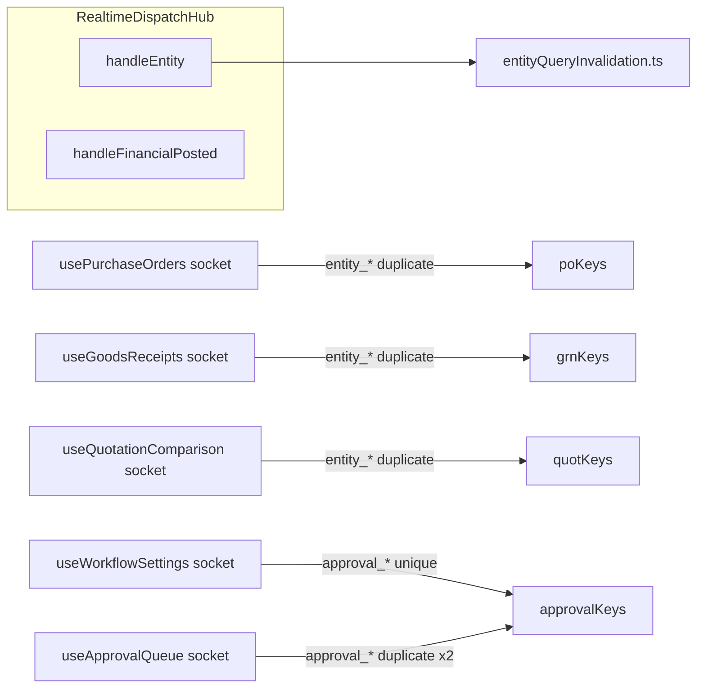
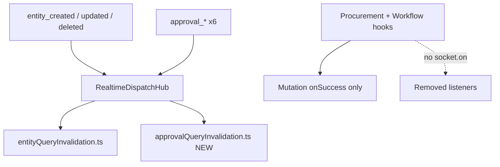

# Phase 2A A3.3 — Procurement & Workflow Listener Cleanup

**Date:** 2026-06-19  
**Authority:** [multi-user-sync-phase2a-a3-implementation-plan-v2.md](multi-user-sync-phase2a-a3-implementation-plan-v2.md)  
**Prerequisites:** A3.1 complete and approved; A3.2 closed (routing absorbed into A3.1)  
**Status:** Plan only — **awaiting approval. No production code.**

---

## Executive Summary

A3.3 removes duplicate socket listeners from procurement and workflow hooks, making **RealtimeDispatchHub** the sole socket-driven invalidation path for `entity_*` and (new in this phase) `approval_*` events. An **Approval Event Mapping Matrix** confirms verbatim parity for all six backend approval events. **Issue 1 (review):** `usePurchaseOrders` invalidates `['purchase-order-report']` on both `purchase_order` and `bill` entity events — the central map must add **both** triggers (bill branch is **required**, not optional) before hook removal.

Post-A3.1, entity invalidation already flows through the hub → [entityQueryInvalidation.ts](../../services/realtime/entityQueryInvalidation.ts). Three procurement hooks re-subscribe to the same `entity_*` events and mostly duplicate the central map. Two workflow hooks subscribe to `approval_*` events — behavior the hub does **not** provide today; removing them without a hub approval handler would regress the approval queue.

This plan therefore has **two tracks**:

| Track | Hooks | Hub prerequisite |
|-------|-------|------------------|
| **A — Procurement** | `usePurchaseOrders`, `useGoodsReceipts`, `useQuotationComparison` | Extend central map: PO report on `purchase_order` **and** `bill` (required); GRN keys on `purchase_order` branch |
| **B — Workflow** | `useWorkflowSettings`, `useApprovalQueue` | Add hub `approval_*` handler + shared `approvalQueryInvalidation.ts` |

**Preserved:** RealtimeDispatchHub ownership, A1 queue, `latestStateRef`, changeLogMerge, `notification_created` (A3.1), multi-tenant isolation.

**Not in A3.3:** Approval payload audit / mobile notification routing (A3.4), `useMobileNotifications` approval block removal, backend emitters, schema changes, `sourceUserId` / recipient filtering.

---

## Approval Event Mapping Matrix

### Event name note (requested vs codebase)

The review requested these event names: `approval_created`, `approval_updated`, `approval_approved`, `approval_rejected`, `approval_completed`, `approval_cancelled`.

**The backend and client never emit or subscribe to those names.** Verified: zero matches in repository for `approval_created`, `approval_updated`, `approval_completed`, `approval_cancelled`.

**Canonical events** (from [backend/src/core/realtime.ts](../../backend/src/core/realtime.ts) and [hooks/useWorkflow.ts](../../hooks/useWorkflow.ts)):

| Requested (review) | Actual socket event | Notes |
|--------------------|---------------------|-------|
| `approval_created` | `approval_requested` | Closest semantic match — new approval request |
| `approval_updated` | *(none)* | No generic update event; state changes use specific verbs below |
| `approval_approved` | `approval_approved` | Exact match |
| `approval_rejected` | `approval_rejected` | Exact match |
| `approval_completed` | *(none)* | Terminal outcomes are `approval_approved` or `approval_rejected` |
| `approval_cancelled` | *(none)* | No cancel event; `approval_returned` is closest workflow reversal |
| — | `approval_returned` | Returned to requester |
| — | `approval_escalated` | Escalated to next level |
| — | `approval_delegated` | Delegated to another approver |

**A3.3 matrix uses the six actual `approval_*` events** — the only events `useWorkflowSettings` and `useApprovalQueue` subscribe to today.

### Shared invalidation set (all six events)

Both hooks register the **same** handler body: `invalidateApprovalQueries(queryClient)` with **no per-event branching**. Source: [hooks/useWorkflow.ts](../../hooks/useWorkflow.ts) lines 23–32, 41–44, 75–78.

**Query keys invalidated (every approval event, both hooks):**

| # | Query key prefix | Resolves to |
|---|------------------|-------------|
| 1 | `['workflow']` | Settings + queue queries |
| 2 | `['purchase-orders']` | PO lists |
| 3 | `['notifications']` | Workflow notification queries |
| 4 | `['dashboardMetrics']` | `dashboardMetricsQueryKeys.root` |
| 5 | `['contracts']` | Contract lists |
| 6 | `['bills']` | Bill lists |
| 7 | `['transactions']` | Transaction lists |
| 8 | `['vendors']` | Vendor lists |

**Tenant filter (both hooks):** return early if `payload.tenantId && payload.tenantId !== tenantId`. No `sourceUserId` or recipient filter.

**Proposed hub behavior:** `handleApprovalEvent(payload)` → same tenant guard → `invalidateApprovalQueries(queryClient)` from new [approvalQueryInvalidation.ts](../../services/realtime/approvalQueryInvalidation.ts) (verbatim extract). No payload changes. No per-event key differences.

### Per-hook current behavior (identical across events)

| Hook | Subscribed events | Handler | Invalidations per event |
|------|-------------------|---------|-------------------------|
| `useWorkflowSettings` | All 6 `approval_*` | `onApproval` → `invalidateApprovalQueries` | 8 keys (table above) |
| `useApprovalQueue` | All 6 `approval_*` | `onApproval` → `invalidateApprovalQueries` | 8 keys (same) |

When **both** hooks are mounted (e.g. workflow settings page with queue panel), each approval event triggers **2×** `invalidateApprovalQueries` (16 key-prefix invalidations, React Query dedupes concurrent refetches).

### Approval Event Mapping Matrix

| Event | useWorkflowSettings (current) | useApprovalQueue (current) | Combined current (both mounted) | New hub + approvalQueryInvalidation | Parity |
|-------|------------------------------|----------------------------|--------------------------------|-------------------------------------|--------|
| `approval_requested` | 8 keys ×1 | 8 keys ×1 | 8 keys ×2 (duplicate) | 8 keys ×1 | **Yes** — no key loss; duplicate removed |
| `approval_approved` | 8 keys ×1 | 8 keys ×1 | 8 keys ×2 | 8 keys ×1 | **Yes** |
| `approval_rejected` | 8 keys ×1 | 8 keys ×1 | 8 keys ×2 | 8 keys ×1 | **Yes** |
| `approval_returned` | 8 keys ×1 | 8 keys ×1 | 8 keys ×2 | 8 keys ×1 | **Yes** |
| `approval_escalated` | 8 keys ×1 | 8 keys ×1 | 8 keys ×2 | 8 keys ×1 | **Yes** |
| `approval_delegated` | 8 keys ×1 | 8 keys ×1 | 8 keys ×2 | 8 keys ×1 | **Yes** |

**Expanded key list (same for every row):**

| Event | Current queries invalidated | New queries invalidated | Parity |
|-------|----------------------------|-------------------------|--------|
| `approval_requested` | `workflow`, `purchase-orders`, `notifications`, `dashboardMetrics`, `contracts`, `bills`, `transactions`, `vendors` | Same 8 prefixes | Yes |
| `approval_approved` | Same | Same | Yes |
| `approval_rejected` | Same | Same | Yes |
| `approval_returned` | Same | Same | Yes |
| `approval_escalated` | Same | Same | Yes |
| `approval_delegated` | Same | Same | Yes |

### Requested-name coverage (informational)

| Requested event | Covered by A3.3? | Mechanism |
|-----------------|------------------|-----------|
| `approval_created` | Yes | Maps to `approval_requested` |
| `approval_updated` | N/A | Event does not exist; no hook listens today |
| `approval_approved` | Yes | Direct |
| `approval_rejected` | Yes | Direct |
| `approval_completed` | N/A | Event does not exist |
| `approval_cancelled` | N/A | Event does not exist; no invalidation loss (never subscribed) |

---

## Approval Migration Verification

### Parity confirmation

```
Current behavior (per approval_* event, tenant match):
  useWorkflowSettings.onApproval  → invalidateApprovalQueries (8 keys)
  useApprovalQueue.onApproval     → invalidateApprovalQueries (8 keys)  [duplicate if both mounted]

New behavior (A3.3):
  RealtimeDispatchHub.handleApprovalEvent → invalidateApprovalQueries (8 keys)  [single registration]

Verdict: Every query prefix invalidated by hooks today remains invalidated by hub.
          No approval query key is dropped.
          Duplicate hook invalidation is eliminated (improvement, not regression).
```

### Checklist (pre-merge gate)

| # | Verification | Pass criteria |
|---|--------------|---------------|
| V1 | Key list extract | `approvalQueryInvalidation.ts` invalidates exactly the 8 prefixes above |
| V2 | Tenant guard | Foreign `payload.tenantId` → no invalidation (match hooks) |
| V3 | No recipient logic | No `sourceUserId`, `userId`, or assignee filter added |
| V4 | Single registration | After Step 3, grep: no `s.on('approval_` outside hub + tests |
| V5 | Hook mutation paths | `useWorkflowSettings.save.onSuccess` and `useApprovalQueue.act.onSuccess` still call `invalidateApprovalQueries` locally |
| V6 | Unit test | `approvalQueryInvalidation.test.ts` asserts 8 invalidations per call |
| V7 | Hub test | `approval_requested` + matching tenant invokes shared invalidation once |
| V8 | Dual-mount regression | Workflow screen with settings + queue: one invalidation wave per event (not two) |
| V9 | Approval listener cleanup symmetry | In `RealtimeDispatchHub.ts`: count of `s.on('approval_*')` in `bindHubToSocket` equals count of matching `s.off('approval_*')` in `cleanupRealtimeDispatchHub` (6 each) |

### Gaps found

| Gap | Severity | A3.3 action |
|-----|----------|-------------|
| Requested event names (`approval_created`, etc.) not in codebase | **Documentation only** | Matrix maps to actual six events; no backend/payload change in A3.3 |
| `approval_updated` / `approval_completed` / `approval_cancelled` never emitted | **None for migration** | No hook or hub listener today; nothing to preserve |
| `useMobileNotifications` also listens to `approval_*` with different keys | **Out of A3.3 scope** | A3.4 removes that block; not counted in this matrix |
| `entity_*` path invalidates `['workflow']` on `approval_request` entity type only | **Complementary, not replacement** | Narrower than approval sweep; hub `approval_*` path preserves broad sweep |

### Duplicate invalidation after migration

| Source | Before A3.3 | After A3.3 |
|--------|-------------|------------|
| `useWorkflowSettings` + `useApprovalQueue` (both mounted) | 2× per event | **Removed** (hooks lose socket blocks) |
| `RealtimeDispatchHub` | 0× (no handler) | **1× per event** |
| `useMobileNotifications` | 1× per event (different keys) | Unchanged until A3.4 |

**Net:** Socket-driven approval invalidation for the 8 workflow keys goes from 1× (single hook) or 2× (dual hook) → exactly **1× via hub**. No duplicate remains for those keys after hook removal.

---

## Current Architecture (Post-A3.1)



---

## Hook-by-Hook Analysis

### 1. `usePurchaseOrders` — [hooks/usePurchaseOrders.ts](../../hooks/usePurchaseOrders.ts)

| Item | Detail |
|------|--------|
| **Socket listeners** | `entity_created`, `entity_updated`, `entity_deleted` |
| **Filter** | `tenantId` match; `payload.type === 'purchase_order' \|\| 'bill'` |
| **Hook invalidations** | `['purchase-orders']`, `['purchase-order-report']` on **`purchase_order` and `bill`** |
| **Hub invalidations (entity path)** | `purchase_order` → `['purchase-orders']`, `['procurement-dashboard']`, `['quotation-comparison']` — missing `['purchase-order-report']` |
| | `bill` → financial keys + invoice/rental invoice keys — **missing `['purchase-order-report']`** (regression if hook removed without map fix) |
| **Duplicated** | `['purchase-orders']` on `purchase_order` events only |
| **Unique (must preserve in map)** | `['purchase-order-report']` on **`purchase_order` and `bill`**; **`['purchase-orders']` on `bill`** (hook invalidates both keys for both types) |
| **Safe removal** | **After** Step 1: `purchase_order` branch + **`bill` branch** include `['purchase-order-report']` (required) and `['purchase-orders']` on bill |
| **Keep** | `useQuery`, `usePurchaseOrderMutations` local `onSuccess` invalidation (mutation path, not socket) |

---

### 2. `useGoodsReceipts` — [hooks/useGoodsReceipts.ts](../../hooks/useGoodsReceipts.ts)

| Item | Detail |
|------|--------|
| **Socket listeners** | `entity_created`, `entity_updated`, `entity_deleted` |
| **Filter** | `tenantId` match; `payload.type === 'goods_receipt' \|\| 'purchase_order'` |
| **Hook invalidations** | `['goods-receipts']`, `['goods-receipt-report']`, `['purchase-orders']` |
| **Hub invalidations** | `goods_receipt` → all three keys + `['procurement-dashboard']` |
| | `purchase_order` → `['purchase-orders']`, `['procurement-dashboard']`, `['quotation-comparison']` (not GRN keys — hook listens to PO for cross-refresh) |
| **Duplicated** | Full overlap on `goods_receipt` events |
| **Unique** | None for `goods_receipt`; PO-triggered GRN refresh is **partially** covered (PO event refreshes PO list via hub, not GRN list unless user also receives a `goods_receipt` entity event) |
| **Safe removal** | Remove socket `useEffect` entirely once map verified; hub `goods_receipt` branch is superset |
| **Keep** | `useGoodsReceiptMutations` local invalidation |

**Note:** If a workflow only emits `purchase_order` entity update without `goods_receipt` event, GRN pages rely on hub PO branch not invalidating GRN keys — today the hook's PO branch **does** invalidate GRN keys. Mitigation: extend hub `purchase_order` branch to include `['goods-receipts']`, `['goods-receipt-report']` **only if** staging proves cross-invalidation is required. Default: match current hook behavior by adding those keys to `purchase_order` hub branch (conservative, low risk).

---

### 3. `useQuotationComparison` — [hooks/useQuotationComparison.ts](../../hooks/useQuotationComparison.ts)

| Item | Detail |
|------|--------|
| **Socket listeners** | `entity_created`, `entity_updated`, `entity_deleted` |
| **Filter** | `tenantId`; `quotation` \| `vendor` \| `purchase_order` |
| **Hook invalidations** | `['quotation-comparison']`, `['procurement-dashboard']` |
| **Hub invalidations** | `vendor`/`quotation` → vendors, quotations, quotation-comparison, procurement-dashboard |
| | `purchase_order` → purchase-orders, procurement-dashboard, quotation-comparison |
| **Duplicated** | **100%** for all three entity types |
| **Unique** | None |
| **Safe removal** | Remove socket `useEffect` immediately (no map change required) |
| **Keep** | `useQuotationComparisonWorkflow` mutation invalidation |

---

### 4. `useWorkflowSettings` — [hooks/useWorkflow.ts](../../hooks/useWorkflow.ts)

| Item | Detail |
|------|--------|
| **Socket listeners** | All 6 `approval_*` events |
| **Filter** | `tenantId` match only |
| **Hook invalidations** | `invalidateApprovalQueries`: `['workflow']`, `['purchase-orders']`, `['notifications']`, `dashboardMetrics.root`, `['contracts']`, `['bills']`, `['transactions']`, `['vendors']` |
| **Hub invalidations** | **None on `approval_*` today** |
| | Partial overlap on `entity_*`: e.g. `bill`/`transaction`/`contract`/`vendor` entity events hit subsets via financial/entity map — **not** equivalent to approval sweep |
| **Duplicated** | With `useApprovalQueue` when both mounted (double `invalidateApprovalQueries` per approval event) |
| **Unique** | Entire `approval_*` → broad cache sweep path |
| **Safe removal** | **Only after** hub registers single `handleApprovalEvent` calling shared `invalidateApprovalQueries` |
| **Keep** | `save` mutation `onSuccess` invalidation; `useQuery` for settings |

---

### 5. `useApprovalQueue` — [hooks/useWorkflow.ts](../../hooks/useWorkflow.ts)

| Item | Detail |
|------|--------|
| **Socket listeners** | Same 6 `approval_*` events (separate handler instance) |
| **Filter** | `tenantId` match only |
| **Hook invalidations** | Same `invalidateApprovalQueries` as `useWorkflowSettings` |
| **Hub invalidations** | None on `approval_*` |
| **Duplicated** | 100% with `useWorkflowSettings`; **2×** when both hooks mount on workflow screens |
| **Unique** | None vs `useWorkflowSettings`; unique vs hub (approval channel) |
| **Safe removal** | Same as `useWorkflowSettings` — hub single handler |
| **Keep** | `act` mutation `onSuccess` invalidation; queue `useQuery` |

---

## Central Map Gaps (Must Close Before Procurement Removal)

| Key | Entity trigger (hook today) | In hub map? | A3.3 action | Priority |
|-----|----------------------------|-------------|-------------|----------|
| `['purchase-order-report']` | `purchase_order` | **No** | Add to `purchase_order` branch | **Required** |
| `['purchase-order-report']` | `bill` | **No** | Add to `bill` entity branch (invoice-bill block) | **Required** — Issue 1 |
| `['purchase-orders']` | `bill` | **No** | Add to `bill` branch alongside PO report (hook invalidates both keys on bill today) | **Required** for full hook parity |
| `['goods-receipts']` | `purchase_order` | **No** | Add to `purchase_order` branch (conservative parity) | Required |
| `['goods-receipt-report']` | `purchase_order` | **No** | Add to `purchase_order` branch (conservative parity) | Required |

**Issue 1 parity rule:** Today `usePurchaseOrders` socket handler invalidates **`['purchase-orders']` + `['purchase-order-report']`** for both `purchase_order` and `bill`. After hook removal, hub map must at minimum add **`['purchase-order-report']` on `bill`** (review gate). Full parity also requires **`['purchase-orders']` on `bill`** (same two keys the hook uses today).

All other procurement hook keys already exist in the hub map.

---

## Target Architecture (Post-A3.3)



---

## Ownership After A3.3

| Concern | Owner |
|---------|-------|
| Socket `entity_*` invalidation | Hub → `entityQueryInvalidation.ts` |
| Socket `approval_*` invalidation | Hub → `approvalQueryInvalidation.ts` (new) |
| Socket `notification_created` | Hub (A3.1, unchanged) |
| Local mutation invalidation | Hook `onSuccess` callbacks (unchanged — **not** moved into central maps) |
| AppContext state merge / refresh | AppContext (unchanged) |
| Reducer patches | Hub → `onEntityReducerPatch` → `entityReducerPatch.ts` |

---

## Implementation Notes

### Mutation-local invalidations stay local

Socket-driven invalidation moves to the hub and central map modules. **Mutation `onSuccess` invalidations remain in hooks** and must **not** be moved into `approvalQueryInvalidation.ts` or `entityQueryInvalidation.ts`.

Examples (unchanged after A3.3):

| Hook | Local invalidation | Scope |
|------|------------------|-------|
| `usePurchaseOrderMutations` | `invalidate()` → `['purchase-orders']`, `['purchase-order-report']`, `['bills']` | User's own save/submit/approve/cancel/delete |
| `useGoodsReceiptMutations` | GRN + PO report keys | User's own GRN mutations |
| `useQuotationComparisonWorkflow` | comparison + quotations + dashboard + PO keys | User's own workflow actions |
| `useWorkflowSettings.save` | `invalidateApprovalQueries` | Settings save |
| `useApprovalQueue.act` | `invalidateApprovalQueries` | Approval action from queue UI |

These are **optimistic UX paths** (immediate refetch after local mutation), separate from multi-user socket sync.

---

| File | Change |
|------|--------|
| [services/realtime/entityQueryInvalidation.ts](../../services/realtime/entityQueryInvalidation.ts) | **`purchase_order` branch:** add `['purchase-order-report']` + GRN keys. **`bill` branch:** add `['purchase-order-report']` (**required** — Issue 1) and `['purchase-orders']` (full hook parity). |
| [services/realtime/approvalQueryInvalidation.ts](../../services/realtime/approvalQueryInvalidation.ts) | **New** — extract `invalidateApprovalQueries` from `useWorkflow.ts` |
| [services/realtime/RealtimeDispatchHub.ts](../../services/realtime/RealtimeDispatchHub.ts) | Add `handleApprovalEvent`; subscribe 6 `approval_*` events; tenant guard only |
| [hooks/usePurchaseOrders.ts](../../hooks/usePurchaseOrders.ts) | Remove socket `useEffect`; remove unused `getRealtimeSocket` import |
| [hooks/useGoodsReceipts.ts](../../hooks/useGoodsReceipts.ts) | Remove socket `useEffect` |
| [hooks/useQuotationComparison.ts](../../hooks/useQuotationComparison.ts) | Remove socket `useEffect` |
| [hooks/useWorkflow.ts](../../hooks/useWorkflow.ts) | Remove both approval socket `useEffect` blocks; import shared invalidation for mutations |
| [tests/entityQueryInvalidation.test.ts](../../tests/entityQueryInvalidation.test.ts) | `purchase_order` → `purchase-order-report`; **`bill` → `purchase-order-report`** (required); PO → GRN keys |
| [tests/approvalQueryInvalidation.test.ts](../../tests/approvalQueryInvalidation.test.ts) | **New** — key list parity with former hook |
| [tests/RealtimeDispatchHub.test.ts](../../tests/RealtimeDispatchHub.test.ts) | Approval tenant guard; single-handler smoke |
| [scripts/verify-realtime-hub-gates.mjs](../../scripts/verify-realtime-hub-gates.mjs) | Extend: fail `s.on('entity_created'` outside hub (partial gate; full in A3.5) |

**Not modified:** Backend, schema, `entityReducerPatch.ts`, `useMobileNotifications` (A3.4), `notification_created` handler.

---

## Migration Sequence

Execute in order — do not remove listeners before hub/map parity exists.

### Step 1 — Extend entity central map

1. **`purchase_order` branch:** add `['purchase-order-report']` to invalidation list (alongside existing keys).
2. **`bill` branch (required — Issue 1):** in the existing `entityType === 'invoice' \|\| entityType === 'bill'` block, add `['purchase-order-report']` and `['purchase-orders']` so bill entity events match `usePurchaseOrders` socket behavior (both keys on both types).
3. **`purchase_order` branch:** add `['goods-receipts']`, `['goods-receipt-report']` (parity with `useGoodsReceipts` PO trigger).
4. Unit tests in `entityQueryInvalidation.test.ts`:
   - `purchase_order` event → `purchase-order-report` invalidated
   - **`bill` event → `purchase-order-report` invalidated** (required gate — Issue 1)
   - **`bill` event → `purchase-orders` invalidated** (full hook parity)
   - PO event → GRN keys if added

### Step 2 — Workflow approval consolidation (hub)

1. Create `approvalQueryInvalidation.ts` — move `invalidateApprovalQueries` verbatim.
2. Add `handleApprovalEvent` to hub: tenant guard → `invalidateApprovalQueries`.
3. Bind 6 `approval_*` listeners in `bindHubToSocket` / cleanup symmetry (**V9:** 6× `.on` = 6× `.off`).
4. **Do not** filter on `sourceUserId` (per Approval Payload Audit — actor ≠ recipient).
5. Hub tests for tenant mismatch and key invocation.

### Step 3 — Remove hook socket blocks

1. Delete procurement socket `useEffect` blocks (three files).
2. Delete workflow approval socket `useEffect` blocks from both exports in `useWorkflow.ts`.
3. Retain all mutation `onSuccess` invalidation.
4. Remove dead imports (`getRealtimeSocket`, `useEffect` if unused).

### Step 4 — Verification

1. `npm run test:phase1-sync`
2. `npm run verify:track-a3`
3. Extend grep gate for entity listeners (optional partial gate)
4. Manual two-user smoke (see below)

---

## Test Strategy

### Unit tests

| Test file | Cases |
|-----------|-------|
| `entityQueryInvalidation.test.ts` | `purchase_order` → `purchase-order-report`; **`bill` → `purchase-order-report` (required)**; PO → GRN keys |
| `approvalQueryInvalidation.test.ts` | 8-key parity; assert identical invalidation for all 6 `approval_*` events |
| `RealtimeDispatchHub.test.ts` | Approval tenant guard; single-handler smoke; V7–V8; **V9 cleanup symmetry** |

### Regression matrix (manual / staging)

| Scenario | Expected after A3.3 |
|----------|---------------------|
| User B on Purchase Orders page; User A edits PO | List refreshes via hub only |
| User B on PO Report widget; User A edits PO | Report refreshes via hub `purchase_order` → `purchase-order-report` |
| User B on PO Report widget; User A edits **vendor bill** linked to PO | Report refreshes via hub **`bill` → `purchase-order-report`** (Issue 1 parity) |
| User B on GRN page; User A posts GRN | GRN list refreshes |
| User B on quotation comparison; vendor quote updated | Comparison refreshes |
| User B on approval queue; User A submits approval | Queue refreshes via hub `approval_*` |
| Workflow settings + queue panel both mounted | Single invalidation per approval event (no double) |
| User A saves PO locally (mutation) | `usePurchaseOrderMutations.invalidate()` still runs — not hub/map |

### Verification commands

```powershell
npm run test:phase1-sync
npm run verify:track-a3
npm run build
```

---

## Risks

| Risk | Severity | Mitigation |
|------|----------|------------|
| Missing `purchase-order-report` on **`bill`** events (Issue 1) | **High** | **Required** map change in Step 1; unit test `bill` → `purchase-order-report` |
| Missing `purchase-order-report` on `purchase_order` | **High** | Add to PO branch; unit test |
| GRN stale when only PO entity fires | Medium | Conservative PO branch extension |
| Approval queue stale if hub handler wrong | **High** | Step 2 before Step 3; manual approval smoke |
| Approval listener leak (missing `.off`) | Medium | **V9** symmetry check in tests / code review |
| Double invalidation until removal | Low | Performance only; fixed by Step 3 |
| `['notifications']` key in approval sweep | Low | Preserve exact key list in extracted module |
| Workflow screens mount both hooks | Medium | Fixed by single hub handler |
| Accidentally moving mutation invalidation into central maps | Low | Implementation note + code review |

---

## Rollback Plan

1. Revert A3.3 PR.
2. Restore socket `useEffect` blocks in five hooks.
3. Remove hub `approval_*` subscriptions and `approvalQueryInvalidation.ts`.
4. Revert map extensions if causing over-invalidation.

A3.1 hub shell, entity routing, and `notification_created` ownership remain intact on partial rollback of Step 3 only if Steps 1–2 kept.

---

## Deviations from v2 Plan

| v2 A3.3 | This plan |
|----------|-----------|
| Procurement hooks only | Adds **workflow approval listener cleanup** (user scope) |
| Workflow in A3.4 | Hub `approval_*` handler moved into A3.3; A3.4 retains payload audit + mobile consolidation |
| A3.2 routing phase | Closed — absorbed into A3.1 |

---

## Remaining Work After A3.3 (A3.4+)

- Approval Payload Audit acceptance; `useMobileNotifications` approval block removal
- Per-user mobile/bell routing on `notification_created` only (not `sourceUserId` on approval)
- `useMobileCommandCenter` dead listener removal
- `useRealtimeQuerySync` retirement (if not done)
- Full CI grep gates (A3.5)

---

## Constraints Checklist

- RealtimeDispatchHub remains sole socket connect owner (A3.1)
- `entityQueryInvalidation` remains central entity map (extended, not bypassed)
- A1 post-COMMIT emit timing unchanged
- `latestStateRef` / changeLogMerge unchanged
- `notification_created` hub ownership unchanged
- No backend / schema changes
- No approval payload semantics change in A3.3 (tenant-wide sweep preserved)

---

## Approval Gate

| Deliverable | Required before A3.4 |
|-------------|----------------------|
| Central map gaps closed + tested (incl. **bill → purchase-order-report**) | Yes |
| Hub `approval_*` handler + tests (incl. **V9** listener symmetry) | Yes |
| **Approval Event Mapping Matrix parity confirmed** | Yes |
| All five hook socket blocks removed | Yes |
| Staging two-user procurement + approval smoke | Recommended |

**Do not implement production code until this plan is approved.**

---

## References

- [multi-user-sync-phase2a-a3-implementation-plan-v2.md](multi-user-sync-phase2a-a3-implementation-plan-v2.md)
- [services/realtime/RealtimeDispatchHub.ts](../../services/realtime/RealtimeDispatchHub.ts)
- [services/realtime/entityQueryInvalidation.ts](../../services/realtime/entityQueryInvalidation.ts)
- [hooks/useWorkflow.ts](../../hooks/useWorkflow.ts)
- Approval Payload Audit — v2 plan § Approval Payload Audit
