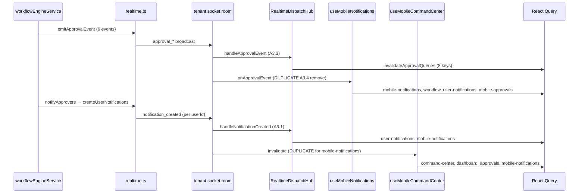

# Phase 2A A3.4 — Mobile & Approval Notification Cleanup

**Date:** 2026-06-19  
**Authority:** [multi-user-sync-phase2a-a3-implementation-plan-v2.md](multi-user-sync-phase2a-a3-implementation-plan-v2.md)  
**Prerequisites:** A3.1 complete (hub + `notification_created`); A3.3 complete (hub `approval_*` + workflow hook dedupe)  
**Status:** Plan only — **awaiting approval. No production code.**

---

## Executive Summary

A3.4 completes the approval-routing work started in A3.3 by removing **remaining duplicate mobile approval listeners**, deleting **dead command-center socket subscriptions**, and **documenting + implementing** the correct split between:

| Event family | Scope | Invalidation owner |
|--------------|-------|-------------------|
| `approval_*` | Tenant-wide shared read models | Hub → `invalidateApprovalQueries` (+ mobile queue keys) |
| `notification_created` | Per-user bell / mobile notification feed | Hub → `user-notifications`, `mobile-notifications` (userId guard) |

**Critical constraint:** `sourceUserId` on `ApprovalSocketPayload` is the **actor**, never the recipient. Do not use it for user filtering.

**Backend payload changes:** Not required for A3.4 client scope (see § Backend changes).

**A3.3 overlap:** Workflow hook dedupe and hub `approval_*` handler are **already shipped** in A3.3. A3.4 is **not** a repeat of that work; it focuses on executive-mobile hooks and closing mobile invalidation gaps.

---

## 1. Findings (Investigation)

### 1.1 ApprovalSocketPayload shape

**Canonical type:** `backend/src/core/realtime.ts`

```typescript
export type ApprovalSocketPayload = {
  tenantId: string;
  requestId: string;
  entityType: string;
  entityId: string;
  level?: number;
  autoApproved?: boolean;
  sourceUserId?: string;  // actor — NOT recipient
  ts: string;
};
```

**Client hub type today:** `services/realtime/RealtimeDispatchHub.ts` uses a minimal `{ tenantId?: string }` for the handler — sufficient for tenant guard; full fields are available on the wire but unused for routing (correct).

| Field | Present? | Semantics |
|-------|----------|-----------|
| `tenantId` | Yes | Tenant room scope |
| `requestId` | Yes | Approval request id |
| `entityType` / `entityId` | Yes | Underlying business entity |
| `level` | Optional | Current approval level |
| `autoApproved` | Optional | Auto-approve path |
| `sourceUserId` | Optional | **Actor** who triggered the event |
| `assigneeId` / `requesterId` / `userId` | **Absent** | Not on wire |

**Related type (separate channel):**

```typescript
export type UserNotificationSocketPayload = {
  tenantId: string;
  userId: string;           // true per-user recipient
  notificationId: string;
  ts: string;
};
```

---

### 1.2 All `approval_*` emitters (backend)

**Single emit function:** `emitApprovalEvent()` in `backend/src/core/realtime.ts` → tenant room broadcast.

**All emits:** `backend/src/modules/workflow/services/workflowEngineService.ts` only.

| Event | Trigger | `sourceUserId` | Also emits `notification_created`? |
|-------|---------|----------------|-------------------------------------|
| `approval_requested` | New approval request | `input.requesterId` | Yes → `notifyApproversForRequest` → approver userIds |
| `approval_approved` (mid-level) | Approve, not final | `input.actorId` | Yes → next-level approvers |
| `approval_approved` (final) | Final approve | `input.actorId` | **No** |
| `approval_approved` (auto) | Auto-approve path | `input.requesterId` | **No** |
| `approval_rejected` | Reject | `input.actorId` | **No** |
| `approval_returned` | Return to requester | `input.actorId` | **No** |
| `approval_delegated` | Delegate | `input.actorId` | Yes → delegatee |
| `approval_escalated` | Escalate | `input.actorId` | Yes → new level approvers |

**Recipient targeting for approvers:** DB notification rows + `emitUserNotification` — **not** carried on `approval_*` payloads.

**Requester bell on terminal actions:** Requesters do **not** receive `notification_created` on reject / return / final approve today. They rely on tenant-wide cache invalidation (`['workflow']`, mobile approval list) to see status changes.

---

### 1.3 All `notification_created` emitters (backend)

**Single emit function:** `emitUserNotification()` in `backend/src/core/realtime.ts`.

**Call chain:** `createUserNotification` / `createUserNotifications` in `backend/src/modules/notifications/services/userNotificationService.ts` — always after DB insert, one emit per recipient userId.

| Caller | Recipients | Purpose |
|--------|------------|---------|
| `workflowNotificationService.notifyApproversForRequest` | Resolved approver userIds | Workflow approval required |
| `unpostedTransactionNotificationService` | Finance review roles | Quick transaction submitted / status |
| `contractRetentionService` | Configured recipient ids | Retention notifications |

No other production paths call `emitUserNotification` directly.

---

### 1.4 Recipient semantics (actor vs requester vs approver vs assignee)

| Role | Where represented | Socket channel |
|------|-------------------|----------------|
| **Actor** | `ApprovalSocketPayload.sourceUserId` | `approval_*` (all events) |
| **Requester** | DB `approval_requests.requester_id`; on `approval_requested`, actor == requester | No dedicated socket field; queue refresh via tenant invalidation |
| **Approver (assigned)** | DB `approval_requests.assigned_approver_id`; resolved at request time | Bell via `notification_created` when `notifyApproversForRequest` runs |
| **Assignee (delegate)** | `delegateToUserId` in action; new `assigned_approver_id` in DB | Bell via `notification_created` on delegate |

**Misconception to reject:** Filtering `approval_*` by `sourceUserId` as “recipient” would exclude approvers on `approval_requested` (actor is requester) and include wrong users on approve/reject (actor is approver).

**Misconception to reject:** Filtering `approval_*` by `payload.userId` — field does not exist on `ApprovalSocketPayload`. Current mobile code attempts this and **never excludes anyone** (guard is always false-y).

---

### 1.5 Should `approval_*` invalidate tenant-wide, user-specific, or both?

| Cache / query key | Correct scope on `approval_*` | Rationale |
|-------------------|------------------------------|-----------|
| `['workflow']`, PO/bill/contract/transaction/vendor keys | **Tenant-wide** | Shared ERP read models; any user viewing queue/lists should refresh |
| `['notifications']` (workflow notification queries) | **Tenant-wide** | Legacy key in `invalidateApprovalQueries`; preserve parity |
| `['mobile-approvals']` | **Tenant-wide** | Shared mobile approval queue API; requesters need refresh on terminal actions without bell |
| `['user-notifications']`, `['mobile-notifications']` | **Per-user only** | Bell feed — use `notification_created` + `userId` guard |
| `['mobile-command-center']`, `['mobile-dashboard']` | **Per-user on bell**; optional tenant-wide on `approval_*` | Command center aggregates counts; approver bell refresh is user-scoped |

**Decision for A3.4:**

```
approval_*     → tenant guard only → invalidateApprovalQueries + ['mobile-approvals']
notification_created → tenant + userId guard → user-notifications + mobile-notifications
                       (+ optional mobile-command-center for matching user — see Step 2)
```

Do **both** paths, on **different keys**, without cross-contaminating user filters onto `approval_*`.

---

### 1.6 Current event flow



**Entity / financial paths (for command-center context):** Hub already handles `entity_*` and `financial.posted`. Command center subscribed to **non-existent** `entity_event` / `financial_posted` — those listeners never fired.

---

### 1.7 Current consumers

| Consumer | Events today | Filter | Keys invalidated |
|----------|--------------|--------|------------------|
| **RealtimeDispatchHub** | `approval_*` (6) | `tenantId` | 8 keys via `approvalQueryInvalidation` |
| **RealtimeDispatchHub** | `notification_created` | `tenantId` + `userId` | `user-notifications`, `mobile-notifications` |
| **useMobileNotifications** | 6× `approval_*` | Broken `userId` (absent) | `mobile-notifications`, `workflow`, `user-notifications`, `mobile-approvals` |
| **useMobileCommandCenter** | 4 dead + `notification_created` | None | `mobile-command-center`, `mobile-dashboard`, `mobile-approvals`, `mobile-notifications` |
| **useWorkflow** (mutations only) | — | — | `invalidateApprovalQueries` on save/act success |
| **useMobileApprovals** | None (poll 60s) | — | Mutation `onSuccess` only |

---

### 1.8 Duplicated listeners (A3.4 scope)

| Duplication | Status | A3.4 action |
|-------------|--------|-------------|
| `useWorkflow` ×2 approval socket blocks | **Removed A3.3** | None |
| `useMobileNotifications` ×6 approval blocks | **Still present** | **Remove entire socket useEffect** |
| Hub + mobile both on `approval_*` | **Active double invalidation** | Remove mobile; hub sole owner |
| Hub + command center on `notification_created` | **Active double** for `mobile-notifications` | Remove command center listener; extend hub if needed for command-center key |

---

### 1.9 Dead listeners

**File:** `modules/executive-mobile/hooks/useMobileCommandCenter.ts`

| Subscribed event | Backend emit exists? | Verdict |
|------------------|---------------------|---------|
| `entity_event` | **No** | Dead |
| `financial_posted` | **No** (actual: `financial.posted`) | Dead |
| `project_expense_voucher_updated` | **No** | Dead |
| `installment_plan_updated` | **No** | Dead |
| `notification_created` | **Yes** | Live but **duplicate** with hub |

**Impact:** Command center socket block provided **no working entity/financial refresh**; only `notification_created` ever fired, and overlapped hub for `mobile-notifications`.

---

### 1.10 Invalidation gap after cleanup

| Key | Hub `approval_*` today | Hub `notification_created` today | Mobile hook today |
|-----|------------------------|----------------------------------|-------------------|
| `mobile-approvals` | **Missing** | No | Invalidated on every `approval_*` (tenant-wide) |
| `mobile-command-center` | No | No | Invalidated on `notification_created` only |
| `mobile-dashboard` | No | No | Same as command center |
| `workflow` | Yes (prefix) | No | Duplicated via mobile approval listener |

**Required A3.4 hub extension:** Add `['mobile-approvals']` to tenant-wide approval invalidation so mobile queue stays live after removing `useMobileNotifications` socket block.

**Optional hub extension (recommended):** On `notification_created` for matching user, also invalidate `['mobile-command-center']` — preserves approver command-center refresh when bell fires, without tenant-wide noise.

**Not recommended:** Add `user-notifications` / `mobile-notifications` to `approval_*` path — wrong semantics; terminal approval actions don't emit `notification_created` to requesters.

---

## 2. Recommended Architecture

### 2.1 Two-channel model (final)

```
┌─────────────────────────────────────────────────────────────────┐
│ approval_* (tenant broadcast)                                    │
│   Guard: payload.tenantId === currentTenantId                      │
│   Action: invalidateApprovalQueries()  // 8 ERP keys              │
│           + invalidate ['mobile-approvals']  // NEW in A3.4       │
│   NO userId / sourceUserId filter                                  │
└─────────────────────────────────────────────────────────────────┘

┌─────────────────────────────────────────────────────────────────┐
│ notification_created (tenant broadcast, user-targeted payload)   │
│   Guard: tenantId + payload.userId === currentUserId             │
│   Action: invalidate ['user-notifications']                        │
│           invalidate ['mobile-notifications']                      │
│           invalidate ['mobile-command-center']  // NEW optional   │
│   NO approval_* subscription in mobile hooks                       │
└─────────────────────────────────────────────────────────────────┘
```

### 2.2 Module layout

| Module | Responsibility |
|--------|----------------|
| `approvalQueryInvalidation.ts` | Tenant-wide ERP keys (existing 8) |
| `mobileApprovalQueryInvalidation.ts` **(new, thin)** | `['mobile-approvals']` only — called from hub `handleApprovalEvent` |
| `notificationQueryInvalidation.ts` **(new, thin, optional)** | Extract hub notification keys for testability; add command-center key |

Alternative (minimal diff): add `['mobile-approvals']` inline in `handleApprovalEvent` and extend `handleNotificationCreated` inline — acceptable if tests cover keys.

### 2.3 Payload semantics resolution (no backend change)

| Question | Resolution |
|----------|------------|
| Is `sourceUserId` the recipient? | **No** — actor only |
| Should mobile filter approval events by user? | **No** — remove filter with listener |
| How do approvers get bell refresh? | **`notification_created`** (existing backend) |
| How do all users see approval queue changes? | **Tenant-wide `approval_*` invalidation** |
| Backend payload extension needed? | **No** for approved A3.4 scope |

**Deferred (separate change request):** Add `requesterId` / `assignedApproverId` to `ApprovalSocketPayload` only if product requires socket-only per-user routing without `notification_created` — not needed for current backend behavior.

---

## 3. Phase Sequence (Implementation Steps)

> Execute in order. Do not skip Step 1 (hub gap) before removing mobile listeners.

### Step 1 — Close mobile approval invalidation gap (hub)

1. Extend `handleApprovalEvent` to invalidate `['mobile-approvals']` tenant-wide (same tenant guard).
2. Prefer small helper `invalidateMobileApprovalQueries(queryClient)` for test isolation.
3. Do **not** add `user-notifications` / `mobile-notifications` to approval path.

### Step 2 — Extend notification path (optional but recommended)

1. Extend `handleNotificationCreated` to invalidate `['mobile-command-center']` for matching user.
2. Do **not** add `mobile-dashboard` unless product confirms command-center invalidation insufficient (dashboard is module-scoped key `['mobile-dashboard', moduleId]` — prefix invalidation works if added later).

### Step 3 — Remove `useMobileNotifications` approval socket block

1. Delete entire `useEffect` + `getRealtimeSocket` import.
2. Keep `useQuery` with `refetchInterval: 60_000` as safety net.
3. Hook becomes query-only; realtime refresh via hub `notification_created`.

### Step 4 — Remove `useMobileCommandCenter` socket block

1. Delete entire `useEffect` + `getRealtimeSocket` import.
2. Keep `useQuery` with `refetchInterval: 90_000`.
3. Rely on hub for `notification_created` + `approval_*` mobile keys.

### Step 5 — Tests + CI grep guards

1. Unit tests for new invalidation keys.
2. Grep tests: mobile hooks must not contain `socket.on` / `getRealtimeSocket` / `approval_`.
3. Assert hub does **not** reference `sourceUserId` for filtering.
4. Partial CI gate in `verify-realtime-hub-gates.mjs`: fail if `socket.on('approval_` outside hub + tests.

### Step 6 — Documentation

1. Update `multi-user-sync-phase2a-a3-implementation-notes.md` post-implementation (not in plan PR).

---

## 4. Files Affected

| File | Change |
|------|--------|
| `services/realtime/RealtimeDispatchHub.ts` | Add `mobile-approvals` on approval; optional `mobile-command-center` on notification |
| `services/realtime/mobileApprovalQueryInvalidation.ts` | **New (recommended)** — single-key helper |
| `services/realtime/notificationQueryInvalidation.ts` | **New (optional)** — extract + extend notification keys |
| `modules/executive-mobile/hooks/useMobileNotifications.ts` | Remove approval socket `useEffect` |
| `modules/executive-mobile/hooks/useMobileCommandCenter.ts` | Remove entire socket `useEffect` |
| `tests/RealtimeDispatchHub.test.ts` | Mobile key coverage; no sourceUserId filter assertion |
| `tests/mobileRealtimeListeners.test.ts` | **New** — grep guards for mobile hooks |
| `tests/approvalQueryInvalidation.test.ts` | Unchanged (ERP 8 keys) |
| `scripts/verify-realtime-hub-gates.mjs` | Add approval listener ownership gate (partial; full gates A3.5) |
| `package.json` | Register new test file in `test:phase1-sync` if added |

**Not modified:**

| File | Reason |
|------|--------|
| `backend/**` | No payload change required |
| `hooks/useWorkflow.ts` | Already deduped A3.3 |
| `approvalQueryInvalidation.ts` 8-key list | Preserve ERP parity |
| `useMobileApprovals.ts` | No socket block; mutation invalidations stay |
| A1 queue, `latestStateRef`, changeLogMerge | Out of scope |

---

## 5. Test Strategy

### 5.1 Unit tests

| Test | Assertion |
|------|-----------|
| Hub `approval_requested` | Invalidates all 8 `APPROVAL_INVALIDATION_QUERY_KEYS` + `['mobile-approvals']` |
| Hub each of 6 approval events | Same key set (no per-event branching) |
| Hub approval foreign tenant | No invalidation |
| Hub approval handler source | Grep/static: no `sourceUserId` recipient filter |
| Hub `notification_created` matching user | `user-notifications`, `mobile-notifications`, (+ `mobile-command-center` if Step 2) |
| Hub `notification_created` foreign user | No invalidation |
| `useMobileNotifications.ts` grep | No `socket.on`, no `getRealtimeSocket`, no `approval_` |
| `useMobileCommandCenter.ts` grep | No `socket.on`, no `getRealtimeSocket` |

### 5.2 Parity matrix

| Scenario | Before A3.4 | After A3.4 |
|----------|-------------|------------|
| Remote `approval_requested` | Hub 8 keys + mobile 4 keys (double) | Hub 8 + mobile-approvals |
| Remote `approval_approved` (final) | Same | Requester mobile queue refreshes via mobile-approvals |
| Approver bell on request | `notification_created` ×2 (hub + cmd center) | Hub once (+ cmd center key if Step 2) |
| Command center on PO edit | Dead listener — **never worked** | Still no entity-driven cmd center refresh (acceptable; poll 90s) |

### 5.3 Verification commands

```powershell
npm run test:phase1-sync
npm run verify:track-a3
npm run build
```

### 5.4 Manual regression (staging, two users)

| # | Scenario | Expected |
|---|----------|----------|
| M1 | User B approver on mobile approvals; User A submits request | B's list refreshes (hub `approval_*` → `mobile-approvals`); B's bell refreshes (`notification_created`) |
| M2 | User A requester on mobile; User B rejects | A's mobile approval list refreshes without bell (tenant `mobile-approvals`) |
| M3 | User B command center; User A action triggers bell to B | Command center counts refresh (`notification_created` path) |
| M4 | Workflow desktop queue | Still hub `approval_*` only (no double from mobile) |
| M5 | User A saves approval locally (mobile mutation) | `useApproveMobileItem` / `useRejectMobileItem` `onSuccess` invalidations unchanged |
| M6 | Tenant switch | Hub re-init; mobile hooks have no stale listeners |

---

## 6. Required Backend Changes

**None for A3.4 client scope.**

| Potential future need | When |
|-----------------------|------|
| Add `requesterId` to `ApprovalSocketPayload` | Product requires socket-only requester targeting without shared queue invalidation |
| Add `assignedApproverId` or `notifyUserIds[]` | Product requires narrowing `mobile-approvals` invalidation without tenant broadcast |
| Emit `notification_created` to requester on terminal approve/reject | Product requires requester bell without opening approval screens |

---

## 7. Required Frontend Changes (Summary)

1. Hub: tenant-wide `mobile-approvals` on all 6 `approval_*` events.
2. Hub (recommended): `mobile-command-center` on `notification_created` for current user.
3. Remove socket blocks from `useMobileNotifications` and `useMobileCommandCenter`.
4. Preserve all mutation-local invalidations in mobile/workflow hooks.
5. Do not move mutation invalidations into central maps.

---

## 8. Risks

| Risk | Severity | Mitigation |
|------|----------|------------|
| Mobile approval list stale after removing listener without hub key | **High** | Step 1 before Step 3; unit test `mobile-approvals` |
| Command center stale after removing `notification_created` duplicate | Medium | Step 2 hub extension; 90s poll fallback |
| Double invalidation during partial rollout | Low | Single PR; ordered steps |
| Confusing `sourceUserId` as recipient in future edits | Medium | Grep test + architecture note in hub handler comment |
| Requester expects bell on reject/approve | Low | Document existing behavior; backend follow-up if product requires |
| Entity edits not refreshing command center | Low (pre-existing) | Dead listeners never worked; out of scope unless product requests hub entity→mobile map |

---

## 9. Rollback Strategy

1. Revert A3.4 PR.
2. Restore `useMobileNotifications` approval socket `useEffect`.
3. Restore `useMobileCommandCenter` socket `useEffect`.
4. Remove hub `mobile-approvals` (+ notification command-center) extensions.
5. Run `npm run test:phase1-sync` to confirm prior grep tests updated/reverted.

No backend rollback required.

---

## 10. Deviations from v2 Plan Document

| v2 text | A3.4 plan adjustment | Reason |
|---------|---------------------|--------|
| A3.4 adds hub `handleApprovalEvent` | **Already done in A3.3** | Workflow track shipped early |
| A3.4 removes `useWorkflow` sockets | **Done A3.3** | Same |
| Remove command center in A3.4 or A3.5 | **A3.4** | User objectives include dead listener removal |
| `approvalQueryInvalidation` only | Add **`mobile-approvals`** alongside | Close gap; keep ERP 8-key module unchanged |

---

## 11. Approval Gate Checklist

Before implementation:

- [ ] Accept two-channel model (`approval_*` tenant-wide vs `notification_created` per-user)
- [ ] Accept **no** backend payload changes in A3.4
- [ ] Accept **no** `sourceUserId` recipient filtering
- [ ] Accept hub extension for `['mobile-approvals']` on `approval_*`
- [ ] Accept optional hub extension for `['mobile-command-center']` on `notification_created`
- [ ] Accept removal of all socket wiring from `useMobileNotifications` and `useMobileCommandCenter`

**Do not implement production code until this plan is approved.**

---

## References

- [multi-user-sync-phase2a-a3-implementation-plan-v2.md](multi-user-sync-phase2a-a3-implementation-plan-v2.md) — Approval Payload Audit (§)
- [multi-user-sync-phase2a-a3.3-plan.md](multi-user-sync-phase2a-a3.3-plan.md) — Workflow dedupe (completed)
- `backend/src/core/realtime.ts` — payload types
- `backend/src/modules/workflow/services/workflowEngineService.ts` — approval emits
- `backend/src/modules/workflow/services/workflowNotificationService.ts` — approver notifications
- `services/realtime/RealtimeDispatchHub.ts` — current hub handlers
- `modules/executive-mobile/hooks/useMobileNotifications.ts` — broken `userId` filter
- `modules/executive-mobile/hooks/useMobileCommandCenter.ts` — dead event names
