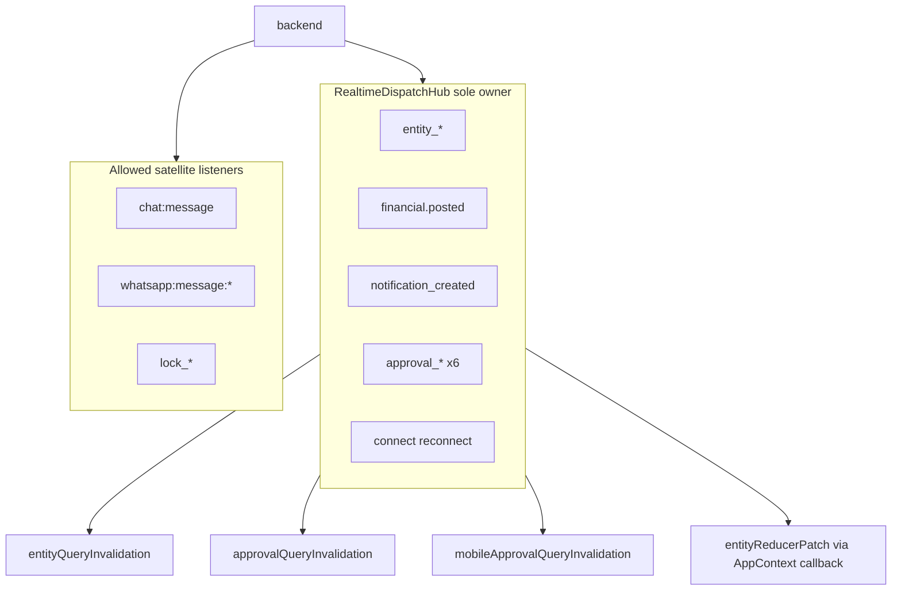

# Phase 2A A3.5 — Final Hardening

**Date:** 2026-06-19  
**Authority:** [multi-user-sync-phase2a-a3-implementation-plan-v2.md](multi-user-sync-phase2a-a3-implementation-plan-v2.md) § Phase A3.5  
**Prerequisites:** A3.1–A3.4 complete (hub owns connect + all core socket events; mobile hooks are query-only)  
**Status:** Plan only — **awaiting approval. No production code.**

---

## Executive Summary

A3.5 closes Phase 2A A3 by removing the last duplicate socket path (`useRealtimeQuerySync`), completing CI ownership gates deferred from A3.1/A3.3, hardening regression tests, and resolving deferred **LOW** findings from the A3.1, A3.3, and A3.4 reviews. No backend or payload changes.

---

## Completed Work Summary (A3.1–A3.4)

| Phase | Shipped | Notes |
|-------|---------|-------|
| **A3.1** | [RealtimeDispatchHub.ts](../../services/realtime/RealtimeDispatchHub.ts), [entityReducerPatch.ts](../../services/realtime/entityReducerPatch.ts), AppContext hub init, reconnect R1–R6 tests, Sidebar/ChatModal `getRealtimeSocket` | A3.2 routing absorbed here |
| **A3.3** | Procurement hook dedupe, hub `approval_*`, [approvalQueryInvalidation.ts](../../services/realtime/approvalQueryInvalidation.ts), workflow socket removal | V9 symmetry tests |
| **A3.4** | Mobile hook socket removal, [mobileApprovalQueryInvalidation.ts](../../services/realtime/mobileApprovalQueryInvalidation.ts), hub `mobile-command-center` on `notification_created` | Two-channel approval model |



---

## 1. Findings (Post-A3.4 Audit)

### 1.1 RealtimeDispatchHub — healthy, minor polish

- **Ownership:** Sole production `connectRealtimeSocket()` caller; binds 5 core events + 6 approval events + `connect`.
- **Approval path:** Tenant guard only → `invalidateApprovalQueries()` + `invalidateMobileApprovalQueries()` — correct per audit.
- **Notification path:** Tenant + `userId` guard → `user-notifications`, `mobile-notifications`, `mobile-command-center`.
- **Entity path:** Invalidation delegated to [entityQueryInvalidation.ts](../../services/realtime/entityQueryInvalidation.ts) (internal tenant guard); reducer/bulkRefresh/own-mutation policy in hub — matches A3.1 design.
- **LOW (A3.1):** Hub cleanup + V9 symmetry — **resolved** in tests.
- **LOW polish:** Unused re-export `export { getRealtimeSocket }` at bottom of hub — nothing imports it (consumers use [core/socket.ts](../../core/socket.ts) directly).

### 1.2 Invalidation modules — no duplicate logic

| Module | Role | Status |
|--------|------|--------|
| [entityQueryInvalidation.ts](../../services/realtime/entityQueryInvalidation.ts) | Entity/financial map | Extended A3.3 (PO report, bill→PO, GRN parity); comments accurate |
| [approvalQueryInvalidation.ts](../../services/realtime/approvalQueryInvalidation.ts) | 8 ERP keys | Frozen per A3.4 constraint; mutation hooks still import for `onSuccess` |
| [mobileApprovalQueryInvalidation.ts](../../services/realtime/mobileApprovalQueryInvalidation.ts) | `mobile-approvals` only | Thin helper; no duplication |
| [entityEventRefreshPolicy.ts](../../services/realtime/entityEventRefreshPolicy.ts) | Reconnect/own-mutation policy | Hub-exclusive; no drift |

**AppContext mutation path:** [AppContext.tsx](../../context/AppContext.tsx) ~1546 calls `invalidateQueriesForEntityEvent` after local unit API save — **intentional mutation invalidation**, not socket duplication. **Do not remove.**

### 1.3 AppContext socket ownership — correct

- Socket effect (~1879): `initRealtimeDispatchHub({ ... onEntityReducerPatch, scheduleRefresh, runRefreshFromApi })`.
- No inline `s.on('entity_*')` / `handleNotificationCreated` remains.
- `disconnectRealtimeSocket()` on unauth paths — correct complement to hub lifecycle.

### 1.4 Sidebar / ChatModal — correct

- [Sidebar.tsx](../../components/layout/Sidebar.tsx), [ChatModal.tsx](../../components/chat/ChatModal.tsx): `getRealtimeSocket()` + `chat:message` only — allowed satellite pattern.

### 1.5 Mobile hooks — A3.4 complete

- [useMobileNotifications.ts](../../modules/executive-mobile/hooks/useMobileNotifications.ts): query-only + 60s poll.
- [useMobileCommandCenter.ts](../../modules/executive-mobile/hooks/useMobileCommandCenter.ts): query-only + 90s poll.
- [useMobileApprovals.ts](../../modules/executive-mobile/hooks/useMobileApprovals.ts): mutation `onSuccess` invalidations preserved — correct.

### 1.6 Remaining dead / duplicate code (A3.5 primary targets)

| Item | Severity | Detail |
|------|----------|--------|
| **[useRealtimeQuerySync.ts](../../hooks/useRealtimeQuerySync.ts)** | **HIGH (latent duplicate)** | Still registers `entity_*` + `financial.posted` socket listeners calling `invalidateQueriesForEntityEvent`. **Not imported anywhere** in the repo — dead but dangerous if re-mounted. Contains **`apiMode` in `useEffect` deps without definition** (latent ReferenceError). |
| **[verify-realtime-hub-gates.mjs](../../scripts/verify-realtime-hub-gates.mjs)** | **HIGH (CI gap)** | Only enforces `connectRealtimeSocket` ownership. Entity/approval/notification gates **deferred from A3.1/A3.3** — still missing. |
| **Duplicate hub tests** | LOW (A3.4) | Two near-identical foreign-tenant approval tests in [RealtimeDispatchHub.test.ts](../../tests/RealtimeDispatchHub.test.ts) |
| **Weak key assertion on notification_created** | LOW (A3.4) | Test asserts `invalidateCalls === 3` but does not assert `mobile-command-center` key explicitly |
| **No dedicated test for mobileApprovalQueryInvalidation** | LOW | Covered indirectly via hub tests only |
| **No post-A3 implementation notes doc** | LOW (v2 plan) | [multi-user-sync-phase2a-a3-implementation-notes.md](multi-user-sync-phase2a-a3-implementation-notes.md) missing |
| **Entity → command center refresh** | LOW (A3.4, pre-existing) | Dead listeners never worked; hub does not invalidate `mobile-command-center` on `entity_*`. Accept as documented limitation unless product requests hub extension. |
| **Requester bell on terminal approval** | LOW (A3.4, backend behavior) | No `notification_created` on final approve/reject; requesters rely on tenant `workflow` / `mobile-approvals`. Document in implementation notes — **no backend change in A3.5**. |

### 1.7 Current socket listener map (production)

| File | Events | Verdict |
|------|--------|---------|
| RealtimeDispatchHub | entity_*, financial.posted, notification_created, approval_* ×6, connect | **Hub owner** |
| useRecordLock | lock_acquired, lock_released | Allowed satellite |
| Sidebar, ChatModal | chat:message | Allowed satellite |
| Header, WhatsApp* | whatsapp:message:* | Allowed satellite |
| **useRealtimeQuerySync** | entity_*, financial.posted | **Remove (A3.5)** |

---

## 2. Cleanup Candidates

### Required (A3.5 scope)

1. **Retire `useRealtimeQuerySync` socket wiring**
   - **Preferred:** Delete [hooks/useRealtimeQuerySync.ts](../../hooks/useRealtimeQuerySync.ts) entirely (zero importers).
   - **Alternative:** Strip to a no-op stub with deprecation comment if team wants to preserve the export name — not recommended given zero usage.

2. **Complete [scripts/verify-realtime-hub-gates.mjs](../../scripts/verify-realtime-hub-gates.mjs)**

   Forbidden outside allowlist (production `.ts/.tsx`):

   | Pattern | Allowed in |
   |---------|------------|
   | `connectRealtimeSocket(` | `core/socket.ts`, `RealtimeDispatchHub.ts`, tests (existing) |
   | `socket.on('entity_created'` / `entity_updated` / `entity_deleted` | Hub only (+ test mocks) |
   | `socket.on('financial.posted'` | Hub only (+ test mocks) |
   | `socket.on('notification_created'` | Hub only (+ test mocks) |
   | `socket.on('approval_` | Hub only (+ test mocks) |

   **Explicit allowlist** (satellite UI — must use `getRealtimeSocket`, not `connectRealtimeSocket`):

   - `hooks/useRecordLock.ts` — `lock_*`
   - `components/layout/Sidebar.tsx`, `components/chat/ChatModal.tsx` — `chat:message`
   - `components/layout/Header.tsx`, `components/whatsapp/WhatsAppSidePanel.tsx`, `components/whatsapp/WhatsAppChatWindow.tsx` — `whatsapp:message:*`

3. **Regression grep tests** — extend [tests/RealtimeDispatchHub.test.ts](../../tests/RealtimeDispatchHub.test.ts) or add [tests/mobileRealtimeListeners.test.ts](../../tests/mobileRealtimeListeners.test.ts):
   - Confirm mobile hooks remain socket-free (already in hub test file — keep)
   - Assert hub `handleApprovalEvent` body has no `sourceUserId`
   - Assert `useRealtimeQuerySync` absent or socket-free after deletion

4. **Test hardening (LOW findings)**
   - Deduplicate redundant foreign-tenant approval tests (keep one with `sourceUserId` present)
   - Assert explicit keys on `notification_created`: `user-notifications`, `mobile-notifications`, `mobile-command-center`
   - Optional: small [tests/mobileApprovalQueryInvalidation.test.ts](../../tests/mobileApprovalQueryInvalidation.test.ts) for single-key helper

5. **Documentation:** Create [multi-user-sync-phase2a-a3-implementation-notes.md](multi-user-sync-phase2a-a3-implementation-notes.md) — final architecture record, two-channel approval model, allowed satellite listeners, known limitations (command center entity refresh, requester bell).

6. **Wire gate into test suite:** Document `npm run verify:track-a3` alongside `test:phase1-sync` in implementation notes; optional: spawn gate from a tiny node test.

### Optional (non-blocking)

| Item | Benefit |
|------|---------|
| Remove unused `export { getRealtimeSocket }` from hub | Clarity |
| Extract `notificationQueryInvalidation.ts` from hub handler | Symmetry with approval/mobile helpers; easier key testing |
| Hub `entity_*` → prefix invalidate `mobile-dashboard` | Closes A3.4 LOW gap for command-center entity refresh — **product decision** |
| Consolidate grep tests into dedicated `mobileRealtimeListeners.test.ts` | Cleaner test layout |
| Update [multi-user-sync-phase2a-a3-review-v2.md](multi-user-sync-phase2a-a3-review-v2.md) header to "superseded by implementation notes" | Doc hygiene |

---

## 3. Required Fixes (Implementation Sequence)

### Step 1 — Remove dead duplicate socket path

- Delete [hooks/useRealtimeQuerySync.ts](../../hooks/useRealtimeQuerySync.ts) (or gut to empty deprecated export if deletion blocked — prefer delete).
- Grep repo for imports; remove any stale references in comments.

### Step 2 — Complete CI ownership gates

Extend [scripts/verify-realtime-hub-gates.mjs](../../scripts/verify-realtime-hub-gates.mjs):

```
Gate 1: connectRealtimeSocket ownership (existing)
Gate 2: entity_* + financial.posted + notification_created socket.on ownership
Gate 3: approval_* socket.on ownership
Gate 4 (soft): satellite files must not call connectRealtimeSocket
```

Output: single pass/fail with offender file list per gate.

### Step 3 — Test hardening

Update [tests/RealtimeDispatchHub.test.ts](../../tests/RealtimeDispatchHub.test.ts):

- Explicit `notification_created` key list assertion
- Remove duplicate foreign-tenant test
- Optional fixture test proving gate would catch reintroduced hook listeners

Register any new test file in `package.json` → `test:phase1-sync`.

### Step 4 — Implementation notes + mark A3 complete

Create [multi-user-sync-phase2a-a3-implementation-notes.md](multi-user-sync-phase2a-a3-implementation-notes.md) with:

- Final listener ownership diagram
- Invalidation module responsibilities
- Mutation-local invalidations that intentionally remain in hooks/AppContext
- Resolved LOW items checklist
- Open product questions (requester bell, entity→mobile-dashboard) — backend follow-up only

---

## 4. Optional Fixes

Defer unless requested in same PR:

- `notificationQueryInvalidation.ts` extraction
- Hub entity path → mobile dashboard invalidation
- Remove hub `getRealtimeSocket` re-export

---

## 5. Risk Assessment

| Risk | Severity | Mitigation |
|------|----------|------------|
| Re-introducing duplicate invalidation via `useRealtimeQuerySync` | Medium (latent today) | Delete file + CI gate 2 |
| CI gate false positives on satellite listeners | Medium | Explicit allowlist per file/event |
| CI gate false negatives (dynamic event strings) | Low | Gate literal patterns; grep tests as backup |
| Over-aggressive gate blocks AppContext mutation `invalidateQueriesForEntityEvent` | Low | Gate targets `socket.on`, not direct invalidation calls |
| Removing `useRealtimeQuerySync` breaks unknown dynamic import | Very low | Grep shows zero imports; verify in Step 1 |
| Document-only changes miss runtime bugs | Low | `test:phase1-sync` + `verify:track-a3` + `build` |

---

## 6. Rollback Strategy

1. Revert A3.5 PR only.
2. Restore [hooks/useRealtimeQuerySync.ts](../../hooks/useRealtimeQuerySync.ts) if deletion causes unexpected import failure.
3. Revert extended [verify-realtime-hub-gates.mjs](../../scripts/verify-realtime-hub-gates.mjs) to connect-only gate (A3.1 baseline).
4. A3.1–A3.4 hub/mobile/workflow behavior remains intact — A3.5 is hygiene + guards, not routing changes.

---

## 7. Test Strategy

### Unit / integration

| Test | Assert |
|------|--------|
| Existing `test:phase1-sync` (68+ tests) | All pass unchanged after routing-neutral cleanup |
| Hub approval ×6 | Still 9 invalidations (8 + mobile-approvals); tenant guard; no sourceUserId in handler |
| Hub notification_created | Explicit 3 keys including `mobile-command-center` |
| Mobile hook grep | No `socket.on`, no `getRealtimeSocket`, no `approval_` |
| Procurement/workflow grep | Unchanged from A3.3 |
| `mobileApprovalQueryInvalidation.test.ts` (optional) | Single-key invalidation |

### CI gates

```powershell
npm run test:phase1-sync
npm run verify:track-a3   # gates 1–3 after A3.5
npm run build
npm run verify:track-e2   # existing realtime track (unchanged)
```

### Manual smoke (staging, two users)

| # | Scenario | Expected |
|---|----------|----------|
| 1 | Remote PO edit | Desktop procurement lists refresh (hub entity path) |
| 2 | Remote approval action | Workflow queue + mobile approvals refresh once (no double) |
| 3 | Bell notification to approver | User notifications + mobile notifications + command center refresh |
| 4 | Chat badge | Sidebar/ChatModal still update on `chat:message` |
| 5 | Record lock UI | `useRecordLock` still works |
| 6 | Introduce test violation locally | `verify:track-a3` fails when adding `socket.on('entity_created'` to a hook |

---

## 8. Files Affected (A3.5)

| File | Change |
|------|--------|
| [hooks/useRealtimeQuerySync.ts](../../hooks/useRealtimeQuerySync.ts) | **Delete** (preferred) |
| [scripts/verify-realtime-hub-gates.mjs](../../scripts/verify-realtime-hub-gates.mjs) | Complete gates 2–3 + satellite allowlist |
| [tests/RealtimeDispatchHub.test.ts](../../tests/RealtimeDispatchHub.test.ts) | Dedupe + explicit notification keys |
| [tests/mobileApprovalQueryInvalidation.test.ts](../../tests/mobileApprovalQueryInvalidation.test.ts) | Optional new |
| [package.json](../../package.json) | Register new test if added |
| [multi-user-sync-phase2a-a3-implementation-notes.md](multi-user-sync-phase2a-a3-implementation-notes.md) | **New** — post-implementation record |
| [services/realtime/RealtimeDispatchHub.ts](../../services/realtime/RealtimeDispatchHub.ts) | Optional: remove unused re-export only |

**Not modified:** backend, `approvalQueryInvalidation.ts`, payload types, A1 queue, `latestStateRef`, changeLogMerge, workflow module, hub routing logic.

---

## 9. LOW Findings Resolution Matrix

| Source | Finding | A3.5 resolution |
|--------|---------|-----------------|
| A3.1 review | Hub cleanup / reconnect tests | Done A3.1 — no action |
| A3.1 review | Tenant switch full re-init | Done A3.1 — document in notes |
| A3.1 review | CI gates deferred | **Gate 2–3 in A3.5** |
| A3.3 review | `['notifications']` key parity | Done — no action |
| A3.3 review | Mutation invalidation not in central maps | Document + gate prevents socket-path duplication |
| A3.3 review | Full entity listener CI deferred | **Gate 2 in A3.5** |
| A3.4 review | Duplicate foreign-tenant tests | Dedupe in A3.5 |
| A3.4 review | notification_created key assertion weak | Explicit key test in A3.5 |
| A3.4 review | Entity → command center (pre-existing) | Document limitation; optional hub extension deferred |
| A3.4 review | Requester bell on terminal approval | Document limitation; backend CR deferred |

---

## 10. Approval Gate

Before implementation:

- [ ] Accept deletion of `useRealtimeQuerySync.ts` (zero importers)
- [ ] Accept full CI gates with satellite allowlist
- [ ] Accept no hub routing / backend changes in A3.5
- [ ] Accept entity→mobile-dashboard remains out of scope unless optional fix explicitly included

**Do not implement production code until this plan is approved.**

---

## References

- [multi-user-sync-phase2a-a3-implementation-plan-v2.md](multi-user-sync-phase2a-a3-implementation-plan-v2.md)
- [multi-user-sync-phase2a-a3.4-plan.md](multi-user-sync-phase2a-a3.4-plan.md)
- [multi-user-sync-phase2a-a3.3-plan.md](multi-user-sync-phase2a-a3.3-plan.md)
- [multi-user-sync-phase2a-a3-review-v2.md](multi-user-sync-phase2a-a3-review-v2.md)
