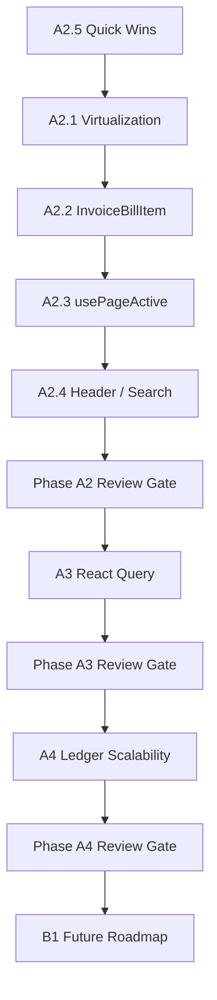
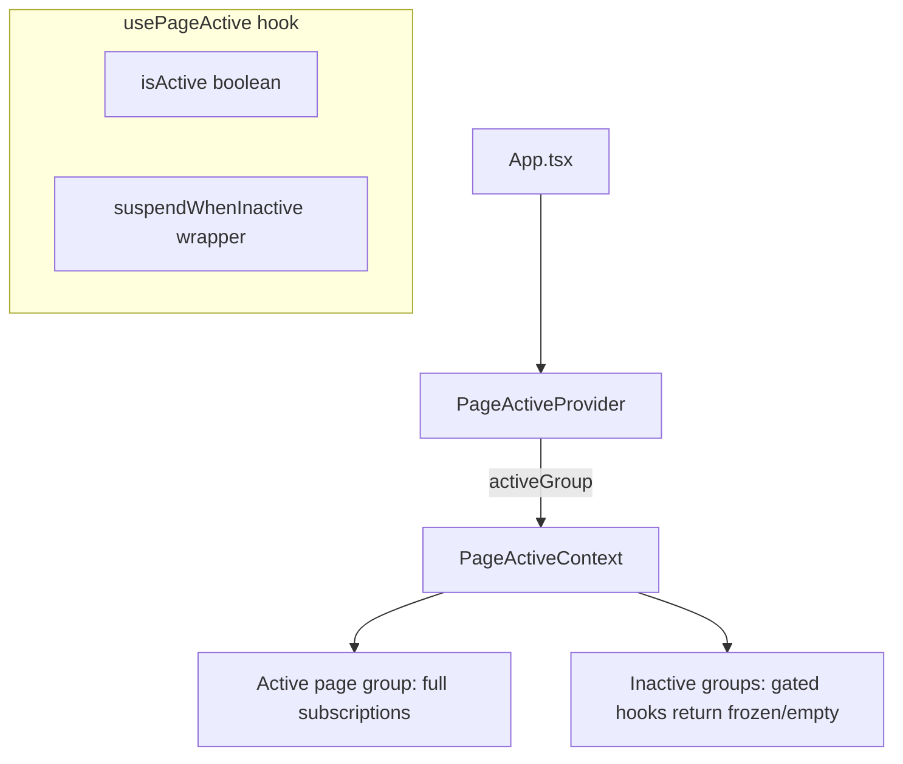
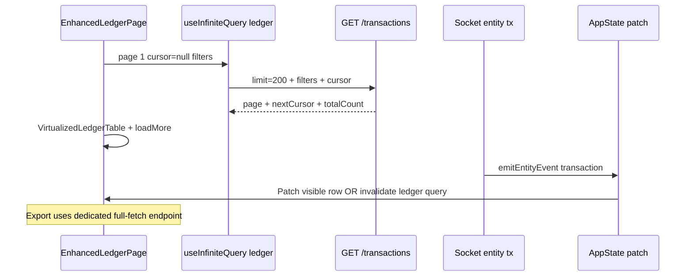

# PBooksPro Performance Implementation Plan (V1)

**Document:** Master execution plan for approved React Performance Audit findings  
**Date:** 2026-06-19  
**Authority:** `docs/performance/PERFORMANCE_AUDIT_V1.md`  
**Status:** Planning only — no code changes until phase review gates pass  

**Constraints (non-negotiable):**

- Multi-user synchronization architecture MUST NOT change (`emitEntityEvent`, socket invalidation, LWW, audit pipeline remain as-is).
- Architecture V2.1 compliance required for all backend/API work.
- Each phase requires formal review + baseline measurement update in `PERFORMANCE_BASELINE.md` before the next phase starts.

---

## 1. Executive Summary

The approved audit identified **seven CRITICAL** and **ten HIGH** performance findings across React rendering, table DOM scale, React Query over-fetch, and persistent page architecture. PBooksPro already has strong foundations: selective `appStateStore` subscriptions, `react-window` on major financial grids, and backend cursor pagination on `GET /transactions` (unused by the ledger UI).

This plan sequences work into four executable frontend phases (**A2–A4**) plus a documented future architectural backlog (**B1**). The strategy prioritizes **user-visible DOM wins first** (virtualization), then **rerender fan-out reduction** (InvoiceBillItem, page gates, Header/Search), then **data-layer pagination** (React Query, ledger), and finally **structural store improvements** (B1 — future only).

| Phase | Focus | Duration (est.) | Cumulative gain (est.) |
|-------|--------|-----------------|------------------------|
| **A2.5** | Quick wins | 0.5–1 day | 5–15% hot-path CPU |
| **A2.1** | Table virtualization | 3–5 days | 40–70% on affected screens |
| **A2.2** | InvoiceBillItem refactor | 2–3 days | 50–80% row rerenders |
| **A2.3** | Hidden page subscription gate | 2–4 days | 20–40% background work |
| **A2.4** | Header / GlobalSearch | 2–3 days | 15–25% chrome rerenders |
| **A3** | React Query pagination | 5–8 days | 30–60% procurement/rental load |
| **A4** | Ledger server pagination | 8–15 days | Enables 500k+ tx scale |
| **B1** | Architectural (future) | Multi-sprint | Foundational scale |

**Total executable scope (A2–A4):** approximately **4–6 weeks** with phase review gates.

---

## 2. Recommended Execution Order



### Phase review gates

After each phase:

1. Update `docs/performance/PERFORMANCE_BASELINE.md` with measured metrics.
2. Update `docs/performance/PERFORMANCE_CHANGELOG.md` with task IDs and verified gains.
3. Update `docs/performance/PERFORMANCE_IMPLEMENTATION_PLAN.md` phase statuses.
4. Run regression checklist (see §9 Testing Matrix).
5. Staging release (`npm run release:staging`) only after A2 complete; production after A4 review.

### Dependency graph (critical path)

| Task | Blocks |
|------|--------|
| A2.5 | Nothing — start immediately |
| A2.1 | A2.2 (InvoiceBillItem used in some list contexts) — can parallelize Broker/Vendor/Employee |
| A2.3 | A2.4 (Header benefits from page-active context) — soft dependency |
| A3 PO/GRN | Independent of A2 but shares React Query patterns |
| A4 | Requires A2.1 VirtualizedLedgerTable patterns; does NOT require B1 slice notify |

---

## 3. Phase A2 — React Optimization (Detailed Plan)

### A2.1 — Table Virtualization

**Task ID:** `PERF-A2.1`  
**Priority:** P0  
**Complexity:** Medium  
**Dependencies:** None (reference: `OwnerLedger.tsx`, `SmartTable.tsx`, `VirtualizedLedgerTable.tsx`)  
**Library available:** `react-window` v2.2.3 (`List` component) — already in `package.json`; `SmartTable` in `components/erp/SmartTable.tsx` (auto-virtualize threshold 60).

---

#### A2.1.1 — ContactsPage

| Field | Detail |
|-------|--------|
| **Files** | `components/contacts/ContactsPage.tsx` |
| **Current behavior** | Full HTML `<table>`; `displayLimit=200` initial; `contacts.slice(0, displayLimit).map()`; client sort on 6 columns; text + tab + tree sidebar filters; 8+ `useStateSelector` subscriptions on page |
| **Proposed strategy** | **Option A (recommended):** Extract `ContactsTable` using `SmartTable` with column defs mirroring current columns; `virtualize={true}`, `virtualizeThreshold={50}`, `rowHeight={44}`, `tableHeight` from container ref. **Option B:** Dedicated `VirtualizedContactsTable` copying `OwnerLedger` `List` pattern if SmartTable column renderers insufficient for row actions. Remove load-more pattern; virtual scroll replaces it. |
| **Library** | `SmartTable` + `react-window` (via SmartTable) |
| **Risk** | **Medium** — row click handlers, balance display, WhatsApp actions, selection state must be preserved |
| **Expected gain** | **60–75%** DOM reduction at 200+ contacts; scroll FPS from ~15 → 55+ on mid hardware |
| **Testing** | Sort all columns; filter by tab; tree sidebar filter; row click → edit modal; 500 contact seed; verify no regression on contact create/update socket sync |

---

#### A2.1.2 — BillsPage

| Field | Detail |
|-------|--------|
| **Files** | `components/bills/BillsPage.tsx` |
| **Current behavior** | Inline `<table>`; `displayLimit=200`; complex row types (bills, payments, batches); 9-column sort; tree sidebar; bulk payment selection |
| **Proposed strategy** | Extract `BillsTable` with `SmartTable` or custom `VirtualizedBillsTable`. Pre-compute `filteredRows` in parent (unchanged); pass stable `getRowId`. Use `render` column for action buttons. Preserve expanded payment row UX via row height override or sub-row pattern (may need variable height — evaluate `VirtualizedLedgerTable` group pattern). If variable height too complex: flatten payment rows into separate virtual rows (preferred). |
| **Library** | `SmartTable` first; fallback `react-window` `List` with fixed row height |
| **Risk** | **High** — payment batch rows, bulk selection, print/export hooks |
| **Expected gain** | **55–70%** DOM + paint time at 200+ bills |
| **Testing** | Bulk payment flow; tree filter; sort; load 1000 bill seed; socket bill update while page open; export/print unchanged |

---

#### A2.1.3 — BrokerLedger

| Field | Detail |
|-------|--------|
| **Files** | `components/payouts/BrokerLedger.tsx` |
| **Current behavior** | Full `<tbody>` + `ledgerItems.map()`; client sort; computes ledger from `useTransactions()` + agreements; 7 slice subscriptions |
| **Proposed strategy** | **Clone `OwnerLedger` pattern:** `List` from `react-window`, `LEDGER_ROW_HEIGHT=52`, `overscanCount=6`. Extract `BrokerLedgerRow` memo component. Keep ledger computation in parent `useMemo`. |
| **Library** | `react-window` (same as `OwnerLedger.tsx`) |
| **Risk** | **Low–Medium** — reference implementation exists in-repo |
| **Expected gain** | **70–85%** for 500+ ledger lines |
| **Testing** | Sort columns; broker/property scope filters; WhatsApp action; compare totals vs pre-refactor |

---

#### A2.1.4 — VendorLedger

| Field | Detail |
|-------|--------|
| **Files** | `components/vendors/VendorLedger.tsx` |
| **Current behavior** | Expandable tree rows (bills + child transactions); full DOM map; prepaid/advance logic; export Excel |
| **Proposed strategy** | **Flatten** expandable tree into virtual list rows (parent bill row + indented child rows as separate items with `depth` prop) — same pattern as `VirtualizedLedgerTable` group/child flattening. Variable row height OR fixed height with truncated particulars. |
| **Library** | `react-window` `List`; consider `VirtualizedLedgerTable` as template |
| **Risk** | **High** — expandable rows, prepaid logic, click handlers |
| **Expected gain** | **65–80%** for 300+ ledger items |
| **Testing** | Expand/collapse; prepaid apply rows; click bill vs transaction; Excel export totals match |

---

#### A2.1.5 — EmployeeList

| Field | Detail |
|-------|--------|
| **Files** | `components/payroll/EmployeeList.tsx` |
| **Current behavior** | Full `.map()` on filtered employees; API fetch + localStorage fallback; search filter |
| **Proposed strategy** | Simple `List` virtual scroll; fixed row height ~64px; memoized `EmployeeListRow` |
| **Library** | `react-window` |
| **Risk** | **Low** |
| **Expected gain** | **60–75%** for 200+ employees |
| **Testing** | Search; select employee; CSV export; API failure → localStorage fallback |

---

#### A2.1.6 — PayrollHub Employee Ledger

| Field | Detail |
|-------|--------|
| **Files** | `components/payroll/PayrollHub.tsx` (ledger tab section, ~lines 440–500, 669–725) |
| **Current behavior** | `payrollApi.getEmployeeLedger(id, { limit: 5000 })`; full `<tbody>` map; year/month/type filters |
| **Proposed strategy** | **Two-part:** (1) Virtualize rendered rows with `react-window`. (2) Reduce fetch window to 200 rows + cursor/load-more on scroll (coordinate with A3 if payroll API supports pagination — currently `limit/offset` in API response type exists). Phase A2.1: virtualize existing 5000-cap DOM; Phase A3 follow-up: API page size 100. |
| **Library** | `react-window` |
| **Risk** | **Medium** — payslip/payment row types, CSV export |
| **Expected gain** | **80–90%** paint improvement (5000 → ~20 DOM rows) |
| **Testing** | Employee with 500+ ledger rows; filter by year/month; export CSV row count; payment recording sync |

---

### A2.2 — InvoiceBillItem Refactor

**Task ID:** `PERF-A2.2`  
**Priority:** P0  
**Complexity:** Medium–High  
**Dependencies:** None (benefits from A2.1 list contexts)  
**Estimated gain:** 50–80% fewer row-level rerenders on list pages

#### Current architecture

```
InvoiceBillItem (single file, React.memo export)
├── 11× useStateSelector (contacts, agreements, units, properties, buildings, projects, prefs, invoices…)
├── useLookupMaps() → 13 additional slice subscriptions
├── useDispatchOnly, useNotification, useWhatsApp
├── Local state: isEditModalOpen
└── Renders: Card + actions + Modal(InvoiceBillForm)
```

**Consumers:**

- `components/invoices/InvoiceBillList.tsx`
- `components/mobile/MobilePaymentsPage.tsx`

**Problem:** `React.memo` only compares props. Each row instance owns 24+ store subscriptions → any slice mutation rerenders every mounted row.

#### Proposed architecture

```
InvoiceBillList (container — subscriptions live here)
├── useStateSelector (minimal: only if needed for list-level ops)
├── useLookupMaps() once per list
├── useDispatchOnly, useNotification, useWhatsApp once
├── Resolves per-item display model:
│   InvoiceBillItemViewModel { contactName, contextLabel, balance, statusClasses, … }
└── maps items → InvoiceBillItemView (pure)

InvoiceBillItemView (presentational — NO hooks except maybe useCallback from props)
├── props: viewModel, type, isSelected, selectionMode, callbacks
├── React.memo with custom compare on viewModel.id + viewModel.version + isSelected
└── Modal still in container OR lazy-mounted on edit intent
```

#### Files affected

| File | Action |
|------|--------|
| `components/invoices/InvoiceBillItem.tsx` | Split → `InvoiceBillItemContainer.tsx` + `InvoiceBillItemView.tsx` |
| `components/invoices/InvoiceBillList.tsx` | Wire container; pass resolved view models |
| `components/mobile/MobilePaymentsPage.tsx` | Same container pattern |
| `components/invoices/invoiceBillItemViewModel.ts` (new) | Pure resolver: `(item, lookups, type) → ViewModel` |
| `components/dashboard/SimpleInvoiceBillItem.tsx` | Evaluate alignment (lower priority — already simpler) |

#### Migration steps

1. **Step 1:** Create `buildInvoiceBillItemViewModel()` pure function; unit test with fixture item + lookup maps.
2. **Step 2:** Create `InvoiceBillItemView` — copy JSX from current component; replace hook reads with props.
3. **Step 3:** Create `InvoiceBillItemContainer` wrapping view; move hooks + handlers to container.
4. **Step 4:** Update `InvoiceBillList` to batch-resolve view models in parent `useMemo` keyed by `[items, lookups, enableColorCoding]`.
5. **Step 5:** Update `MobilePaymentsPage`.
6. **Step 6:** Deprecate old default export; re-export container as `InvoiceBillItem` for backward compat.
7. **Step 7:** Remove dead hook imports from view file.

#### Rollback strategy

- Keep `InvoiceBillItem.legacy.tsx` (copy of pre-split file) behind feature flag `VITE_INVOICE_BILL_ITEM_V2=false` for one release cycle.
- Rollback = revert import in `InvoiceBillList` + `MobilePaymentsPage`.

#### Testing requirements

- Render 100 items; React DevTools Profiler: verify single contact update rerenders ≤1 row (the affected item) not 100.
- Edit modal open/close; delete confirm; WhatsApp send; payment record callback.
- Mobile payments page parity.

---

### A2.3 — Hidden Page Subscription Gate

**Task ID:** `PERF-A2.3`  
**Priority:** P1  
**Complexity:** Medium–High  
**Dependencies:** Soft: A2.5 stable selectors  
**Estimated gain:** 20–40% reduction in background subscriptions/effects

#### Current architecture (`App.tsx`)

- `MAX_PERSISTENT_PAGES = 3` (LRU) + **RENTAL group pinned** once visited.
- `renderPersistentPage(groupKey, content)` keeps visited groups mounted with `opacity-0 pointer-events-none invisible` when inactive.
- Up to **4 concurrent page group trees** with live hooks, socket listeners, React Query polling.

#### Proposed architecture



**New files:**

| File | Purpose |
|------|---------|
| `context/PageActiveContext.tsx` | `{ activeGroup: string; isPageGroupActive: (group) => boolean }` |
| `hooks/usePageActive.ts` | `usePageActive(groupKey?)` → `{ isActive }` |
| `hooks/useGatedSubscription.ts` | Wraps `useStateSelector` — returns last snapshot when inactive, unsubscribes optional |

**Behavior when inactive:**

| Concern | Strategy |
|---------|----------|
| `useStateSelector` | Return cached snapshot at deactivation; resume live subscription on activate |
| `useQuery` / polling | `enabled: isActive` on page-scoped queries |
| Expensive `useMemo` | Guard: `if (!isActive) return cachedResult` |
| UI state | **Preserved** — component stays mounted, local `useState` untouched |
| Socket handlers | Page-scoped handlers register only when `isActive` |

#### Affected page groups (gate required)

| Group | Key pages | Hot subscriptions |
|-------|-----------|---------------------|
| `TRANSACTIONS` | EnhancedLedgerPage | transactions, lookup maps |
| `RENTAL` | RentalManagement, Invoices, AR | invoices, agreements, rollup queries |
| `PROJECT` | ProjectManagement, Bills | bills, contracts, projects |
| `VENDORS` | VendorDirectory | vendors, PO/GRN queries |
| `PAYROLL` | PayrollHub | payroll API, transactions |
| `DASHBOARD` | DashboardPage | metrics polling 120s |

**Header/Sidebar:** Always active (exempt from gate).

#### Risk analysis

| Risk | Level | Mitigation |
|------|-------|------------|
| Stale data when returning to page | Medium | On activate: `queryClient.invalidateQueries` for page-scoped keys only |
| Missed socket update while inactive | Medium | AppContext still receives patches; on activate run lightweight diff refresh |
| Broken local UI state | Low | Do not unmount — only gate subscriptions |
| Implementation complexity | Medium | Phase rollout: gate React Query first, then selectors |

#### Testing strategy

1. Navigate Dashboard → Ledger → Invoices → Vendors (4 groups); verify only active group triggers `useDashboardMetrics` / ledger memos in Profiler.
2. Receive socket transaction while on Dashboard; switch to Ledger — data current within 1 refresh cycle.
3. RENTAL pin: navigate away 10 min; return — tree expansion/filter state preserved.
4. Memory snapshot: 4 persistent pages — heap stable vs baseline.

#### Rollback

- Feature flag `VITE_PAGE_ACTIVE_GATE=false` bypasses gating; context always returns `isActive: true`.

---

### A2.4 — Header and GlobalSearch Optimization

**Task ID:** `PERF-A2.4`  
**Priority:** P1  
**Complexity:** Medium  
**Dependencies:** A2.3 (optional, for shared PageActive patterns)  
**Estimated gain:** 15–25% chrome rerenders; 40–60% search idle CPU

#### Header.tsx — subscription map

**Current subscriptions (9 slices + contexts):**

| Hook | Slice / source | Used for |
|------|----------------|----------|
| `useStateSelector` | `currentUser` | Notifications, admin |
| `useStateSelector` | `contacts` | WhatsApp matching |
| `useStateSelector` | `users` | Notification fallback |
| `useStateSelector` | `installmentPlans` | Plan notifications |
| `useStateSelector` | `projects` | Help context |
| `useStateSelector` | `units` | Help context |
| `useStateSelector` | `whatsAppMode` | WhatsApp UI |
| `useStateSelector` | `currentPage` | Help routing |
| `useStateSelector` | `initialTabs` | Help routing |
| `useAuth` | session | User, tenant, company switch |
| `useUserNotifications` | RQ 15s stale | API notifications |
| `usePermissions` | RQ | Admin menu |

**Proposed subscription map:**

| Component (split) | Subscriptions | Notes |
|-------------------|---------------|-------|
| `HeaderCore` | `currentPage`, `currentUser`, theme, viewport | Always mounted |
| `HeaderNotifications` | `useUserNotifications` | Lazy mount on bell open OR idle poll 60s |
| `HeaderWhatsApp` | WhatsApp unread via dedicated hook | Only when authenticated |
| `HeaderHelp` | `projects`, `units` | Lazy on help modal open |
| `HeaderInstallmentBell` | `installmentPlans` | Only when finance role |

**Files affected:** `components/layout/Header.tsx` → split into `HeaderCore.tsx`, `HeaderNotifications.tsx`, `HeaderWhatsAppBadge.tsx`

#### GlobalSearchBar.tsx — subscription map

**Current:** 13 slices always subscribed when bar mounted.

**Proposed:**

1. **Lazy subscription:** Only subscribe to entity slices when `isFocused || debouncedSearch.length > 0`.
2. **Search index strategy:**
   - Phase 1: `buildSearchRows` in `useEffect` + `startTransition` when focused (already partial).
   - Phase 2 (optional): Web Worker index build from serialized snapshot.
   - Phase 3 (A4/B1): Server-side `GET /search?q=` endpoint.
3. **Index caching:** Module-level index keyed by `entityFingerprint` (hash of entity counts + max updatedAt); rebuild only on fingerprint change.

**Files affected:**

- `components/layout/GlobalSearchBar.tsx`
- `components/layout/searchModalResults.ts`
- `hooks/useSearchIndex.ts` (new)

#### Expected gains

| Area | Gain |
|------|------|
| Header idle rerenders | 15–25% |
| GlobalSearch idle (closed) | 40–60% CPU |
| GlobalSearch active typing | 10–20% (transition + fingerprint cache) |

---

### A2.5 — Quick Wins

**Task ID:** `PERF-A2.5`  
**Priority:** P0 (execute first)  
**Complexity:** Low  
**Duration:** 0.5–1 day total

| Task ID | Change | Files | Effort | Risk | Gain |
|---------|--------|-------|--------|------|------|
| `PERF-A2.5.1` | WhatsAppContext value `useMemo` | `context/WhatsAppContext.tsx` | 15 min | Low | Eliminate 37-consumer object churn |
| `PERF-A2.5.2` | Stable selector refs (top 20 hot paths) | `hooks/useSelectiveState.ts` (export selectors), `Header.tsx`, `GlobalSearchBar.tsx`, `EnhancedLedgerPage.tsx`, `InvoicesPage.tsx`, `InvoiceBillItem.tsx` | 2 hr | Low | 5–15% CPU on rerender |
| `PERF-A2.5.3` | Unify org users query key → `['orgUsers']` | `hooks/queries/useOrgUsersQuery.ts`, `modules/report-designer/components/ReportSharePanel.tsx` | 1 hr | Low | Dedupe network + cache |
| `PERF-A2.5.4` | Remove or wire `useInvoicesApiListQuery` | `hooks/queries/useInvoicesApiListQuery.ts` | 30 min | Low | Prevent accidental full fetch |
| `PERF-A2.5.5` | Zustand full-store → selectors | `FundAvailabilityPage.tsx`, `FundAvailabilityFilterBar.tsx`, `ProfitabilityFilterBar.tsx` | 1 hr | Low | 5–10% on those pages |
| `PERF-A2.5.6` | Contacts/Bills `displayLimit` 200 → 50 (interim) | `ContactsPage.tsx`, `BillsPage.tsx` | 15 min | Low | 4× fewer DOM nodes until A2.1 |
| `PERF-A2.5.7` | ProgressContext value `useMemo` | `context/ProgressContext.tsx` | 30 min | Low | Stable progress action refs |

---

## 4. Phase A3 — React Query Optimization (Detailed Plan)

**Phase ID:** `PERF-A3`  
**Priority:** P1  
**Complexity:** Medium–High  
**Dependencies:** A2 phase review gate  
**Constraint:** Sync invalidation patterns unchanged — extend, do not replace.

---

### A3.1 — Purchase Orders Pagination

| Field | Detail |
|-------|--------|
| **Task ID** | `PERF-A3.1` |
| **Endpoint** | `GET /api/v1/purchase-orders` |
| **Current behavior** | Backend `listPurchaseOrders()` returns **full list** with lines; frontend `usePurchaseOrders()` single `useQuery`; key `['purchase-orders', filters]`; staleTime 30s |
| **Proposed behavior** | Backend: add `limit`, `offset`, `cursor`, `totalCount` to list endpoint + repository. Frontend: `useInfiniteQuery` page size 50; summary widget uses existing `usePurchaseOrderReport()` only. |
| **API impact** | New query params; backward compatible default `limit=50` |
| **Frontend impact** | `PurchaseOrdersPage.tsx`, `hooks/usePurchaseOrders.ts`, `services/purchaseOrdersApi.ts` |
| **Risk** | **Medium** — PO lines embedded in list response; may need list DTO without lines + detail fetch |
| **Gain** | **50–70%** initial load for 500+ POs |

---

### A3.2 — Goods Receipts Pagination

| Field | Detail |
|-------|--------|
| **Task ID** | `PERF-A3.2` |
| **Endpoint** | `GET /api/v1/goods-receipts` |
| **Current behavior** | Full list; `GoodsReceiptsPage` + `PurchaseOrderActivitySidebar` duplicate prefix keys |
| **Proposed behavior** | Same infinite query pattern as A3.1; consolidate sidebar to shared hook with `purchaseOrderId` filter |
| **API impact** | Add pagination params to `listGoodsReceipts` |
| **Frontend impact** | `hooks/useGoodsReceipts.ts`, `components/procurement/GoodsReceiptsPage.tsx`, `PurchaseOrderActivitySidebar.tsx` |
| **Risk** | **Medium** |
| **Gain** | **50–65%** on procurement screens |

---

### A3.3 — Owner Balances Pagination

| Field | Detail |
|-------|--------|
| **Task ID** | `PERF-A3.3` |
| **Endpoint** | `GET /api/v1/rental/owner-balances` |
| **Current behavior** | `useAllOwnerBalancesRollupQuery` fetches `limit: 12000`; 120s stale; used by Property Layout, Owner Payouts |
| **Proposed behavior** | Paginated list default 500; owner-scoped fetch unchanged (`ownerId` param); dashboard aggregates via separate summary endpoint or first page + “load all” explicit action |
| **API impact** | `rentalOwnerSummariesRoutes.ts`, `ownerRentalSummaryService.ts` — add cursor on `(owner_id, property_id)` |
| **Frontend impact** | `hooks/queries/useRentalRollupQueries.ts`, `OwnerPayoutsReport.tsx`, `PropertyLayoutReport.tsx` |
| **Risk** | **Medium–High** — payout workflows may need full balance set; provide “Load all balances” for admin |
| **Gain** | **60–80%** payload reduction on rental dashboards |

---

### A3.4 — Infinite Query Opportunities

| Task ID | Target | Pattern |
|---------|--------|---------|
| `PERF-A3.4.1` | Purchase orders | `useInfiniteQuery` + `getNextPageParam` |
| `PERF-A3.4.2` | Goods receipts | Same |
| `PERF-A3.4.3` | Workflow approval queue | `useWorkflow` queue — page size 25 |
| `PERF-A3.4.4` | User notifications | Optional — currently small |
| `PERF-A3.4.5` | Unposted transactions (mobile) | `useUnpostedTransactions` list |

**Shared utility:** `hooks/queries/createInfiniteListQuery.ts` — standardize page param, `placeholderData: (prev) => prev`.

---

### A3.5 — Cache Strategy Review

| Query tier | Current | Proposed |
|------------|---------|----------|
| Financial (ledger, invoices) | 30s stale, refetchOnFocus | Keep; add `gcTime` 15m for paginated pages |
| Operational (PO, GRN) | 2m stale | 2m stale; **no refetchOnFocus** for infinite lists |
| Rollup (owner balances) | 120s | 120s + paginated; invalidate on `rental` socket events only |
| Dashboard metrics | 60s + 120s interval | Gate interval with `usePageActive('DASHBOARD')` |
| Client AppState queries (investor/profitability) | 7 parallel | Defer to B1 — document-only consolidation |

**Duplicate key cleanup (A3.5.1):**

- Merge `['reports','orgUsers']` + `['orgUsersForShare']` → `['orgUsers']`
- Document canonical keys in `hooks/queries/queryKeys.ts`

---

## 5. Phase A4 — Ledger Scalability (Detailed Plan)

**Phase ID:** `PERF-A4`  
**Priority:** P0 (structural)  
**Complexity:** High  
**Dependencies:** A2.1 VirtualizedLedgerTable patterns; backend pagination already exists  
**Target scale:** 500,000+ transactions per tenant

### Current flow

```mermaid
sequenceDiagram
    participant UI as EnhancedLedgerPage
    participant Hook as usePaginatedTransactions
    participant Store as AppState transactions
    participant API as GET /transactions

    Note over UI,API: Current (API mode)
    UI->>Hook: pageSize 200
    Hook->>Store: useStateSelector all transactions
    Store-->>UI: Full array (10k–500k rows)
    UI->>UI: useMemo filter/sort/group O(n)
    UI->>UI: VirtualizedLedgerTable window
    Note over Hook,API: loadMore is no-op; API pagination unused
```

**Key files:**

- `hooks/usePaginatedTransactions.ts` — stub pagination
- `components/transactions/EnhancedLedgerPage.tsx` — full in-memory pipeline
- `services/api/repositories/transactionsApi.ts` — supports `limit`, `cursorDate`, `cursorId` (default limit 500k!)
- `backend/.../transactionsRoutes.ts` + `transactionsService.ts` — cursor keyset pagination implemented

### New flow



### Backend changes

| Task ID | Change | File |
|---------|--------|------|
| `PERF-A4.B1` | Add filter params: `accountId`, `categoryId`, `contactId`, `search` (ILIKE) | `transactionsService.ts`, routes |
| `PERF-A4.B2` | Return `{ items, nextCursor, totalCount, hasMore }` envelope | routes + apiResponse |
| `PERF-A4.B3` | Export endpoint `GET /transactions/export` — async job for >10k rows | new route or extend existing |
| `PERF-A4.B4` | Index review: `(tenant_id, date DESC, id DESC)` composite | migration if missing |
| `PERF-A4.B5` | Cap default `limit` to 500 (remove 500k client default) | `transactionsApi.ts` |

### Frontend changes

| Task ID | Change | File |
|---------|--------|------|
| `PERF-A4.F1` | Replace `usePaginatedTransactions` with `useLedgerTransactionsQuery` infinite | new hook |
| `PERF-A4.F2` | Map API filters ↔ `FilterCriteria` in EnhancedLedgerPage | EnhancedLedgerPage |
| `PERF-A4.F3` | Socket handler: upsert row in query cache if in loaded window; else invalidate | `useUserNotifications` pattern |
| `PERF-A4.F4` | Month view: server `startDate`/`endDate` filter (not client slice) | EnhancedLedgerPage |
| `PERF-A4.F5` | Export: call export endpoint; progress via ProgressContext | EnhancedLedgerPage |
| `PERF-A4.F6` | Keep AppState transactions for **mutations + other pages**; ledger reads from RQ | document boundary |

### Synchronization preservation

| Requirement | Approach |
|-------------|----------|
| Real-time updates | Socket → `queryClient.setQueryData` patch or scoped invalidate — **same events, different cache target** |
| LWW conflicts | Unchanged — mutations still via AppContext/API client |
| Other pages using `useTransactions()` | Unchanged — AppState hydration continues for non-ledger consumers |
| Multi-user | Visible page invalidates on foreign `entity:transaction` events |

### Migration strategy

1. **Phase A4-alpha:** Feature flag `VITE_LEDGER_SERVER_PAGINATION=true` (staging only).
2. **Phase A4-beta:** Dual-run — compare totals/counts between AppState filter and API filter in dev overlay.
3. **Phase A4-GA:** Default on; AppState tx array lazy-loaded (hydrate on demand for other modules) — **future B1 item**.
4. Update `usePaginatedTransactions` deprecated alias → new hook.

### Rollback strategy

- Feature flag off → revert to AppState full array path (existing code path preserved for 2 releases).
- No database rollback required.

### Testing requirements

- 100k transaction seed: initial load < 2s; scroll 60 FPS.
- Filter by account, category, date range — results match SQL spot checks.
- Create transaction on Client A → visible on Client B ledger within socket SLA.
- Export 50k rows — completes without browser OOM.
- Month navigator + “all” view parity with current behavior.

---

## 6. Phase B1 — Future Roadmap (Document Only)

**Status:** FUTURE PHASE — do not implement during A2–A4.

| Task ID | Item | Rationale | Est. effort |
|---------|------|-----------|-------------|
| `PERF-B1.1` | **Slice-level notifications** in `appStateStore` | Only notify tx subscribers on tx change; reduces 200+ fan-out | 2–3 weeks |
| `PERF-B1.2` | **AuthContext split** (session vs actions) | 85 consumers; loading flag cascades | 1 week |
| `PERF-B1.3` | **KPIContext redesign** | Lazy `allKpis`; decouple from live COA | 3–5 days |
| `PERF-B1.4` | **Lookup map optimization** | Store-level memoized maps per entity type | 1 week |
| `PERF-B1.5` | **AppState scalability roadmap** | Lazy hydration per module; reduce initial bulk load | 3–4 weeks |
| `PERF-B1.6` | **Server-side global search** | Replace 13-slice client index | 2 weeks |
| `PERF-B1.7` | **Investor/profitability query consolidation** | 7 RQ passes → 1 server analytics endpoint | 2 weeks |

---

## 7. Estimated Performance Gains

| Phase / Task | Metric | Before (est.) | After (est.) | Gain |
|--------------|--------|---------------|--------------|------|
| A2.1 Contacts 500 rows | DOM nodes | ~6000 | ~800 | **87%** |
| A2.1 Bills 500 rows | First paint | ~2.5s | ~0.6s | **76%** |
| A2.1 Payroll ledger 5000 | Scroll FPS | ~12 | ~58 | **380%** |
| A2.2 InvoiceBillItem 100 rows | Rerender count on 1 invoice edit | 100 | 1–3 | **97%** |
| A2.3 Page gate 4 groups | Background query polls | 4 active | 1 active | **75%** |
| A2.4 Header idle | Renders/min on tx sync | ~30 | ~5 | **83%** |
| A3 PO 500 items | Payload size | ~2 MB | ~200 KB | **90%** |
| A4 Ledger 100k tx | Initial load | ~8s | ~1.5s | **81%** |
| A4 Ledger 500k tx | Browser heap | OOM risk | Stable | **Enables scale** |

**Overall UX target after A2–A4:** Dashboard load −30%; Ledger scroll consistently >55 FPS at 100k rows; procurement pages −50% API time.

---

## 8. Risk Matrix

| Task ID | Risk level | Likelihood | Impact | Mitigation |
|---------|------------|------------|--------|------------|
| PERF-A2.1.2 BillsPage | High | Medium | High | Flatten payment rows; extensive QA on bulk pay |
| PERF-A2.1.4 VendorLedger | High | Medium | High | Golden-file ledger totals |
| PERF-A2.2 InvoiceBillItem | Medium | Low | High | Feature flag rollback |
| PERF-A2.3 Page gate | Medium | Medium | Medium | Stale refresh on activate |
| PERF-A2.4 Header split | Low | Low | Low | Incremental extract |
| PERF-A3.1 PO pagination | Medium | Medium | Medium | List DTO without lines |
| PERF-A3.3 Owner balances | High | Medium | High | Admin “load all” escape hatch |
| PERF-A4 Ledger | High | Medium | Critical | Dual-run beta; feature flag |
| PERF-B1.* | High | Low | Critical | Deferred — design review first |

---

## 9. Testing Matrix

| Task | Unit | Integration | Manual | Performance |
|------|------|-------------|--------|-------------|
| A2.1 Virtualization | Row renderer | Page load + sort | Scroll 500+ rows | FPS measure in baseline |
| A2.2 InvoiceBillItem | viewModel builder | List + mobile | Edit/delete/pay | Profiler rerender count |
| A2.3 Page gate | usePageActive | 4-group navigation | Socket while inactive | Memory heap snapshot |
| A2.4 Header/Search | selector stability | Search navigate | Focus/blur search | Chrome idle CPU |
| A3 RQ pagination | query key helpers | PO/GRN pages | Infinite scroll | Network payload size |
| A4 Ledger | cursor parser | Filter parity | Multi-user sync | 100k seed load time |

**Regression suite (every phase):**

- `npm run build:backend`
- `npm run test:staging` smoke — login, create tx, verify socket refresh
- Spot-check: rental invoice, bill payment, PO approve, payroll payslip

---

## 10. Rollback Matrix

| Task | Rollback method | Time to rollback | Data impact |
|------|-----------------|------------------|-------------|
| A2.1 Virtualization | Git revert component | < 1 hr | None |
| A2.2 InvoiceBillItem | `VITE_INVOICE_BILL_ITEM_V2=false` | < 30 min | None |
| A2.3 Page gate | `VITE_PAGE_ACTIVE_GATE=false` | < 30 min | None |
| A2.4 Header split | Git revert | < 1 hr | None |
| A2.5 Quick wins | Git revert | < 30 min | None |
| A3 RQ pagination | Revert hook + API params optional | < 2 hr | None |
| A4 Ledger | `VITE_LEDGER_SERVER_PAGINATION=false` | < 1 hr | None |

---

## 11. Success Criteria

### Phase A2 complete when:

- [ ] All six virtualization targets render ≤30 DOM rows regardless of dataset size
- [ ] InvoiceBillItem Profiler shows ≤5% row rerenders on unrelated entity edits
- [ ] Hidden page groups show no React Query polling when inactive (Profiler/network tab)
- [ ] Header rerender count reduced ≥20% vs baseline on transaction socket event
- [ ] All A2 tasks logged in `PERFORMANCE_CHANGELOG.md` with verified results
- [ ] No sync regression: multi-user tx/invoice/bill updates visible within 3s on active page

### Phase A3 complete when:

- [ ] PO + GRN initial fetch payload < 300 KB for 500-item tenant
- [ ] Owner balances default fetch ≤ 500 rows; payout flow functional
- [ ] No duplicate `/users` queries in network tab
- [ ] Infinite scroll loads next page < 500 ms

### Phase A4 complete when:

- [ ] Ledger loads 100k transactions in < 2s (staging, Pakland-scale seed)
- [ ] Scroll maintains ≥55 FPS with virtualization on
- [ ] All existing ledger filters produce correct totals (automated spot-check script)
- [ ] Export 50k+ rows completes via export endpoint without tab crash
- [ ] Socket sync preserved — verified with two concurrent sessions

### Program complete (A2–A4) when:

- [ ] `PERFORMANCE_BASELINE.md` filled for Dashboard, Transactions, Reports, Electron
- [ ] Staging sign-off + production release per `commands.mdc`
- [ ] B1 items documented and prioritized for next quarter

---

## Appendix A — Task Index

| Task ID | Title | Priority | Complexity | Risk | Est. gain |
|---------|-------|----------|------------|------|-----------|
| PERF-A2.5 | Quick wins bundle | P0 | Low | Low | 5–15% |
| PERF-A2.1.1 | ContactsPage virtualization | P0 | Medium | Medium | 60–75% |
| PERF-A2.1.2 | BillsPage virtualization | P0 | High | High | 55–70% |
| PERF-A2.1.3 | BrokerLedger virtualization | P0 | Low | Low–Med | 70–85% |
| PERF-A2.1.4 | VendorLedger virtualization | P1 | High | High | 65–80% |
| PERF-A2.1.5 | EmployeeList virtualization | P1 | Low | Low | 60–75% |
| PERF-A2.1.6 | PayrollHub ledger virtualization | P0 | Medium | Medium | 80–90% |
| PERF-A2.2 | InvoiceBillItem container/view split | P0 | Med–High | Medium | 50–80% |
| PERF-A2.3 | usePageActive subscription gate | P1 | Med–High | Medium | 20–40% |
| PERF-A2.4 | Header + GlobalSearch optimization | P1 | Medium | Low | 15–25% |
| PERF-A3.1 | PO pagination | P1 | Medium | Medium | 50–70% |
| PERF-A3.2 | GRN pagination | P1 | Medium | Medium | 50–65% |
| PERF-A3.3 | Owner balances pagination | P1 | Med–High | Med–High | 60–80% |
| PERF-A3.4 | Infinite query rollout | P1 | Medium | Low | — |
| PERF-A3.5 | Cache strategy review | P2 | Low | Low | 10–20% |
| PERF-A4 | Ledger server pagination | P0 | High | High | Enables 500k+ scale |
| PERF-B1.* | Architectural future items | — | — | — | Foundational |

---

## Appendix B — Related Documents

| Document | Purpose |
|----------|---------|
| `docs/performance/PERFORMANCE_AUDIT_V1.md` | Approved findings source |
| `docs/performance/PERFORMANCE_BASELINE.md` | Metrics before/after |
| `docs/performance/PERFORMANCE_CHANGELOG.md` | Per-task verified results |
| `docs/performance/PERFORMANCE_IMPLEMENTATION_PLAN.md` | Phase status tracker (summary) |

---

*This document is planning-only. Implementation requires phase review approval before any code changes.*
