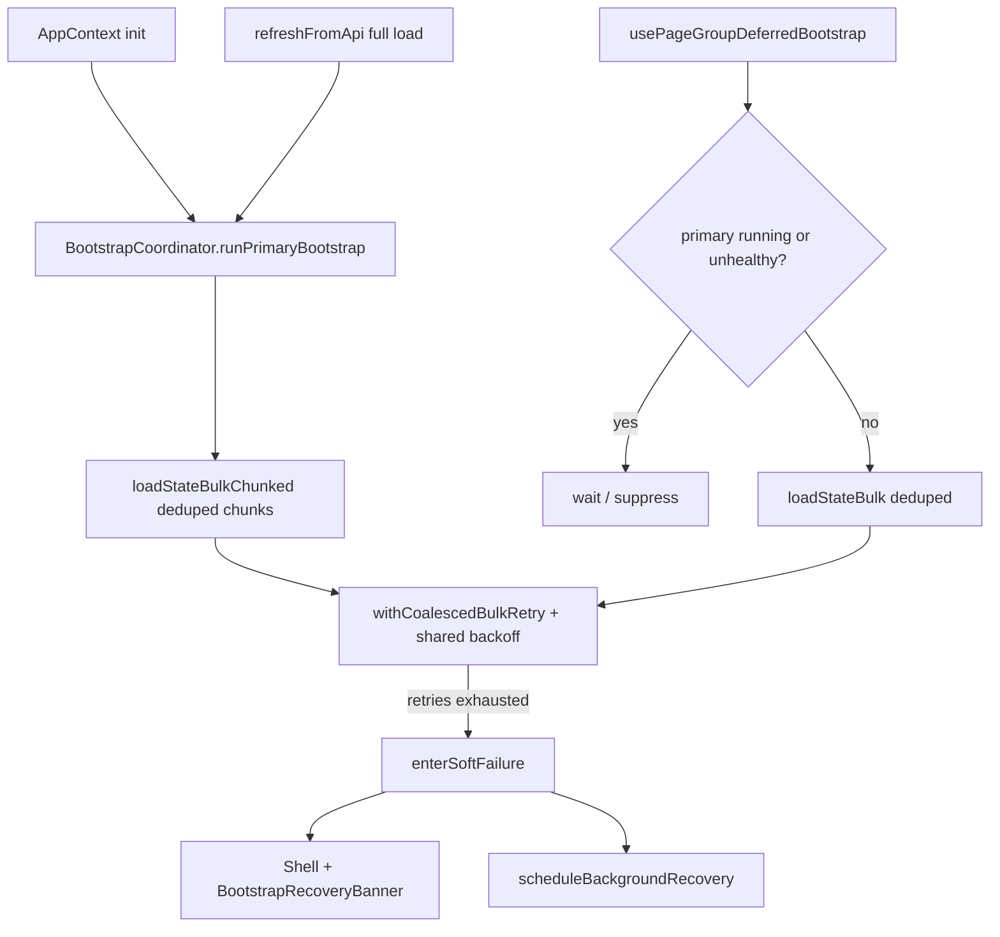

# PERF-P3 — Bootstrap Failure Containment Validation

Generated: 2026-06-23T03:13:33.601Z

## Static implementation checklist

- [x] **services/api/bootstrapCoordinator.ts** — OK
- [x] **services/api/appStateApi.ts** — OK
- [x] **hooks/usePageGroupDeferredBootstrap.ts** — OK
- [x] **context/AppContext.tsx** — OK
- [x] **App.tsx** — OK

## Architecture (PERF-P3)

## Before vs after request flow

| Trigger | Before PERF-P3 | After PERF-P3 |
|---------|----------------|---------------|
| Login init | Independent chunked bulk | Single primary pipeline; refresh attaches |
| refreshFromApi (full) | Second chunked bulk + retries | Attaches to primary if in-flight |
| Page nav deferred | Immediate bulk?entities= | Waits for coordinator; suppressed if unhealthy |
| Parallel identical bulk | N network calls | 1 shared promise (dedupeBulkRequest) |
| 503 retry storm | 3 loaders × 3 retries each | Coalesced retry + shared backoff |
| Overlay on failure | Blocking spinner / init screen | Soft failure: shell + recovery banner |

## Baseline capture (pre-fix reference)

- Capture: `docs/performance/cloud/captures/nav-probe-2026-06-22-atp.json`
- Total requests: 0
- `/state/bulk`: 0
- `/state/bulk-chunked`: 0
- HTTP 503: 0

## Manual validation steps

1. Login — DevTools Network: at most one concurrent primary bootstrap pipeline.
2. Dashboard — no duplicate `/state/bulk?entities=` while chunked bootstrap runs.
3. Rental navigation — deferred bootstrap waits; check `[BOOTSTRAP_COORDINATOR]` console logs.
4. Simulate 503 (staging pool pressure) — overlay clears; amber recovery banner; background retry.

## Risk assessment

| Risk | Mitigation |
|------|------------|
| Stale attach to failed primary | Health → unhealthy; deferred waits for background recovery |
| Partial state after soft failure | Background recovery merges full bulk when server recovers |
| Over-suppression of deferred loads | Gate clears when health → healthy |
| Tenant switch stale coordinator | `resetForTenant` on company switch |

## Instrumentation counters

`getBootstrapCoordinator().getMetrics()` exposes: `activeBootstraps`, `suppressedDeferredBootstraps`, `deduplicatedBulkRequests`, `coalescedRetries`, `overlayRecoveryEvents`.
